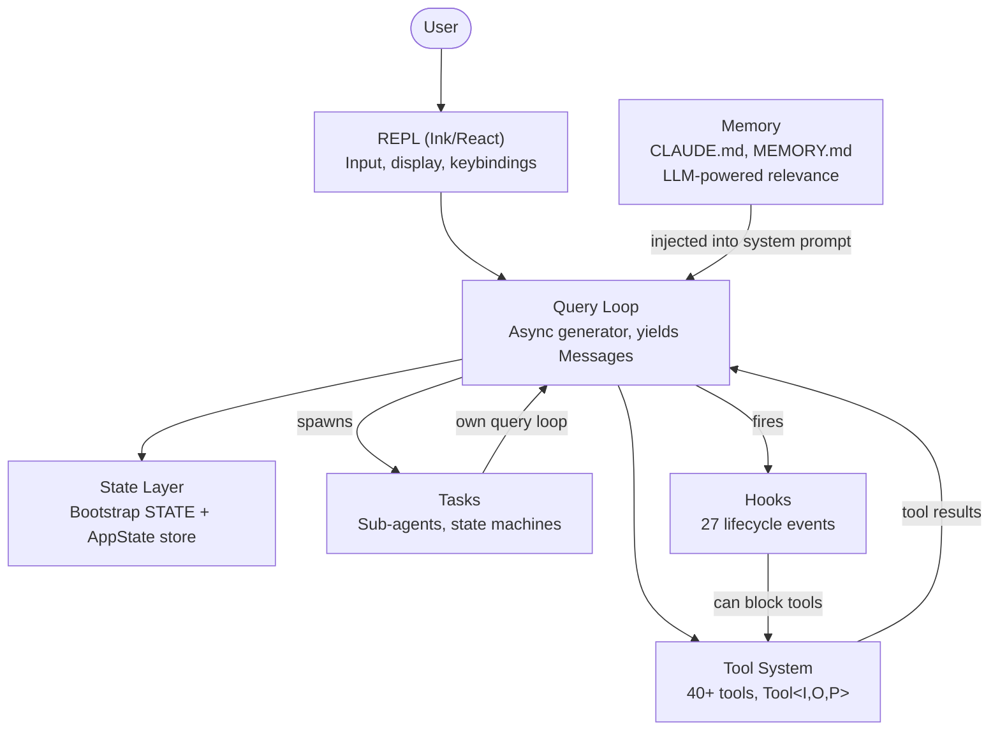
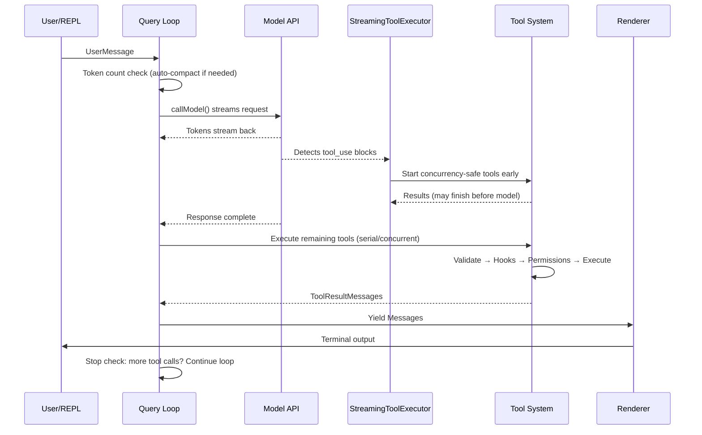
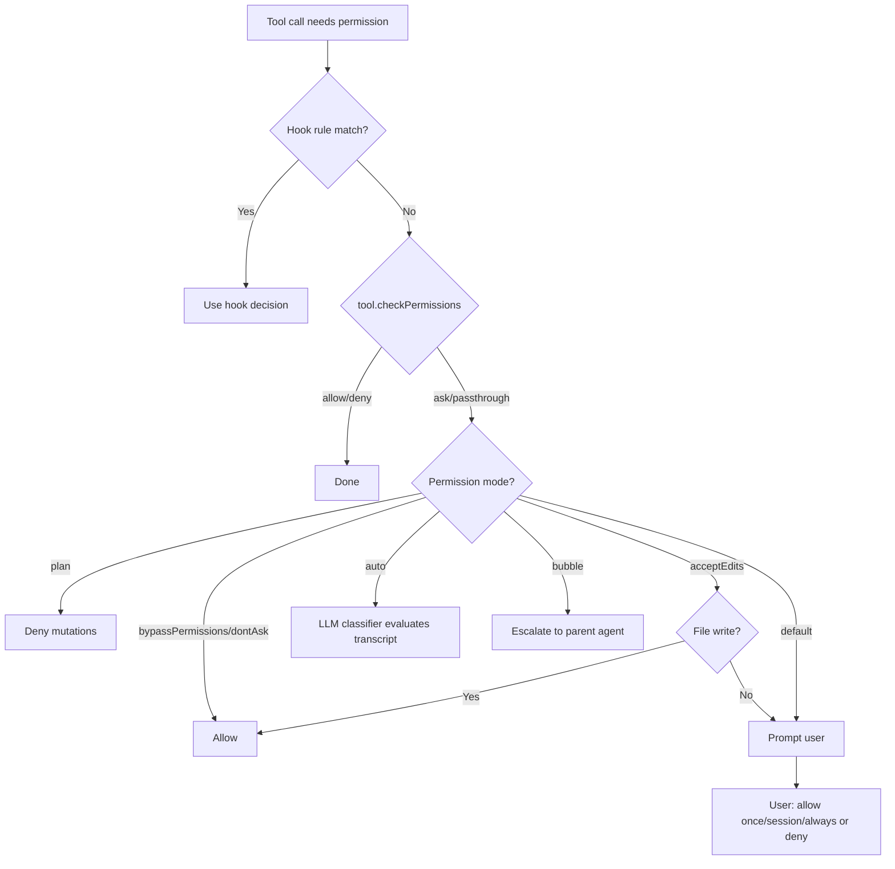
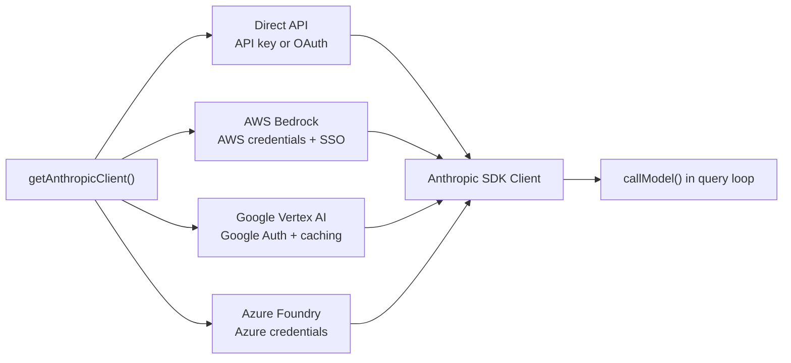
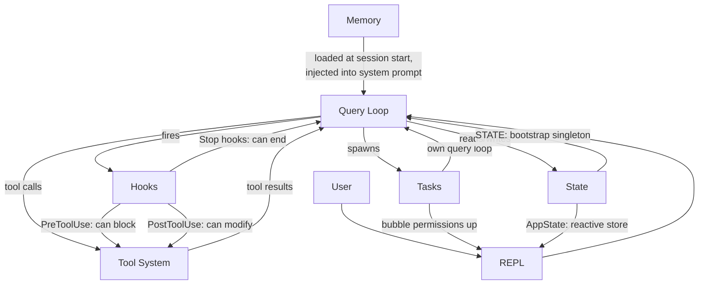

# Chapter 1: The Architecture of an AI Agent

# 第 1 章：AI 智能体的架构

## What You're Looking At

## 你正在看的是什么

A traditional CLI is a function. It takes arguments, does work, and exits. `grep` does not decide to also run `sed`. `curl` does not open a file and patch it based on what it downloaded. The contract is simple: one command, one action, deterministic output.

传统的 CLI 是一个函数。它接受参数、完成工作、然后退出。`grep` 不会决定顺便去运行 `sed`。`curl` 不会打开一个文件并根据它下载的内容去修补这个文件。它的契约很简单：一条命令，一个动作，确定性的输出。

An agentic CLI breaks every part of that contract. It takes a natural language prompt, decides what tools to use, executes them in whatever order the situation demands, evaluates the results, and loops until the task is done or the user stops it. The "program" is not a fixed sequence of instructions -- it is a loop around a language model that generates its own instruction sequence at runtime. The tool calls are the side effects. The model's reasoning is the control flow.

智能体式（agentic）的 CLI 打破了这一契约的每一个部分。它接受一段自然语言提示，决定使用哪些工具，按照情境所需的任意顺序执行它们，评估结果，然后循环往复，直到任务完成或用户叫停。这里的“程序”不是一段固定的指令序列——它是一个围绕语言模型的循环，而这个模型在运行时生成它自己的指令序列。工具调用是副作用。模型的推理才是控制流。

Claude Code is Anthropic's production implementation of this idea: a TypeScript monolith of nearly two thousand files that turns a terminal into a full development environment powered by Claude. It shipped to hundreds of thousands of developers, which means every architectural decision carries real-world consequences. This chapter gives you the mental model. Six abstractions define the entire system. A single data flow connects them. Once you internalize the golden path from keystroke to final output, every subsequent chapter is a zoom into one segment of that path.

Claude Code 是 Anthropic 对这一理念的生产级实现：一个由近两千个文件组成的 TypeScript 单体程序，它把终端变成了一个由 Claude 驱动的完整开发环境。它被交付给了数十万开发者，这意味着每一个架构决策都承载着真实世界的后果。本章为你建立心智模型。六个抽象定义了整个系统。一条单一的数据流将它们连接起来。一旦你内化了从按键到最终输出的这条黄金路径，后续的每一章都不过是对这条路径上某一段落的放大细看。

What follows is a retrospective decomposition -- these six abstractions were not designed upfront on a whiteboard. They emerged from the pressures of shipping a production agent to a large user base. Understanding them as they are, not as they were planned, sets the right expectations for the rest of the book.

接下来是一次回溯式的拆解——这六个抽象并不是事先在白板上设计好的。它们是在向庞大用户群交付一个生产级智能体的压力下涌现出来的。如其所是地去理解它们，而不是如其所计划地去理解它们，会为本书余下的部分设定正确的预期。

---

## The Six Key Abstractions

## 六个关键抽象

Claude Code is built on six core abstractions. Everything else -- the 400+ utility files, the forked terminal renderer, the vim emulation, the cost tracker -- exists to support these six.

Claude Code 建立在六个核心抽象之上。其余的一切——400 多个工具文件、fork 出来的终端渲染器、vim 模拟、成本追踪器——存在的目的都是为了支撑这六个抽象。



Here is what each one does and why it exists.

下面是每一个抽象的职责以及它为何存在。

**1. The Query Loop** (`query.ts`, ~1,700 lines). An async generator that is the heartbeat of the entire system. It streams a model response, collects tool calls, executes them, appends results to the message history, and loops. Every interaction -- REPL, SDK, sub-agent, headless `--print` -- flows through this single function. It yields `Message` objects that the UI consumes. Its return type is a discriminated union called `Terminal` that encodes exactly why the loop stopped: normal completion, user abort, token budget exhaustion, stop hook intervention, max turns, or unrecoverable error. The generator pattern -- rather than callbacks or event emitters -- gives natural backpressure, clean cancellation, and typed terminal states. Chapter 5 covers the loop's internals in full.

**1. 查询循环（The Query Loop）**（`query.ts`，约 1,700 行）。一个 async generator，是整个系统的心跳。它流式接收模型响应、收集工具调用、执行它们、把结果追加到消息历史中，然后循环。每一次交互——REPL、SDK、子智能体、无头的 `--print`——都流经这唯一一个函数。它 yield 出供 UI 消费的 `Message` 对象。它的返回类型是一个名为 `Terminal` 的可辨识联合（discriminated union），精确地编码了循环停止的原因：正常完成、用户中止、token 预算耗尽、stop hook 介入、达到最大轮次，或不可恢复的错误。generator 模式——而非回调或事件发射器——带来了天然的 backpressure、干净的取消能力，以及带类型的终止状态。第 5 章将完整讲解这个循环的内部机制。

**2. The Tool System** (`Tool.ts`, `tools.ts`, `services/tools/`). A tool is anything the agent can do in the world: read a file, run a shell command, edit code, search the web. That simplicity of purpose hides significant machinery. Each tool implements a rich interface covering identity, schema, execution, permissions, and rendering. Tools are not just functions -- they carry their own permission logic, concurrency declarations, progress reporting, and UI rendering. The system partitions tool calls into concurrent and serial batches, and a streaming executor starts concurrency-safe tools before the model even finishes its response. Chapter 6 covers the full tool interface and execution pipeline.

**2. 工具系统（The Tool System）**（`Tool.ts`、`tools.ts`、`services/tools/`）。工具是智能体能够在世界中做的任何事情：读取文件、运行 shell 命令、编辑代码、搜索网络。这种目的上的简单背后隐藏着大量机制。每个工具都实现了一个内容丰富的接口，涵盖身份标识、schema、执行、权限和渲染。工具不仅仅是函数——它们携带着自己的权限逻辑、并发声明、进度上报和 UI 渲染。系统会把工具调用划分为并发批次和串行批次，并且一个流式执行器会在模型尚未完成响应之前就启动那些并发安全的工具。第 6 章将完整讲解工具接口与执行流水线。

**3. Tasks** (`Task.ts`, `tasks/`). Tasks are background work units -- primarily sub-agents. They follow a state machine: `pending -> running -> completed | failed | killed`. The `AgentTool` spawns a new `query()` generator with its own message history, tool set, and permission mode. Tasks give Claude Code its recursive capability: an agent can delegate to sub-agents, which can delegate further.

**3. 任务（Tasks）**（`Task.ts`、`tasks/`）。任务是后台工作单元——主要是子智能体。它们遵循一个状态机：`pending -> running -> completed | failed | killed`。`AgentTool` 会派生出一个新的 `query()` generator，它拥有自己的消息历史、工具集和权限模式。任务赋予了 Claude Code 递归的能力：一个智能体可以委派给子智能体，而子智能体还可以继续向下委派。

**4. State** (two layers). The system maintains state at two levels. A mutable singleton (`STATE`) holds ~80 fields of session-level infrastructure: working directory, model configuration, cost tracking, telemetry counters, session ID. It is set once at startup and mutated directly -- no reactivity. A minimal reactive store (34 lines, Zustand-shaped) drives the UI: messages, input mode, tool approvals, progress indicators. The separation is intentional: infrastructure state changes rarely and does not need to trigger re-renders; UI state changes constantly and must. Chapter 3 covers the two-tier architecture in depth.

**4. 状态（State）**（两个层次）。系统在两个层次上维护状态。一个可变的单例（`STATE`）持有约 80 个字段的会话级基础设施：工作目录、模型配置、成本追踪、遥测计数器、会话 ID。它在启动时设置一次，之后被直接修改——没有响应式。一个极简的响应式存储（34 行，Zustand 风格）驱动着 UI：消息、输入模式、工具审批、进度指示器。这种分离是有意为之的：基础设施状态很少变化，也不需要触发重新渲染；UI 状态则不断变化，并且必须触发渲染。第 3 章将深入讲解这种双层架构。

**5. Memory** (`memdir/`). The agent's persistent context across sessions. Three tiers: project-level (`CLAUDE.md` files in the repo), user-level (`~/.claude/MEMORY.md`), and team-level (shared via symlinks). At session start, the system scans for all memory files, parses frontmatter, and an LLM selects which memories are relevant to the current conversation. Memory is how Claude Code "remembers" your codebase conventions, architectural decisions, and debugging history.

**5. 记忆（Memory）**（`memdir/`）。智能体跨会话的持久化上下文。三个层级：项目级（仓库中的 `CLAUDE.md` 文件）、用户级（`~/.claude/MEMORY.md`），以及团队级（通过符号链接共享）。在会话开始时，系统会扫描所有记忆文件、解析 frontmatter，并由一个 LLM 选出哪些记忆与当前对话相关。记忆就是 Claude Code “记住”你的代码库约定、架构决策和调试历史的方式。

**6. Hooks** (`hooks/`, `utils/hooks/`). User-defined lifecycle interceptors that fire at 27 distinct events across 4 execution types: shell commands, single-shot LLM prompts, multi-turn agent conversations, and HTTP webhooks. Hooks can block tool execution, modify inputs, inject additional context, or short-circuit the entire query loop. The permission system itself is partially implemented through hooks -- `PreToolUse` hooks can deny tool calls before the interactive permission prompt ever fires.

**6. 钩子（Hooks）**（`hooks/`、`utils/hooks/`）。用户自定义的生命周期拦截器，它们在 27 个不同的事件上触发，横跨 4 种执行类型：shell 命令、单次 LLM 提示、多轮智能体对话，以及 HTTP webhook。Hooks 可以阻止工具执行、修改输入、注入额外上下文，或者让整个查询循环短路。权限系统本身就有一部分是通过 hooks 实现的——`PreToolUse` hook 可以在交互式权限提示弹出之前就拒绝工具调用。

---

## The Golden Path: From Keystroke to Output

## 黄金路径：从按键到输出

Trace a single request through the system. The user types "add error handling to the login function" and presses Enter.

让我们追踪一个请求在系统中的完整流转。用户输入“给 login 函数加上错误处理”并按下回车。



Three things to notice about this flow.

关于这条流程，有三点值得注意。

First, the query loop is a generator, not a callback chain. The REPL pulls messages from it via `for await`, which means backpressure is natural -- if the UI cannot keep up, the generator pauses. This is a deliberate choice over event emitters or observable streams.

第一，查询循环是一个 generator，而不是一条回调链。REPL 通过 `for await` 从它那里拉取消息，这意味着 backpressure 是天然的——如果 UI 跟不上，generator 就会暂停。相比事件发射器或可观察流（observable stream），这是一个有意的选择。

Second, tool execution overlaps with model streaming. The `StreamingToolExecutor` does not wait for the model to finish before starting concurrency-safe tools. A `Read` call can complete and return its results while the model is still generating the rest of its response. This is speculative execution -- if the model's final output invalidates the tool call (rare but possible), the result is discarded.

第二，工具执行与模型流式输出是重叠进行的。`StreamingToolExecutor` 不会等模型完成后才启动那些并发安全的工具。一个 `Read` 调用可以在模型还在生成其响应余下部分的时候就完成并返回结果。这是一种推测执行（speculative execution）——如果模型的最终输出使该工具调用失效（这很罕见但有可能发生），结果就会被丢弃。

Third, the entire loop is re-entrant. When the model makes tool calls, the results are appended to the message history, and the loop calls the model again with the updated context. There is no separate "tool result handling" phase -- it is all one loop. The model decides when it is done by simply not making any more tool calls.

第三，整个循环是可重入的。当模型发起工具调用时，结果会被追加到消息历史中，然后循环带着更新后的上下文再次调用模型。这里并没有一个单独的“工具结果处理”阶段——它全部都在同一个循环里。模型只需不再发起任何工具调用，就以此决定自己已经完成了。

---

## The Permission System

## 权限系统

Claude Code runs arbitrary shell commands on your machine. It edits your files. It can spawn sub-processes, make network requests, and modify your git history. Without a permission system, this is a security catastrophe.

Claude Code 会在你的机器上运行任意 shell 命令。它会编辑你的文件。它可以派生子进程、发起网络请求，并修改你的 git 历史。如果没有一套权限系统，这就是一场安全灾难。

The system defines seven permission modes, ordered from most to least permissive:

系统定义了七种权限模式，按从最宽松到最严格的顺序排列：

| Mode | Behavior |
|------|----------|
| `bypassPermissions` | Everything allowed. No checks. Internal/testing only. |
| `dontAsk` | All allowed, but still logged. No user prompts. |
| `auto` | Transcript classifier (LLM) decides allow/deny. |
| `acceptEdits` | File edits auto-approved; all other mutations prompt. |
| `default` | Standard interactive mode. User approves each action. |
| `plan` | Read-only. All mutations blocked. |
| `bubble` | Escalate decision to parent agent (sub-agent mode). |

| 模式 | 行为 |
|------|----------|
| `bypassPermissions` | 一切都被允许。不做任何检查。仅供内部/测试使用。 |
| `dontAsk` | 全部允许，但仍会被记录日志。不向用户弹出提示。 |
| `auto` | 由记录分类器（LLM）决定允许/拒绝。 |
| `acceptEdits` | 文件编辑自动批准；所有其他变更操作都会提示。 |
| `default` | 标准交互模式。用户对每个动作逐一批准。 |
| `plan` | 只读。所有变更操作都被阻止。 |
| `bubble` | 将决策上交给父智能体（子智能体模式）。 |

When a tool call needs permission, the resolution follows a strict chain:

当一个工具调用需要权限时，其裁决遵循一条严格的链条：



The `auto` mode deserves special attention. It runs a separate, lightweight LLM call that classifies the tool invocation against the conversation transcript. The classifier sees a compact representation of the tool input and decides whether the action is consistent with what the user asked for. This is the mode that lets Claude Code work semi-autonomously -- approving routine operations while flagging anything that looks like it deviates from the user's intent.

`auto` 模式值得特别关注。它会运行一次单独的、轻量的 LLM 调用，针对对话记录来对工具调用进行分类。这个分类器看到工具输入的一个紧凑表示，并判断该动作是否与用户的请求相一致。正是这种模式让 Claude Code 能够半自主地工作——批准常规操作，同时把任何看起来偏离了用户意图的动作标记出来。

Sub-agents default to `bubble` mode, which means they cannot approve their own dangerous actions. Permission requests propagate up to the parent agent or ultimately to the user. This prevents a sub-agent from silently running destructive commands that the user never saw.

子智能体默认采用 `bubble` 模式，这意味着它们无法批准自己的危险动作。权限请求会向上传递给父智能体，或最终传递给用户。这可以防止子智能体悄无声息地运行用户从未看见过的破坏性命令。

---

## Multi-Provider Architecture

## 多提供方架构

Claude Code talks to Claude through four different infrastructure paths, all transparent to the rest of the system.

Claude Code 通过四条不同的基础设施路径与 Claude 通信，而这些路径对系统的其余部分都是透明的。



The key insight is that the Anthropic SDK provides wrapper classes for each cloud provider that present the same interface as the direct API client. The `getAnthropicClient()` factory reads environment variables and configuration to determine which provider to use, constructs the appropriate client, and returns it. From that point forward, `callModel()` and every other consumer treats it as a generic Anthropic client.

关键的洞见在于：Anthropic SDK 为每个云提供方都提供了包装类（wrapper class），它们呈现出与直连 API 客户端相同的接口。`getAnthropicClient()` 这个工厂函数读取环境变量和配置以确定要使用哪个提供方，构造出相应的客户端并返回它。从那一刻起，`callModel()` 以及其他每一个使用方都把它当作一个通用的 Anthropic 客户端来对待。

Provider selection is determined at startup and stored in `STATE`. The query loop never checks which provider is active. This means switching from Direct API to Bedrock is a configuration change, not a code change -- the agent loop, tool system, and permission model are entirely provider-agnostic.

提供方的选择在启动时确定，并存储于 `STATE` 中。查询循环从不检查当前激活的是哪个提供方。这意味着从 Direct API 切换到 Bedrock 是一次配置变更，而非代码变更——智能体循环、工具系统和权限模型都是完全与提供方无关的。

---

## The Build System

## 构建系统

Claude Code ships as both an internal Anthropic tool and a public npm package. The same codebase serves both, with compile-time feature flags controlling what gets included.

Claude Code 既作为 Anthropic 的内部工具发布，也作为公开的 npm 包发布。同一套代码库同时服务于两者，由编译期的特性开关（feature flag）控制哪些内容会被纳入。

```typescript
// Conditional imports guarded by feature flags
const reactiveCompact = feature('REACTIVE_COMPACT')
  ? require('./services/compact/reactiveCompact.js')
  : null
```

The `feature()` function comes from `bun:bundle`, Bun's built-in bundler API. At build time, each feature flag resolves to a boolean literal. The bundler's dead code elimination then strips the `require()` call entirely when the flag is false -- the module is never loaded, never included in the bundle, and never shipped.

`feature()` 函数来自 `bun:bundle`，即 Bun 内置的打包器 API。在构建时，每个特性开关都会被解析为一个布尔字面量。当开关为 false 时，打包器的死代码消除（dead code elimination）随即会把那个 `require()` 调用整个剥离掉——该模块从不会被加载、从不会被纳入打包产物，也从不会被发布出去。

The pattern is consistent: a top-level `feature()` guard wrapping a `require()` call. The `require()` is used instead of `import` specifically because dynamic `require()` can be fully eliminated by the bundler when the guard is false, while dynamic `import()` cannot (it returns a Promise that the bundler must preserve).

这个模式是一致的：一个顶层的 `feature()` 守卫包裹着一个 `require()` 调用。这里之所以专门使用 `require()` 而非 `import`，是因为当守卫为 false 时，动态 `require()` 可以被打包器完全消除，而动态 `import()` 则不行（它返回一个打包器必须保留的 Promise）。

There is an irony worth noting. The source maps published with early npm releases contained `sourcesContent` -- the full original TypeScript source, including the internal-only code paths. The feature flags successfully stripped the runtime code but left the source in the maps. This is how the Claude Code source became publicly readable.

有一个值得一提的讽刺之处。早期 npm 发行版随附发布的 source map 中包含了 `sourcesContent`——也就是完整的原始 TypeScript 源代码，连同那些仅供内部使用的代码路径。特性开关成功地剥离了运行时代码，却把源代码留在了 source map 里。这正是 Claude Code 源代码得以被公开阅读的缘由。

---

## How the Pieces Connect

## 各部分如何连接

The six abstractions form a dependency graph:

这六个抽象构成了一张依赖图：



Memory feeds into the query loop as part of the system prompt. The query loop drives tool execution. Tool results feed back into the query loop as messages. Tasks are recursive query loops with isolated message histories. Hooks intercept the query loop at defined points. State is read and written by everything, with the reactive store bridging to the UI.

记忆作为系统提示的一部分被喂入查询循环。查询循环驱动工具执行。工具结果以消息的形式反馈回查询循环。任务是带有隔离消息历史的递归查询循环。Hooks 在预定义的若干点上拦截查询循环。状态被一切组件读取和写入，而响应式存储则架起了通往 UI 的桥梁。

The circular dependency between the query loop and the tool system is the system's defining characteristic. The model generates tool calls. Tools execute and produce results. Results are appended to the message history. The model sees the results and decides what to do next. This cycle continues until the model stops generating tool calls or an external constraint (token budget, max turns, user abort) terminates it.

查询循环与工具系统之间的循环依赖是这个系统的决定性特征。模型生成工具调用。工具执行并产生结果。结果被追加到消息历史中。模型看到结果并决定下一步做什么。这个循环持续进行，直到模型停止生成工具调用，或者某个外部约束（token 预算、最大轮次、用户中止）终止了它。

Here is how they connect to the chapters that follow: the golden path from input to output is the thread that runs through the entire book. Chapter 2 traces how the system boots to the point where this path can execute. Chapter 3 explains the two-tier state architecture that the path reads and writes. Chapter 4 covers the API layer that the query loop calls. Each subsequent chapter zooms into one segment of the path you have just seen end-to-end.

以下是它们与后续各章的连接方式：从输入到输出的这条黄金路径是贯穿全书的主线。第 2 章追踪系统如何启动，直到这条路径可以开始执行的那一刻。第 3 章解释这条路径所读写的双层状态架构。第 4 章讲解查询循环所调用的 API 层。后续的每一章都会放大细看你刚刚端到端见过的这条路径上的某一段。

---

## Apply This

## 学以致用

If you are building an agentic system -- any system where an LLM decides what actions to take at runtime -- here are the patterns from Claude Code's architecture that transfer.

如果你正在构建一个智能体式系统——任何由 LLM 在运行时决定采取何种动作的系统——以下是来自 Claude Code 架构、可以迁移过去的若干模式。

**The generator loop pattern.** Use an async generator as your agent loop, not callbacks or event emitters. The generator gives you natural backpressure (consumers pull at their own pace), clean cancellation (`.return()` on the generator), and a typed return value for terminal states. The problem it solves: in callback-based agent loops, it is difficult to know when the loop is "done" and why. Generators make termination a first-class part of the type system.

**generator 循环模式。** 把 async generator 用作你的智能体循环，而不是回调或事件发射器。generator 带给你天然的 backpressure（消费者按自己的节奏拉取）、干净的取消能力（对 generator 调用 `.return()`），以及一个用于表示终止状态的带类型返回值。它解决的问题是：在基于回调的智能体循环里，很难知道循环何时“完成”以及为何完成。generator 让“终止”成为类型系统中的一等公民。

**The self-describing tool interface.** Every tool should declare its own concurrency safety, permission requirements, and rendering behavior. Do not put this logic in a central orchestrator that "knows about" each tool. The problem it solves: a central orchestrator becomes a god object that must be updated every time a tool is added. Self-describing tools scale linearly -- adding tool N+1 requires zero changes to existing code.

**自描述的工具接口。** 每个工具都应当声明它自己的并发安全性、权限要求和渲染行为。不要把这些逻辑放进一个“了解”每个工具的中央编排器里。它解决的问题是：中央编排器会变成一个 god object，每当新增一个工具时都必须去更新它。自描述的工具能够线性扩展——新增第 N+1 个工具不需要对现有代码做任何改动。

**Separate infrastructure state from reactive state.** Not all state needs to trigger UI updates. Session configuration, cost tracking, and telemetry belong in a plain mutable object. Message history, progress indicators, and approval queues belong in a reactive store. The problem it solves: making everything reactive adds subscription overhead and complexity to state that changes once at startup and is read a thousand times. Two tiers match two access patterns.

**将基础设施状态与响应式状态分离开。** 并非所有状态都需要触发 UI 更新。会话配置、成本追踪和遥测应当放在一个普通的可变对象里。消息历史、进度指示器和审批队列则应当放在一个响应式存储里。它解决的问题是：让一切都变得响应式，会给那些“启动时变化一次、却被读取上千次”的状态平添订阅开销与复杂性。两个层次恰好匹配两种访问模式。

**Permission modes, not permission checks.** Define a small set of named modes (plan, default, auto, bypass) and resolve every permission decision through the mode. Do not scatter `if (isAllowed)` checks through tool implementations. The problem it solves: inconsistent permission enforcement. When every tool goes through the same mode-based resolution chain, you can reason about the system's security posture by knowing which mode is active.

**用权限模式，而非权限检查。** 定义一小组具名模式（plan、default、auto、bypass），并让每一个权限决策都经由模式来裁决。不要把 `if (isAllowed)` 这样的检查散落在各个工具实现里。它解决的问题是：权限执行的不一致。当每个工具都走同一条基于模式的裁决链时，你只需知道当前激活的是哪个模式，就能推断出系统的安全态势。

**Recursive agent architecture via tasks.** Sub-agents should be new instances of the same agent loop with their own message history, not special-cased code paths. Permission escalation flows upward via `bubble` mode. The problem it solves: sub-agent logic that diverges from the main agent loop, leading to subtle differences in behavior and error handling. If the sub-agent is the same loop, it inherits all the same guarantees.

**借助任务实现递归式智能体架构。** 子智能体应当是同一个智能体循环的新实例，拥有它们自己的消息历史，而不是被特殊处理的代码路径。权限的升级通过 `bubble` 模式向上流动。它解决的问题是：子智能体逻辑偏离主智能体循环，从而导致行为和错误处理上的细微差异。如果子智能体就是同一个循环，它便继承了所有相同的保证。
