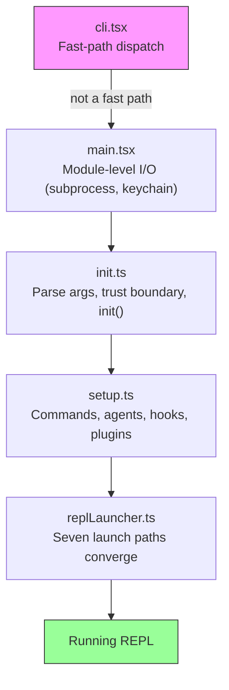
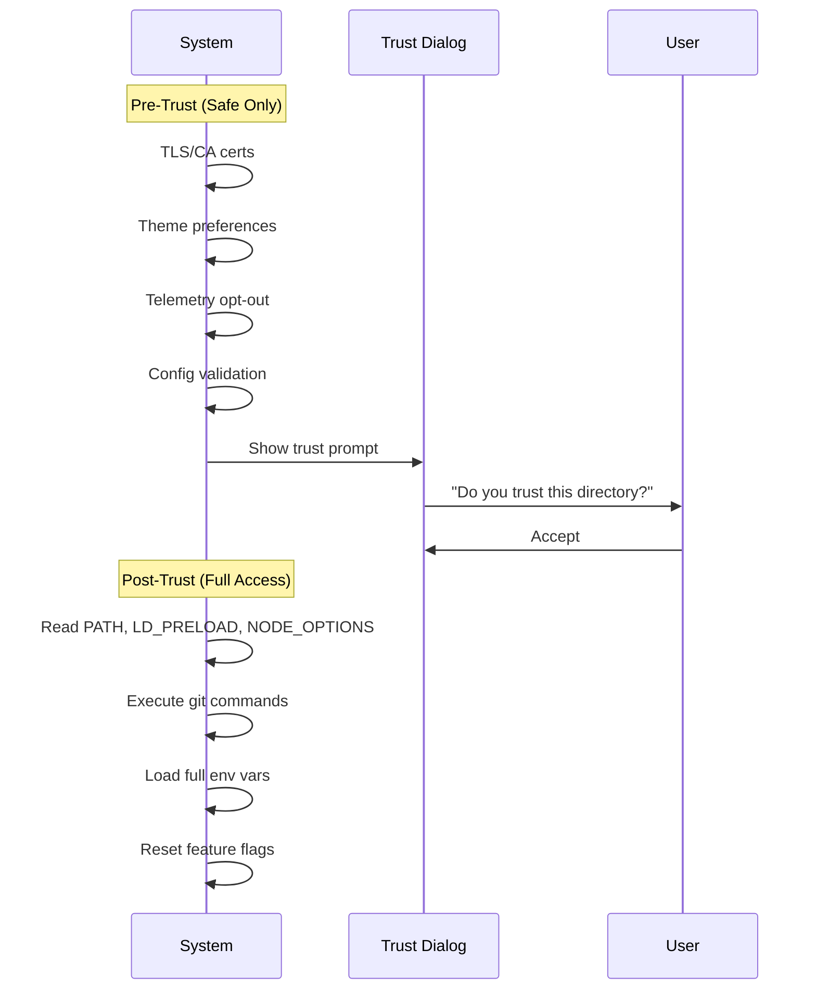

# Chapter 2: Starting Fast -- The Bootstrap Pipeline

# 第 2 章：快速启动 —— 引导流水线

If Chapter 1 gave you the map of Claude Code's architecture, this chapter gives you the route it takes to reach a working state. Every component from the six abstractions -- the query loop, the tool system, the state layers, hooks, memory -- must be initialized before the user sees a cursor. The budget for all of it: 300 milliseconds.

如果说第 1 章给了你 Claude Code 架构的地图，那么本章则给出了它抵达可用状态所走的路线。六大抽象中的每一个组件 —— 查询循环、工具系统、状态层、hook、内存 —— 都必须在用户看到光标之前完成初始化。而完成这一切的预算是：300 毫秒。

Three hundred milliseconds is the threshold where humans perceive a tool as instant. Cross it, and the CLI feels sluggish. Miss it by a lot, and developers stop using it. Everything in this chapter exists to stay under that line.

300 毫秒是人类感知工具"即时响应"的临界值。一旦越过它，CLI 就会显得迟钝；如果大幅超出，开发者就会弃用它。本章的一切都是为了守住这条线。

Bootstrap must accomplish four things: validate the environment, establish security boundaries, configure the communication layer, and render the UI. It must do all four in under 300ms. The architectural insight is that these four jobs can be partially overlapped, carefully ordered, and aggressively pruned to fit inside a budget that feels impossible for a system this complex.

引导过程必须完成四件事：验证环境、建立安全边界、配置通信层、渲染 UI。而且这四件事都必须在 300ms 内完成。其架构上的洞见在于：这四项工作可以被部分重叠、精心排序、并大刀阔斧地裁剪，从而塞进一个对于如此复杂的系统看似不可能的预算之内。

A note on methodology: the timestamps in this chapter are approximate, derived from the codebase's own profiling checkpoints. They represent typical warm-start timings on modern hardware. Cold starts are slower. The absolute numbers matter less than the relative structure: which operations overlap, which block, and which are deferred.

关于方法论的一点说明：本章中的时间戳都是近似值，来自代码库自身的性能剖析检查点。它们代表的是现代硬件上典型的热启动（warm-start）耗时。冷启动会更慢。绝对数字并不像相对结构那么重要：哪些操作彼此重叠、哪些会阻塞、哪些被延迟执行。

---

## The Shape of the Pipeline

## 流水线的形态

The startup pipeline lives in five files, executed in sequence. Each file narrows the scope of what the system needs to do next:

启动流水线分布在五个文件中，按顺序执行。每个文件都会收窄系统接下来需要做的事情的范围：



Each file does the minimum work necessary before passing control to the next. `cli.tsx` tries to exit before importing anything heavy. `main.tsx` fires slow operations as side effects during import evaluation. `init.ts` resolves configuration and establishes the trust boundary. `setup.ts` registers capabilities. `replLauncher.ts` picks the right entry point and starts the UI.

每个文件都只做将控制权交给下一个文件之前所必需的最小工作量。`cli.tsx` 试图在导入任何重量级模块之前就退出。`main.tsx` 在导入求值（import evaluation）期间以副作用的形式触发慢操作。`init.ts` 解析配置并建立信任边界。`setup.ts` 注册各项能力。`replLauncher.ts` 选定正确的入口点并启动 UI。

Three parallelism strategies make this fast:

三种并行策略让这一切变得快速：

1. **Module-level subprocess dispatch.** Fire keychain and MDM reads as side effects *during import evaluation*. The subprocesses run while the remaining ~135ms of static imports load.

1. **模块级子进程派发。** 在*导入求值期间*以副作用形式触发钥匙串（keychain）和 MDM 读取。这些子进程在剩余约 135ms 的静态导入加载过程中并行运行。

2. **Promise parallelism in setup.** Socket binding, hook snapshotting, command loading, and agent definition loading all run concurrently.

2. **setup 阶段的 Promise 并行。** 套接字绑定、hook 快照、命令加载与 agent 定义加载全部并发执行。

3. **Post-render deferred prefetches.** Everything the user does not need before typing their first message -- git status, model capabilities, AWS credentials -- runs after the prompt is visible.

3. **渲染后延迟预取。** 用户在输入第一条消息之前并不需要的一切 —— git 状态、模型能力、AWS 凭证 —— 都在提示符可见之后才运行。

A fourth strategy is less visible but equally important: **dynamic imports to defer module evaluation**. The codebase uses `await import('./module.js')` in at least a dozen places to avoid loading code until it is needed. OpenTelemetry (400KB + 700KB gRPC) loads only when telemetry initializes. React components load only when rendering. Each dynamic import trades cold-path latency (first use triggers module evaluation) for hot-path speed (startup does not pay for modules it might never use).

第四种策略不那么显眼，但同样重要：**用动态导入来延迟模块求值**。代码库在至少十几处使用了 `await import('./module.js')`，以避免在真正需要之前就加载代码。OpenTelemetry（400KB + 700KB 的 gRPC）只在遥测初始化时才加载。React 组件只在渲染时才加载。每一次动态导入都是在用冷路径延迟（首次使用时触发模块求值）换取热路径速度（启动时不必为可能永远用不到的模块买单）。

---

## Phase 0: Fast-Path Dispatch (cli.tsx)

## 阶段 0：快速路径派发（cli.tsx）

The first file the process enters, `cli.tsx`, has one job: determine whether the full bootstrap pipeline is needed at all. Many invocations -- `claude --version`, `claude --help`, `claude mcp list` -- need a specific answer and nothing else. Loading React, initializing telemetry, reading the keychain, and setting up the tool system would be pure waste.

进程进入的第一个文件 `cli.tsx` 只有一项任务：判断是否真的需要走完整的引导流水线。许多调用 —— `claude --version`、`claude --help`、`claude mcp list` —— 只需要一个特定的答复，别无他求。为它们加载 React、初始化遥测、读取钥匙串、搭建工具系统纯属浪费。

The pattern is: check `argv`, dynamically import only the handler you need, and exit before the rest of the system loads.

这一模式是：检查 `argv`，只动态导入你需要的那个处理器，并在系统的其余部分加载之前就退出。

```typescript
// Pseudocode for the fast-path pattern
if (args.length === 1 && args[0] === '--version') {
  const { printVersion } = await import('./commands/version.js')
  await printVersion()
  process.exit(0)
}
```

There are roughly a dozen fast paths covering version, help, configuration, MCP server management, and update checks. The specifics do not matter -- the pattern does. Each path dynamically imports exactly one module, calls one function, and exits. The rest of the codebase never loads.

大约有十几条快速路径，覆盖版本、帮助、配置、MCP 服务器管理以及更新检查。具体内容并不重要 —— 重要的是这一模式。每条路径都精确地动态导入一个模块、调用一个函数、然后退出。代码库的其余部分从不加载。

This is the first instance of a principle that recurs throughout bootstrap: **do less by knowing more about intent**. The argv array reveals the user's intent. If the intent is narrow, the execution path should be narrow too.

这是贯穿整个引导过程的一条原则的首次体现：**通过更了解意图来做更少的事**。argv 数组揭示了用户的意图。如果意图很窄，那么执行路径也应当很窄。

If no fast path matches, `cli.tsx` falls through to the full `main.tsx` import, and the real startup begins.

如果没有任何快速路径匹配，`cli.tsx` 就会落入完整的 `main.tsx` 导入，真正的启动由此开始。

---

## Phase 1: Module-Level I/O (main.tsx)

## 阶段 1：模块级 I/O（main.tsx）

When `main.tsx` is imported, its module-level side effects fire during evaluation -- before any function in the file is called. This is the most performance-critical technique in the entire bootstrap:

当 `main.tsx` 被导入时，它的模块级副作用会在求值期间触发 —— 早于该文件中任何函数被调用。这是整个引导过程中对性能最关键的技术：

```typescript
// These run at import time, not at call time
const mdmPromise = startMDMSubprocess()
const keychainPromise = readKeychainCredentials()
```

While the JavaScript engine evaluates the rest of `main.tsx` and its transitive imports (~138ms of module evaluation), these two promises are already in flight. The MDM (Mobile Device Management) subprocess checks organizational security policies. The keychain read fetches stored credentials. Both are I/O-bound operations that would otherwise serialize on the critical path.

当 JavaScript 引擎在对 `main.tsx` 的其余部分及其传递性导入进行求值时（约 138ms 的模块求值），这两个 promise 已经在执行中了。MDM（移动设备管理，Mobile Device Management）子进程负责检查组织级安全策略，而钥匙串读取负责取回存储的凭证。二者都是 I/O 密集型操作，否则就会在关键路径上被串行化。

The insight: module evaluation is not idle time -- it is time you can overlap with I/O. By the time `main.tsx`'s exported functions are first called, these promises are often already resolved.

其洞见在于：模块求值并非空闲时间 —— 而是可以与 I/O 重叠的时间。当 `main.tsx` 导出的函数首次被调用时，这些 promise 往往已经 resolve 了。

This technique requires suppressing ESLint's top-level-await and side-effect-in-module-scope rules in the relevant files. The codebase has a custom ESLint rule specifically for `process.env` access patterns that allows controlled side effects at module scope while preventing uncontrolled ones elsewhere.

这一技术要求在相关文件中关闭 ESLint 的 top-level-await 与"模块作用域内副作用"规则。代码库中有一条专门针对 `process.env` 访问模式的自定义 ESLint 规则，它允许在模块作用域内进行受控的副作用，同时阻止在其他地方出现不受控的副作用。

---

## Phase 2: Parse and Trust (init.ts)

## 阶段 2：解析与信任（init.ts）

The `init()` function is memoized -- calling it multiple times is safe and returns the same result. This is important because multiple entry points (the REPL, print mode, SDK mode) may each call `init()`, and the memoization guarantees it runs exactly once.

`init()` 函数被做了记忆化（memoized）—— 多次调用是安全的，并返回相同的结果。这一点很重要，因为多个入口点（REPL、print 模式、SDK 模式）可能各自调用 `init()`，而记忆化保证它恰好只运行一次。

The function resolves command-line arguments via Commander, loads configuration from multiple sources (global settings, project settings, environment variables), and then hits the most important boundary in the pipeline.

该函数通过 Commander 解析命令行参数，从多个来源（全局设置、项目设置、环境变量）加载配置，随后抵达整条流水线中最重要的那条边界。

### The Trust Boundary

### 信任边界

Before the trust boundary, the system operates in a restricted mode. After it, full capabilities are available. The boundary exists because Claude Code reads environment variables -- and environment variables can be poisoned.

在信任边界之前，系统运行于受限模式；在它之后，完整能力才得以开放。这条边界之所以存在，是因为 Claude Code 会读取环境变量 —— 而环境变量是可以被投毒（poisoned）的。



The trust boundary is not about the user trusting Claude Code. It is about Claude Code trusting the *environment*. A malicious `.bashrc` could set `LD_PRELOAD` to inject code into every subprocess. The trust dialog ensures the user explicitly consents to operating in a directory that may have been configured by someone else.

信任边界关乎的并不是用户是否信任 Claude Code，而是 Claude Code 是否信任*环境*。一个恶意的 `.bashrc` 可能会设置 `LD_PRELOAD`，把代码注入到每一个子进程中。信任对话框确保用户明确同意在一个可能由他人配置过的目录中运行。

The system has ten distinct trust-sensitive operations. Before the user accepts the trust dialog, only safe operations run: TLS certificate configuration, theme preferences, telemetry opt-out. After trust, the system reads potentially dangerous environment variables (PATH, LD_PRELOAD, NODE_OPTIONS), executes git commands, and applies the full environment configuration.

系统中有十项各不相同的、对信任敏感的操作。在用户接受信任对话框之前，只有安全操作会运行：TLS 证书配置、主题偏好、遥测退出。在获得信任之后，系统才会读取潜在危险的环境变量（PATH、LD_PRELOAD、NODE_OPTIONS）、执行 git 命令，并应用完整的环境配置。

### The preAction Hook

### preAction 钩子

Commander's `preAction` hook is the architectural linchpin. Commander parses the command structure (flags, subcommands, positional arguments) *without* executing anything. The `preAction` hook fires after parsing but before the matched command handler runs:

Commander 的 `preAction` 钩子是整个架构的关键枢纽。Commander 会解析命令结构（标志、子命令、位置参数）而*不*执行任何东西。`preAction` 钩子在解析之后、但在被匹配的命令处理器运行之前触发：

```typescript
program.hook('preAction', async (thisCommand) => {
  await init(thisCommand)
})
```

This separation means fast-path commands (handled in `cli.tsx` before Commander loads) never pay the `init()` cost. Only commands that need the full environment trigger initialization.

这种分离意味着快速路径命令（在 Commander 加载之前就由 `cli.tsx` 处理掉了）从不承担 `init()` 的开销。只有那些需要完整环境的命令才会触发初始化。

---

## Phase 3: Setup (setup.ts)

## 阶段 3：搭建（setup.ts）

After `init()` completes, `setup()` registers all the capabilities the system needs:

在 `init()` 完成之后，`setup()` 会注册系统所需的全部能力：

```mermaid
gantt
    title Phase 3: Parallel Setup
    dateFormat X
    axisFormat %Lms

    section Sequential
    Commands registration   :0, 5
    section Parallel
    Agent definitions      :5, 15
    Hook registration      :5, 12
    Plugin initialization  :5, 20
    MCP server connections :5, 25
```



Commands, agents, hooks, and plugins all register in parallel where possible. The setup phase is where the system transitions from "I know my configuration" to "I have all my capabilities." After setup, every tool is registered, every hook is wired, and the system is ready to handle user input.

命令、agent、hook 与插件都尽可能地并行注册。setup 阶段正是系统从"我知道我的配置"过渡到"我拥有我的全部能力"的地方。在 setup 之后，每一个工具都已注册、每一个 hook 都已接线，系统已准备好处理用户输入。

Setup also handles the security hook snapshot. The hook configuration is read from disk once, frozen into an immutable snapshot, and used for the rest of the session. Later modifications to the hooks configuration file on disk are ignored. This prevents an attacker from modifying hook rules after the session starts -- the frozen snapshot is the only source of truth for permission decisions.

setup 还负责处理安全 hook 快照。hook 配置从磁盘读取一次，被冻结为一份不可变的快照，并在会话余下的时间里一直使用。之后对磁盘上 hook 配置文件的修改都会被忽略。这可以防止攻击者在会话开始后再去修改 hook 规则 —— 那份冻结的快照是权限决策的唯一可信来源。

---

## Phase 4: Launch (replLauncher.ts)

## 阶段 4：启动（replLauncher.ts）

Seven different code paths converge on `replLauncher.ts`: interactive REPL, print mode (`--print`), SDK mode, resume (`--resume`), continue (`--continue`), pipe mode, and headless. The launcher inspects the configuration produced by `init()` and dispatches to the right entry point.

七条不同的代码路径在 `replLauncher.ts` 处汇聚：交互式 REPL、print 模式（`--print`）、SDK 模式、恢复（`--resume`）、继续（`--continue`）、管道模式以及无头（headless）模式。启动器检查由 `init()` 产生的配置，并派发到正确的入口点。

Two examples illustrate the range:

两个例子可以说明其覆盖范围：

**Interactive REPL** -- the standard case. The launcher mounts the React/Ink component tree, starts the terminal renderer, and enters the event loop. The user sees a prompt and can start typing.

**交互式 REPL** —— 标准场景。启动器挂载 React/Ink 组件树，启动终端渲染器，进入事件循环。用户看到提示符，可以开始输入。

**Print mode** (`--print`) -- a single prompt from argv. The launcher creates a headless query loop with no React tree, runs it to completion, streams the output to stdout, and exits. Same agent loop, different presentation.

**Print 模式**（`--print`）—— 来自 argv 的单条提示。启动器创建一个没有 React 树的无头查询循环，运行至完成，将输出流式输出到 stdout，然后退出。同样的 agent 循环，不同的呈现方式。

The important detail: all seven paths eventually call `query()` -- the same agent loop from Chapter 1. The launch path determines *how* the loop is presented (interactive terminal, single-shot, SDK protocol), not *what* it does. This convergence is what makes the architecture testable and predictable: regardless of how the user invokes Claude Code, the core behavior is identical.

关键细节在于：这七条路径最终都会调用 `query()` —— 也就是第 1 章里那个相同的 agent 循环。启动路径决定的是该循环*如何*被呈现（交互式终端、一次性运行、SDK 协议），而非它*做什么*。正是这种汇聚使得架构可测试、可预测：无论用户以何种方式调用 Claude Code，核心行为都是一致的。

---

## The Startup Timeline

## 启动时间线

Here is what the full pipeline looks like in time:

下面是完整流水线在时间轴上的样子：

```mermaid
gantt
    title Bootstrap Timeline (~240ms)
    dateFormat X
    axisFormat %Lms

    section Phase 0
    Fast-path check          :0, 5

    section Phase 1
    Module evaluation        :5, 143
    MDM subprocess (parallel) :8, 60
    Keychain read (parallel)  :8, 50

    section Phase 2
    Commander parse          :143, 146
    init()                   :146, 160
    Trust boundary           :160, 175

    section Phase 3
    setup() + parallel registration :175, 210

    section Phase 4
    Launch path selection    :210, 215
    First render             :215, 240
```



The critical path runs through module evaluation (the single longest phase at ~138ms), then Commander parse, init, and setup. The parallel I/O operations (MDM, keychain) overlap with module evaluation and are typically resolved before they are needed.

关键路径经过模块求值（单一阶段中耗时最长，约 138ms），随后是 Commander 解析、init 与 setup。并行的 I/O 操作（MDM、keychain）与模块求值相重叠，通常在被需要之前就已 resolve。

### The Performance Budget

### 性能预算

| Phase | Time | What Happens |
|-------|------|-------------|
| Fast-path check | ~5ms | Check argv, exit early if possible |
| Module evaluation | ~138ms | Import tree, fire parallel I/O |
| Commander parse | ~3ms | Parse flags and subcommands |
| init() | ~14ms | Config resolution, trust boundary |
| setup() | ~35ms | Commands, agents, hooks, plugins |
| Launch + first render | ~25ms | Pick path, mount React, first paint |
| **Total** | **~240ms** | Under 300ms budget |

| 阶段 | 耗时 | 发生了什么 |
|-------|------|-------------|
| Fast-path check | ~5ms | 检查 argv，可能的话提前退出 |
| Module evaluation | ~138ms | 导入树，触发并行 I/O |
| Commander parse | ~3ms | 解析标志与子命令 |
| init() | ~14ms | 配置解析，信任边界 |
| setup() | ~35ms | 命令、agent、hook、插件 |
| Launch + first render | ~25ms | 选定路径，挂载 React，首次绘制 |
| **总计** | **~240ms** | 在 300ms 预算之内 |

The total is approximately 240ms on a modern machine -- 60ms of headroom under the 300ms budget. Cold starts (first run after reboot, OS cache empty) can push module evaluation to 200ms+, bringing the total closer to the limit.

在一台现代机器上总计约为 240ms —— 相对 300ms 的预算还有 60ms 的余量。冷启动（重启后首次运行、操作系统缓存为空）可能会把模块求值推高到 200ms 以上，使总耗时更接近上限。

---

## The Migration System

## 迁移系统

A brief note on one subsystem that runs during init: schema migrations. Claude Code stores configuration and session data in local files and directories. When the format changes between versions, migrations run automatically at startup.

简要说明一个在 init 期间运行的子系统：模式迁移（schema migrations）。Claude Code 将配置与会话数据存储在本地文件和目录中。当格式在不同版本之间发生变化时，迁移会在启动时自动运行。

Each migration is a function with a version number. The system checks the current schema version against the highest migration version, runs pending migrations in order, and updates the version. Migrations are idempotent and fast (operating on small local files, not databases). The entire migration pass typically completes in under 5ms. If a migration fails, it logs the error and continues -- availability beats strict consistency for local configuration.

每个迁移都是一个带有版本号的函数。系统将当前模式版本与最高迁移版本进行比对，按顺序运行待处理的迁移，并更新版本号。迁移是幂等且快速的（操作的是小型本地文件，而非数据库）。整趟迁移通常在 5ms 内完成。如果某个迁移失败，它会记录错误并继续 —— 对于本地配置而言，可用性胜过严格一致性。

---

## What Startup Teaches About System Design

## 启动过程教给我们的系统设计之道

The bootstrap pipeline is a study in narrowing scopes. Each phase reduces the space of possibilities:

引导流水线是一项关于"逐步收窄范围"的研究。每个阶段都在压缩可能性的空间：

- Phase 0 narrows from "any CLI invocation" to "needs full bootstrap"

- 阶段 0 从"任意 CLI 调用"收窄到"需要完整引导"

- Phase 1 narrows from "everything must load" to "load in parallel with I/O"

- 阶段 1 从"一切都必须加载"收窄到"与 I/O 并行加载"

- Phase 2 narrows from "unknown environment" to "trusted, configured environment"

- 阶段 2 从"未知环境"收窄到"受信任、已配置的环境"

- Phase 3 narrows from "no capabilities" to "fully registered"

- 阶段 3 从"没有能力"收窄到"已完全注册"

- Phase 4 narrows from "seven possible modes" to "one concrete launch path"

- 阶段 4 从"七种可能的模式"收窄到"一条具体的启动路径"

By the time the REPL renders, every decision has been made. The query loop receives a fully configured environment with no ambiguity about what mode it is in, which tools are available, or what permissions apply. The 300ms budget is not just a performance target -- it is a forcing function that prevents bootstrap from becoming a lazy initialization system where decisions are deferred and scattered throughout the codebase.

当 REPL 渲染出来时，每一项决策都已尘埃落定。查询循环接收到的是一个完全配置好的环境，对于自己处于何种模式、有哪些工具可用、适用什么权限，没有任何含糊之处。300ms 的预算不只是一个性能目标 —— 它是一种强制约束（forcing function），防止引导过程退化成那种把决策延后、并散落在整个代码库各处的惰性初始化系统。

---

## Apply This

## 应用要点

**Overlap I/O with initialization.** Fire slow operations (subprocess spawns, credential reads, network checks) at module evaluation time, before they are needed. The JavaScript engine is doing synchronous work anyway -- use that time for parallel I/O. The pattern: `const promise = startSlowThing()` at the top of the file, `await promise` at the point of use.

**让 I/O 与初始化重叠。** 在模块求值期间、在真正需要之前就触发慢操作（子进程派生、凭证读取、网络检查）。反正 JavaScript 引擎正在做同步工作 —— 把那段时间用于并行 I/O。模式是：在文件顶部写 `const promise = startSlowThing()`，在使用处再 `await promise`。

**Narrow scope as early as possible.** The bootstrap pipeline's five files form a funnel: each phase eliminates work that subsequent phases do not need to do. Fast-path dispatch is the most dramatic example, but the principle applies everywhere. If you can determine at parse time that a code path is unnecessary, skip it.

**尽早收窄范围。** 引导流水线的五个文件构成了一个漏斗：每个阶段都消除掉后续阶段无需再做的工作。快速路径派发是最戏剧化的例子，但这条原则放之四海皆准。如果你能在解析阶段就判定某条代码路径没有必要，那就跳过它。

**Establish trust boundaries explicitly.** If your application reads from an environment it does not control (environment variables, configuration files, shell settings), draw a clear line between "safe to read before the user consents" and "only read after consent." The trust boundary prevents a class of attacks where a malicious environment poisons the application before the user has a chance to evaluate it.

**显式地建立信任边界。** 如果你的应用从一个它无法掌控的环境中读取数据（环境变量、配置文件、shell 设置），就要在"用户同意之前可以安全读取"与"只在同意之后才读取"之间划出一条清晰的界线。信任边界可以阻止这样一类攻击：恶意环境在用户有机会审视它之前就把应用投了毒。

**Memoize your init function.** Make initialization idempotent -- calling it twice produces the same result. This eliminates ordering bugs when multiple entry points may each trigger initialization. The memoization pattern is trivial but eliminates an entire class of double-initialization bugs.

**记忆化你的 init 函数。** 让初始化变得幂等 —— 调用两次产生相同的结果。当多个入口点可能各自触发初始化时，这能消除顺序相关的 bug。记忆化模式微不足道，却能根除整整一类重复初始化的 bug。

**Capture early input before yielding.** In an event-driven system, user input that arrives during initialization can be lost. Claude Code captures the initial prompt from argv before any async work begins, ensuring that `claude "fix the bug"` does not drop the prompt if initialization takes longer than expected.

**在让出控制权之前捕获早期输入。** 在事件驱动的系统中，初始化期间到达的用户输入可能会丢失。Claude Code 会在任何异步工作开始之前就从 argv 中捕获初始提示，从而确保即便初始化耗时超出预期，`claude "fix the bug"` 也不会丢掉那条提示。
