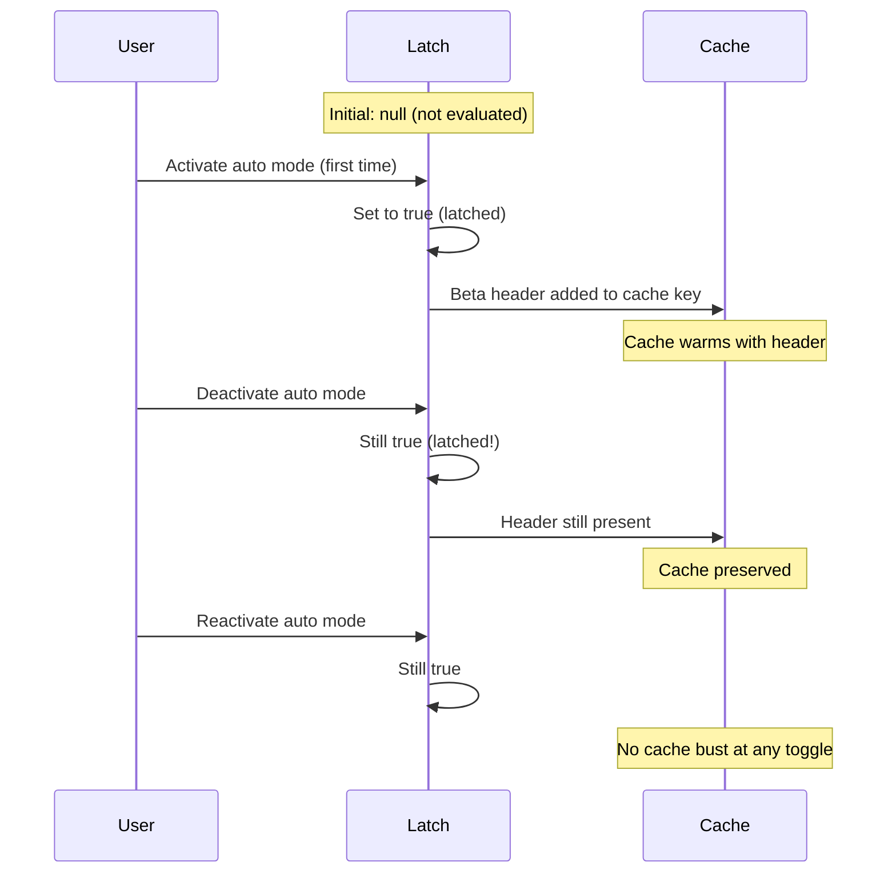
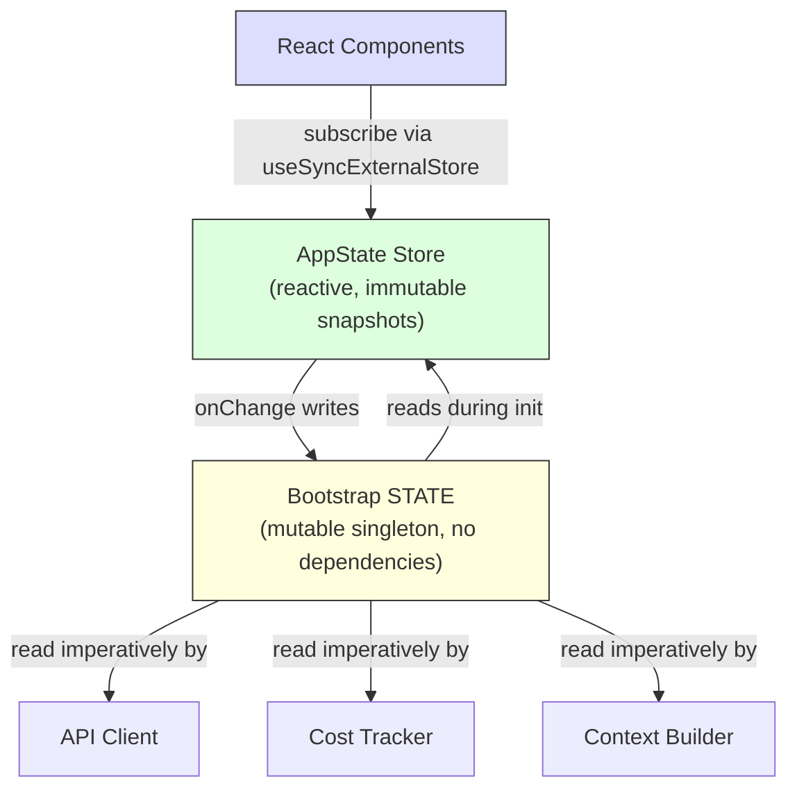

# Chapter 3: State -- The Two-Tier Architecture

# 第 3 章：状态——双层架构

Chapter 2 traced the bootstrap pipeline from process start to first render. By the end, the system had a fully configured environment. But configured with *what*? Where does the session ID live? The current model? The message history? The cost tracker? The permission mode? Where does state live, and why does it live there?

第 2 章梳理了从进程启动到首次渲染的引导（bootstrap）流程。在流程结束时，系统已拥有一个完全配置好的环境。但究竟用*什么*配置的呢？session ID 存放在哪里？当前的模型呢？消息历史呢？成本追踪器呢？权限模式呢？状态究竟存放在哪里，又为何存放在那里？

Every long-running application eventually faces this question. For a simple CLI tool the answer is trivial -- a few variables in `main()`. But Claude Code is not a simple CLI tool. It is a React application rendered through Ink, with a process lifecycle that spans hours, a plugin system that loads at arbitrary times, an API layer that must construct prompts from cached context, a cost tracker that survives process restarts, and dozens of infrastructure modules that need to read and write shared data without importing each other.

每个长时间运行的应用最终都会面对这个问题。对于一个简单的 CLI 工具，答案很简单——在 `main()` 里放几个变量就行。但 Claude Code 不是一个简单的 CLI 工具。它是一个通过 Ink 渲染的 React 应用，进程生命周期长达数小时，插件系统会在任意时刻加载，API 层必须从缓存的上下文中构造 prompt，成本追踪器要能在进程重启后存活，还有数十个基础设施模块需要在彼此不互相 import 的前提下读写共享数据。

The naive approach -- a single global store -- fails immediately. If the cost tracker updated the same store that drives React re-renders, every API call would trigger a full component tree reconciliation. Infrastructure modules (bootstrap, context building, cost tracking, telemetry) cannot import React. They run before React mounts. They run after React unmounts. They run in contexts where no component tree exists at all. Putting everything into a React-aware store would create circular dependencies across the entire import graph.

最朴素的做法——单一全局 store——会立刻失败。如果成本追踪器更新的是驱动 React 重渲染的同一个 store，那么每一次 API 调用都会触发整棵组件树的协调（reconciliation）。基础设施模块（引导、上下文构建、成本追踪、遥测）不能 import React。它们在 React 挂载之前运行，在 React 卸载之后运行，也在根本不存在组件树的上下文中运行。把所有东西都塞进一个感知 React 的 store，会在整张 import 图中制造循环依赖。

Claude Code solves this with a two-tier architecture: a mutable process singleton for infrastructure state, and a minimal reactive store for UI state. This chapter explains both tiers, the side-effect system that bridges them, and the supporting subsystems that depend on this foundation. Every subsequent chapter assumes you understand where state lives and why it lives there.

Claude Code 用一种双层架构来解决这个问题：用一个可变的进程级单例（singleton）承载基础设施状态，用一个极简的响应式 store 承载 UI 状态。本章将讲解这两层、桥接它们的副作用系统，以及依赖于这一基础的各个支撑子系统。后续每一章都默认你已经理解状态存放在哪里、以及为何存放在那里。

---

## 3.1 Bootstrap State -- The Process Singleton

## 3.1 引导状态——进程级单例

### Why a Mutable Singleton

### 为何选择可变单例

The bootstrap state module (`bootstrap/state.ts`) is a single mutable object created once at process start:

引导状态模块（`bootstrap/state.ts`）是一个在进程启动时创建一次的、单一的可变对象：

```typescript
const STATE: State = getInitialState()
```

The comment above this line reads: `AND ESPECIALLY HERE`. Two lines above the type definition: `DO NOT ADD MORE STATE HERE - BE JUDICIOUS WITH GLOBAL STATE`. These comments have the tone of engineers who learned the cost of an ungoverned global object the hard way.

这行代码上方的注释写着：`AND ESPECIALLY HERE`。在类型定义上方两行处：`DO NOT ADD MORE STATE HERE - BE JUDICIOUS WITH GLOBAL STATE`。这些注释带着一种语气——它们来自那些以惨痛代价领教过失控的全局对象的工程师。

A mutable singleton is the right choice here for three reasons. First, bootstrap state must be available before any framework initializes -- before React mounts, before the store is created, before plugins load. Module-scope initialization is the only mechanism that guarantees availability at import time. Second, the data is inherently process-scoped: session IDs, telemetry counters, cost accumulators, cached paths. There is no meaningful "previous state" to diff against, no subscribers to notify, no undo history. Third, the module must be a leaf in the import dependency graph. If it imported React, or the store, or any service module, it would create cycles that break the bootstrap sequence described in Chapter 2. By depending on nothing but utility types and `node:crypto`, it remains importable from anywhere.

在这里，选择可变单例是正确的，原因有三。第一，引导状态必须在任何框架初始化之前就可用——在 React 挂载之前、在 store 创建之前、在插件加载之前。模块作用域的初始化是唯一能保证在 import 时刻就可用的机制。第二，这些数据本质上是进程级作用域的：session ID、遥测计数器、成本累加器、缓存的路径。这里没有有意义的“前一个状态”可供 diff，没有订阅者需要通知，也没有撤销历史。第三，该模块必须是 import 依赖图中的一个叶子节点。如果它 import 了 React、store 或任何服务模块，就会制造循环，从而破坏第 2 章所描述的引导序列。由于它除了工具类型和 `node:crypto` 之外不依赖任何东西，因此可以从任何地方被 import。

### The ~80 Fields

### 约 80 个字段

The `State` type contains approximately 80 fields. A sampling reveals the breadth:

`State` 类型包含约 80 个字段。抽样一看便知其涵盖之广：

**Identity and paths** -- `originalCwd`, `projectRoot`, `cwd`, `sessionId`, `parentSessionId`. The `originalCwd` is resolved through `realpathSync` and NFC-normalized at process start. It never changes.

**身份与路径**——`originalCwd`、`projectRoot`、`cwd`、`sessionId`、`parentSessionId`。其中 `originalCwd` 在进程启动时通过 `realpathSync` 解析并经过 NFC 归一化处理。它永不改变。

**Cost and metrics** -- `totalCostUSD`, `totalAPIDuration`, `totalLinesAdded`, `totalLinesRemoved`. These accumulate monotonically through the session and persist to disk on exit.

**成本与指标**——`totalCostUSD`、`totalAPIDuration`、`totalLinesAdded`、`totalLinesRemoved`。它们在整个会话期间单调累加，并在退出时持久化到磁盘。

**Telemetry** -- `meter`, `sessionCounter`, `costCounter`, `tokenCounter`. OpenTelemetry handles, all nullable (null until telemetry initializes).

**遥测**——`meter`、`sessionCounter`、`costCounter`、`tokenCounter`。这些是 OpenTelemetry 句柄，全部可为 null（在遥测初始化之前为 null）。

**Model configuration** -- `mainLoopModelOverride`, `initialMainLoopModel`. The override is set when the user changes models mid-session.

**模型配置**——`mainLoopModelOverride`、`initialMainLoopModel`。当用户在会话中途切换模型时，会设置这个 override 值。

**Session flags** -- `isInteractive`, `kairosActive`, `sessionTrustAccepted`, `hasExitedPlanMode`. Booleans that gate behavior for the session duration.

**会话标志**——`isInteractive`、`kairosActive`、`sessionTrustAccepted`、`hasExitedPlanMode`。这些布尔值在整个会话期间充当行为开关。

**Cache optimization** -- `promptCache1hAllowlist`, `promptCache1hEligible`, `systemPromptSectionCache`, `cachedClaudeMdContent`. These exist to prevent redundant computation and prompt cache busting.

**缓存优化**——`promptCache1hAllowlist`、`promptCache1hEligible`、`systemPromptSectionCache`、`cachedClaudeMdContent`。它们的存在是为了避免重复计算以及 prompt 缓存失效（cache busting）。

### The Getter/Setter Pattern

### Getter/Setter 模式

The `STATE` object is never exported. All access goes through approximately 100 individual getter and setter functions:

`STATE` 对象从不被 export。所有访问都通过大约 100 个独立的 getter 与 setter 函数进行：

```typescript
// Pseudocode — illustrates the pattern
export function getProjectRoot(): string {
  return STATE.projectRoot
}

export function setProjectRoot(dir: string): void {
  STATE.projectRoot = dir.normalize('NFC')  // NFC normalization on every path setter
}
```

This pattern enforces encapsulation, NFC normalization on every path setter (preventing Unicode mismatches on macOS), type narrowing, and bootstrap isolation. The trade-off is verbosity -- a hundred functions for eighty fields. But in a codebase where a stray mutation could bust a 50,000-token prompt cache, explicitness wins.

这种模式强制实现了封装、在每个路径 setter 上的 NFC 归一化（防止 macOS 上的 Unicode 不匹配）、类型收窄（type narrowing）以及引导隔离。代价是冗长——八十个字段对应一百个函数。但在一个“一次意外的写入就可能让 50,000 token 的 prompt 缓存失效”的代码库里，显式性更胜一筹。

### The Signal Pattern

### 信号（Signal）模式

Bootstrap cannot import listeners (it is a DAG leaf), so it uses a minimal pub/sub primitive called `createSignal`. The `sessionSwitched` signal has exactly one consumer: `concurrentSessions.ts`, which keeps PID files in sync. The signal is exposed as `onSessionSwitch = sessionSwitched.subscribe`, letting callers register themselves without bootstrap knowing who they are.

引导模块不能 import 监听器（它是 DAG 的叶子节点），因此它使用了一个名为 `createSignal` 的极简发布/订阅原语。`sessionSwitched` 信号恰好只有一个消费者：`concurrentSessions.ts`，它负责让 PID 文件保持同步。该信号以 `onSessionSwitch = sessionSwitched.subscribe` 的形式暴露出来，使调用方能够自行注册，而引导模块无需知道它们是谁。

### The Five Sticky Latches

### 五个粘滞锁存（Sticky Latch）

The most subtle fields in bootstrap state are five boolean latches that follow the same pattern: once a feature is first activated during a session, a corresponding flag stays `true` for the rest of the session. They all exist for one reason: prompt cache preservation.

引导状态中最微妙的字段，是五个遵循同一模式的布尔锁存：一旦某个特性在会话期间首次被激活，对应的标志就会在会话余下时间里一直保持 `true`。它们的存在都只有一个原因：保住 prompt 缓存。



Claude's API supports server-side prompt caching. When consecutive requests share the same system prompt prefix, the server reuses cached computations. But the cache key includes HTTP headers and request body fields. If a beta header appears in request N but not request N+1, the cache is busted -- even if the prompt content is identical. For a system prompt exceeding 50,000 tokens, a cache miss is expensive.

Claude 的 API 支持服务端 prompt 缓存。当连续的请求共享相同的 system prompt 前缀时，服务端会复用缓存的计算结果。但缓存键（cache key）包含 HTTP header 和请求体字段。如果某个 beta header 出现在第 N 个请求中、却没出现在第 N+1 个请求中，那么缓存就会失效——即便 prompt 内容完全相同。对于一个超过 50,000 token 的 system prompt，一次缓存未命中（cache miss）代价高昂。

The five latches:

这五个锁存：

| Latch | What It Prevents |
|-------|-----------------|
| `afkModeHeaderLatched` | Shift+Tab auto mode toggling flips the AFK beta header on/off |
| `fastModeHeaderLatched` | Fast mode cooldown enter/exit flips the fast mode header |
| `cacheEditingHeaderLatched` | Remote feature flag changes bust every active user's cache |
| `thinkingClearLatched` | Triggered on confirmed cache miss (>1h idle). Prevents re-enabling thinking blocks from busting freshly warmed cache |
| `pendingPostCompaction` | Consume-once flag for telemetry: distinguishes compaction-induced cache misses from TTL-expiry misses |

| 锁存 | 它防止了什么 |
|-------|-----------------|
| `afkModeHeaderLatched` | Shift+Tab 切换 auto 模式会让 AFK beta header 反复开关 |
| `fastModeHeaderLatched` | fast 模式冷却的进入/退出会让 fast mode header 反复开关 |
| `cacheEditingHeaderLatched` | 远程功能开关（feature flag）的变更会让每一个活跃用户的缓存失效 |
| `thinkingClearLatched` | 在确认发生缓存未命中时（空闲 >1 小时）触发。防止重新启用 thinking block 让刚刚预热好的缓存失效 |
| `pendingPostCompaction` | 供遥测使用的“一次性消费”标志：用于区分压缩（compaction）引起的缓存未命中与 TTL 过期引起的未命中 |

All five use a three-state type: `boolean | null`. The `null` initial value means "not yet evaluated." `true` means "latched on." They never return to `null` or `false` once set to `true`. This is the defining property of a latch.

这五个全都使用一种三态类型：`boolean | null`。初始值 `null` 表示“尚未求值”。`true` 表示“已锁存为开”。它们一旦被置为 `true`，就再也不会回到 `null` 或 `false`。这正是锁存的定义性特征。

The implementation pattern:

其实现模式：

```typescript
function shouldSendBetaHeader(featureCurrentlyActive: boolean): boolean {
  const latched = getAfkModeHeaderLatched()
  if (latched === true) return true       // Already latched -- always send
  if (featureCurrentlyActive) {
    setAfkModeHeaderLatched(true)          // First activation -- latch it
    return true
  }
  return false                             // Never activated -- don't send
}
```

Why not just always send all beta headers? Because headers are part of the cache key. Sending an unrecognized header creates a different cache namespace. The latch ensures you only enter a cache namespace when you actually need it, then stay there.

为什么不干脆永远发送所有 beta header 呢？因为 header 是缓存键的一部分。发送一个无法识别的 header 会创建出一个不同的缓存命名空间。锁存确保你只在真正需要时才进入某个缓存命名空间，然后就一直留在那里。

---

## 3.2 AppState -- The Reactive Store

## 3.2 AppState——响应式 Store

### The 34-Line Implementation

### 34 行的实现

The UI state store lives in `state/store.ts`:

UI 状态 store 位于 `state/store.ts`：

The store implementation is approximately 30 lines: a closure over a `state` variable, an `Object.is` equality check to prevent spurious updates, synchronous listener notification, and an `onChange` callback for side effects. The skeleton looks like:

store 的实现大约 30 行：一个闭包包住 `state` 变量，一次 `Object.is` 相等性检查以防止虚假更新，同步的监听器通知，以及一个用于副作用的 `onChange` 回调。骨架大致如下：

```typescript
// Pseudocode — illustrates the pattern
function makeStore(initial, onTransition) {
  let current = initial
  const subs = new Set()
  return {
    read:      () => current,
    update:    (fn) => { /* Object.is guard, then notify */ },
    subscribe: (cb) => { subs.add(cb); return () => subs.delete(cb) },
  }
}
```

Thirty-four lines. No middleware, no devtools, no time-travel debugging, no action types. Just a closure over a mutable variable, a Set of listeners, and an `Object.is` equality check. This is Zustand without the library.

三十四行。没有中间件，没有 devtools，没有时间旅行调试，没有 action 类型。只有一个包住可变变量的闭包、一个由监听器组成的 Set，以及一次 `Object.is` 相等性检查。这就是去掉了库本身的 Zustand。

The design decisions worth examining:

值得细究的设计决策：

**Updater function pattern.** There is no `setState(newValue)` -- only `setState((prev) => next)`. Every mutation receives the current state and must produce the next state, eliminating stale-state bugs from concurrent mutations.

**更新函数（updater）模式。** 这里没有 `setState(newValue)`——只有 `setState((prev) => next)`。每一次写入都会收到当前状态，并且必须产出下一个状态，从而消除了并发写入导致的过期状态（stale-state）bug。

**`Object.is` equality check.** If the updater returns the same reference, the mutation is a no-op. No listeners fire. No side effects run. Critical for performance -- components that spread-and-set without changing values produce no re-renders.

**`Object.is` 相等性检查。** 如果 updater 返回的是同一个引用，这次写入就是空操作（no-op）。不会触发任何监听器，不会运行任何副作用。这对性能至关重要——那些只是展开并重新设置、却没有改变值的组件，不会产生任何重渲染。

**`onChange` fires before listeners.** The optional `onChange` callback receives both old and new state and fires synchronously before any subscriber is notified. This is used for side effects (Section 3.4) that must complete before the UI re-renders.

**`onChange` 先于监听器触发。** 可选的 `onChange` 回调会同时接收旧状态与新状态，并在任何订阅者被通知之前同步触发。它用于那些必须在 UI 重渲染之前完成的副作用（见第 3.4 节）。

**No middleware, no devtools.** This is not an oversight. When your store needs exactly three operations (get, set, subscribe), an `Object.is` equality check, and a synchronous `onChange` hook, 34 lines of code you own is better than a dependency. You control the exact semantics. You can read the entire implementation in thirty seconds.

**没有中间件，没有 devtools。** 这并非疏忽。当你的 store 恰好只需要三个操作（get、set、subscribe）、一次 `Object.is` 相等性检查，以及一个同步的 `onChange` 钩子时，你自己拥有的这 34 行代码胜过一个外部依赖。你能掌控确切的语义。你能在三十秒内读完整个实现。

### The AppState Type

### AppState 类型

The `AppState` type (~452 lines) is the shape of everything the UI needs to render. It is wrapped in `DeepImmutable<>` for most fields, with explicit exclusions for fields containing function types:

`AppState` 类型（约 452 行）是 UI 渲染所需一切的形态描述。它的大多数字段被包裹在 `DeepImmutable<>` 中，并对包含函数类型的字段做了显式的排除：

```typescript
export type AppState = DeepImmutable<{
  settings: SettingsJson
  verbose: boolean
  // ... ~150 more fields
}> & {
  tasks: { [taskId: string]: TaskState }  // Contains abort controllers
  agentNameRegistry: Map<string, AgentId>
}
```

The intersection type lets most fields be deeply immutable while exempting fields that hold functions, Maps, and mutable refs. Full immutability is the default, with surgical escape hatches where the type system would fight the runtime semantics.

这个交叉类型（intersection type）让大多数字段保持深度不可变，同时豁免了那些持有函数、Map 和可变引用（ref）的字段。完全不可变是默认值，而在类型系统会与运行时语义相冲突的地方，则开了精确的“逃生口”（escape hatch）。

### React Integration

### 与 React 集成

The store integrates with React through `useSyncExternalStore`:

store 通过 `useSyncExternalStore` 与 React 集成：

```typescript
// Standard React pattern — useSyncExternalStore with a selector
export function useAppState<T>(selector: (state: AppState) => T): T {
  const store = useContext(AppStoreContext)
  return useSyncExternalStore(
    store.subscribe,
    () => selector(store.getState()),
  )
}
```

The selector must return an existing sub-object reference (not a freshly constructed object) for `Object.is` comparison to prevent unnecessary re-renders. If you write `useAppState(s => ({ a: s.a, b: s.b }))`, every render produces a new object reference, and the component re-renders on every state change. This is the same constraint Zustand users face -- cheaper comparisons, but the selector author must understand reference identity.

selector 必须返回一个已存在的子对象引用（而非新构造的对象），这样 `Object.is` 比较才能防止不必要的重渲染。如果你写成 `useAppState(s => ({ a: s.a, b: s.b }))`，那么每次渲染都会产出一个新的对象引用，组件就会在每一次状态变更时重渲染。这与 Zustand 用户面临的约束相同——比较更廉价，但 selector 的编写者必须理解引用同一性（reference identity）。

---

## 3.3 How the Two Tiers Relate

## 3.3 两层之间如何关联

The two tiers communicate through explicit, narrow interfaces.

这两层通过显式而狭窄的接口进行通信。



Bootstrap state flows into AppState during initialization: `getDefaultAppState()` reads settings from disk (which bootstrap helped locate), checks feature flags (which bootstrap evaluated), and sets the initial model (which bootstrap resolved from CLI args and settings).

在初始化期间，引导状态流入 AppState：`getDefaultAppState()` 从磁盘读取设置（其位置由引导模块协助定位）、检查功能开关（由引导模块求值）、并设置初始模型（由引导模块从 CLI 参数和设置中解析得出）。

AppState flows back to bootstrap state through side effects: when the user changes the model, `onChangeAppState` calls `setMainLoopModelOverride()` in bootstrap. When settings change, credential caches in bootstrap are cleared.

AppState 又通过副作用回流到引导状态：当用户切换模型时，`onChangeAppState` 会调用引导模块中的 `setMainLoopModelOverride()`。当设置发生变更时，引导模块中的凭据缓存会被清空。

But the two tiers never share a reference. A module that imports bootstrap state does not need to know about React. A component that reads AppState does not need to know about the process singleton.

但这两层从不共享引用。一个 import 引导状态的模块无需了解 React。一个读取 AppState 的组件无需了解进程级单例。

A concrete example clarifies the data flow. When the user types `/model claude-sonnet-4`:

一个具体的例子能讲清楚数据流。当用户输入 `/model claude-sonnet-4` 时：

1. The command handler calls `store.setState(prev => ({ ...prev, mainLoopModel: 'claude-sonnet-4' }))`

1. 命令处理器调用 `store.setState(prev => ({ ...prev, mainLoopModel: 'claude-sonnet-4' }))`

2. The store's `Object.is` check detects a change

2. store 的 `Object.is` 检查侦测到一处变更

3. `onChangeAppState` fires, detects the model changed, calls `setMainLoopModelOverride()` (updates bootstrap) and `updateSettingsForSource()` (persists to disk)

3. `onChangeAppState` 触发，侦测到模型已改变，调用 `setMainLoopModelOverride()`（更新引导状态）和 `updateSettingsForSource()`（持久化到磁盘）

4. All store subscribers fire -- React components re-render to show the new model name

4. 所有 store 订阅者触发——React 组件重渲染以显示新的模型名称

5. The next API call reads the model from `getMainLoopModelOverride()` in bootstrap state

5. 下一次 API 调用从引导状态中的 `getMainLoopModelOverride()` 读取模型

Steps 1-4 are synchronous. The API client in step 5 may run seconds later. But it reads from bootstrap state (updated in step 3), not from AppState. This is the two-tier handoff: the UI store is the source of truth for what the user chose, but bootstrap state is the source of truth for what the API client uses.

第 1 到 4 步是同步的。第 5 步的 API 客户端可能在数秒之后才运行。但它读取的是引导状态（在第 3 步已更新），而非 AppState。这正是双层之间的交接：UI store 是“用户选了什么”的真相来源（source of truth），而引导状态是“API 客户端用什么”的真相来源。

The DAG property -- bootstrap depends on nothing, AppState depends on bootstrap for init, React depends on AppState -- is enforced by an ESLint rule that prevents `bootstrap/state.ts` from importing modules outside its allowed set.

这一 DAG 特性——引导不依赖任何东西，AppState 在初始化时依赖引导，React 依赖 AppState——是由一条 ESLint 规则强制保证的，该规则禁止 `bootstrap/state.ts` import 其允许集合之外的模块。

---

## 3.4 Side Effects: onChangeAppState

## 3.4 副作用：onChangeAppState

The `onChange` callback is where the two tiers synchronize. Every `setState` call triggers `onChangeAppState`, which receives both previous and new state and decides what external effects to fire.

`onChange` 回调正是两层进行同步之处。每一次 `setState` 调用都会触发 `onChangeAppState`，它同时接收前一个状态与新状态，并决定要触发哪些外部副作用。

**Permission mode sync** is the primary use case. Prior to this centralized handler, permission mode was synced to the remote session (CCR) by only 2 of 8+ mutation paths. The other six -- Shift+Tab cycling, dialog options, slash commands, rewind, bridge callbacks -- all mutated AppState without telling CCR. The external metadata drifted out of sync.

**权限模式同步**是主要的应用场景。在引入这个集中式处理器之前，权限模式只通过 8 条以上写入路径中的 2 条被同步到远程会话（CCR）。其余六条——Shift+Tab 循环切换、对话框选项、斜杠命令、回退（rewind）、桥接回调——全都改写了 AppState 却没有告知 CCR。于是外部元数据逐渐失去同步。

The fix: stop scattering notifications across mutation sites and instead hook the diff in one place. The comment in the source code lists every mutation path that was broken and notes that "the scattered callsites above need zero changes." This is the architectural benefit of centralized side effects -- coverage is structural, not manual.

修复方案：不再把通知散布到各个写入点，而是在一个地方挂接对状态 diff 的处理。源代码中的注释列出了每一条曾经出问题的写入路径，并指出“上面那些分散的调用点一处都不用改”。这正是集中式副作用带来的架构收益——覆盖是结构性的，而非靠人工保证的。

**Model changes** keep bootstrap state in sync with what the UI renders. **Settings changes** clear credential caches and re-apply environment variables. **Verbose toggle** and **expanded view** are persisted to global config.

**模型变更**让引导状态与 UI 所渲染的内容保持一致。**设置变更**会清空凭据缓存并重新应用环境变量。**verbose 开关**与**展开视图（expanded view）**则被持久化到全局配置中。

The pattern -- centralized side effects on a diffable state transition -- is essentially the Observer pattern applied at the granularity of a state diff rather than individual events. It scales better than scattered event emissions because the number of side effects grows much more slowly than the number of mutation sites.

这一模式——在可 diff 的状态转换上集中处理副作用——本质上就是把观察者模式（Observer pattern）应用在“状态 diff”这一粒度上，而非应用在单个事件上。它比分散的事件触发扩展性更好，因为副作用的数量增长得比写入点的数量慢得多。

---

## 3.5 Context Building

## 3.5 上下文构建

Three memoized async functions in `context.ts` build the system prompt context prepended to every conversation. Each is computed once per session, not per turn.

`context.ts` 中有三个被记忆化（memoized）的 async 函数，它们构建出会被预置到每段对话之前的 system prompt 上下文。每个函数在一次会话中只计算一次，而非每一轮（turn）都计算。

`getGitStatus` runs five git commands in parallel (`Promise.all`), producing a block with the current branch, default branch, recent commits, and working tree status. The `--no-optional-locks` flag prevents git from taking write locks that could interfere with concurrent git operations in another terminal.

`getGitStatus` 以并行方式（`Promise.all`）运行五条 git 命令，生成一个包含当前分支、默认分支、近期提交以及工作树状态的信息块。`--no-optional-locks` 标志可防止 git 获取写锁，避免干扰另一个终端中并发的 git 操作。

`getUserContext` loads CLAUDE.md content and caches it in bootstrap state via `setCachedClaudeMdContent`. This cache breaks a circular dependency: the auto-mode classifier needs CLAUDE.md content, but CLAUDE.md loading goes through the filesystem, which goes through permissions, which calls the classifier. By caching in bootstrap state (a DAG leaf), the cycle is broken.

`getUserContext` 加载 CLAUDE.md 的内容，并通过 `setCachedClaudeMdContent` 将其缓存到引导状态中。这一缓存打破了一处循环依赖：auto 模式分类器需要 CLAUDE.md 的内容，但 CLAUDE.md 的加载要经过文件系统，文件系统又要经过权限检查，而权限检查会调用该分类器。通过缓存到引导状态（一个 DAG 叶子节点）中，这个循环被打破了。

All three context functions use Lodash's `memoize` (compute once, cache forever) rather than TTL-based caching. The reasoning: if git status were re-computed every 5 minutes, the change would bust the server-side prompt cache. The system prompt even tells the model: "This is the git status at the start of the conversation. Note that this status is a snapshot in time."

这三个上下文函数全都使用 Lodash 的 `memoize`（计算一次、永久缓存），而非基于 TTL 的缓存。其理由是：如果每 5 分钟重新计算一次 git status，这种变化就会让服务端的 prompt 缓存失效。system prompt 甚至会直接告诉模型：“This is the git status at the start of the conversation. Note that this status is a snapshot in time.”（这是对话开始时的 git 状态。请注意这一状态只是某一时刻的快照。）

---

## 3.6 Cost Tracking

## 3.6 成本追踪

Every API response flows through `addToTotalSessionCost`, which accumulates per-model usage, updates bootstrap state, reports to OpenTelemetry, and recursively processes advisor tool usage (nested model calls within a response).

每一个 API 响应都会流经 `addToTotalSessionCost`，它会按模型累计用量、更新引导状态、上报至 OpenTelemetry，并递归处理 advisor 工具的用量（即一个响应中嵌套的模型调用）。

Cost state survives process restarts through save-and-restore to a project config file. The session ID is used as a guard -- costs are only restored if the persisted session ID matches the session being resumed.

成本状态通过向项目配置文件“保存—恢复”的方式在进程重启后存活下来。session ID 充当一道防护——只有当持久化的 session ID 与正在恢复的会话相匹配时，成本数据才会被恢复。

Histograms use reservoir sampling (Algorithm R) to maintain bounded memory while accurately representing distributions. The 1,024-entry reservoir produces p50, p95, and p99 percentiles. Why not a simple running average? Because averages hide distribution shape. A session where 95% of API calls take 200ms and 5% take 10 seconds has the same average as one where all calls take 690ms, but the user experience is radically different.

直方图（histogram）使用蓄水池采样（reservoir sampling，即 Algorithm R）来在保持有界内存的同时准确地表示分布。这个 1,024 项的蓄水池可产出 p50、p95 和 p99 百分位数。为什么不用简单的滑动平均（running average）？因为平均值会掩盖分布的形态。一个会话中 95% 的 API 调用耗时 200ms、5% 耗时 10 秒，它的平均值与“所有调用都耗时 690ms”的会话相同，但用户体验天差地别。

---

## 3.7 What We Learned

## 3.7 我们学到了什么

The codebase has grown from a simple CLI to a system with ~450 lines of state type definitions, ~80 fields of process state, a side-effect system, multiple persistence boundaries, and cache optimization latches. None of this was designed upfront. The sticky latches were added when cache busting became a measurable cost problem. The `onChange` handler was centralized when 6 of 8 permission sync paths were discovered to be broken. The CLAUDE.md cache was added when a circular dependency emerged.

这个代码库已从一个简单的 CLI 成长为一个拥有约 450 行状态类型定义、约 80 个进程状态字段、一套副作用系统、多重持久化边界以及若干缓存优化锁存的系统。这一切都不是一开始就设计好的。粘滞锁存是在缓存失效变成一个可量化的成本问题时才加入的。`onChange` 处理器是在发现 8 条权限同步路径中有 6 条已损坏时才被集中化的。CLAUDE.md 缓存则是在出现一处循环依赖时才加入的。

This is the natural growth pattern of state in a complex application. The two-tier architecture provides enough structure to contain the growth -- new bootstrap fields do not affect React rendering, new AppState fields do not create import cycles -- while remaining flexible enough to accommodate patterns that were not anticipated in the original design.

这正是一个复杂应用中状态的自然生长模式。双层架构提供了足够的结构来容纳这种生长——新增的引导字段不会影响 React 渲染，新增的 AppState 字段不会制造 import 循环——同时又保持了足够的灵活性，以容纳原始设计中并未预料到的模式。

---

## 3.8 State Architecture Summary

## 3.8 状态架构小结

| Property | Bootstrap State | AppState |
|---|---|---|
| **Location** | Module-scope singleton | React context |
| **Mutability** | Mutable through setters | Immutable snapshots via updater |
| **Subscribers** | Signal (pub/sub) for specific events | `useSyncExternalStore` for React |
| **Availability** | Import time (before React) | After provider mounts |
| **Persistence** | Process exit handlers | Via onChange to disk |
| **Equality** | N/A (imperative reads) | `Object.is` reference check |
| **Dependencies** | DAG leaf (imports nothing) | Imports types from across codebase |
| **Test reset** | `resetStateForTests()` | Create new store instance |
| **Primary consumers** | API client, cost tracker, context builder | React components, side effects |

| 属性 | Bootstrap State（引导状态） | AppState |
|---|---|---|
| **位置** | 模块作用域单例 | React context |
| **可变性** | 通过 setter 可变 | 通过 updater 产生不可变快照 |
| **订阅者** | 针对特定事件的 Signal（发布/订阅） | 供 React 使用的 `useSyncExternalStore` |
| **可用性** | import 时刻（早于 React） | provider 挂载之后 |
| **持久化** | 进程退出处理器 | 经由 onChange 写入磁盘 |
| **相等性** | 不适用（命令式读取） | `Object.is` 引用检查 |
| **依赖** | DAG 叶子节点（不 import 任何东西） | 从整个代码库各处 import 类型 |
| **测试重置** | `resetStateForTests()` | 创建一个新的 store 实例 |
| **主要消费者** | API 客户端、成本追踪器、上下文构建器 | React 组件、副作用 |

---

## Apply This

## 应用要点

**Separate state by access pattern, not by domain.** Session ID belongs in the singleton not because it is "infrastructure" in the abstract, but because it must be readable before React mounts and writable without notifying subscribers. Permission mode belongs in the reactive store because changing it must trigger re-renders and side effects. Let the access pattern drive the tier, and the architecture follows naturally.

**按访问模式而非按领域来划分状态。** session ID 之所以归属于单例，并不是因为它抽象意义上是“基础设施”，而是因为它必须在 React 挂载之前就可读、并且在写入时无需通知订阅者。权限模式之所以归属于响应式 store，是因为改变它必须触发重渲染与副作用。让访问模式来决定层级归属，架构便会自然成形。

**The sticky latch pattern.** Any system that interacts with a cache (prompt cache, CDN, query cache) faces the same problem: feature toggles that change the cache key mid-session cause invalidation. Once a feature is activated, its cache key contribution stays active for the session. The three-state type (`boolean | null`, meaning "not evaluated / on / never off") makes the intent self-documenting. Especially valuable when the cache is not under your control.

**粘滞锁存模式。** 任何与缓存打交道的系统（prompt 缓存、CDN、查询缓存）都面临同一个问题：那些会在会话中途改变缓存键的功能开关会导致缓存失效。一旦某个特性被激活，它对缓存键的贡献就在整个会话期间保持有效。三态类型（`boolean | null`，含义为“未求值 / 开 / 永不关闭”）让意图自带文档。当缓存不在你的掌控之内时，这一点尤其宝贵。

**Centralize side effects on state diffs.** When multiple code paths can change the same state, do not scatter notifications across mutation sites. Hook the store's `onChange` callback and detect which fields changed. Coverage becomes structural (any mutation triggers the effect) rather than manual (each mutation site must remember to notify).

**在状态 diff 上集中处理副作用。** 当多条代码路径都能改变同一份状态时，不要把通知散布到各个写入点。挂接 store 的 `onChange` 回调，并侦测哪些字段发生了变化。覆盖于是变成结构性的（任何写入都会触发该副作用），而非靠人工保证的（每个写入点都必须记得去通知）。

**Prefer 34 lines you own over a library you do not.** When your requirements are exactly get, set, subscribe, and a change callback, a minimal implementation gives you full control over the semantics. In a system where state management bugs can cost real money, that transparency has value. The key insight is recognizing when you do *not* need a library.

**宁愿用你自己拥有的 34 行代码，也不用你掌控不了的库。** 当你的需求恰好就是 get、set、subscribe 和一个变更回调时，一个极简实现能让你完全掌控其语义。在一个“状态管理 bug 可能真的要花真金白银”的系统里，这种透明性是有价值的。关键的洞见在于识别出你*不*需要一个库的那些时刻。

**Use process exit as a persistence boundary with intention.** Multiple subsystems persist state on process exit. The trade-off is explicit: non-graceful termination (SIGKILL, OOM) loses accumulated data. This is acceptable because the data is diagnostic, not transactional, and writing to disk on every state change would be too expensive for counters that increment hundreds of times per session.

**有意识地把进程退出当作一道持久化边界。** 多个子系统会在进程退出时持久化状态。这里的权衡是显式的：非优雅终止（SIGKILL、OOM）会丢失已累积的数据。这是可以接受的，因为这些数据是诊断性的、而非事务性的；而对于那些一次会话中要自增数百次的计数器来说，每次状态变更都写一次磁盘的代价太高了。

---

The two-tier architecture established in this chapter -- bootstrap singleton for infrastructure, reactive store for UI, side effects bridging them -- is the foundation that every subsequent chapter builds on. The conversation loop (Chapter 4) reads context from the memoized builders. The tool system (Chapter 5) checks permissions from AppState. The agent system (Chapter 8) creates task entries in AppState while tracking costs in bootstrap state. Understanding where state lives, and why, is prerequisite to understanding how any of these systems work.

本章所确立的双层架构——用引导单例承载基础设施、用响应式 store 承载 UI、用副作用桥接二者——是后续每一章赖以建立的基础。对话循环（第 4 章）从被记忆化的构建器中读取上下文。工具系统（第 5 章）从 AppState 检查权限。Agent 系统（第 8 章）在 AppState 中创建任务条目，同时在引导状态中追踪成本。理解状态存放在哪里、以及为什么，是理解上述任何一个系统如何运作的前提。

Some fields straddle the boundary. The main loop model exists in both tiers: `mainLoopModel` in AppState (for UI rendering) and `mainLoopModelOverride` in bootstrap state (for API client consumption). The `onChangeAppState` handler keeps them synchronized. This duplication is the cost of the two-tier split. But the alternative -- having the API client import the React store, or having React components read from the process singleton -- would violate the dependency direction that keeps the architecture sound. A small amount of controlled duplication, bridged by a centralized synchronization point, is preferable to a tangled dependency graph.

有些字段横跨了这道边界。主循环模型在两层中都存在：AppState 中的 `mainLoopModel`（用于 UI 渲染）以及引导状态中的 `mainLoopModelOverride`（供 API 客户端消费）。`onChangeAppState` 处理器让二者保持同步。这种重复是双层切分所付出的代价。但另一种选择——让 API 客户端 import React store，或让 React 组件从进程级单例读取数据——则会违背那条维系架构健全的依赖方向。少量受控的重复、再由一个集中的同步点来桥接，要胜过一张纠缠不清的依赖图。
