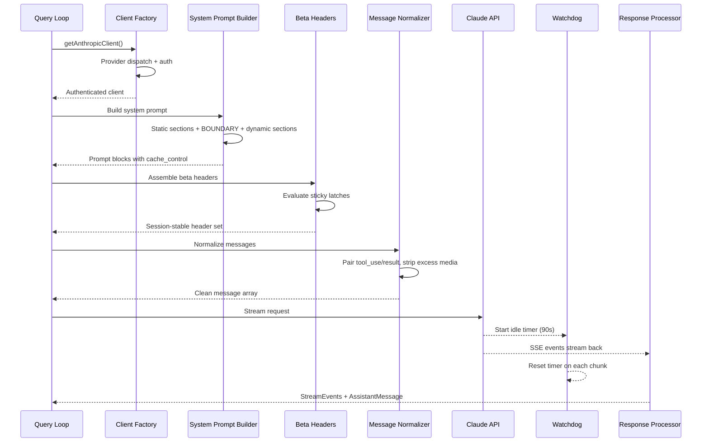
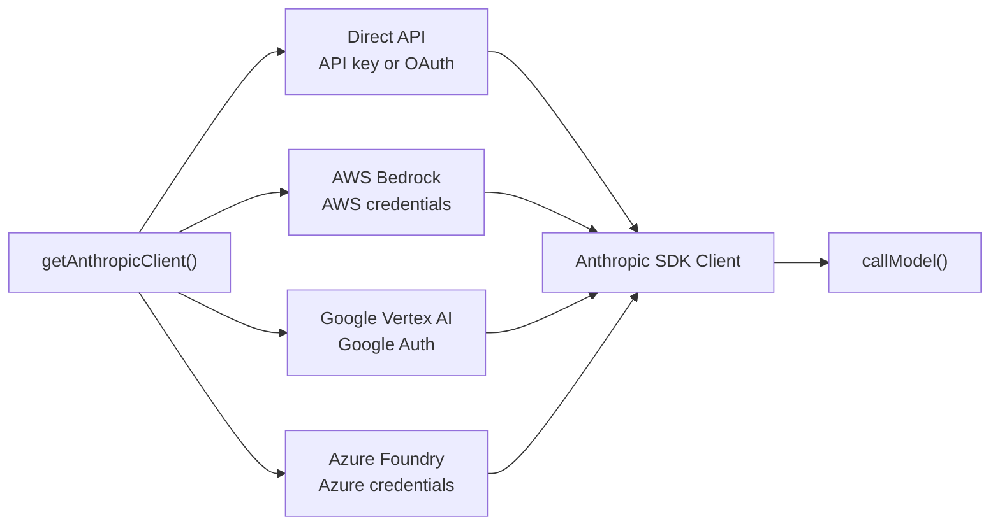
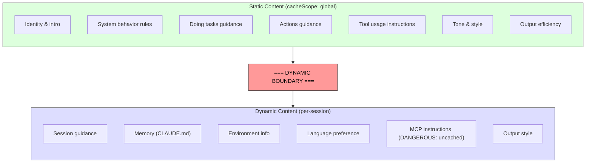

# Chapter 4: Talking to Claude -- The API Layer

# 第 4 章：与 Claude 对话——API 层

Chapter 3 established where state lives and how the two tiers communicate. Now we follow what happens when that state is put to use: the system needs to talk to a language model. Everything in Claude Code -- the bootstrap sequence, the state system, the permission framework -- exists to serve this moment.

第 3 章确立了状态存放在何处，以及两个层级之间如何通信。现在我们来追踪当这些状态被投入使用时会发生什么：系统需要与一个语言模型对话。Claude Code 中的一切——启动序列、状态系统、权限框架——存在的意义都是为了服务于这一时刻。

This layer handles more failure modes than any other part of the system. It must route through four cloud providers via a single transparent interface. It must construct system prompts with byte-level awareness of how the server's prompt cache works, because a single misplaced section can bust a cache worth 50,000+ tokens. It must stream responses with active failure detection, because TCP connections die silently. And it must maintain session-stable invariants so that mid-conversation changes to feature flags do not cause invisible performance cliffs.

这一层处理的失败模式比系统中任何其他部分都多。它必须通过单一透明接口路由到四个云服务商。它在构造系统提示时必须对服务端 prompt 缓存的工作方式有字节级的认知，因为一个放错位置的段落就可能击穿价值 50,000+ token 的缓存。它必须在流式接收响应时主动检测失败，因为 TCP 连接会无声无息地断掉。而且它必须维持会话级稳定的不变量，使得对话进行到一半时对功能开关（feature flag）的更改不会引发隐形的性能悬崖。

Let us trace a single API call from start to finish.

让我们从头到尾追踪一次完整的 API 调用。

---

## The Multi-Provider Client Factory

## 多服务商客户端工厂

The `getAnthropicClient()` function is the single factory for all model communication. It returns an Anthropic SDK client configured for whichever provider the deployment targets:

`getAnthropicClient()` 函数是所有模型通信的唯一工厂。它返回一个 Anthropic SDK 客户端，该客户端会根据部署所面向的服务商进行相应配置：

The dispatch is entirely environment-variable driven, evaluated in a fixed priority order. All four provider-specific SDK classes are cast to `Anthropic` via `as unknown as Anthropic`. The comment in the source is refreshingly honest: "we have always been lying about the return type." This deliberate type erasure means every consumer sees a uniform interface. The rest of the codebase never branches on provider.

这套分派完全由环境变量驱动，并以固定的优先级顺序进行求值。所有四个服务商专属的 SDK 类都通过 `as unknown as Anthropic` 被强制转换为 `Anthropic`。源码中的注释坦率得令人耳目一新："we have always been lying about the return type."（我们一直在对返回类型撒谎。）这种刻意的类型抹除意味着每个调用方看到的都是统一的接口。代码库的其余部分从不根据服务商做分支判断。

Each provider SDK is dynamically imported -- `AnthropicBedrock`, `AnthropicFoundry`, `AnthropicVertex` are heavy modules with their own dependency trees. The dynamic import ensures unused providers never load.

每个服务商的 SDK 都是动态导入的——`AnthropicBedrock`、`AnthropicFoundry`、`AnthropicVertex` 都是携带各自依赖树的重型模块。动态导入确保未使用的服务商永远不会被加载。

Provider selection is determined at startup and stored in bootstrap `STATE`. The query loop never checks which provider is active. Switching from Direct API to Bedrock is a configuration change, not a code change.

服务商的选择在启动时确定，并存储于启动期的 `STATE` 中。查询循环（query loop）从不检查当前激活的是哪个服务商。从 Direct API 切换到 Bedrock 是一次配置更改，而非代码更改。

### The buildFetch Wrapper

### buildFetch 包装器

Every outbound fetch gets wrapped to inject an `x-client-request-id` header -- a UUID generated per request. When a request times out, the server never assigns a request ID to the response. Without the client-side ID, the API team cannot correlate the timeout with server-side logs. This header bridges that gap. It is only sent to first-party Anthropic endpoints -- third-party providers might reject unknown headers.

每一次向外发起的 fetch 都会被包装，以注入一个 `x-client-request-id` 请求头——这是每次请求生成的一个 UUID。当一个请求超时时，服务端永远不会为该响应分配请求 ID。没有客户端侧的这个 ID，API 团队就无法将超时与服务端日志关联起来。这个请求头弥合了这道鸿沟。它只发送给第一方的 Anthropic 端点——第三方服务商可能会拒绝未知的请求头。

---

## System Prompt Construction

## 系统提示的构造

The system prompt is the most cache-sensitive artifact in the entire system. Claude's API provides server-side prompt caching: identical prompt prefixes across requests can be cached, saving both latency and cost. A 200K-token conversation might have 50-70K tokens that are identical to the previous turn. Busting that cache forces the server to re-process all of it.

系统提示是整个系统中对缓存最为敏感的产物。Claude 的 API 提供服务端 prompt 缓存：跨请求相同的 prompt 前缀可以被缓存，从而同时节省延迟和成本。一段 200K token 的对话中，可能有 50-70K token 与上一轮完全相同。击穿那份缓存会迫使服务端重新处理全部内容。

### The Dynamic Boundary Marker

### 动态边界标记

The prompt is built as an array of string sections with a critical dividing line:

prompt 被构造为一个字符串段落的数组，其中有一条关键的分界线：

Everything before the boundary is identical across sessions, users, and organizations -- it gets the highest tier of server-side caching. Everything after contains user-specific content and drops to per-session caching.

边界之前的所有内容在不同会话、不同用户、不同组织之间都是完全相同的——它享有服务端缓存的最高层级。边界之后的所有内容包含用户专属的内容，因而降级为会话级缓存。

The naming convention for sections is deliberately loud. Adding a new section requires choosing between `systemPromptSection` (safe, cached) and `DANGEROUS_uncachedSystemPromptSection` (cache-breaking, requires a reason string). The `_reason` parameter is unused at runtime but serves as mandatory documentation -- every cache-breaking section carries its justification in the source code.

段落的命名约定故意做得很张扬。添加一个新段落时，需要在 `systemPromptSection`（安全、可缓存）和 `DANGEROUS_uncachedSystemPromptSection`（破坏缓存、需要一个理由字符串）之间做出选择。`_reason` 参数在运行时未被使用，但它充当强制性的文档——每一个破坏缓存的段落都在源码中携带其正当理由。

### The 2^N Problem

### 2^N 问题

A comment in `prompts.ts` explains why conditional sections must go after the boundary:

`prompts.ts` 中的一条注释解释了为什么条件性段落必须放在边界之后：

> Each conditional here is a runtime bit that would otherwise multiply the Blake2b prefix hash variants (2^N).

> 此处的每一个条件判断都是一个运行时比特位，否则它会使 Blake2b 前缀哈希的变体数量翻倍（2^N）。

Every boolean condition before the boundary doubles the number of unique global cache entries. Three conditionals create 8 variants; five create 32. The static sections are deliberately unconditional. Compile-time feature flags (resolved by the bundler) are acceptable before the boundary. Runtime checks (is this Haiku? does the user have auto mode?) must go after.

边界之前的每一个布尔条件都会使全局缓存条目的唯一数量翻倍。三个条件产生 8 个变体；五个条件产生 32 个。静态段落被刻意设计为无条件的。编译期的功能开关（由打包器解析）在边界之前是可以接受的。运行时的检查（这是 Haiku 吗？用户启用了 auto 模式吗？）则必须放在边界之后。

This is the kind of constraint that is invisible until you violate it. A well-intentioned engineer adding a user-setting-gated section before the boundary could silently fragment the global cache and double the fleet's prompt processing costs.

这是那种在你违反它之前都看不见的约束。一位好心的工程师如果在边界之前添加一个受用户设置控制的段落，就可能悄无声息地把全局缓存碎片化，并使整个机群的 prompt 处理成本翻倍。

---

## Streaming

## 流式处理

### Raw SSE Over SDK Abstractions

### 选择原始 SSE 而非 SDK 抽象

The streaming implementation uses the raw `Stream<BetaRawMessageStreamEvent>` rather than the SDK's higher-level `BetaMessageStream`. The reason: `BetaMessageStream` calls `partialParse()` on every `input_json_delta` event. For tool calls with large JSON inputs (file edits with hundreds of lines), this re-parses the growing JSON string from scratch on every chunk -- O(n^2) behavior. Claude Code handles tool input accumulation itself, so the partial parsing is pure waste.

流式处理的实现使用的是原始的 `Stream<BetaRawMessageStreamEvent>`，而非 SDK 更高层级的 `BetaMessageStream`。原因在于：`BetaMessageStream` 会在每一个 `input_json_delta` 事件上调用 `partialParse()`。对于带有大型 JSON 输入的工具调用（涉及数百行的文件编辑），这会在每个数据块到来时从头重新解析不断增长的 JSON 字符串——这是 O(n^2) 的行为。Claude Code 自己处理工具输入的累积，因此这种部分解析纯属浪费。

### The Idle Watchdog

### 空闲看门狗

TCP connections can die without notification. The server may crash, a load balancer may silently drop the connection, or a corporate proxy may time out. The SDK's request timeout only covers the initial fetch -- once HTTP 200 arrives, the timeout is satisfied. If the streaming body stops, nothing catches it.

TCP 连接可能在毫无通知的情况下死掉。服务器可能崩溃，负载均衡器可能悄悄丢弃连接，或者企业代理可能超时。SDK 的请求超时只覆盖最初的 fetch——一旦 HTTP 200 到达，超时条件就已被满足。如果流式响应体停止了，没有任何机制会捕捉到它。

The watchdog: a `setTimeout` that resets on every received chunk. If no chunks arrive for 90 seconds, the stream is aborted and the system falls back to a non-streaming retry. A warning fires at the 45-second mark. When the watchdog fires, it logs the event with the client request ID for correlation.

看门狗：一个在每次收到数据块时都会被重置的 `setTimeout`。如果 90 秒内没有数据块到达，该流就会被中止，系统转而回退到一次非流式重试。在第 45 秒处会触发一条警告。当看门狗触发时，它会记录该事件并附上客户端请求 ID，以便关联。

### Non-Streaming Fallback

### 非流式回退

When streaming fails mid-response (network error, stall, truncation), the system falls back to a synchronous `messages.create()` call. This handles proxy failures where the proxy returns HTTP 200 with a non-SSE body, or truncates the SSE stream partway through.

当流式处理在响应进行到一半时失败（网络错误、停滞、被截断），系统会回退到一次同步的 `messages.create()` 调用。这能处理那些代理返回 HTTP 200 却带着非 SSE 响应体、或者中途截断 SSE 流的代理失败场景。

The fallback can be disabled when streaming tool execution is active, since a fallback would re-execute the entire request and potentially run tools twice.

当流式的工具执行正处于活跃状态时，这种回退可以被禁用，因为一次回退会重新执行整个请求，并可能导致工具被运行两次。

---

## Prompt Cache System

## Prompt 缓存系统

### Three Tiers

### 三个层级

Prompt caching operates at three levels:

Prompt 缓存在三个层级上运作：

**Ephemeral cache** (default): Per-session caching with a server-defined TTL (~5 minutes). All users get this.

**临时缓存（Ephemeral cache）**（默认）：会话级缓存，带有服务端定义的 TTL（约 5 分钟）。所有用户都享有这一层。

**1-hour TTL**: Eligible users get extended caching. Eligibility is determined by subscription status and latched in bootstrap state -- the `promptCache1hEligible` sticky latch from Chapter 3 ensures a mid-session overage flip does not change the TTL.

**1 小时 TTL**：符合条件的用户可获得扩展缓存。是否符合条件由订阅状态决定，并在启动期状态中被锁存——第 3 章介绍的 `promptCache1hEligible` 粘性锁存器（sticky latch）确保会话进行到一半时的超额状态翻转不会改变 TTL。

**Global scope**: System prompt cache entries get cross-session, cross-organization sharing. The static portions of the prompt are identical for all Claude Code users, so a single cached copy serves everyone. Global scope is disabled when MCP tools are present, because MCP tool definitions are user-specific and would fragment the cache into millions of unique prefixes.

**全局作用域（Global scope）**：系统提示的缓存条目可以跨会话、跨组织共享。prompt 的静态部分对所有 Claude Code 用户都是相同的，因此单一一份缓存副本即可服务所有人。当存在 MCP 工具时，全局作用域会被禁用，因为 MCP 工具定义是用户专属的，会把缓存碎片化为数以百万计的唯一前缀。

### The Sticky Latches in Action

### 粘性锁存器的实战

The five sticky latches from Chapter 3 are evaluated here, during request construction. Each latch starts as `null` and, once set to `true`, remains `true` for the session. The comment above the latch block is precise: "Sticky-on latches for dynamic beta headers. Each header, once first sent, keeps being sent for the rest of the session so mid-session toggles don't change the server-side cache key and bust ~50-70K tokens."

第 3 章介绍的五个粘性锁存器在这里、在构造请求的过程中被求值。每个锁存器都以 `null` 起始，一旦被设为 `true`，就在整个会话期间保持 `true`。锁存器代码块上方的注释非常精确："Sticky-on latches for dynamic beta headers. Each header, once first sent, keeps being sent for the rest of the session so mid-session toggles don't change the server-side cache key and bust ~50-70K tokens."（用于动态 beta 请求头的粘性开启锁存器。每个请求头一旦首次被发送，在会话余下的时间里就会持续被发送，这样会话中途的开关切换就不会改变服务端缓存键、不会击穿约 50-70K token。）

See Chapter 3, Section 3.1 for the full explanation of the latch pattern, the five specific latches, and why always-send-all-headers is not the right solution.

关于锁存器模式、那五个具体的锁存器，以及为什么"始终发送所有请求头"不是正确的解决方案，完整的解释参见第 3 章第 3.1 节。

---

## The queryModel Generator

## queryModel 生成器

The `queryModel()` function is an async generator (~700 lines) that orchestrates the entire API call lifecycle. It yields `StreamEvent`, `AssistantMessage`, and `SystemAPIErrorMessage` objects.

`queryModel()` 函数是一个异步生成器（async generator，约 700 行），它编排了整个 API 调用的生命周期。它会 yield 出 `StreamEvent`、`AssistantMessage` 和 `SystemAPIErrorMessage` 对象。

The request assembly follows a carefully ordered sequence:

请求的组装遵循一个精心安排的顺序：

1. **Kill switch check** -- safety valve for the most expensive model tier
2. **Beta header assembly** -- model-specific, with sticky latches applied
3. **Tool schema building** -- parallel via `Promise.all()`, deferred tools excluded until discovered
4. **Message normalization** -- repair orphaned tool_use/tool_result mismatches, strip excess media, remove stale blocks
5. **System prompt block construction** -- split at the dynamic boundary, assign cache scopes
6. **Retry-wrapped streaming** -- handles 529 (overloaded), model fallback, thinking downgrade, OAuth refresh

1. **熔断开关检查（Kill switch check）**——针对最昂贵模型层级的安全阀
2. **Beta 请求头组装**——按模型而定，并应用粘性锁存器
3. **工具 schema 构建**——通过 `Promise.all()` 并行进行，延迟工具（deferred tools）在被发现之前被排除在外
4. **消息规范化**——修复孤立的 tool_use/tool_result 不匹配、剥离多余的媒体内容、移除陈旧的内容块
5. **系统提示内容块的构造**——在动态边界处分割，并分配缓存作用域
6. **带重试包装的流式处理**——处理 529（过载）、模型回退、thinking 降级、OAuth 刷新

### Output Token Cap

### 输出 token 上限

The default output cap is 8,000 tokens, not the typical 32K or 64K. Production data showed that p99 output is 4,911 tokens -- standard limits over-reserve by 8-16x. When a response hits the cap (<1% of requests), it gets one clean retry at 64K. This saves significant cost at fleet scale.

默认的输出上限是 8,000 token，而非通常的 32K 或 64K。生产数据显示 p99 的输出为 4,911 token——标准限额超额预留了 8-16 倍。当一个响应触及上限时（占请求不到 1%），它会以 64K 的上限获得一次干净的重试。在机群规模上，这能节省可观的成本。

### Error Handling and Retry

### 错误处理与重试

The `withRetry()` function is itself an async generator that yields `SystemAPIErrorMessage` events so the UI can display retry status. Retry strategies:

`withRetry()` 函数本身就是一个异步生成器，它会 yield 出 `SystemAPIErrorMessage` 事件，以便 UI 能够显示重试状态。重试策略包括：

- **529 (overloaded)**: Wait and retry, optionally downgrading fast mode
- **Model fallback**: Primary model fails, try a fallback (e.g., Opus to Sonnet)
- **Thinking downgrade**: Context window overflow triggers reduced thinking budget
- **OAuth 401**: Refresh token and retry once

- **529（过载）**：等待并重试，可选择性地降级快速模式（fast mode）
- **模型回退**：主模型失败时，尝试一个备选模型（例如从 Opus 切到 Sonnet）
- **Thinking 降级**：上下文窗口溢出会触发更低的 thinking 预算
- **OAuth 401**：刷新 token 并重试一次

The generator pattern means retry progress ("Server overloaded, retrying in 5s...") appears as a natural part of the event stream, not as a side-channel notification.

生成器模式意味着重试进度（"Server overloaded, retrying in 5s..."，服务器过载，5 秒后重试……）作为事件流的自然组成部分出现，而非作为一条旁路通道（side-channel）通知。

---

## Apply This

## 实践应用

**Treat prompt caching as an architectural constraint, not a feature toggle.** Most LLM applications "turn on" caching. Claude Code treats it as a design constraint that shapes prompt ordering, section memoization, header latching, and configuration management. The difference between a well-structured prompt (cache hit on 50K tokens) and a poorly-structured one (full reprocessing every turn) is the single largest cost lever in the system.

**把 prompt 缓存当作一项架构约束，而非一个功能开关。** 大多数 LLM 应用只是"打开"缓存。Claude Code 则把它视为一项设计约束，这项约束塑造了 prompt 的排序、段落的记忆化（memoization）、请求头的锁存以及配置管理。一个结构良好的 prompt（在 50K token 上命中缓存）与一个结构糟糕的 prompt（每轮都全量重新处理）之间的差异，是整个系统中最大的单一成本杠杆。

**Use the DANGEROUS naming convention for costly escape hatches.** When a codebase has an invariant that is easy to violate accidentally, naming the escape hatch with a loud prefix does three things: makes violations visible in code review, forces documentation (the required reason parameter), and creates psychological friction toward the safe default. This generalizes beyond caching to any operation with invisible cost.

**为代价高昂的"逃生舱口"使用 DANGEROUS 命名约定。** 当一个代码库存在某项容易被意外违反的不变量时，用一个张扬的前缀来命名这个逃生舱口可以做到三件事：让违规在代码评审中变得显眼；强制要求文档（那个必填的 reason 参数）；并对偏离安全默认值的行为制造心理上的摩擦。这一做法可以推广到缓存之外，适用于任何具有隐形成本的操作。

**Build streaming with a watchdog, not just a timeout.** The SDK's request timeout satisfies on HTTP 200, but the response body can stop arriving at any point. A `setTimeout` that resets on every chunk catches this. The non-streaming fallback handles proxy failure modes (HTTP 200 with non-SSE body, mid-stream truncation) that are more common than you expect in corporate environments.

**为流式处理构建一个看门狗，而不仅仅是一个超时。** SDK 的请求超时在 HTTP 200 时即被满足，但响应体可能在任意一点停止到达。一个在每次收到数据块时都会重置的 `setTimeout` 能够捕捉到这种情况。而非流式回退则能处理那些代理失败模式（HTTP 200 却带非 SSE 响应体、流中途被截断），这些模式在企业环境中比你预想的更为常见。

**Make retry strategies yield-based, not exception-based.** By making the retry wrapper an async generator that yields status events, the caller displays retry progress as a natural part of the event stream. The model fallback pattern (Opus fails, try Sonnet) is particularly useful for production resilience.

**让重试策略基于 yield，而非基于异常。** 通过把重试包装器做成一个会 yield 状态事件的异步生成器，调用方就能把重试进度作为事件流的自然组成部分加以展示。模型回退模式（Opus 失败时改用 Sonnet）对于生产环境的韧性尤其有用。

**Separate the fast path from the full pipeline.** Not every API call needs tool search, advisor integration, thinking budgets, and streaming infrastructure. Claude Code's `queryHaiku()` function provides a streamlined path for internal operations (compaction, classification) that skips all agentic concerns. A separate function with a simplified interface prevents accidental complexity leakage.

**将快速路径与完整流水线分离开来。** 并非每一次 API 调用都需要工具搜索、advisor 集成、thinking 预算和流式处理基础设施。Claude Code 的 `queryHaiku()` 函数为内部操作（压缩、分类）提供了一条精简的路径，它跳过了所有与 agent 相关的考量。一个带有简化接口的独立函数可以防止意外的复杂度泄漏。

---

## Looking Ahead

## 展望

The API layer sits at the foundation of everything that follows. Chapter 5 will show how the query loop uses the streaming response to drive tool execution -- including how tools begin executing before the model finishes its response. Chapter 6 will explain how the compaction system preserves cache efficiency when conversations approach the context limit. Chapter 7 will show how each agent thread gets its own message array and request chain.

API 层是后续一切内容的根基。第 5 章将展示查询循环如何利用流式响应来驱动工具执行——包括工具如何在模型尚未完成其响应之前就开始执行。第 6 章将解释当对话逼近上下文上限时，压缩系统如何维持缓存效率。第 7 章将展示每个 agent 线程如何获得自己的消息数组和请求链。

All of those systems inherit the constraints established here: cache stability as an architectural invariant, provider transparency through the client factory, and session-stable configuration through the latch system. The API layer does not just send requests -- it defines the rules by which every other system operates.

所有这些系统都继承了此处确立的约束：作为架构不变量的缓存稳定性、通过客户端工厂实现的服务商透明性，以及通过锁存器系统实现的会话级稳定配置。API 层不只是发送请求——它定义了其他每一个系统赖以运作的规则。
