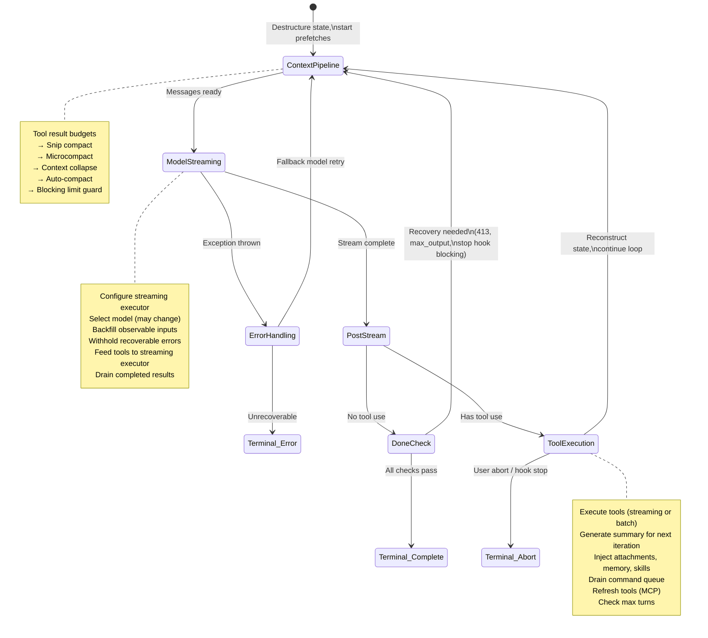
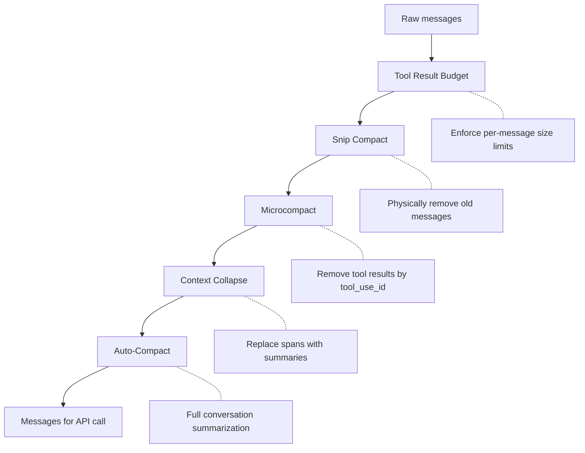
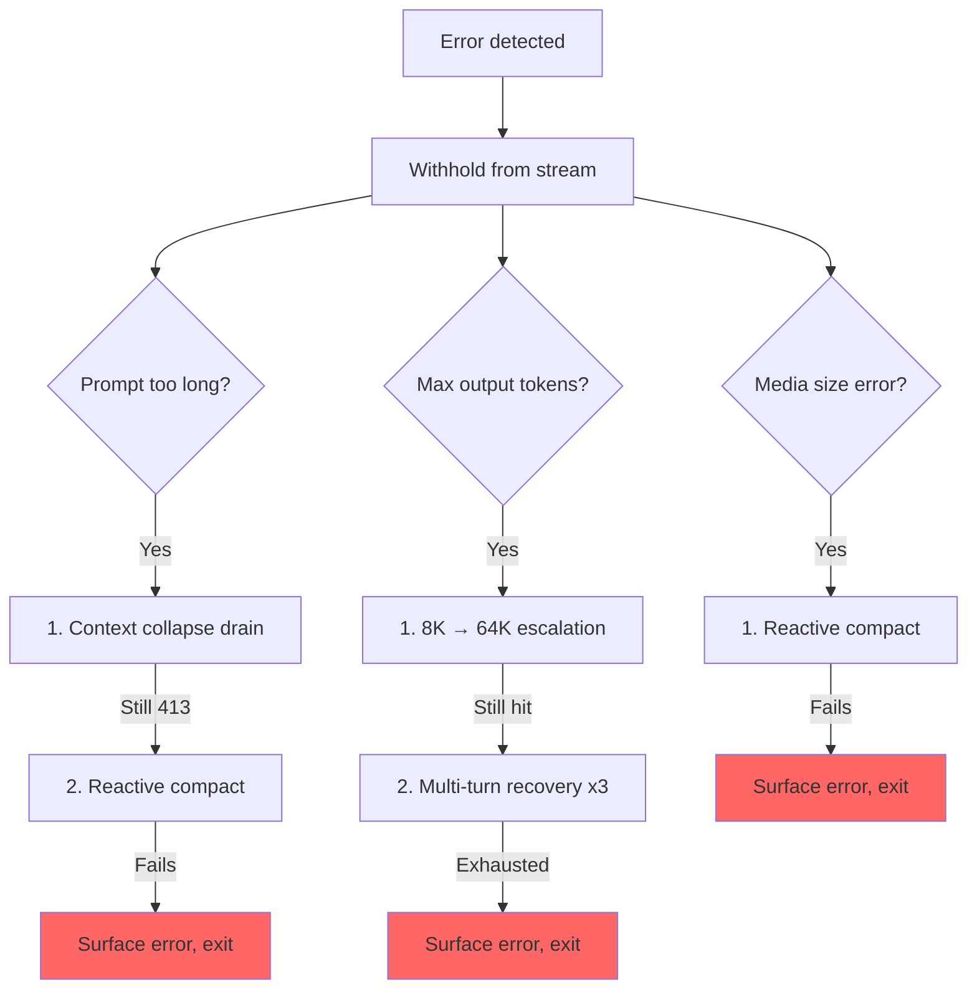

# Chapter 5: The Agent Loop

> 第 5 章：Agent 循环

## The Beating Heart

> 跳动的心脏

Chapter 4 showed how the API layer transforms configuration into streaming HTTP requests -- how the client is built, how system prompts are assembled, how responses arrive as server-sent events. That layer handles the *mechanics* of talking to the model. But a single API call is not an agent. An agent is a loop: call the model, execute tools, feed results back, call the model again, until the work is done.

> 第 4 章展示了 API 层如何把配置转化为流式 HTTP 请求——客户端如何构建、system prompt 如何组装、响应如何以 server-sent events 的形式到达。那一层处理的是与模型对话的*机制*。但单次 API 调用并不构成一个 agent。Agent 是一个循环：调用模型、执行工具、把结果反馈回去、再次调用模型，直到工作完成。

Every system has a center of gravity. In a database, it is the storage engine. In a compiler, it is the intermediate representation. In Claude Code, it is `query.ts` -- a single 1,730-line file containing the async generator that runs every interaction, from the first keystroke in the REPL to the last tool call of a headless `--print` invocation.

> 每个系统都有它的重心。在数据库里，是存储引擎；在编译器里，是中间表示；在 Claude Code 里，是 `query.ts`——一个 1,730 行的单一文件，包含驱动每一次交互的 async generator，从 REPL 中的第一次按键，到无头 `--print` 调用的最后一次工具调用。

This is not an exaggeration. There is exactly one code path that talks to the model, executes tools, manages context, recovers from errors, and decides when to stop. That code path is the `query()` function. The REPL calls it. The SDK calls it. Sub-agents call it. The headless runner calls it. If you are using Claude Code, you are inside `query()`.

> 这并非夸张。与模型对话、执行工具、管理上下文、从错误中恢复、决定何时停止——所有这些都恰好只走一条代码路径。那条路径就是 `query()` 函数。REPL 调用它，SDK 调用它，sub-agent 调用它，无头 runner 也调用它。只要你在用 Claude Code，你就身处 `query()` 之中。

The file is dense, but it is not complex in the way that tangled inheritance hierarchies are complex. It is complex in the way that a submarine is complex: a single hull with many redundant systems, each one added because the ocean found a way in. Every `if` branch has a story. Every withheld error message represents a real bug where an SDK consumer disconnected mid-recovery. Every circuit breaker threshold was tuned against real sessions that burned thousands of API calls in infinite loops.

> 这个文件很密集，但它的复杂不同于盘根错节的继承层级那种复杂。它的复杂更像潜艇的复杂：一个单一艇身，配着许多冗余系统，每一套都是因为海水找到了一个新的入口才被加上去的。每个 `if` 分支背后都有一段故事。每一条被压下不发的错误消息，都对应一个真实的 bug——某个 SDK 消费方在恢复过程中途断开了连接。每一个熔断器阈值，都是针对那些在无限循环里烧掉成千上万次 API 调用的真实会话调校出来的。

This chapter traces the entire loop, start to finish. By the end, you will understand not just what happens, but why each mechanism exists and what breaks without it.

> 本章将从头到尾追踪整个循环。读完之后，你不仅会理解发生了什么，还会理解每个机制为何存在、缺了它会出什么问题。

---

## Why an Async Generator

> 为什么用 Async Generator

The first architectural question: why is the agent loop a generator and not a callback-based event emitter?

> 第一个架构问题：为什么 agent 循环是一个 generator，而不是基于回调的 event emitter？

```typescript
// Simplified — shows the concept, not the exact types
async function* agentLoop(params: LoopParams): AsyncGenerator<Message | Event, TerminalReason>
```

The actual signature yields several message and event types and returns a discriminated union encoding why the loop stopped.

> 实际签名会 yield 多种消息和事件类型，并返回一个 discriminated union，编码出循环停止的原因。

Three reasons, in order of importance.

> 三个理由，按重要性排序。

**Backpressure.** An event emitter fires whether the consumer is ready or not. A generator yields only when the consumer calls `.next()`. When the REPL's React renderer is busy painting the previous frame, the generator naturally pauses. When an SDK consumer is processing a tool result, the generator waits. No buffer overflow, no dropped messages, no "fast producer / slow consumer" problem.

> **背压（Backpressure）。** event emitter 不管消费方是否就绪都会触发。而 generator 只在消费方调用 `.next()` 时才 yield。当 REPL 的 React 渲染器正忙着绘制上一帧时，generator 会自然地暂停；当某个 SDK 消费方正在处理一条工具结果时，generator 会等待。没有缓冲区溢出，没有消息丢失，也没有"快生产者/慢消费者"问题。

**Return value semantics.** The generator's return type is `Terminal` -- a discriminated union encoding exactly why the loop stopped. Was it a normal completion? A user abort? A token budget exhaustion? A stop hook intervention? A max-turns limit? An unrecoverable model error? There are 10 distinct terminal states. Callers do not need to subscribe to an "end" event and hope the payload contains the reason. They get it as a typed return value from `for await...of` or `yield*`.

> **返回值语义。** generator 的返回类型是 `Terminal`——一个 discriminated union，精确编码了循环停止的原因。是正常完成？用户中止？token 预算耗尽？stop hook 介入？达到 max-turns 上限？还是不可恢复的模型错误？一共有 10 种不同的终止状态。调用方无需订阅某个"end"事件再去祈祷 payload 里带着原因——他们直接从 `for await...of` 或 `yield*` 拿到一个带类型的返回值。

**Composability via `yield*`.** The outer `query()` function delegates to `queryLoop()` with `yield*`, which transparently forwards every yielded value and the final return. Sub-generators like `handleStopHooks()` use the same pattern. This creates a clean chain of responsibility without callbacks, without promises wrapping promises, without event forwarding boilerplate.

> **通过 `yield*` 实现的可组合性。** 外层的 `query()` 函数用 `yield*` 委托给 `queryLoop()`，后者会透明地转发每一个 yield 出来的值以及最终的返回值。像 `handleStopHooks()` 这样的子 generator 用的是同样的模式。这构建出一条干净的责任链——没有回调，没有 promise 套 promise，也没有事件转发的样板代码。

The choice has a cost -- async generators in JavaScript cannot be "rewound" or forked. But the agent loop does not need either. It is a strictly forward-moving state machine.

> 这个选择是有代价的——JavaScript 中的 async generator 无法被"回退"或 fork。但 agent 循环两者都不需要。它是一个严格单向前进的状态机。

One more subtlety: the `function*` syntax makes the function *lazy*. The body does not execute until the first `.next()` call. This means `query()` returns instantly -- all the heavy initialization (config snapshot, memory prefetch, budget tracker) happens only when the consumer starts pulling values. In the REPL, this means the React rendering pipeline is already set up before the first line of the loop runs.

> 还有一个微妙之处：`function*` 语法让函数变得*惰性（lazy）*。函数体在第一次调用 `.next()` 之前不会执行。这意味着 `query()` 会立即返回——所有那些沉重的初始化（配置快照、内存预取、预算追踪器）只在消费方开始拉取值时才发生。在 REPL 中，这意味着在循环的第一行运行之前，React 渲染流水线就已经搭建完毕了。

---

## What Callers Provide

> 调用方提供什么

Before tracing the loop, it helps to know what goes in:

> 在追踪循环之前，先弄清楚输入是什么会很有帮助：

```typescript
// Simplified — illustrates the key fields
type LoopParams = {
  messages: Message[]
  prompt: SystemPrompt
  permissionCheck: CanUseToolFn
  context: ToolUseContext
  source: QuerySource         // 'repl', 'sdk', 'agent:xyz', 'compact', etc.
  maxTurns?: number
  budget?: { total: number }  // API-level task budget
  deps?: LoopDeps             // Injected for testing
}
```

The notable fields:

> 值得关注的字段：

- **`querySource`**: A string discriminant like `'repl_main_thread'`, `'sdk'`, `'agent:xyz'`, `'compact'`, or `'session_memory'`. Many conditionals branch on this. The compact agent uses `querySource: 'compact'` so the blocking limit guard does not deadlock (the compact agent needs to run to *reduce* the token count).

> - **`querySource`**：一个字符串判别值，例如 `'repl_main_thread'`、`'sdk'`、`'agent:xyz'`、`'compact'` 或 `'session_memory'`。许多条件分支都依据它来走。compact agent 使用 `querySource: 'compact'`，这样 blocking limit guard 才不会死锁（compact agent 需要运行起来才能*降低* token 数量）。

- **`taskBudget`**: The API-level task budget (`output_config.task_budget`). Distinct from the `+500k` auto-continue token budget feature. `total` is the budget for the whole agentic turn; `remaining` is computed per iteration from cumulative API usage and adjusted across compaction boundaries.

> - **`taskBudget`**：API 层面的任务预算（`output_config.task_budget`）。它与 `+500k` 这种自动续接的 token 预算特性不同。`total` 是整个 agentic 回合的预算；`remaining` 在每次迭代时由累计的 API 用量计算得出，并在 compaction 边界处做相应调整。

- **`deps`**: Optional dependency injection. Defaults to `productionDeps()`. This is the seam where tests swap in fake model calls, fake compaction, and deterministic UUIDs.

> - **`deps`**：可选的依赖注入，默认为 `productionDeps()`。这是测试用来替换假模型调用、假 compaction 以及确定性 UUID 的接缝点。

- **`canUseTool`**: A function that returns whether a given tool is allowed. This is the permission layer -- it checks trust settings, hook decisions, and the current permission mode.

> - **`canUseTool`**：一个返回某个工具是否被允许的函数。这就是权限层——它检查信任设置、hook 决策以及当前的权限模式。

---

## The Two-Layer Entry Point

> 两层入口点

The public API is a thin wrapper around the real loop:

> 公开的 API 是真正循环外面的一层薄封装：

The outer function wraps the inner loop, tracking which queued commands were consumed during the turn. After the inner loop completes, consumed commands are marked as `'completed'`. If the loop throws or the generator is closed via `.return()`, the completion notifications never fire -- a failed turn should not mark commands as successfully processed. Commands queued during a turn (via `/` slash commands or task notifications) are marked `'started'` inside the loop and `'completed'` in the wrapper. If the loop throws or the generator is closed via `.return()`, the completion notifications never fire. This is intentional -- a failed turn should not mark commands as successfully processed.

> 外层函数包裹着内层循环，追踪本回合中哪些排队命令被消费了。内层循环完成后，被消费的命令会被标记为 `'completed'`。如果循环抛出异常，或 generator 通过 `.return()` 被关闭，那么完成通知就永远不会触发——失败的回合不应把命令标记为已成功处理。回合中排队的命令（通过 `/` slash 命令或任务通知）在循环内部被标记为 `'started'`，在包装器中被标记为 `'completed'`。如果循环抛出异常或 generator 通过 `.return()` 被关闭，完成通知就永远不会触发。这是有意为之——失败的回合不应把命令标记为已成功处理。

---

## The State Object

> 状态对象

The loop carries its state in a single typed object:

> 循环把它的状态承载在一个带类型的对象里：

```typescript
// Simplified — illustrates the key fields
type LoopState = {
  messages: Message[]
  context: ToolUseContext
  turnCount: number
  transition: Continue | undefined
  // ... plus recovery counters, compaction tracking, pending summaries, etc.
}
```

Ten fields. Each one earns its place:

> 十个字段。每一个都名副其实：

| Field | Why It Exists |
|-------|---------------|
| `messages` | The conversation history, grown each iteration |
| `toolUseContext` | Mutable context: tools, abort controller, agent state, options |
| `autoCompactTracking` | Tracks compaction state: turn counter, turn ID, consecutive failures, compacted flag |
| `maxOutputTokensRecoveryCount` | How many multi-turn recovery attempts for output token limits (max 3) |
| `hasAttemptedReactiveCompact` | One-shot guard against infinite reactive compaction loops |
| `maxOutputTokensOverride` | Set to 64K during escalation, cleared after |
| `pendingToolUseSummary` | A promise from the previous iteration's Haiku summary, resolved during current streaming |
| `stopHookActive` | Prevents re-running stop hooks after a blocking retry |
| `turnCount` | Monotonic counter, checked against `maxTurns` |
| `transition` | Why the previous iteration continued -- `undefined` on first iteration |

> | 字段 | 存在的理由 |
> |-------|---------------|
> | `messages` | 对话历史，每次迭代都在增长 |
> | `toolUseContext` | 可变上下文：工具、abort controller、agent 状态、选项 |
> | `autoCompactTracking` | 追踪 compaction 状态：回合计数器、回合 ID、连续失败次数、已 compact 标志 |
> | `maxOutputTokensRecoveryCount` | 针对输出 token 上限做了多少次多回合恢复尝试（最多 3 次） |
> | `hasAttemptedReactiveCompact` | 防止无限 reactive compaction 循环的一次性保护标志 |
> | `maxOutputTokensOverride` | 在升级期间设为 64K，之后清除 |
> | `pendingToolUseSummary` | 来自上一次迭代 Haiku 摘要的 promise，在当前流式处理过程中被 resolve |
> | `stopHookActive` | 阻止在 blocking 重试之后重新运行 stop hooks |
> | `turnCount` | 单调递增计数器，与 `maxTurns` 做比对 |
> | `transition` | 上一次迭代之所以继续的原因——首次迭代时为 `undefined` |

### Immutable Transitions in a Mutable Loop

> 可变循环中的不可变转换

Here is the pattern that appears at every `continue` statement in the loop:

> 下面是循环中每个 `continue` 语句处都会出现的模式：

```typescript
const next: State = {
  messages: [...messagesForQuery, ...assistantMessages, ...toolResults],
  toolUseContext: toolUseContextWithQueryTracking,
  autoCompactTracking: tracking,
  turnCount: nextTurnCount,
  maxOutputTokensRecoveryCount: 0,
  hasAttemptedReactiveCompact: false,
  pendingToolUseSummary: nextPendingToolUseSummary,
  maxOutputTokensOverride: undefined,
  stopHookActive,
  transition: { reason: 'next_turn' },
}
state = next
```

Every continue site constructs a complete new `State` object. Not `state.messages = newMessages`. Not `state.turnCount++`. A full reconstruction. The benefit is that every transition is self-documenting. You can read any `continue` site and see exactly which fields change and which are preserved. The `transition` field on the new state records *why* the loop is continuing -- tests assert on this to verify that the correct recovery path fired.

> 每个 continue 点都会构造一个全新的、完整的 `State` 对象。不是 `state.messages = newMessages`，也不是 `state.turnCount++`，而是彻底重建。好处在于每次转换都是自带文档的。你阅读任何一个 `continue` 点，都能精确看到哪些字段变了、哪些被保留下来。新状态上的 `transition` 字段记录了循环*为什么*要继续——测试会对它做断言，以验证触发的是正确的恢复路径。

---

## The Loop Body

> 循环体

Here is the full execution flow of a single iteration, compressed to its skeleton:

> 下面是单次迭代的完整执行流程，压缩成骨架形式：



That is the entire loop. Every feature in Claude Code -- from memory to sub-agents to error recovery -- feeds into or consumes from this single iteration structure.

> 这就是整个循环。Claude Code 的每一项特性——从内存到 sub-agent 再到错误恢复——都向这个单一的迭代结构输入数据，或从中消费数据。

---

## Context Management: Four Compression Layers

> 上下文管理：四层压缩

Before each API call, the message history passes through up to four context management stages. They run in a specific order, and that order matters.

> 在每次 API 调用之前，消息历史会经过最多四个上下文管理阶段。它们按特定顺序运行，而这个顺序很重要。



### Layer 0: Tool Result Budget

> 第 0 层：工具结果预算

Before any compression, `applyToolResultBudget()` enforces per-message size limits on tool results. Tools without a finite `maxResultSizeChars` are exempted.

> 在任何压缩开始之前，`applyToolResultBudget()` 会对工具结果强制施加按消息计的大小上限。没有设定有限 `maxResultSizeChars` 的工具不受此限制。

### Layer 1: Snip Compact

> 第 1 层：Snip Compact

The lightest operation. Snip physically removes old messages from the array, yielding a boundary message to signal the removal to the UI. It reports how many tokens were freed, and that number is plumbed into auto-compact's threshold check.

> 最轻量的操作。Snip 会从数组中物理性地移除旧消息，并 yield 一条边界消息，向 UI 发出移除信号。它会报告释放了多少 token，而这个数字会被接入 auto-compact 的阈值检查。

### Layer 2: Microcompact

> 第 2 层：Microcompact

Microcompact removes tool results that are no longer needed, identified by `tool_use_id`. For cached microcompact (which edits the API cache), the boundary message is deferred until after the API response. The reason: client-side token estimates are unreliable. The actual `cache_deleted_input_tokens` from the API response tells you what was really freed.

> Microcompact 会移除不再需要的工具结果，按 `tool_use_id` 来识别。对于带缓存的 microcompact（它会编辑 API 缓存），边界消息会被推迟到 API 响应之后才发出。原因是：客户端侧的 token 估算并不可靠。API 响应中真实的 `cache_deleted_input_tokens` 才能告诉你实际释放了多少。

### Layer 3: Context Collapse

> 第 3 层：Context Collapse

Context collapse replaces spans of conversation with summaries. It runs before auto-compact, and the ordering is deliberate: if collapse reduces the context below the auto-compact threshold, auto-compact becomes a no-op. This preserves granular context instead of replacing everything with a single monolithic summary.

> Context collapse 会用摘要替换掉一段段对话。它在 auto-compact 之前运行，而这个顺序是刻意安排的：如果 collapse 已经把上下文降到 auto-compact 阈值以下，auto-compact 就会变成空操作。这样能保留细粒度的上下文，而不是用一个单一的、整块的摘要取代所有内容。

### Layer 4: Auto-Compact

> 第 4 层：Auto-Compact

The heaviest operation: it forks an entire Claude conversation to summarize the history. The implementation has a circuit breaker -- after 3 consecutive failures, it stops trying. This prevents the nightmare scenario observed in production: sessions stuck over the context limit burning 250K API calls per day in an infinite compact-fail-retry loop.

> 最重的操作：它会 fork 出一整个 Claude 对话来对历史做摘要。实现中带有熔断器——连续失败 3 次后就停止尝试。这能防止生产环境中观察到的噩梦场景：会话卡在超出上下文上限的状态，在无限的 compact-失败-重试循环里，每天烧掉 25 万次 API 调用。

### Auto-Compact Thresholds

> Auto-Compact 阈值

The thresholds are derived from the model's context window:

> 阈值是从模型的上下文窗口推导出来的：

```
effectiveContextWindow = contextWindow - min(modelMaxOutput, 20000)

Thresholds (relative to effectiveContextWindow):
  Auto-compact fires:      effectiveWindow - 13,000
  Blocking limit (hard):   effectiveWindow - 3,000
```

| Constant | Value | Purpose |
|----------|-------|---------|
| `AUTOCOMPACT_BUFFER_TOKENS` | 13,000 | Headroom below effective window for auto-compact trigger |
| `MANUAL_COMPACT_BUFFER_TOKENS` | 3,000 | Reserves space so `/compact` still works |
| `MAX_CONSECUTIVE_AUTOCOMPACT_FAILURES` | 3 | Circuit breaker threshold |

> | 常量 | 取值 | 用途 |
> |----------|-------|---------|
> | `AUTOCOMPACT_BUFFER_TOKENS` | 13,000 | 在有效窗口以下为 auto-compact 触发预留的余量 |
> | `MANUAL_COMPACT_BUFFER_TOKENS` | 3,000 | 预留空间，使 `/compact` 仍能工作 |
> | `MAX_CONSECUTIVE_AUTOCOMPACT_FAILURES` | 3 | 熔断器阈值 |

The 13,000-token buffer means auto-compact fires well before the hard limit. The gap between the auto-compact threshold and the blocking limit is where reactive compact operates -- if the proactive auto-compact fails or is disabled, reactive compact catches the 413 error and compacts on demand.

> 13,000 token 的缓冲意味着 auto-compact 在硬上限之前就早早触发。auto-compact 阈值与 blocking limit 之间的这段间隙，正是 reactive compact 发挥作用的地方——如果主动的 auto-compact 失败或被禁用，reactive compact 就会捕获 413 错误并按需做 compact。

### Token Counting

> Token 计数

The canonical function `tokenCountWithEstimation` combines authoritative API-reported token counts (from the most recent response) with a rough estimate for messages added after that response. The approximation is conservative -- it errs toward higher counts, which means auto-compact fires slightly early rather than slightly late.

> 权威函数 `tokenCountWithEstimation` 会把 API 报告的权威 token 计数（来自最近一次响应）与那次响应之后新增消息的粗略估算结合起来。这个近似是保守的——它倾向于估高而非估低，这意味着 auto-compact 宁可稍微早一点触发，也不要稍微晚一点触发。

---

## Model Streaming

> 模型流式处理

### The callModel() Loop

> callModel() 循环

The API call happens inside a `while(attemptWithFallback)` loop that enables model fallback:

> API 调用发生在一个 `while(attemptWithFallback)` 循环内，该循环用于启用模型回退（fallback）：

```typescript
let attemptWithFallback = true
while (attemptWithFallback) {
  attemptWithFallback = false
  try {
    for await (const message of deps.callModel({ messages, systemPrompt, tools, signal })) {
      // Process each streamed message
    }
  } catch (innerError) {
    if (innerError instanceof FallbackTriggeredError && fallbackModel) {
      currentModel = fallbackModel
      attemptWithFallback = true
      continue
    }
    throw innerError
  }
}
```

When enabled, a `StreamingToolExecutor` starts executing tools as soon as their `tool_use` blocks arrive during streaming -- not after the full response completes. How tools are orchestrated into concurrent batches is the subject of Chapter 7.

> 启用后，`StreamingToolExecutor` 会在流式过程中工具的 `tool_use` 块一到达就开始执行工具——而不是等整个响应完成之后。工具如何被编排成并发批次，是第 7 章的主题。

### The Withholding Pattern

> 压制（Withholding）模式

This is one of the most important patterns in the file. Recoverable errors are suppressed from the yield stream:

> 这是整个文件中最重要的模式之一。可恢复的错误会从 yield 流中被压制掉：

```typescript
let withheld = false
if (contextCollapse?.isWithheldPromptTooLong(message)) withheld = true
if (reactiveCompact?.isWithheldPromptTooLong(message)) withheld = true
if (isWithheldMaxOutputTokens(message)) withheld = true
if (!withheld) yield yieldMessage
```

Why withhold? Because SDK consumers -- Cowork, the desktop app -- terminate the session on any message with an `error` field. If you yield a prompt-too-long error and then successfully recover via reactive compaction, the consumer has already disconnected. The recovery loop keeps running, but nobody is listening. So the error is withheld, pushed to `assistantMessages` so downstream recovery checks can find it. If all recovery paths fail, the withheld message is finally surfaced.

> 为什么要压制？因为 SDK 消费方——Cowork、桌面应用——一旦收到任何带 `error` 字段的消息就会终止会话。假如你 yield 出一个 prompt-too-long 错误，随后又通过 reactive compaction 成功恢复了，但此时消费方已经断开连接。恢复循环还在跑，却已经没人在听了。于是错误被压制，被推入 `assistantMessages`，以便下游的恢复检查能找到它。如果所有恢复路径都失败，被压制的消息才会最终浮现出来。

### Model Fallback

> 模型回退

When a `FallbackTriggeredError` is caught (high demand on the primary model), the loop switches models and retries. But thinking signatures are model-bound -- replaying a protected-thinking block from one model to a different fallback model causes a 400 error. The code strips signature blocks before retry. All orphaned assistant messages from the failed attempt are tombstoned so the UI removes them.

> 当捕获到 `FallbackTriggeredError`（主模型负载过高）时，循环会切换模型并重试。但 thinking 签名是与模型绑定的——把一个来自某模型的 protected-thinking 块重放给另一个不同的回退模型会引发 400 错误。代码会在重试前剥离签名块。失败尝试产生的所有孤立 assistant 消息都会被打上 tombstone，以便 UI 把它们移除。

---

## Error Recovery: The Escalation Ladder

> 错误恢复：升级阶梯

Error recovery in query.ts is not a single strategy. It is a ladder of increasingly aggressive interventions, each triggered when the previous one fails.

> query.ts 中的错误恢复并不是单一策略。它是一架由逐级激进的干预措施组成的阶梯，每一级都在上一级失败时被触发。



### The Death Spiral Guard

> 死亡螺旋防护

The most dangerous failure mode is an infinite loop. The code has multiple guards:

> 最危险的失败模式是无限循环。代码中设置了多重防护：

1. **`hasAttemptedReactiveCompact`**: One-shot flag. Reactive compact fires once per error type.

> 1. **`hasAttemptedReactiveCompact`**：一次性标志。每种错误类型 reactive compact 只触发一次。

2. **`MAX_OUTPUT_TOKENS_RECOVERY_LIMIT = 3`**: Hard cap on multi-turn recovery attempts.

> 2. **`MAX_OUTPUT_TOKENS_RECOVERY_LIMIT = 3`**：对多回合恢复尝试次数的硬上限。

3. **Circuit breaker on auto-compact**: After 3 consecutive failures, auto-compact stops trying entirely.

> 3. **auto-compact 上的熔断器**：连续失败 3 次后，auto-compact 彻底停止尝试。

4. **No stop hooks on error responses**: The code explicitly returns before reaching stop hooks when the last message is an API error. The comment explains: "error -> hook blocking -> retry -> error -> ... (the hook injects more tokens each cycle)."

> 4. **错误响应上不运行 stop hooks**：当最后一条消息是 API 错误时，代码会在抵达 stop hooks 之前显式 return。注释解释道："error -> hook blocking -> retry -> error -> ...（hook 每一轮都注入更多 token）。"

5. **Preserved `hasAttemptedReactiveCompact` across stop hook retries**: When a stop hook returns blocking errors and forces a retry, the reactive compact guard is preserved. The comment documents the bug: "Resetting to false here caused an infinite loop burning thousands of API calls."

> 5. **在 stop hook 重试之间保留 `hasAttemptedReactiveCompact`**：当某个 stop hook 返回 blocking 错误并强制重试时，reactive compact 的防护标志会被保留。注释记录了那个 bug："在这里重置为 false 曾导致一个烧掉成千上万次 API 调用的无限循环。"

Each of these guards was added because someone hit the failure mode in production.

> 这些防护中的每一个，都是因为有人在生产环境中撞上了对应的失败模式才被加上去的。

---

## Worked Example: "Fix the Bug in auth.ts"

> 实例演练："修复 auth.ts 中的 bug"

To make the loop concrete, let us trace a real interaction through three iterations.

> 为了把循环讲具体，我们来追踪一次真实交互，贯穿三次迭代。

**The user types:** `Fix the null pointer bug in src/auth/validate.ts`

> **用户输入：** `Fix the null pointer bug in src/auth/validate.ts`

**Iteration 1: The model reads the file.**

> **迭代 1：模型读取文件。**

The loop enters. Context management runs (no compression needed -- the conversation is short). The model streams a response: "Let me look at the file." It emits a single `tool_use` block: `Read({ file_path: "src/auth/validate.ts" })`. The streaming executor sees a concurrency-safe tool and starts it immediately. By the time the model finishes its response text, the file contents are already in memory.

> 循环开始。上下文管理运行（无需压缩——对话还很短）。模型流式输出一段响应："Let me look at the file." 它发出一个 `tool_use` 块：`Read({ file_path: "src/auth/validate.ts" })`。streaming executor 看到这是一个并发安全的工具，立即启动它。等模型把响应文本输出完毕时，文件内容已经在内存里了。

Post-stream processing: the model used a tool, so we enter the tool-use path. The Read result (file contents with line numbers) is pushed to `toolResults`. A Haiku summary promise is kicked off in the background. State is reconstructed with the new messages, `transition: { reason: 'next_turn' }`, and the loop continues.

> 流式处理后的阶段：模型用了工具，于是我们进入 tool-use 路径。Read 结果（带行号的文件内容）被推入 `toolResults`。一个 Haiku 摘要 promise 在后台被启动。状态以新消息重建，`transition: { reason: 'next_turn' }`，循环继续。

**Iteration 2: The model edits the file.**

> **迭代 2：模型编辑文件。**

Context management runs again (still under the threshold). The model streams: "I see the bug on line 42 -- `userId` can be null." It emits `Edit({ file_path: "src/auth/validate.ts", old_string: "const user = getUser(userId)", new_string: "if (!userId) return { error: 'unauthorized' }\nconst user = getUser(userId)" })`.

> 上下文管理再次运行（仍在阈值之下）。模型流式输出："I see the bug on line 42 -- `userId` can be null." 它发出 `Edit({ file_path: "src/auth/validate.ts", old_string: "const user = getUser(userId)", new_string: "if (!userId) return { error: 'unauthorized' }\nconst user = getUser(userId)" })`。

Edit is not concurrency-safe, so the streaming executor queues it until the response completes. Then the 14-step execution pipeline fires: Zod validation passes, input backfill expands the path, the PreToolUse hook checks permissions (the user approves), and the edit is applied. The pending Haiku summary from iteration 1 resolves during streaming -- its result is yielded as a `ToolUseSummaryMessage`. State is reconstructed, loop continues.

> Edit 不是并发安全的，所以 streaming executor 会把它排队，直到响应完成。随后 14 步的执行流水线启动：Zod 校验通过、input backfill 展开路径、PreToolUse hook 检查权限（用户批准）、编辑被应用。来自迭代 1 的待处理 Haiku 摘要在流式过程中 resolve——其结果作为 `ToolUseSummaryMessage` 被 yield 出来。状态被重建，循环继续。

**Iteration 3: The model declares completion.**

> **迭代 3：模型宣告完成。**

The model streams: "I've fixed the null pointer bug by adding a guard clause." No `tool_use` blocks. We enter the "done" path. Prompt-too-long recovery? Not needed. Max output tokens? No. Stop hooks run -- no blocking errors. Token budget check passes. The loop returns `{ reason: 'completed' }`.

> 模型流式输出："I've fixed the null pointer bug by adding a guard clause." 没有 `tool_use` 块。我们进入"done"路径。需要 prompt-too-long 恢复吗？不需要。是否达到 max output tokens？没有。stop hooks 运行——没有 blocking 错误。token 预算检查通过。循环返回 `{ reason: 'completed' }`。

Total: three API calls, two tool executions, one user permission prompt. The loop handled streaming tool execution, Haiku summarization overlapping with the API call, and the full permission pipeline -- all through the same `while(true)` structure.

> 总计：三次 API 调用、两次工具执行、一次用户权限提示。这个循环处理了流式工具执行、与 API 调用重叠进行的 Haiku 摘要，以及完整的权限流水线——全都通过同一个 `while(true)` 结构完成。

---

## Token Budgets

> Token 预算

Users can request a token budget for a turn (e.g., `+500k`). The budget system decides whether to continue or stop after the model completes a response.

> 用户可以为某个回合申请一份 token 预算（例如 `+500k`）。预算系统会在模型完成一次响应后，决定是继续还是停止。

`checkTokenBudget` makes a binary continue/stop decision with three rules:

> `checkTokenBudget` 用三条规则做出一个二选一的继续/停止决策：

1. **Subagents always stop.** Budget is a top-level concept only.

> 1. **Subagent 总是停止。** 预算只是一个顶层概念。

2. **Completion threshold at 90%.** If `turnTokens < budget * 0.9`, continue.

> 2. **完成阈值定在 90%。** 如果 `turnTokens < budget * 0.9`，则继续。

3. **Diminishing returns detection.** After 3+ continuations, if both the current and previous delta are below 500 tokens, stop early. The model is producing less and less output per continuation.

> 3. **收益递减检测。** 在 3 次及以上续接之后，如果当前和上一次的增量都低于 500 token，就提前停止。说明模型每次续接产出的内容越来越少。

When the decision is "continue," a nudge message is injected telling the model how much budget remains.

> 当决策为"继续"时，会注入一条提醒（nudge）消息，告诉模型还剩多少预算。

---

## Stop Hooks: Forcing the Model to Keep Working

> Stop Hooks：强迫模型继续工作

Stop hooks run when the model finishes without requesting any tool use -- it thinks it is done. The hooks evaluate whether it actually *is* done.

> stop hooks 在模型没有请求任何工具使用就结束时运行——也就是它认为自己已经完成了。这些 hook 会评估它是不是*真的*完成了。

The pipeline runs template job classification, fires background tasks (prompt suggestion, memory extraction), and then executes stop hooks proper. When a stop hook returns blocking errors -- "you said you were done, but the linter found 3 errors" -- the errors are appended to the message history and the loop continues with `stopHookActive: true`. This flag prevents re-running the same hooks on the retry.

> 这条流水线会运行模板作业分类、触发后台任务（prompt 建议、内存提取），然后真正执行 stop hooks。当某个 stop hook 返回 blocking 错误——"你说你完成了，但 linter 发现了 3 个错误"——这些错误会被追加到消息历史中，循环以 `stopHookActive: true` 继续。这个标志能防止在重试时重新运行同样的 hook。

When a stop hook signals `preventContinuation`, the loop exits immediately with `{ reason: 'stop_hook_prevented' }`.

> 当某个 stop hook 发出 `preventContinuation` 信号时，循环会立即以 `{ reason: 'stop_hook_prevented' }` 退出。

---

## State Transitions: The Complete Catalog

> 状态转换：完整目录

Every exit from the loop is one of two types: a `Terminal` (the loop returns) or a `Continue` (the loop iterates).

> 循环的每一次退出都属于两种类型之一：`Terminal`（循环 return）或 `Continue`（循环继续迭代）。

### Terminal States (10 reasons)

> 终止状态（10 种原因）

| Reason | Trigger |
|--------|---------|
| `blocking_limit` | Token count at hard limit, auto-compact OFF |
| `image_error` | ImageSizeError, ImageResizeError, or unrecoverable media error |
| `model_error` | Unrecoverable API/model exception |
| `aborted_streaming` | User abort during model streaming |
| `prompt_too_long` | Withheld 413 after all recovery exhausted |
| `completed` | Normal completion (no tool use, or budget exhausted, or API error) |
| `stop_hook_prevented` | Stop hook explicitly blocked continuation |
| `aborted_tools` | User abort during tool execution |
| `hook_stopped` | PreToolUse hook stopped continuation |
| `max_turns` | Hit the `maxTurns` limit |

> | 原因 | 触发条件 |
> |--------|---------|
> | `blocking_limit` | token 数达到硬上限，且 auto-compact 处于关闭状态 |
> | `image_error` | ImageSizeError、ImageResizeError，或不可恢复的媒体错误 |
> | `model_error` | 不可恢复的 API/模型异常 |
> | `aborted_streaming` | 模型流式过程中的用户中止 |
> | `prompt_too_long` | 所有恢复手段耗尽后浮现出的被压制 413 |
> | `completed` | 正常完成（无工具使用，或预算耗尽，或 API 错误） |
> | `stop_hook_prevented` | stop hook 显式阻止了续接 |
> | `aborted_tools` | 工具执行过程中的用户中止 |
> | `hook_stopped` | PreToolUse hook 阻止了续接 |
> | `max_turns` | 达到 `maxTurns` 上限 |

### Continue States (7 reasons)

> 继续状态（7 种原因）

| Reason | Trigger |
|--------|---------|
| `collapse_drain_retry` | Context collapse drained staged collapses on 413 |
| `reactive_compact_retry` | Reactive compact succeeded after 413 or media error |
| `max_output_tokens_escalate` | 8K cap hit, escalating to 64K |
| `max_output_tokens_recovery` | 64K still hit, multi-turn recovery (up to 3 attempts) |
| `stop_hook_blocking` | Stop hook returned blocking errors, must retry |
| `token_budget_continuation` | Token budget not exhausted, nudge message injected |
| `next_turn` | Normal tool-use continuation |

> | 原因 | 触发条件 |
> |--------|---------|
> | `collapse_drain_retry` | 在 413 时 context collapse 排空了暂存的 collapse |
> | `reactive_compact_retry` | 在 413 或媒体错误后 reactive compact 成功 |
> | `max_output_tokens_escalate` | 撞上 8K 上限，升级到 64K |
> | `max_output_tokens_recovery` | 64K 仍被撞上，进行多回合恢复（最多 3 次尝试） |
> | `stop_hook_blocking` | stop hook 返回了 blocking 错误，必须重试 |
> | `token_budget_continuation` | token 预算未耗尽，注入了 nudge 消息 |
> | `next_turn` | 正常的 tool-use 续接 |

---

## Orphaned Tool Results: The Protocol Safety Net

> 孤立的工具结果：协议安全网

The API protocol requires that every `tool_use` block is followed by a `tool_result`. The function `yieldMissingToolResultBlocks` creates error `tool_result` messages for every `tool_use` block that the model emitted but that never got a corresponding result. Without this safety net, a crash during streaming would leave orphaned `tool_use` blocks that would cause a protocol error on the next API call.

> API 协议要求每个 `tool_use` 块后面都必须跟一个 `tool_result`。函数 `yieldMissingToolResultBlocks` 会为模型发出却从未拿到对应结果的每一个 `tool_use` 块创建错误 `tool_result` 消息。没有这张安全网，流式过程中的崩溃会留下孤立的 `tool_use` 块，从而在下一次 API 调用时引发协议错误。

It fires in three places: the outer error handler (model crash), the fallback handler (model switch mid-stream), and the abort handler (user interruption). Each path has a different error message, but the mechanism is identical.

> 它在三个地方触发：外层错误处理器（模型崩溃）、fallback 处理器（流式中途切换模型）和 abort 处理器（用户中断）。每条路径的错误消息各不相同，但机制完全一致。

---

## Abort Handling: Two Paths

> 中止处理：两条路径

Aborts can happen at two points: during streaming and during tool execution. Each has distinct behavior.

> 中止可能发生在两个时间点：流式过程中以及工具执行过程中。两者行为各不相同。

**Abort during streaming**: The streaming executor (if active) drains remaining results, generating synthetic `tool_results` for queued tools. Without the executor, `yieldMissingToolResultBlocks` fills the gap. The `signal.reason` check distinguishes between a hard abort (Ctrl+C) and a submit-interrupt (user typed a new message) -- submit-interrupts skip the interruption message because the queued user message already provides context.

> **流式过程中的中止**：streaming executor（若处于活动状态）会排空剩余结果，为排队的工具生成合成的 `tool_results`。若没有该 executor，则由 `yieldMissingToolResultBlocks` 来填补空缺。`signal.reason` 检查用来区分硬中止（Ctrl+C）与提交式中断（用户输入了一条新消息）——提交式中断会跳过中断消息，因为排队的用户消息已经提供了上下文。

**Abort during tool execution**: Similar logic, with a `toolUse: true` parameter on the interruption message signaling to the UI that tools were in progress.

> **工具执行过程中的中止**：逻辑类似，只是中断消息上带一个 `toolUse: true` 参数，向 UI 表明当时有工具正在执行。

---

## The Thinking Rules

> Thinking 规则

Claude's thinking/redacted_thinking blocks have three inviolable rules:

> Claude 的 thinking/redacted_thinking 块有三条不可违反的规则：

1. A message containing a thinking block must be part of a query whose `max_thinking_length > 0`

> 1. 包含 thinking 块的消息必须属于一个 `max_thinking_length > 0` 的 query。

2. A thinking block may not be the last block in a message

> 2. thinking 块不能是某条消息中的最后一个块。

3. Thinking blocks must be preserved for the duration of an assistant trajectory

> 3. thinking 块必须在整个 assistant trajectory 期间被保留。

Violating any of these produces opaque API errors. The code handles them in several places: the fallback handler strips signature blocks (which are model-bound), the compaction pipeline preserves the protected tail, and the microcompact layer never touches thinking blocks.

> 违反其中任何一条都会产生晦涩难懂的 API 错误。代码在好几个地方处理它们：fallback 处理器剥离签名块（它们与模型绑定）、compaction 流水线保留受保护的尾部，而 microcompact 层从不触碰 thinking 块。

---

## Dependency Injection

> 依赖注入

The `QueryDeps` type is intentionally narrow -- four dependencies, not forty:

> `QueryDeps` 类型被刻意收得很窄——四个依赖，而不是四十个：

Four injected dependencies: the model caller, the compactor, the microcompactor, and a UUID generator. Tests pass `deps` into the loop params to inject fakes directly. Using `typeof fn` for the type definitions keeps the signatures in sync automatically. Alongside the mutable `State` and the injectable `QueryDeps`, an immutable `QueryConfig` is snapshotted once at `query()` entry -- feature flags, session state, and environment variables captured once and never re-read. The three-way separation (mutable state, immutable config, injectable deps) makes the loop testable and makes the eventual refactor to a pure `step(state, event, config)` reducer straightforward.

> 四个被注入的依赖：模型调用器、compactor、microcompactor，以及一个 UUID 生成器。测试通过把 `deps` 传入循环参数来直接注入假实现。用 `typeof fn` 来定义类型，可以让签名自动保持同步。除了可变的 `State` 和可注入的 `QueryDeps`，还有一个不可变的 `QueryConfig`，它在 `query()` 入口处只快照一次——feature flag、会话状态和环境变量都只捕获一次，之后再不重读。这种三向分离（可变状态、不可变配置、可注入依赖）让循环变得可测试，也让最终重构为纯 `step(state, event, config)` reducer 变得轻而易举。

---

## Apply This: Building Your Own Agent Loop

> 实践应用：构建你自己的 Agent 循环

**Use a generator, not callbacks.** The backpressure is free. The return value semantics are free. The composability via `yield*` is free. Agent loops are strictly forward-moving -- you never need to rewind or fork.

> **用 generator，而不是回调。** 背压是免费的，返回值语义是免费的，通过 `yield*` 实现的可组合性也是免费的。Agent 循环严格单向前进——你永远不需要回退或 fork。

**Make state transitions explicit.** Reconstruct the full state object at every `continue` site. The verbosity is the feature -- it prevents partial-update bugs and makes each transition self-documenting.

> **让状态转换显式化。** 在每个 `continue` 点重建完整的状态对象。这份冗长本身就是特性——它能防止部分更新的 bug，并让每次转换都自带文档。

**Withhold recoverable errors.** If your consumers disconnect on errors, do not yield errors until you know recovery has failed. Push them to an internal buffer, attempt recovery, and surface only on exhaustion.

> **压制可恢复的错误。** 如果你的消费方一遇错误就断开连接，那就在确认恢复已失败之前不要 yield 错误。把它们推入一个内部缓冲区，尝试恢复，只有在所有手段耗尽时才浮现出来。

**Layer your context management.** Light operations first (removal), heavy operations last (summarization). This preserves granular context when possible and falls back to monolithic summaries only when necessary.

> **给上下文管理分层。** 轻量操作在前（移除），重量操作在后（摘要）。这能在可能时保留细粒度上下文，只在必要时才退而求其次用整块摘要。

**Add circuit breakers for every retry.** Every recovery mechanism in `query.ts` has an explicit limit: 3 auto-compact failures, 3 max-output recovery attempts, 1 reactive compact attempt. Without these limits, the first production session that triggers a retry-on-failure loop will burn your API budget overnight.

> **为每一次重试都加上熔断器。** `query.ts` 中的每个恢复机制都有明确的上限：3 次 auto-compact 失败、3 次 max-output 恢复尝试、1 次 reactive compact 尝试。没有这些上限，第一个触发"失败即重试"循环的生产会话就会在一夜之间烧光你的 API 预算。

The minimal agent loop skeleton, if you are starting from scratch:

> 如果你从零开始，最小化的 agent 循环骨架如下：

```
async function* agentLoop(params) {
  let state = initState(params)
  while (true) {
    const context = compressIfNeeded(state.messages)
    const response = await callModel(context)
    if (response.error) {
      if (canRecover(response.error, state)) { state = recoverState(state); continue }
      return { reason: 'error' }
    }
    if (!response.toolCalls.length) return { reason: 'completed' }
    const results = await executeTools(response.toolCalls)
    state = { ...state, messages: [...context, response.message, ...results] }
  }
}
```

Every feature in Claude Code's loop is an elaboration of one of these steps. The four compression layers elaborate step 3 (compress). The withholding pattern elaborates the model call. The escalation ladder elaborates error recovery. Stop hooks elaborate the "no tool use" exit. Start with this skeleton. Add each elaboration only when you hit the problem it solves.

> Claude Code 循环里的每一项特性，都是对上述某一步的细化。四层压缩细化了第 3 步（压缩）；压制模式细化了模型调用；升级阶梯细化了错误恢复；stop hooks 细化了"无工具使用"的退出路径。从这个骨架起步。只在真正撞上某个问题时，才加上能解决它的那项细化。

---

## Summary

> 小结

The agent loop is 1,730 lines of a single `while(true)` that does everything. It streams model responses, executes tools concurrently, compresses context through four layers, recovers from five categories of errors, tracks token budgets with diminishing returns detection, runs stop hooks that can force the model back to work, manages prefetch pipelines for memory and skills, and produces a typed discriminated union of exactly why it stopped.

> agent 循环是一个 1,730 行、包揽一切的单一 `while(true)`。它流式输出模型响应、并发执行工具、经四层压缩上下文、从五大类错误中恢复、带收益递减检测地追踪 token 预算、运行能强迫模型重新工作的 stop hooks、管理内存与 skill 的预取流水线，并产出一个带类型的 discriminated union，精确说明它为何停止。

It is the most important file in the system because it is the only file that touches every other subsystem. The context pipeline feeds into it. The tool system feeds out of it. The error recovery wraps around it. The hooks intercept it. The state layer persists through it. The UI renders from it.

> 它是整个系统中最重要的文件，因为它是唯一一个触及所有其他子系统的文件。上下文流水线向它输入，工具系统从它输出，错误恢复包裹着它，hook 拦截它，状态层透过它持久化，UI 则依据它来渲染。

If you understand `query()`, you understand Claude Code. Everything else is a peripheral.

> 如果你理解了 `query()`，你就理解了 Claude Code。其余一切都不过是外围设备。
