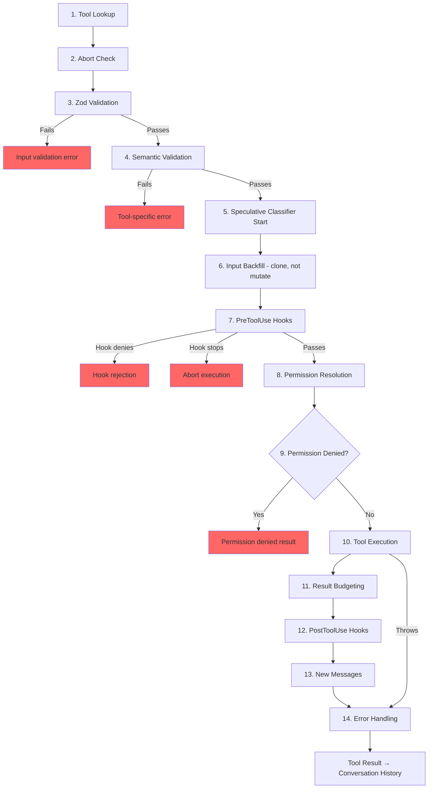

# Chapter 6: Tools -- From Definition to Execution

> 第 6 章：工具 —— 从定义到执行

## The Nervous System

> 神经系统

Chapter 5 showed you the agent loop -- the `while(true)` that streams model responses, collects tool calls, and feeds results back. The loop is the heartbeat. But the heartbeat is meaningless without the nervous system that translates "the model wants to run `git status`" into an actual shell command, with permission checks, result budgeting, and error handling.

> 第 5 章向你展示了 agent 循环 —— 那个 `while(true)`，它流式接收模型响应、收集工具调用，并把结果回灌。循环是心跳。但如果没有神经系统把"模型想运行 `git status`"翻译成一条真正的 shell 命令——并附带权限检查、结果预算控制和错误处理——这心跳本身毫无意义。

The tool system is that nervous system. It spans 40+ tool implementations, a centralized registry with feature-flag gating, a 14-step execution pipeline, a permission resolver with seven modes, and a streaming executor that starts tools before the model finishes its response.

> 工具系统就是那套神经系统。它涵盖了 40 多个工具实现、一个带 feature-flag 门控的集中式注册表、一条 14 步的执行流水线、一个有七种模式的权限解析器，以及一个能在模型还没说完响应之前就启动工具的流式执行器。

Every tool call in Claude Code -- every file read, every shell command, every grep, every sub-agent dispatch -- flows through the same pipeline. The uniformity is the point: whether the tool is a built-in Bash executor or a third-party MCP server, it gets the same validation, the same permission checks, the same result budgeting, the same error classification.

> Claude Code 中的每一次工具调用——每一次文件读取、每一条 shell 命令、每一次 grep、每一次 sub-agent 派发——都流经同一条流水线。这种一致性正是关键所在：无论该工具是内置的 Bash 执行器还是第三方 MCP 服务器，它都会经过相同的校验、相同的权限检查、相同的结果预算控制、相同的错误分类。

The `Tool` interface has approximately 45 members. That sounds overwhelming, but only five matter for understanding how the system works:

> `Tool` 接口大约有 45 个成员。这听上去令人望而生畏，但要理解系统如何运作，真正重要的只有五个：

1. **`call()`** -- execute the tool
2. **`inputSchema`** -- validate and parse the input
3. **`isConcurrencySafe()`** -- can this run in parallel?
4. **`checkPermissions()`** -- is this allowed?
5. **`validateInput()`** -- does this input make semantic sense?

> 1. **`call()`** —— 执行该工具
> 2. **`inputSchema`** —— 校验并解析输入
> 3. **`isConcurrencySafe()`** —— 它能并行运行吗？
> 4. **`checkPermissions()`** —— 它被允许吗？
> 5. **`validateInput()`** —— 这份输入在语义上说得通吗？

Everything else -- the 12 rendering methods, the analytics hooks, the search hints -- exists to support the UI and telemetry layers. Start with the five, and the rest falls into place.

> 其余的一切——12 个渲染方法、分析（analytics）钩子、搜索提示——都是为了支撑 UI 层和遥测（telemetry）层而存在的。先抓住这五个，其余部分自然会各归其位。

---

## The Tool Interface

> Tool 接口

### Three Type Parameters

> 三个类型参数

Every tool is parameterized over three types:

> 每个工具都由三个类型参数化：

```typescript
Tool<Input extends AnyObject, Output, P extends ToolProgressData>
```

`Input` is a Zod object schema that serves double duty: it generates the JSON Schema sent to the API (so the model knows what parameters to provide), and it validates the model's response at runtime via `safeParse`. `Output` is the TypeScript type of the tool's result. `P` is the progress event type the tool emits while running -- BashTool emits stdout chunks, GrepTool emits match counts, AgentTool emits sub-agent transcripts.

> `Input` 是一个 Zod 对象 schema，身兼两职：它生成发送给 API 的 JSON Schema（这样模型才知道该提供哪些参数），并在运行时通过 `safeParse` 校验模型的响应。`Output` 是该工具结果的 TypeScript 类型。`P` 是该工具运行期间发出的进度事件类型——BashTool 发出 stdout 分块，GrepTool 发出匹配计数，AgentTool 发出 sub-agent 的对话记录（transcript）。

### buildTool() and Fail-Closed Defaults

> buildTool() 与失败即关闭（fail-closed）的默认值

No tool definition directly constructs a `Tool` object. Every tool passes through `buildTool()`, a factory that spreads a defaults object under the tool-specific definition:

> 没有任何一个工具定义会直接构造 `Tool` 对象。每个工具都要经过 `buildTool()`——一个工厂函数，它把一个默认值对象铺展（spread）在工具专有定义的下层：

```typescript
// Pseudocode — illustrates the fail-closed defaults pattern
const SAFE_DEFAULTS = {
  isEnabled:         () => true,
  isParallelSafe:    () => false,   // Fail-closed: new tools run serially
  isReadOnly:        () => false,   // Fail-closed: treated as writes
  isDestructive:     () => false,
  checkPermissions:  (input) => ({ behavior: 'allow', updatedInput: input }),
}

function buildTool(definition) {
  return { ...SAFE_DEFAULTS, ...definition }  // Definition overrides defaults
}
```

The defaults are deliberately fail-closed where it matters for safety. A new tool that forgets to implement `isConcurrencySafe` defaults to `false` -- it runs serially, never in parallel. A tool that forgets `isReadOnly` defaults to `false` -- the system treats it as a write operation. A tool that forgets `toAutoClassifierInput` returns an empty string -- the auto-mode security classifier skips it, which means the general permission system handles it instead of an automated bypass.

> 这些默认值在事关安全之处刻意采用了失败即关闭策略。一个忘记实现 `isConcurrencySafe` 的新工具默认为 `false`——它串行运行，绝不并行。一个忘记 `isReadOnly` 的工具默认为 `false`——系统把它当作写操作对待。一个忘记 `toAutoClassifierInput` 的工具返回空字符串——auto 模式的安全分类器会跳过它，这意味着改由通用权限系统来处理它，而不是走自动放行的旁路。

The one default that is *not* fail-closed is `checkPermissions`, which returns `allow`. This seems backwards until you understand the layered permission model: `checkPermissions` is tool-specific logic that runs *after* the general permission system has already evaluated rules, hooks, and mode-based policies. A tool returning `allow` from `checkPermissions` is saying "I have no tool-specific objection" -- it is not granting blanket access. The grouping into sub-objects (`options`, named fields like `readFileState`) provides the structure that focused interfaces would provide, without the ceremony of declaring, implementing, and threading five separate interface types through 40+ call sites.

> 唯一一个 *不* 采用失败即关闭的默认值是 `checkPermissions`，它返回 `allow`。在你理解这套分层权限模型之前，这看起来是反着来的：`checkPermissions` 是工具专有的逻辑，它运行在通用权限系统 *已经* 评估完规则、钩子和基于模式的策略 *之后*。一个工具从 `checkPermissions` 返回 `allow`，意思是"我作为工具本身没有异议"——它并不是在授予一揽子的访问权。把字段分组为子对象（`options`，以及像 `readFileState` 这样的具名字段）所提供的结构，正是那些细粒度接口本会提供的；但它省去了声明、实现并把五个独立接口类型贯穿到 40 多个调用点的繁文缛节。

### Concurrency Is Input-Dependent

> 并发安全性取决于输入

The signature `isConcurrencySafe(input: z.infer<Input>): boolean` takes the parsed input because the same tool can be safe for some inputs and unsafe for others. BashTool is the canonical example: `ls -la` is read-only and concurrency-safe, but `rm -rf /tmp/build` is not. The tool parses the command, classifies each subcommand against known-safe sets, and returns `true` only when every non-neutral part is a search or read operation.

> 签名 `isConcurrencySafe(input: z.infer<Input>): boolean` 接受已解析的输入，因为同一个工具对某些输入安全、对另一些输入则不安全。BashTool 是最经典的例子：`ls -la` 是只读且并发安全的，但 `rm -rf /tmp/build` 不是。该工具会解析命令，把每个子命令对照已知安全集合进行分类，仅当每个非中性部分都是搜索或读取操作时才返回 `true`。

### The ToolResult Return Type

> ToolResult 返回类型

Every `call()` returns a `ToolResult<T>`:

> 每个 `call()` 都返回一个 `ToolResult<T>`：

```typescript
type ToolResult<T> = {
  data: T
  newMessages?: (UserMessage | AssistantMessage | AttachmentMessage | SystemMessage)[]
  contextModifier?: (context: ToolUseContext) => ToolUseContext
}
```

`data` is the typed output that gets serialized into the API's `tool_result` content block. `newMessages` lets a tool inject additional messages into the conversation -- AgentTool uses this to append sub-agent transcripts. `contextModifier` is a function that mutates the `ToolUseContext` for subsequent tools -- this is how `EnterPlanMode` switches the permission mode. Context modifiers are only honored for non-concurrency-safe tools; if your tool runs in parallel, its modifier is queued until the batch completes.

> `data` 是带类型的输出，会被序列化进 API 的 `tool_result` 内容块。`newMessages` 让工具能向对话中注入额外的消息——AgentTool 借此追加 sub-agent 的对话记录。`contextModifier` 是一个函数，它为后续工具修改 `ToolUseContext`——`EnterPlanMode` 正是借此切换权限模式的。Context modifier 只对非并发安全的工具生效；如果你的工具并行运行，它的 modifier 会被排队，直到这一批工具全部完成。

---

## ToolUseContext: The God Object

> ToolUseContext：上帝对象

`ToolUseContext` is the massive context bag threaded through every tool call. It has approximately 40 fields. It is, by any reasonable definition, a god object. It exists because the alternative is worse.

> `ToolUseContext` 是那个贯穿每一次工具调用的庞大上下文包。它大约有 40 个字段。按任何合理定义，它都是一个上帝对象（god object）。它之所以存在，是因为替代方案更糟。

A tool like BashTool needs the abort controller, the file state cache, the app state, the message history, the tool set, MCP connections, and half a dozen UI callbacks. Threading these as individual parameters would produce function signatures with 15+ arguments. The pragmatic solution is a single context object, grouped by concern:

> 像 BashTool 这样的工具需要 abort controller、文件状态缓存、应用状态、消息历史、工具集合、MCP 连接，以及五六个 UI 回调。把它们作为单独的参数层层传递，会产生带 15 个以上参数的函数签名。务实的解决方案是用单一的上下文对象，并按关注点分组：

**Configuration** (`options` sub-object): The tool set, model name, MCP connections, debug flags. Set once at query start, mostly immutable.

> **配置（Configuration）**（`options` 子对象）：工具集合、模型名称、MCP 连接、调试标志。在查询开始时设置一次，基本不可变。

**Execution state**: The `abortController` for cancellation, `readFileState` for the LRU file cache, `messages` for the full conversation history. These change during execution.

> **执行状态（Execution state）**：用于取消的 `abortController`、用于 LRU 文件缓存的 `readFileState`、用于完整对话历史的 `messages`。这些会在执行期间发生变化。

**UI callbacks**: `setToolJSX`, `addNotification`, `requestPrompt`. Only wired in interactive (REPL) contexts. SDK and headless modes leave them undefined.

> **UI 回调（UI callbacks）**：`setToolJSX`、`addNotification`、`requestPrompt`。仅在交互式（REPL）上下文中接线。SDK 模式和无头（headless）模式会将它们置为 undefined。

**Agent context**: `agentId`, `renderedSystemPrompt` (frozen parent prompt for fork sub-agents -- re-rendering could diverge due to feature flag warm-up and bust the cache).

> **Agent 上下文（Agent context）**：`agentId`、`renderedSystemPrompt`（为 fork 出来的 sub-agent 冻结的父 prompt——重新渲染可能因 feature flag 预热而产生偏差，从而击穿缓存）。

The sub-agent variant of `ToolUseContext` is particularly revealing. When `createSubagentContext()` builds a context for a child agent, it makes deliberate choices about which fields to share and which to isolate: `setAppState` becomes a no-op for async agents, `localDenialTracking` gets a fresh object, `contentReplacementState` is cloned from the parent. Each choice encodes a lesson learned from a production bug.

> `ToolUseContext` 的 sub-agent 变体尤其能说明问题。当 `createSubagentContext()` 为一个子 agent 构建上下文时，它对哪些字段共享、哪些字段隔离做了刻意的取舍：对异步 agent 而言 `setAppState` 变成一个空操作（no-op），`localDenialTracking` 拿到一个全新的对象，`contentReplacementState` 则从父级克隆而来。每一个取舍背后，都凝结着一个从生产环境 bug 中汲取的教训。

---

## The Registry

> 注册表

### getAllBaseTools(): The Single Source of Truth

> getAllBaseTools()：唯一可信来源

The function `getAllBaseTools()` returns the exhaustive list of every tool that could exist in the current process. Always-present tools come first, then conditionally-included tools gated by feature flags:

> 函数 `getAllBaseTools()` 返回当前进程中可能存在的每一个工具的完整清单。始终存在的工具排在前面，随后是由 feature flag 门控、按条件纳入的工具：

```typescript
const SleepTool = feature('PROACTIVE') || feature('KAIROS')
  ? require('./tools/SleepTool/SleepTool.js').SleepTool
  : null
```

The `feature()` import from `bun:bundle` is resolved at bundle time. When `feature('AGENT_TRIGGERS')` is statically false, the bundler eliminates the entire `require()` call -- dead code elimination that keeps the binary small.

> 从 `bun:bundle` 导入的 `feature()` 是在打包（bundle）时解析的。当 `feature('AGENT_TRIGGERS')` 静态为 false 时，打包器会消除整个 `require()` 调用——这是一种保持二进制文件精简的死代码消除（dead code elimination）。

### assembleToolPool(): Merging Built-in and MCP Tools

> assembleToolPool()：合并内置工具与 MCP 工具

The final tool set that reaches the model comes from `assembleToolPool()`:

> 最终送达模型的工具集合来自 `assembleToolPool()`：

1. Get built-in tools (with deny-rule filtering, REPL mode hiding, and `isEnabled()` checks)
2. Filter MCP tools by deny rules
3. Sort each partition alphabetically by name
4. Concatenate built-ins (prefix) + MCP tools (suffix)

> 1. 获取内置工具（经过 deny 规则过滤、REPL 模式隐藏以及 `isEnabled()` 检查）
> 2. 按 deny 规则过滤 MCP 工具
> 3. 在每个分区内按名称字母序排序
> 4. 拼接内置工具（前缀）+ MCP 工具（后缀）

The sort-then-concatenate approach is not aesthetic preference. The API server places a prompt-cache breakpoint after the last built-in tool. A flat sort across all tools would interleave MCP tools into the built-in list, and adding or removing an MCP tool would shift built-in tool positions, invalidating the cache.

> 先排序再拼接的做法并非出于审美偏好。API 服务器会在最后一个内置工具之后放置一个 prompt-cache 断点。对所有工具做一次扁平排序会让 MCP 工具穿插进内置工具列表，而增删任何一个 MCP 工具都会挪动内置工具的位置，从而使缓存失效。

---

## The 14-Step Execution Pipeline

> 14 步执行流水线

The function `checkPermissionsAndCallTool()` is where intent becomes action. Every tool call passes through these 14 steps.

> 函数 `checkPermissionsAndCallTool()` 正是意图变为行动之处。每一次工具调用都要经过这 14 个步骤。



### Steps 1-4: Validation

> 第 1-4 步：校验

**Tool Lookup** falls back to `getAllBaseTools()` for alias matches, handling transcripts from older sessions where a tool was renamed. **Abort Check** prevents wasted computation on tool calls queued before Ctrl+C propagated. **Zod Validation** catches type mismatches; for deferred tools, the error appends a hint to call ToolSearch first. **Semantic Validation** goes beyond schema conformance -- FileEditTool rejects no-op edits, BashTool blocks standalone `sleep` when MonitorTool is available.

> **工具查找（Tool Lookup）** 会回退到 `getAllBaseTools()` 做别名匹配，以处理来自旧会话、工具已被重命名的对话记录。**中止检查（Abort Check）** 防止在 Ctrl+C 传播之前已入队的工具调用上浪费算力。**Zod 校验（Zod Validation）** 捕捉类型不匹配；对于延迟加载（deferred）的工具，错误信息会追加一条提示，要求先调用 ToolSearch。**语义校验（Semantic Validation）** 超越了 schema 层面的符合性——FileEditTool 拒绝空操作（no-op）的编辑，而当 MonitorTool 可用时，BashTool 会拦截单独的 `sleep`。

### Steps 5-6: Preparation

> 第 5-6 步：准备

**Speculative Classifier Start** kicks off the auto-mode security classifier in parallel for Bash commands, shaving hundreds of milliseconds off the common path. **Input Backfill** clones the parsed input and adds derived fields (expanding `~/foo.txt` to absolute paths) for hooks and permissions, preserving the original for transcript stability.

> **预测式分类器启动（Speculative Classifier Start）** 为 Bash 命令并行地启动 auto 模式的安全分类器，从常见路径上抹去数百毫秒。**输入回填（Input Backfill）** 克隆已解析的输入，并为钩子和权限添加派生字段（把 `~/foo.txt` 展开为绝对路径），同时保留原始输入以保证对话记录的稳定性。

### Steps 7-9: Permission

> 第 7-9 步：权限

**PreToolUse Hooks** are the extension mechanism -- they can make permission decisions, modify inputs, inject context, or stop execution entirely. **Permission Resolution** bridges hooks and the general permission system: if a hook already decided, that is final; otherwise `canUseTool()` triggers rule matching, tool-specific checks, mode-based defaults, and interactive prompts. **Permission Denied Handling** builds an error message and executes `PermissionDenied` hooks.

> **PreToolUse 钩子（PreToolUse Hooks）** 是扩展机制——它们可以做出权限决策、修改输入、注入上下文，或彻底停止执行。**权限解析（Permission Resolution）** 在钩子与通用权限系统之间架起桥梁：如果某个钩子已经做出决策，那就是终局；否则 `canUseTool()` 会触发规则匹配、工具专有检查、基于模式的默认值以及交互式提示。**权限拒绝处理（Permission Denied Handling）** 会构建一条错误消息并执行 `PermissionDenied` 钩子。

### Steps 10-14: Execution and Cleanup

> 第 10-14 步：执行与清理

**Tool Execution** runs the actual `call()` with the original input. **Result Budgeting** persists oversized output to `~/.claude/tool-results/{hash}.txt` and replaces it with a preview. **PostToolUse Hooks** can modify MCP output or block continuation. **New Messages** are appended (sub-agent transcripts, system reminders). **Error Handling** classifies errors for telemetry, extracts safe strings from potentially mangled names, and emits OTel events.

> **工具执行（Tool Execution）** 用原始输入运行真正的 `call()`。**结果预算控制（Result Budgeting）** 把超大的输出持久化到 `~/.claude/tool-results/{hash}.txt`，并用一份预览替换它。**PostToolUse 钩子（PostToolUse Hooks）** 可以修改 MCP 的输出或阻止继续执行。**新消息（New Messages）** 会被追加（sub-agent 对话记录、系统提醒）。**错误处理（Error Handling）** 为遥测对错误进行分类，从可能被混淆（mangled）的名称中提取安全字符串，并发出 OTel 事件。

---

## The Permission System

> 权限系统

### Seven Modes

> 七种模式

| Mode | Behavior |
|------|----------|
| `default` | Tool-specific checks; prompt user for unrecognized operations |
| `acceptEdits` | Auto-allow file edits; prompt for other operations |
| `plan` | Read-only -- deny all write operations |
| `dontAsk` | Auto-deny anything that would normally prompt (background agents) |
| `bypassPermissions` | Allow everything without prompting |
| `auto` | Use the transcript classifier to decide (feature-flagged) |
| `bubble` | Internal mode for sub-agents that escalate to the parent |

> | 模式 | 行为 |
> |------|----------|
> | `default` | 工具专有检查；遇到无法识别的操作时提示用户 |
> | `acceptEdits` | 自动允许文件编辑；其他操作则提示 |
> | `plan` | 只读——拒绝所有写操作 |
> | `dontAsk` | 自动拒绝任何通常会触发提示的操作（后台 agent） |
> | `bypassPermissions` | 不加提示地允许一切 |
> | `auto` | 使用对话记录分类器来决策（受 feature flag 控制） |
> | `bubble` | 供向父级上报的 sub-agent 使用的内部模式 |

### The Resolution Chain

> 解析链

When a tool call reaches permission resolution:

> 当一次工具调用进入权限解析阶段时：

1. **Hook decision**: If a PreToolUse hook already returned `allow` or `deny`, that is final.
2. **Rule matching**: Three rule sets -- `alwaysAllowRules`, `alwaysDenyRules`, `alwaysAskRules` -- match on tool name and optional content patterns. `Bash(git *)` matches any Bash command starting with `git`.
3. **Tool-specific check**: The tool's `checkPermissions()` method. Most return `passthrough`.
4. **Mode-based default**: `bypassPermissions` allows everything. `plan` denies writes. `dontAsk` denies prompts.
5. **Interactive prompt**: In `default` and `acceptEdits` modes, unresolved decisions show a prompt.
6. **Auto-mode classifier**: A two-stage classifier (fast model, then extended thinking for ambiguous cases).

> 1. **钩子决策（Hook decision）**：如果某个 PreToolUse 钩子已经返回 `allow` 或 `deny`，那就是终局。
> 2. **规则匹配（Rule matching）**：三套规则集——`alwaysAllowRules`、`alwaysDenyRules`、`alwaysAskRules`——基于工具名称和可选的内容模式进行匹配。`Bash(git *)` 匹配任何以 `git` 开头的 Bash 命令。
> 3. **工具专有检查（Tool-specific check）**：工具的 `checkPermissions()` 方法。大多数返回 `passthrough`。
> 4. **基于模式的默认值（Mode-based default）**：`bypassPermissions` 允许一切。`plan` 拒绝写操作。`dontAsk` 拒绝提示。
> 5. **交互式提示（Interactive prompt）**：在 `default` 和 `acceptEdits` 模式下，未决的决策会弹出一个提示。
> 6. **Auto 模式分类器（Auto-mode classifier）**：一个两阶段分类器（先用快速模型，对模棱两可的情况再启用 extended thinking）。

The `safetyCheck` variant has a `classifierApprovable` boolean: `.claude/` and `.git/` edits are `classifierApprovable: true` (unusual but sometimes legitimate), while Windows path bypass attempts are `classifierApprovable: false` (almost always adversarial).

> `safetyCheck` 变体带有一个 `classifierApprovable` 布尔值：对 `.claude/` 和 `.git/` 的编辑是 `classifierApprovable: true`（不寻常，但有时是合法的），而 Windows 路径绕过尝试则是 `classifierApprovable: false`（几乎总是带有恶意的）。

### Permission Rules and Matching

> 权限规则与匹配

Permission rules are stored as `PermissionRule` objects with three parts: a `source` tracing provenance (userSettings, projectSettings, localSettings, cliArg, policySettings, session, etc.), a `ruleBehavior` (allow, deny, ask), and a `ruleValue` with the tool name and optional content pattern.

> 权限规则以 `PermissionRule` 对象的形式存储，包含三个部分：用于追溯来源的 `source`（userSettings、projectSettings、localSettings、cliArg、policySettings、session 等）、一个 `ruleBehavior`（allow、deny、ask），以及一个带有工具名称和可选内容模式的 `ruleValue`。

The `ruleContent` field enables fine-grained matching. `Bash(git *)` allows any Bash command starting with `git`. `Edit(/src/**)` allows edits only within `/src`. `Fetch(domain:example.com)` allows fetching from a specific domain. Rules without `ruleContent` match all invocations of that tool.

> `ruleContent` 字段实现了细粒度匹配。`Bash(git *)` 允许任何以 `git` 开头的 Bash 命令。`Edit(/src/**)` 只允许在 `/src` 内进行编辑。`Fetch(domain:example.com)` 允许从特定域名抓取。不带 `ruleContent` 的规则匹配该工具的所有调用。

BashTool's permission matcher parses the command via `parseForSecurity()` (a bash AST parser) and splits compound commands into subcommands. If AST parsing fails (complex syntax with heredocs or nested subshells), the matcher returns `() => true` -- fail-safe, meaning the hook always runs. The assumption is that if the command is too complex to parse, it is too complex to confidently exclude from safety checks.

> BashTool 的权限匹配器通过 `parseForSecurity()`（一个 bash AST 解析器）解析命令，并把复合命令拆分成子命令。如果 AST 解析失败（涉及 heredoc 或嵌套子 shell 的复杂语法），匹配器返回 `() => true`——这是 fail-safe（失败即保全），意味着钩子总会运行。其假设是：如果一条命令复杂到无法解析，那它也就复杂到不能有把握地将其排除在安全检查之外。

### Bubble Mode for Sub-Agents

> 供 Sub-Agent 使用的 Bubble 模式

Sub-agents in coordinator-worker patterns cannot show permission prompts -- they have no terminal. The `bubble` mode causes permission requests to propagate up to the parent context. The coordinator agent, running in the main thread with terminal access, handles the prompt and sends the decision back down.

> 在协调者—工作者（coordinator-worker）模式中的 sub-agent 无法显示权限提示——它们没有终端。`bubble` 模式使权限请求向上传播到父级上下文。运行在主线程、拥有终端访问权的协调者 agent 来处理该提示，并把决策向下发回。

---

## Tool Deferred Loading

> 工具的延迟加载

Tools with `shouldDefer: true` are sent to the API with `defer_loading: true` -- names and descriptions but not full parameter schemas. This reduces initial prompt size. To use a deferred tool, the model must first call `ToolSearchTool` to load its schema. The failure mode is instructive: calling a deferred tool without loading it causes Zod validation to fail (all typed parameters arrive as strings), and the system appends a targeted recovery hint.

> 带有 `shouldDefer: true` 的工具会以 `defer_loading: true` 发送给 API——只发送名称和描述，而不发送完整的参数 schema。这缩小了初始 prompt 的体积。要使用一个延迟加载的工具，模型必须先调用 `ToolSearchTool` 来加载它的 schema。其失败模式很有启发性：未加载就调用一个延迟加载的工具会导致 Zod 校验失败（所有带类型的参数都以字符串形式抵达），随后系统会追加一条有针对性的恢复提示。

Deferred loading also improves cache hit rates: tools sent with `defer_loading: true` contribute only their name to the prompt, so adding or removing a deferred MCP tool changes the prompt by a few tokens rather than hundreds.

> 延迟加载还能提升缓存命中率：以 `defer_loading: true` 发送的工具只把名称计入 prompt，因此增删一个延迟加载的 MCP 工具只会让 prompt 变动几个 token，而非数百个。

---

## Result Budgeting

> 结果预算控制

### Per-Tool Size Limits

> 单工具大小上限

Each tool declares `maxResultSizeChars`:

> 每个工具都声明 `maxResultSizeChars`：

| Tool | maxResultSizeChars | Rationale |
|------|-------------------|-----------|
| BashTool | 30,000 | Enough for most useful output |
| FileEditTool | 100,000 | Diffs can be large but the model needs them |
| GrepTool | 100,000 | Search results with context lines add up fast |
| FileReadTool | Infinity | Self-bounds via its own token limits; persisting would create circular Read loops |

> | 工具 | maxResultSizeChars | 理由 |
> |------|-------------------|-----------|
> | BashTool | 30,000 | 足以容纳大多数有用的输出 |
> | FileEditTool | 100,000 | diff 可能很大，但模型需要它们 |
> | GrepTool | 100,000 | 带上下文行的搜索结果累积得很快 |
> | FileReadTool | Infinity | 通过自身的 token 上限自我约束；持久化会造成循环的 Read 死循环 |

When a result exceeds the threshold, the full content is saved to disk and replaced with a `<persisted-output>` wrapper containing a preview and file path. The model can then use `Read` to access the full output if needed.

> 当一个结果超过阈值时，完整内容会被保存到磁盘，并替换为一个 `<persisted-output>` 包装器，其中包含一份预览和文件路径。模型随后可在需要时使用 `Read` 来访问完整输出。

### Per-Conversation Aggregate Budget

> 单次对话的聚合预算

Beyond per-tool limits, `ContentReplacementState` tracks an aggregate budget across the entire conversation, preventing death by a thousand cuts -- many tools each returning 90% of their individual limit can still overwhelm the context window.

> 除了单工具上限之外，`ContentReplacementState` 还在整段对话范围内跟踪一个聚合预算，防止"千刀万剐"式的失控——许多工具各自返回各自上限的 90%，加起来仍可能压垮上下文窗口。

---

## Individual Tool Highlights

> 各工具亮点

### BashTool: The Most Complex Tool

> BashTool：最复杂的工具

BashTool is the system's most complex tool by far. It parses compound commands, classifies subcommands as read-only or write, manages background tasks, detects image output by magic bytes, and implements a sed simulation for safe edit previews.

> BashTool 是迄今为止系统中最复杂的工具。它解析复合命令，把子命令分类为只读或写，管理后台任务，通过 magic bytes 检测图像输出，并实现了一套 sed 模拟以提供安全的编辑预览。

The compound command parsing is particularly interesting. `splitCommandWithOperators()` breaks a command like `cd /tmp && mkdir build && ls build` into individual subcommands. Each is classified against known-safe command sets (`BASH_SEARCH_COMMANDS`, `BASH_READ_COMMANDS`, `BASH_LIST_COMMANDS`). A compound command is read-only only if ALL non-neutral parts are safe. The neutral set (echo, printf) is ignored -- they do not make a command read-only, but they also do not make it write-only.

> 复合命令的解析尤其有意思。`splitCommandWithOperators()` 把 `cd /tmp && mkdir build && ls build` 这样的命令拆解成一个个子命令。每个子命令都对照已知安全的命令集合（`BASH_SEARCH_COMMANDS`、`BASH_READ_COMMANDS`、`BASH_LIST_COMMANDS`）进行分类。一条复合命令只有在其所有非中性部分都安全时才算只读。中性集合（echo、printf）会被忽略——它们不会使命令变为只读，但也不会使命令变为只写。

The sed simulation (`_simulatedSedEdit`) deserves special attention. When a user approves a sed command in the permission dialog, the system pre-computes the result by running the sed command in a sandbox and capturing the output. The pre-computed result is injected into the input as `_simulatedSedEdit`. When `call()` executes, it applies the edit directly, bypassing shell execution. This guarantees that what the user previewed is exactly what gets written -- not a re-execution that might produce different results if the file changed between preview and execution.

> sed 模拟（`_simulatedSedEdit`）值得特别留意。当用户在权限对话框中批准一条 sed 命令时，系统会在沙箱中运行该 sed 命令并捕获输出，从而预先计算出结果。这份预先计算的结果会以 `_simulatedSedEdit` 的形式注入到输入中。当 `call()` 执行时，它直接应用该编辑，绕过 shell 执行。这就保证了用户预览到的内容正是被写入的内容——而不是一次可能在预览与执行之间文件已发生变化、从而产生不同结果的重新执行。

### FileEditTool: Staleness Detection

> FileEditTool：陈旧检测

FileEditTool integrates with `readFileState`, the LRU cache of file contents and timestamps maintained across the conversation. Before applying an edit, it checks whether the file has been modified since the model last read it. If the file is stale -- modified by a background process, another tool, or the user -- the edit is rejected with a message telling the model to re-read the file first.

> FileEditTool 与 `readFileState` 集成，后者是贯穿整段对话维护的、记录文件内容与时间戳的 LRU 缓存。在应用一次编辑之前，它会检查文件自模型上次读取以来是否被修改过。如果文件已陈旧——被某个后台进程、另一个工具或用户修改过——该编辑会被拒绝，并附上一条消息，告诉模型先重新读取该文件。

The fuzzy matching in `findActualString()` handles the common case where the model gets whitespace slightly wrong. It normalizes whitespace and quote styles before matching, so an edit targeting `old_string` with trailing spaces still matches the file's actual content. The `replace_all` flag enables bulk replacements; without it, non-unique matches are rejected, requiring the model to provide enough context to identify a single location.

> `findActualString()` 中的模糊匹配处理了一种常见情形：模型把空白字符弄得稍有偏差。它在匹配前会规范化空白和引号风格，因此一个针对带尾随空格的 `old_string` 的编辑仍能匹配到文件的实际内容。`replace_all` 标志启用批量替换；没有它时，非唯一的匹配会被拒绝，要求模型提供足够的上下文以定位到单一位置。

### FileReadTool: The Versatile Reader

> FileReadTool：多才多艺的读取器

FileReadTool is the only built-in tool with `maxResultSizeChars: Infinity`. If Read output were persisted to disk, the model would need to Read the persisted file, which could itself exceed the limit, creating an infinite loop. The tool instead self-bounds via token estimation and truncates at the source.

> FileReadTool 是唯一一个 `maxResultSizeChars: Infinity` 的内置工具。如果 Read 的输出被持久化到磁盘，模型就需要去 Read 那个被持久化的文件，而它本身又可能超过上限，从而造成死循环。该工具转而通过 token 估算来自我约束，并在源头处截断。

The tool is remarkably versatile: it reads text files with line numbers, images (returning base64 multimodal content blocks), PDFs (via `extractPDFPages()`), Jupyter notebooks (via `readNotebook()`), and directories (falling back to `ls`). It blocks dangerous device paths (`/dev/zero`, `/dev/random`, `/dev/stdin`) and handles macOS screenshot filename quirks (U+202F narrow no-break space vs regular space in "Screen Shot" filenames).

> 这个工具极其多才多艺：它能读取带行号的文本文件、图像（返回 base64 多模态内容块）、PDF（通过 `extractPDFPages()`）、Jupyter notebook（通过 `readNotebook()`）以及目录（回退到 `ls`）。它会拦截危险的设备路径（`/dev/zero`、`/dev/random`、`/dev/stdin`），并处理 macOS 截图文件名的怪癖（"Screen Shot" 文件名中 U+202F 窄不换行空格与普通空格之别）。

### GrepTool: Pagination via head_limit

> GrepTool：通过 head_limit 实现分页

GrepTool wraps `ripGrep()` and adds a pagination mechanism via `head_limit`. The default is 250 entries -- enough for useful results but small enough to avoid context bloat. When truncation occurs, the response includes `appliedLimit: 250`, signaling the model to use `offset` on the next call to paginate. An explicit `head_limit: 0` disables the limit entirely.

> GrepTool 封装了 `ripGrep()`，并通过 `head_limit` 增加了一套分页机制。默认值是 250 条——足以给出有用的结果，又小到不会让上下文膨胀。当发生截断时，响应中会包含 `appliedLimit: 250`，提示模型在下一次调用中使用 `offset` 进行分页。显式的 `head_limit: 0` 则完全禁用该上限。

GrepTool automatically excludes six VCS directories (`.git`, `.svn`, `.hg`, `.bzr`, `.jj`, `.sl`). Searching inside `.git/objects` is almost never what the model wants, and accidental inclusion of binary pack files would blow through token budgets.

> GrepTool 自动排除六个版本控制系统（VCS）目录（`.git`、`.svn`、`.hg`、`.bzr`、`.jj`、`.sl`）。在 `.git/objects` 内搜索几乎从来都不是模型想要的，而意外纳入二进制 pack 文件会把 token 预算挥霍一空。

### AgentTool and Context Modifiers

> AgentTool 与 Context Modifier

AgentTool spawns sub-agents that run their own query loops. Its `call()` returns `newMessages` containing the sub-agent's transcript, and optionally a `contextModifier` that propagates state changes back to the parent. Because AgentTool is not concurrency-safe by default, multiple Agent tool calls in a single response run serially -- each sub-agent's context modifier is applied before the next sub-agent starts. In coordinator mode, the pattern inverts: the coordinator dispatches sub-agents for independent tasks, and the `isAgentSwarmsEnabled()` check unlocks parallel agent execution.

> AgentTool 派生出运行各自查询循环的 sub-agent。它的 `call()` 返回包含 sub-agent 对话记录的 `newMessages`，以及可选的、把状态变更传播回父级的 `contextModifier`。由于 AgentTool 默认不是并发安全的，单次响应中的多个 Agent 工具调用会串行运行——每个 sub-agent 的 context modifier 都会在下一个 sub-agent 启动之前应用。在协调者（coordinator）模式下，这一模式反转过来：协调者为相互独立的任务派发 sub-agent，而 `isAgentSwarmsEnabled()` 检查则解锁了 agent 的并行执行。

---

## How Tools Interact with the Message History

> 工具如何与消息历史交互

Tool results do not simply return data to the model. They participate in the conversation as structured messages.

> 工具结果并不只是把数据返回给模型。它们作为结构化的消息参与到对话之中。

The API expects tool results as `ToolResultBlockParam` objects that reference the original `tool_use` block by ID. Most tools serialize to text. FileReadTool can serialize to image content blocks (base64-encoded) for multimodal responses. BashTool detects image output by inspecting magic bytes in stdout and switches to image blocks accordingly.

> API 期望工具结果是 `ToolResultBlockParam` 对象，并通过 ID 引用原始的 `tool_use` 块。大多数工具序列化为文本。FileReadTool 可以为多模态响应序列化为图像内容块（base64 编码）。BashTool 通过检视 stdout 中的 magic bytes 来检测图像输出，并据此切换到图像块。

`ToolResult.newMessages` is how tools extend the conversation beyond the simple call-and-response pattern. **Agent transcripts**: AgentTool injects the sub-agent's message history as attachment messages. **System reminders**: Memory tools inject system messages that appear after the tool result -- visible to the model on the next turn but stripped at the `normalizeMessagesForAPI` boundary. **Attachment messages**: Hook results, additional context, and error details carry structured metadata that the model can reference in subsequent turns.

> `ToolResult.newMessages` 是工具突破简单的"调用—响应"模式、扩展对话的方式。**Agent 对话记录（Agent transcripts）**：AgentTool 把 sub-agent 的消息历史作为附件消息注入。**系统提醒（System reminders）**：记忆类工具注入出现在工具结果之后的系统消息——模型在下一轮可见，但在 `normalizeMessagesForAPI` 边界处被剥离。**附件消息（Attachment messages）**：钩子结果、额外上下文以及错误细节携带着结构化元数据，模型可在后续轮次中引用它们。

The `contextModifier` function is the mechanism for tools that change the execution environment. When `EnterPlanMode` executes, it returns a modifier that sets the permission mode to `'plan'`. When `ExitWorktree` executes, it modifies the working directory. These modifiers are the only way for a tool to affect subsequent tools -- direct mutation of `ToolUseContext` is not possible because the context is spread-copied before each tool call. The serial-only restriction is enforced by the orchestration layer: if two concurrent tools both modify the working directory, which wins?

> `contextModifier` 函数是那些会改变执行环境的工具所采用的机制。当 `EnterPlanMode` 执行时，它返回一个把权限模式设为 `'plan'` 的 modifier。当 `ExitWorktree` 执行时，它修改工作目录。这些 modifier 是工具影响后续工具的唯一途径——直接修改 `ToolUseContext` 是不可能的，因为在每次工具调用之前上下文都会被铺展复制（spread-copied）。仅限串行的限制由编排层强制执行：如果两个并发工具都修改工作目录，那该听谁的？

---

## Apply This: Designing a Tool System

> 实践应用：设计一套工具系统

**Fail-closed defaults.** New tools should be conservative until explicitly marked otherwise. A developer who forgets to set a flag gets the safe behavior, not the dangerous one.

> **失败即关闭的默认值。** 新工具在未被显式标注之前应当保持保守。忘记设置某个标志的开发者得到的是安全行为，而非危险行为。

**Input-dependent safety.** `isConcurrencySafe(input)` and `isReadOnly(input)` take the parsed input because the same tool at different inputs has different safety profiles. A tool registry that marks BashTool as "always serial" is correct but wasteful.

> **取决于输入的安全性。** `isConcurrencySafe(input)` 和 `isReadOnly(input)` 接受已解析的输入，因为同一个工具在不同输入下有着不同的安全画像。一个把 BashTool 标记为"永远串行"的工具注册表虽然正确，却很浪费。

**Layer your permissions.** Tool-specific checks, rule-based matching, mode-based defaults, interactive prompts, and automated classifiers each handle different cases. No single mechanism is sufficient.

> **分层处理你的权限。** 工具专有检查、基于规则的匹配、基于模式的默认值、交互式提示以及自动化分类器各自处理不同的情形。没有任何单一机制是足够的。

**Budget results, not just inputs.** Token limits on input are standard. But tool results can be arbitrarily large and they accumulate across turns. Per-tool limits prevent individual explosions. Aggregate conversation limits prevent cumulative overflow.

> **为结果（而不只是输入）做预算。** 对输入设 token 上限是标准做法。但工具结果可以任意大，而且会跨轮次累积。单工具上限防止个体爆炸。对话级聚合上限防止累积溢出。

**Make error classification telemetry-safe.** In minified builds, `error.constructor.name` is mangled. The `classifyToolError()` function extracts the most informative safe string available -- telemetry-safe messages, errno codes, stable error names -- without ever logging the raw error message to analytics.

> **让错误分类对遥测安全。** 在经过最小化（minified）的构建中，`error.constructor.name` 会被混淆。`classifyToolError()` 函数提取可得的信息量最大的安全字符串——遥测安全的消息、errno 码、稳定的错误名称——而从不把原始错误消息记录到分析系统中。

---

## What Comes Next

> 接下来是什么

This chapter traced how a single tool call flows from definition through validation, permission, execution, and result budgeting. But the model rarely requests just one tool at a time. How tools are orchestrated into concurrent batches is the subject of Chapter 7.

> 本章追踪了单次工具调用如何从定义出发，流经校验、权限、执行和结果预算控制。但模型很少一次只请求一个工具。工具如何被编排成并发的批次，正是第 7 章的主题。
