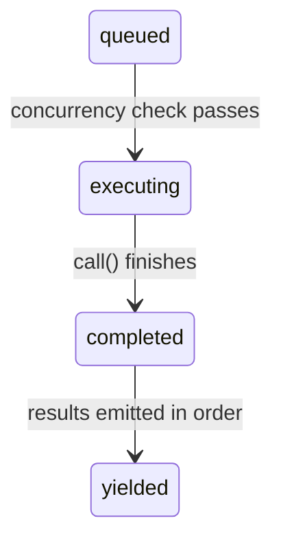

# Chapter 7: Concurrent Tool Execution

# 第 7 章：工具的并发执行

## The Cost of Waiting

## 等待的代价

Chapter 6 traced the lifecycle of a single tool call -- from the raw `tool_use` block in the API response through input validation, permission checks, execution, and result formatting. That pipeline handles one tool. But the model rarely requests just one.

第 6 章追踪了单次工具调用的生命周期——从 API 响应中原始的 `tool_use` 块开始，经过输入校验、权限检查、执行，直到结果格式化。那条流水线处理的是一个工具。但模型很少只请求一个工具。

A typical Claude Code interaction involves three to five tool calls per turn. "Read these two files, grep for this pattern, then edit this function." The model emits all of those in a single response. If each tool takes 200 milliseconds, running them sequentially costs a full second. If the Read and Grep calls are independent -- and they are -- running them in parallel cuts that to 200 milliseconds. Five-to-one improvement, free.

一次典型的 Claude Code 交互每轮会涉及三到五次工具调用。“读这两个文件，用 grep 搜索这个模式，然后编辑这个函数。”模型会在单次响应中一次性发出所有这些调用。如果每个工具耗时 200 毫秒，串行执行就要花掉整整一秒。如果 Read 和 Grep 调用相互独立——而它们确实如此——并行执行就能把时间压缩到 200 毫秒。五比一的提升，且不费分毫。

But not all tools are independent. An Edit that modifies `config.ts` cannot run concurrently with another Edit that modifies `config.ts`. A Bash command that creates a directory must complete before a Bash command that writes a file into that directory. Concurrency is not a global property of a tool. It is a property of a specific tool invocation with specific inputs.

但并非所有工具都相互独立。一个修改 `config.ts` 的 Edit 不能与另一个修改 `config.ts` 的 Edit 并发运行。一个创建目录的 Bash 命令必须先完成，随后才能运行一个向该目录写入文件的 Bash 命令。并发性不是工具的全局属性，而是某次带有特定输入的具体工具调用的属性。

This is the insight that drives the entire concurrency system: **safety is per-call, not per-tool-type**. `Bash("ls -la")` is safe to parallelize. `Bash("rm -rf build/")` is not. The same tool, different inputs, different concurrency classification. The system must inspect the input before deciding.

这正是驱动整个并发系统的核心洞见：**安全性是针对每次调用的，而非针对每种工具类型的**。`Bash("ls -la")` 可以安全地并行化，而 `Bash("rm -rf build/")` 则不行。同一个工具，不同的输入，得到不同的并发分类。系统必须在做决策之前先检查输入。

Claude Code implements two layers of concurrency optimization. The first is **batch orchestration**: after the model's response is fully received, partition the tool calls into concurrent and serial groups, then execute each group appropriately. The second is **speculative execution**: start running tools *while the model is still streaming its response*, harvesting results before the response is even complete. Together, these two mechanisms eliminate most of the wall-clock time that would otherwise be spent waiting.

Claude Code 实现了两层并发优化。第一层是**批次编排**（batch orchestration）：在完整接收模型响应之后，将工具调用划分为并发组和串行组，再分别以恰当的方式执行各组。第二层是**推测执行**（speculative execution）：*在模型仍在流式输出其响应的同时*就开始运行工具，在响应尚未完成之前就收割结果。这两套机制相互配合，消除了原本大部分会被浪费在等待上的实际耗时（wall-clock time）。

---

## The Partition Algorithm

## 划分算法

The entry point is `partitionToolCalls()` in `toolOrchestration.ts`. It takes an ordered array of `ToolUseBlock` messages and produces an array of batches, where each batch is either "all concurrent-safe" or "a single serial tool."

入口是 `toolOrchestration.ts` 中的 `partitionToolCalls()`。它接收一个有序的 `ToolUseBlock` 消息数组，产出一个批次数组，其中每个批次要么是“全部并发安全”，要么是“单个串行工具”。

```typescript
// Pseudocode — illustrates the partition algorithm
type Group = { parallel: boolean; calls: ToolCall[] }

function groupBySafety(calls: ToolCall[], registry: ToolRegistry): Group[] {
  return calls.reduce((groups, call) => {
    const def = registry.lookup(call.name)
    const input = def?.schema.safeParse(call.input)
    // Fail-closed: parse failure or exception → serial
    const safe = input?.success
      ? tryCatch(() => def.isParallelSafe(input.data), false)
      : false
    // Merge consecutive safe calls into one group
    if (safe && groups.at(-1)?.parallel) {
      groups.at(-1)!.calls.push(call)
    } else {
      groups.push({ parallel: safe, calls: [call] })
    }
    return groups
  }, [] as Group[])
}
```

The algorithm walks the array left to right. For each tool call:

该算法从左到右遍历数组。对每次工具调用：

1. **Look up the tool definition** by name.

1. **按名称查找工具定义**。

2. **Parse the input** with the tool's Zod schema via `safeParse()`. If parsing fails, the tool is conservatively classified as not concurrency-safe.

2. **解析输入**，通过 `safeParse()` 使用该工具的 Zod schema 进行解析。如果解析失败，该工具会被保守地归类为非并发安全。

3. **Call `isConcurrencySafe(parsedInput)`** on the tool definition. This is where per-input classification happens. The Bash tool parses the command string, checks if every subcommand is read-only (`ls`, `grep`, `cat`, `git status`), and returns `true` only if the entire compound command is a pure read. The Read tool always returns `true`. The Edit tool always returns `false`. The call is wrapped in try-catch -- if `isConcurrencySafe` throws (say, the Bash command string can't be parsed by the shell-quote library), the tool defaults to serial.

3. **在工具定义上调用 `isConcurrencySafe(parsedInput)`**。这里正是按输入进行分类的环节。Bash 工具会解析命令字符串，检查每个子命令是否为只读（`ls`、`grep`、`cat`、`git status`），仅当整条复合命令都是纯读取时才返回 `true`。Read 工具始终返回 `true`。Edit 工具始终返回 `false`。该调用被包裹在 try-catch 中——如果 `isConcurrencySafe` 抛出异常（比如 Bash 命令字符串无法被 shell-quote 库解析），该工具就默认为串行。

4. **Merge or create a batch.** If the current tool is concurrency-safe AND the most recent batch is also concurrency-safe, append to that batch. Otherwise, start a new batch.

4. **合并或新建批次。** 如果当前工具是并发安全的，并且最近的批次也是并发安全的，就把它追加到该批次。否则，开启一个新批次。

The result is a sequence of batches that alternates between concurrent groups and individual serial entries. Walk through a concrete example:

最终结果是一个批次序列，在并发组与单独的串行条目之间交替出现。我们来看一个具体的例子：

```
Model requests: [Read, Read, Grep, Edit, Read]

Step 1: Read  → concurrent-safe → new batch {safe, [Read]}
Step 2: Read  → concurrent-safe → append   {safe, [Read, Read]}
Step 3: Grep  → concurrent-safe → append   {safe, [Read, Read, Grep]}
Step 4: Edit  → NOT safe        → new batch {serial, [Edit]}
Step 5: Read  → concurrent-safe → new batch {safe, [Read]}

Result: 3 batches
  Batch 1: [Read, Read, Grep]  — run concurrently
  Batch 2: [Edit]              — run alone
  Batch 3: [Read]              — run concurrently (just one tool)
```

The partitioning is greedy and order-preserving. Consecutive safe tools accumulate into a single batch. Any unsafe tool breaks the run and starts a new batch. This means the order in which the model emits tool calls matters -- if it interleaves a Write between two Reads, you get three batches instead of two. In practice, models tend to cluster their reads together, which is the common case the algorithm is optimized for.

这种划分是贪婪的，且保持顺序。连续的安全工具会累积进同一个批次。任何不安全的工具都会打断这串连续序列并开启一个新批次。这意味着模型发出工具调用的顺序很重要——如果它在两个 Read 之间夹了一个 Write，你得到的就是三个批次而不是两个。实践中，模型倾向于把读取操作聚在一起，而这正是该算法所针对优化的常见情形。

---

## Batch Execution

## 批次执行

The `runTools()` generator iterates through the partitioned batches and dispatches each one to the appropriate executor.

`runTools()` 这个 generator 遍历划分好的批次，并把每个批次分派给恰当的执行器。

### Concurrent Batches

### 并发批次

For a concurrent batch, `runToolsConcurrently()` fires all tools in parallel using an `all()` utility that caps active generators at the concurrency limit:

对于并发批次，`runToolsConcurrently()` 使用一个 `all()` 工具函数并行触发所有工具，该工具函数会将活跃的 generator 数量限制在并发上限之内：

```typescript
// Pseudocode — illustrates the concurrent dispatch pattern
async function* dispatchParallel(calls, context) {
  yield* boundedAll(
    calls.map(async function* (call) {
      context.markInProgress(call.id)
      yield* executeSingle(call, context)
      context.markComplete(call.id)
    }),
    MAX_CONCURRENCY,  // Default: 10
  )
}
```

The concurrency limit defaults to 10, configurable via `CLAUDE_CODE_MAX_TOOL_USE_CONCURRENCY`. Ten is generous -- you rarely see more than five or six tool calls in a single model response. The limit exists as a safety valve for pathological cases, not as a typical constraint.

并发上限默认为 10，可通过 `CLAUDE_CODE_MAX_TOOL_USE_CONCURRENCY` 配置。10 已相当宽裕——你很少能在单次模型响应中看到超过五六次工具调用。这个上限存在的意义是作为应对病态情况的安全阀，而非用于日常约束。

The `all()` utility is a generator-aware variant of `Promise.all` with bounded concurrency. It starts up to N generators simultaneously, yields results from whichever completes first, and starts the next queued generator as each one finishes. The mechanics are similar to a semaphore-guarded task pool, but adapted for async generators that yield intermediate results.

`all()` 工具函数是 `Promise.all` 的一个支持 generator、且带有并发上限的变体。它最多同时启动 N 个 generator，从最先完成的那个产出结果，并在每个 generator 完成时启动队列中的下一个。其机制类似于由信号量（semaphore）守护的任务池，只是针对会产出中间结果的 async generator 做了适配。

**Context modifier queuing** is the subtle part. Some tools produce *context modifiers* -- functions that transform the `ToolUseContext` for subsequent tools. When tools run concurrently, you cannot apply these modifiers immediately because other tools in the same batch are reading the same context. Instead, modifiers are collected in a map keyed by tool use ID:

**上下文修改器排队**（Context modifier queuing）是其中微妙的部分。某些工具会产生*上下文修改器*（context modifier）——这些函数会为后续工具变换 `ToolUseContext`。当工具并发运行时，你不能立即应用这些修改器，因为同一批次中的其他工具正在读取同一份上下文。取而代之，修改器会被收集到一个以工具使用 ID 为键的 map 中：

```typescript
const queuedContextModifiers: Record<
  string,
  ((context: ToolUseContext) => ToolUseContext)[]
> = {}
```

After the entire concurrent batch finishes, the modifiers are applied in tool-order (not completion-order), preserving deterministic context evolution:

在整个并发批次结束之后，修改器会按工具顺序（而非完成顺序）被应用，从而保持上下文演进的确定性：

```typescript
for (const block of blocks) {
  const modifiers = queuedContextModifiers[block.id]
  if (!modifiers) continue
  for (const modifier of modifiers) {
    currentContext = modifier(currentContext)
  }
}
```

In practice, none of the current concurrency-safe tools produce context modifiers -- the comment in the codebase acknowledges this explicitly. But the infrastructure exists because tools can be added by MCP servers, and a custom read-only MCP tool might legitimately want to modify context (updating a "files seen" set, for instance).

实践中，目前所有并发安全的工具都不会产生上下文修改器——代码库中的注释明确承认了这一点。但这套基础设施之所以存在，是因为工具可以由 MCP 服务器添加，而某个自定义的只读 MCP 工具可能有正当理由去修改上下文（例如更新一个“已见文件”集合）。

### Serial Batches

### 串行批次

Serial execution is straightforward. Each tool runs, its context modifiers are applied immediately, and the next tool sees the updated context:

串行执行很直接。每个工具运行，其上下文修改器立即被应用，下一个工具便能看到更新后的上下文：

```typescript
for (const toolUse of toolUseMessages) {
  for await (const update of runToolUse(toolUse, /* ... */)) {
    if (update.contextModifier) {
      currentContext = update.contextModifier.modifyContext(currentContext)
    }
    yield { message: update.message, newContext: currentContext }
  }
}
```

This is the critical difference. Serial tools can change the world for subsequent tools. An Edit modifies a file; the next Read sees the modified version. A Bash command creates a directory; the next Bash command writes into it. Context modifiers are the formalization of this dependency: they let a tool say "the execution environment has changed, here's how."

这正是关键的区别所在。串行工具可以为后续工具改变这个“世界”。一个 Edit 修改了某个文件，下一个 Read 就能看到修改后的版本。一个 Bash 命令创建了一个目录，下一个 Bash 命令就向其中写入。上下文修改器是对这种依赖关系的形式化表达：它们让一个工具能够声明“执行环境已经变了，变化如下”。

---

## The Streaming Tool Executor

## 流式工具执行器

Batch orchestration eliminates unnecessary serialization *after* the model's response arrives. But there is a bigger opportunity: the model's response takes time to stream. A typical multi-tool response might take 2-3 seconds to fully arrive. The first tool call is parseable after 500 milliseconds. Why wait for the remaining 2 seconds?

批次编排消除的是模型响应到达*之后*那些不必要的串行化。但还有一个更大的机会：模型响应的流式传输本身就需要时间。一次典型的多工具响应可能需要 2 到 3 秒才能完整到达。第一个工具调用在 500 毫秒后就可以被解析出来。何必再等剩下的 2 秒呢？

The `StreamingToolExecutor` class implements speculative execution. As the model streams its response, each `tool_use` block is handed to the executor the moment it is fully parsed. The executor starts running it immediately -- while the model is still generating the next tool call. By the time the response finishes streaming, several tools may have already completed.

`StreamingToolExecutor` 类实现了推测执行。当模型流式输出其响应时，每个 `tool_use` 块一旦被完整解析，就立即交给执行器。执行器随即开始运行它——而此时模型还在生成下一个工具调用。等到响应流式传输完成时，可能已经有好几个工具完成了。

```mermaid
gantt
    title Sequential vs Streaming Tool Execution
    dateFormat X
    axisFormat %Ls

    section Sequential
    Model streams response     :a1, 0, 2500
    Tool 1 (0.2s)              :a2, after a1, 200
    Tool 2 (0.3s)              :a3, after a2, 300
    Tool 3 (0.1s)              :a4, after a3, 100

    section Streaming Executor
    Model streams response     :b1, 0, 2500
    Tool 1 starts at 0.5s      :b2, 500, 700
    Tool 2 starts at 1.2s      :b3, 1200, 1500
    Tool 3 drain after stream  :b4, 2500, 2600
```



Sequential total: 3.1s. Streaming total: 2.6s -- tools 1 and 2 completed during streaming, saving 16% of wall-clock time.

串行总耗时：3.1 秒。流式总耗时：2.6 秒——工具 1 和工具 2 在流式传输期间就已完成，节省了 16% 的实际耗时。

The savings compound. When the model requests five read-only tools and the response takes 3 seconds to stream, all five tools can start and finish during that 3 seconds. The post-stream drain phase has nothing left to do. The user sees results almost immediately after the last character of the model's response appears.

这种节省是会叠加的。当模型请求五个只读工具、而响应需要 3 秒来完成流式传输时，这五个工具都可以在这 3 秒内启动并完成。流式结束后的收尾（drain）阶段便无事可做。用户几乎在模型响应的最后一个字符出现的瞬间就能看到结果。

### Tool Lifecycle

### 工具的生命周期

Each tool tracked by the executor progresses through four states:

被执行器追踪的每个工具都会经历四个状态：



- **queued**: The `tool_use` block has been parsed and registered. Waiting for concurrency conditions to allow execution.

- **queued（已排队）**：`tool_use` 块已被解析并注册。正在等待并发条件允许其执行。

- **executing**: The tool's `call()` function is running. Results accumulate in a buffer.

- **executing（执行中）**：该工具的 `call()` 函数正在运行。结果在缓冲区中累积。

- **completed**: Execution finished. Results are ready to be yielded to the conversation.

- **completed（已完成）**：执行结束。结果已准备好被产出到对话中。

- **yielded**: Results have been emitted. Terminal state.

- **yielded（已产出）**：结果已被发出。终态。

### addTool(): Queuing During the Stream

### addTool()：在流式过程中排队

```typescript
addTool(block: ToolUseBlock, assistantMessage: AssistantMessage): void
```

Called by the streaming response parser each time a complete `tool_use` block arrives. The method:

每当一个完整的 `tool_use` 块到达时，由流式响应解析器调用。该方法会：

1. Looks up the tool definition. If not found, immediately creates a `completed` entry with an error message -- no point in queuing a tool that does not exist.

1. 查找工具定义。如果找不到，就立即创建一个带错误消息的 `completed` 条目——为一个不存在的工具排队毫无意义。

2. Parses the input and determines `isConcurrencySafe` using the same logic as `partitionToolCalls()`.

2. 解析输入，并使用与 `partitionToolCalls()` 相同的逻辑判定 `isConcurrencySafe`。

3. Pushes a `TrackedTool` with status `'queued'`.

3. 压入一个状态为 `'queued'` 的 `TrackedTool`。

4. Calls `processQueue()` -- which may start the tool immediately.

4. 调用 `processQueue()`——它可能会立即启动该工具。

The call to `processQueue()` is fire-and-forget (`void this.processQueue()`). The executor does not await it. This is intentional: `addTool()` is called from the streaming parser's event handler, and blocking there would stall response parsing. The tool starts executing in the background while the parser continues consuming the stream.

对 `processQueue()` 的调用是“发射后不管”（fire-and-forget，即 `void this.processQueue()`）。执行器不会 await 它。这是有意为之：`addTool()` 是从流式解析器的事件处理器中被调用的，在那里阻塞会拖住响应的解析。工具会在后台开始执行，而解析器继续消费流。

### processQueue(): The Admission Check

### processQueue()：准入检查

The admission check is a single predicate:

准入检查是一个单一的谓词：

```typescript
// Pseudocode — illustrates the mutual exclusion rule
canRun = noToolsRunning || (newToolIsSafe && allRunningAreSafe)
```

A tool can start executing if and only if:

一个工具当且仅当满足以下条件之一时才能开始执行：

- **No tools are currently executing** (the queue is empty), OR

- **当前没有任何工具正在执行**（队列为空），或者

- **Both the new tool and all currently executing tools are concurrency-safe.**

- **新工具以及所有当前正在执行的工具都是并发安全的。**

This is a mutual exclusion contract. A non-concurrent tool requires exclusive access -- nothing else can be running. Concurrent tools can share the runway with other concurrent tools, but a single non-concurrent tool in the executing set blocks everyone.

这是一份互斥契约。非并发工具需要独占访问——不能有任何其他东西在运行。并发工具可以与其他并发工具共享“跑道”，但执行集合中只要有一个非并发工具，就会阻塞所有人。

The `processQueue()` method iterates through all tools in order. For each queued tool, it checks `canExecuteTool()`. If the tool can run, it starts. If a non-concurrent tool cannot run yet, the loop *breaks* -- it stops checking subsequent tools entirely, because non-concurrent tools must maintain ordering. If a concurrent tool cannot run (blocked by an executing non-concurrent tool), the loop *continues* -- but in practice this rarely helps, because concurrent tools after a non-concurrent blocker are typically dependent on its results anyway.

`processQueue()` 方法按顺序遍历所有工具。对每个排队中的工具，它检查 `canExecuteTool()`。如果该工具可以运行，就启动它。如果一个非并发工具尚不能运行，循环就 *break*——彻底停止检查后续工具，因为非并发工具必须维持顺序。如果一个并发工具不能运行（被某个正在执行的非并发工具阻塞），循环则 *continue*——但实践中这很少有帮助，因为排在非并发阻塞者之后的并发工具通常本来就依赖于它的结果。

### executeTool(): The Core Execution Loop

### executeTool()：核心执行循环

This method is where the real complexity lives. It manages abort controllers, error cascades, progress reporting, and context modifiers.

真正的复杂性就藏在这个方法里。它管理着中止控制器（abort controller）、错误级联、进度上报以及上下文修改器。

**Child abort controllers.** Each tool gets its own `AbortController` that is a child of a shared sibling-level controller.

**子级中止控制器。** 每个工具都拥有自己的 `AbortController`，它是某个共享的同级（sibling-level）控制器的子级。

The hierarchy is three levels deep: the query-level controller (owned by the REPL, fires on user Ctrl+C) parents the sibling controller (owned by the streaming executor, fires on Bash errors) which parents each tool's individual controller. Aborting the sibling controller kills all running tools. Aborting a tool's individual controller kills only that tool -- but it also bubbles up to the query controller if the abort reason is not a sibling error. This bubble-up prevents the system from silently discarding the executor when, for example, a permission denial should end the entire turn.

这个层级结构有三层深：查询级（query-level）控制器（由 REPL 拥有，在用户按 Ctrl+C 时触发）是同级控制器（由流式执行器拥有，在 Bash 出错时触发）的父级，而后者又是每个工具各自控制器的父级。中止同级控制器会杀死所有正在运行的工具。中止某个工具自己的控制器只会杀死那个工具——但如果中止原因并非同级错误，它还会向上冒泡到查询控制器。这种冒泡机制可防止系统在某些场景下（例如某次权限拒绝本应结束整个轮次时）悄无声息地丢弃执行器。

This bubble-up is essential for permission denial. When a user rejects a tool in the permission dialog, the tool's abort controller fires. That signal must reach the query loop so it can end the turn. Without it, the query loop would continue as if nothing happened, sending a stale rejection message to the model.

这种向上冒泡对于权限拒绝至关重要。当用户在权限对话框中拒绝某个工具时，该工具的中止控制器会触发。这个信号必须传达到查询循环，使其能够结束本轮。否则，查询循环会像什么都没发生一样继续下去，向模型发送一条已经过时的拒绝消息。

**The sibling error cascade.** When a tool produces an error result, the executor checks whether to cancel sibling tools. The rule: **only Bash errors cascade.** When a shell command errors, the executor records the failure, captures a description of the errored tool, and aborts the sibling controller -- which cancels all other running tools in the batch.

**同级错误级联。** 当某个工具产生错误结果时，执行器会检查是否应取消其同级工具。规则是：**只有 Bash 错误会级联。** 当一条 shell 命令出错时，执行器会记录这次失败，捕获出错工具的一段描述，并中止同级控制器——这会取消该批次中所有其他正在运行的工具。

The rationale is pragmatic. Bash commands often form implicit dependency chains: `mkdir build && cp src/* build/ && tar -czf dist.tar.gz build/`. If `mkdir` fails, running `cp` and `tar` is pointless. Canceling siblings immediately saves time and avoids confusing error messages.

其依据是务实的。Bash 命令常常构成隐式的依赖链：`mkdir build && cp src/* build/ && tar -czf dist.tar.gz build/`。如果 `mkdir` 失败了，再运行 `cp` 和 `tar` 就毫无意义。立即取消同级工具既节省时间，也避免了令人困惑的错误消息。

Read and Grep errors, by contrast, are independent. If one file read fails because the file was deleted, that has no bearing on a concurrent grep searching a different directory. Canceling the grep would waste work for no reason.

相比之下，Read 和 Grep 错误是相互独立的。如果某次文件读取因为文件被删除而失败，这与一个正在搜索另一个目录的并发 grep 毫无关系。取消那个 grep 只会平白无故地浪费已完成的工作。

The error cascade produces synthetic error messages for sibling tools:

错误级联会为同级工具产生合成的（synthetic）错误消息：

```
Cancelled: parallel tool call Bash(mkdir build) errored
```

The description includes the first 40 characters of the errored tool's command or file path, giving the model enough context to understand what went wrong.

这段描述包含出错工具的命令或文件路径的前 40 个字符，给模型足够的上下文去理解到底出了什么问题。

**Progress messages** are handled separately from results. While results are buffered and yielded in order, progress messages (status updates like "Reading file..." or "Searching...") go to a `pendingProgress` array and are yielded immediately via `getCompletedResults()`. A resolve callback wakes up the `getRemainingResults()` loop when new progress arrives, preventing the UI from appearing frozen during long-running tools.

**进度消息**与结果是分开处理的。结果会被缓冲并按顺序产出，而进度消息（诸如“正在读取文件……”或“正在搜索……”这类状态更新）则进入一个 `pendingProgress` 数组，并通过 `getCompletedResults()` 立即产出。当有新进度到达时，一个 resolve 回调会唤醒 `getRemainingResults()` 循环，从而避免界面在工具长时间运行期间显得卡死。

**Queue re-processing.** After each tool completes, `processQueue()` is called again:

**队列的重新处理。** 每个工具完成后，`processQueue()` 会被再次调用：

```typescript
void promise.finally(() => {
  void this.processQueue()
})
```

This is how serial tools that were blocked by a concurrent batch get started. When the last concurrent tool finishes, the subsequent non-concurrent tool's `canExecuteTool()` check passes, and it begins executing.

这正是那些被某个并发批次阻塞的串行工具得以启动的方式。当最后一个并发工具完成时，后续那个非并发工具的 `canExecuteTool()` 检查就会通过，于是它开始执行。

### Result Harvesting

### 结果收割

The streaming executor exposes two harvesting methods, designed for two different phases of the response lifecycle.

流式执行器暴露了两个收割方法，分别针对响应生命周期的两个不同阶段而设计。

**`getCompletedResults()` -- mid-stream harvesting.** This is a synchronous generator called between chunks of the streaming API response. It walks the tools array in order and yields results for any tools that have completed:

**`getCompletedResults()`——流中收割。** 这是一个同步 generator，在流式 API 响应的各个数据块（chunk）之间被调用。它按顺序遍历工具数组，并为所有已完成的工具产出结果：

`getCompletedResults()` is a synchronous generator that walks the tools array in submission order. For each tool, it first drains any pending progress messages. If the tool is completed, it yields the results and marks it as yielded. The critical rule: if a non-concurrent tool is still executing, the walk **breaks** -- nothing after it can be yielded, even if subsequent tools have already completed. Results after a serial tool might depend on its context modifications, so they must wait. For concurrent tools, this restriction does not apply; the loop skips executing concurrent tools and continues checking subsequent entries.

`getCompletedResults()` 是一个同步 generator，按提交顺序遍历工具数组。对每个工具，它首先排空所有待处理的进度消息。如果该工具已完成，它就产出结果并将其标记为已产出。关键规则是：如果某个非并发工具仍在执行中，遍历就**中断**（break）——它之后的任何东西都不能被产出，即便后续工具已经完成。串行工具之后的结果可能依赖于它对上下文的修改，因此它们必须等待。对于并发工具，这条限制不适用；循环会跳过正在执行的并发工具，继续检查后续条目。

This break is the order-preservation mechanism. If a non-concurrent tool is still executing, nothing after it can be yielded -- even if subsequent tools have already completed. Results after a serial tool might depend on its context modifications, so they must wait. For concurrent tools, this restriction does not apply; the loop skips executing concurrent tools and continues checking subsequent entries.

这次中断正是顺序保持机制。如果某个非并发工具仍在执行中，它之后的任何东西都不能被产出——即便后续工具已经完成。串行工具之后的结果可能依赖于它对上下文的修改，因此它们必须等待。对于并发工具，这条限制不适用；循环会跳过正在执行的并发工具，继续检查后续条目。

**`getRemainingResults()` -- post-stream drain.** Called after the model's response is fully received. This async generator loops until every tool is yielded:

**`getRemainingResults()`——流后收尾。** 在模型响应被完整接收之后调用。这个 async generator 会循环直到每个工具都已产出：

`getRemainingResults()` is the post-stream drain. It loops until every tool is yielded. On each iteration, it processes the queue (starting any newly-unblocked tools), yields any completed results via `getCompletedResults()`, and then -- if tools are still executing but nothing new has completed -- uses `Promise.race` to idle-wait on whichever finishes first: any executing tool's promise, or a progress-available signal. This avoids busy-polling while still waking up the moment something happens. When no tools have completed and nothing new can start, the executor waits for any executing tool to finish (or for progress to arrive). This avoids busy-polling while still waking up the moment something happens.

`getRemainingResults()` 是流后收尾环节。它循环直到每个工具都已产出。在每次迭代中，它处理队列（启动任何新近解除阻塞的工具），通过 `getCompletedResults()` 产出所有已完成的结果，然后——如果仍有工具在执行但尚无新东西完成——使用 `Promise.race` 在以下二者中谁先完成就空闲等待谁：任一正在执行的工具的 promise，或一个“有进度可用”的信号。这既避免了忙轮询（busy-polling），又能在事情一发生时立即唤醒。当没有工具完成、且没有新东西可以启动时，执行器会等待任一正在执行的工具完成（或等待进度到达）。这既避免了忙轮询，又能在事情一发生时立即唤醒。

### Order Preservation

### 顺序保持

Results are yielded in the order tools were *received*, not the order they *completed*. This is a deliberate design choice.

结果按工具被*接收*的顺序产出，而非它们*完成*的顺序。这是一项刻意的设计抉择。

Consider a model response that requests `[Read("a.ts"), Read("b.ts"), Read("c.ts")]`. All three start concurrently. `c.ts` finishes first (it is smaller), then `a.ts`, then `b.ts`. If results were yielded in completion order, the conversation would show:

设想一次模型响应请求了 `[Read("a.ts"), Read("b.ts"), Read("c.ts")]`。三者并发启动。`c.ts` 最先完成（因为它更小），然后是 `a.ts`，再然后是 `b.ts`。如果结果按完成顺序产出，对话中会显示为：

```
Tool result: c.ts contents
Tool result: a.ts contents
Tool result: b.ts contents
```

But the model emitted them in a-b-c order. The conversation history must match the model's expectation, or the next turn will be confused about which result corresponds to which request. By yielding in arrival order, the conversation stays coherent:

但模型是按 a-b-c 的顺序发出它们的。对话历史必须与模型的预期相符，否则下一轮就会搞不清哪个结果对应哪个请求。通过按到达顺序产出，对话得以保持连贯：

```
Tool result: a.ts contents  (completed second, yielded first)
Tool result: b.ts contents  (completed third, yielded second)
Tool result: c.ts contents  (completed first, yielded third)
```

The cost is minor: if tool 1 is slow and tools 2-5 are fast, the fast results sit in buffers until tool 1 finishes. But the alternative -- conversation incoherence -- is far worse.

代价微乎其微：如果工具 1 很慢而工具 2 到 5 很快，那些快速结果会一直待在缓冲区里，直到工具 1 完成。但另一种选择——对话失去连贯性——要糟糕得多。

### discard(): The Streaming Fallback Escape Hatch

### discard()：流式回退的逃生口

When the API response stream fails mid-way (network error, server disconnect), the system retries with a new API call. But the streaming executor may have already started tools from the failed attempt. Those results are now orphaned -- they correspond to a response that was never fully received.

当 API 响应流中途失败时（网络错误、服务器断连），系统会以一次新的 API 调用进行重试。但流式执行器可能已经从那次失败的尝试中启动了一些工具。这些结果如今成了孤儿——它们对应的是一次从未被完整接收的响应。

```typescript
discard(): void {
  this.discarded = true
}
```

Setting `discarded = true` causes:

设置 `discarded = true` 会导致：

- `getCompletedResults()` returns immediately with no results.

- `getCompletedResults()` 立即返回，不带任何结果。

- `getRemainingResults()` returns immediately with no results.

- `getRemainingResults()` 立即返回，不带任何结果。

- Any tool that starts executing checks `getAbortReason()`, sees `streaming_fallback`, and gets a synthetic error instead of actually running.

- 任何开始执行的工具都会检查 `getAbortReason()`，看到 `streaming_fallback`，于是得到一个合成错误而非真正运行。

The discarded executor is abandoned. A fresh executor is created for the retry attempt.

被丢弃的执行器被弃用。系统会为重试尝试创建一个全新的执行器。

---

## Tool Concurrency Properties

## 工具的并发属性

Each built-in tool declares its concurrency characteristics through the `isConcurrencySafe()` method. The classification is not arbitrary -- it reflects the tool's actual effect on shared state.

每个内置工具都通过 `isConcurrencySafe()` 方法声明自己的并发特性。这种分类并非随意——它反映了该工具对共享状态的实际影响。

| Tool | Concurrency Safe | Condition | Rationale |
|------|-----------------|-----------|-----------|
| **Read** | Always | -- | Pure read. No side effects. |
| **Grep** | Always | -- | Pure read. Wraps ripgrep. |
| **Glob** | Always | -- | Pure read. File listing. |
| **Fetch** | Always | -- | HTTP GET. No local side effects. |
| **WebSearch** | Always | -- | API call to search provider. |
| **Bash** | Sometimes | Read-only commands only | `isReadOnly()` parses the command and classifies subcommands. `ls`, `git status`, `cat`, `grep` are safe. `rm`, `mkdir`, `mv` are not. |
| **Edit** | Never | -- | Modifies files. Two concurrent edits to the same file corrupt it. |
| **Write** | Never | -- | Creates or overwrites files. Same corruption risk. |
| **NotebookEdit** | Never | -- | Modifies `.ipynb` files. |

| 工具 | 是否并发安全 | 条件 | 依据 |
|------|-----------------|-----------|-----------|
| **Read** | 始终 | -- | 纯读取。无副作用。 |
| **Grep** | 始终 | -- | 纯读取。封装 ripgrep。 |
| **Glob** | 始终 | -- | 纯读取。列出文件。 |
| **Fetch** | 始终 | -- | HTTP GET。无本地副作用。 |
| **WebSearch** | 始终 | -- | 对搜索提供方的 API 调用。 |
| **Bash** | 有时 | 仅限只读命令 | `isReadOnly()` 解析命令并对子命令分类。`ls`、`git status`、`cat`、`grep` 是安全的；`rm`、`mkdir`、`mv` 则不是。 |
| **Edit** | 从不 | -- | 修改文件。对同一文件的两次并发编辑会损坏它。 |
| **Write** | 从不 | -- | 创建或覆盖文件。同样的损坏风险。 |
| **NotebookEdit** | 从不 | -- | 修改 `.ipynb` 文件。 |

The Bash tool's classification deserves elaboration. It uses `splitCommandWithOperators()` to decompose compound commands (`&&`, `||`, `;`, `|`), then classifies each subcommand against known-safe sets:

Bash 工具的分类值得详细说明。它使用 `splitCommandWithOperators()` 来拆解复合命令（`&&`、`||`、`;`、`|`），然后将每个子命令对照已知安全集合进行分类：

- **Search commands**: `grep`, `rg`, `find`, `fd`, `ag`, `ack`

- **搜索类命令**：`grep`、`rg`、`find`、`fd`、`ag`、`ack`

- **Read commands**: `cat`, `head`, `tail`, `wc`, `jq`, `less`, `file`, `stat`

- **读取类命令**：`cat`、`head`、`tail`、`wc`、`jq`、`less`、`file`、`stat`

- **List commands**: `ls`, `tree`, `du`, `df`

- **列举类命令**：`ls`、`tree`、`du`、`df`

- **Neutral commands**: `echo`, `printf` (no side effects but not "reads")

- **中性类命令**：`echo`、`printf`（无副作用，但也不算“读取”）

A compound command is read-only only if every non-neutral subcommand is in the search, read, or list set. `ls -la && cat README.md` is safe. `ls -la && rm -rf build/` is not -- the `rm` contaminates the entire command.

一条复合命令只有在其每个非中性子命令都属于搜索、读取或列举集合时，才算只读。`ls -la && cat README.md` 是安全的。`ls -la && rm -rf build/` 则不是——`rm` 污染了整条命令。

---

## The Interrupt Behavior Contract

## 中断行为契约

While tools are executing, the user can type a new message. What should happen? The answer depends on the tool.

在工具执行期间，用户可以输入一条新消息。此时应该发生什么？答案取决于具体的工具。

Each tool declares an `interruptBehavior()` method that returns either `'cancel'` or `'block'`:

每个工具都声明一个 `interruptBehavior()` 方法，它返回 `'cancel'` 或 `'block'`：

- **`'cancel'`**: Stop the tool immediately, discard partial results, and process the new user message. Used by tools where partial execution is harmless (reads, searches).

- **`'cancel'`**：立即停止该工具，丢弃部分结果，并处理用户的新消息。用于那些部分执行无害的工具（读取、搜索）。

- **`'block'`**: Keep the tool running to completion. The user's new message waits. Used by tools where interruption would leave the system in an inconsistent state (writes mid-flight, long-running bash commands). This is the default.

- **`'block'`**：让该工具继续运行直至完成。用户的新消息则要等待。用于那些中断会让系统处于不一致状态的工具（进行到一半的写入、长时间运行的 bash 命令）。这是默认行为。

The streaming executor tracks the interruptible state of the current tool set:

流式执行器会追踪当前工具集合的可中断状态：

The interruptible state is updated by checking all currently executing tools: the set is interruptible only when every executing tool supports cancellation. If even one tool's interrupt behavior is `'block'`, the entire set is treated as non-interruptible.

可中断状态是通过检查所有当前正在执行的工具来更新的：只有当每一个正在执行的工具都支持取消时，该集合才是可中断的。哪怕只有一个工具的中断行为是 `'block'`，整个集合就会被视为不可中断。

The UI only shows an "interruptible" indicator when ALL executing tools support cancellation. If even one tool is `'block'`, the entire set is treated as non-interruptible. This is conservative but correct: you cannot meaningfully interrupt a batch where one tool would keep running anyway.

只有当所有正在执行的工具都支持取消时，界面才会显示“可中断”指示。哪怕只有一个工具是 `'block'`，整个集合就会被视为不可中断。这种处理保守却正确：对于一个其中某个工具无论如何都会继续运行的批次，你无法有意义地去中断它。

When the user does interrupt and all tools are cancellable, the abort controller fires with reason `'interrupt'`. The executor's `getAbortReason()` method checks each tool's interrupt behavior individually -- a `'cancel'` tool gets a synthetic `user_interrupted` error, while a `'block'` tool (which would not be present in a fully interruptible set, but the code handles the edge case) continues running.

当用户确实发起中断、且所有工具都可取消时，中止控制器会以原因 `'interrupt'` 触发。执行器的 `getAbortReason()` 方法会逐个检查每个工具的中断行为——`'cancel'` 工具会得到一个合成的 `user_interrupted` 错误，而 `'block'` 工具（它本不会出现在一个完全可中断的集合中，但代码仍处理了这个边界情形）则继续运行。

---

## Context Modifiers: The Serial-Only Contract

## 上下文修改器：仅限串行的契约

Context modifiers are functions of type `(context: ToolUseContext) => ToolUseContext`. They let a tool say "I've changed something about the execution environment that subsequent tools need to know about."

上下文修改器是类型为 `(context: ToolUseContext) => ToolUseContext` 的函数。它们让一个工具能够声明：“我改变了执行环境中的某些东西，后续工具需要知道这一点。”

The contract is simple: **context modifiers are only applied for serial (non-concurrent-safe) tools.** This is stated explicitly in the source:

契约很简单：**上下文修改器只对串行（非并发安全）工具应用。** 源码中对此有明确表述：

```typescript
// NOTE: we currently don't support context modifiers for concurrent
//       tools. None are actively being used, but if we want to use
//       them in concurrent tools, we need to support that here.
if (!tool.isConcurrencySafe && contextModifiers.length > 0) {
  for (const modifier of contextModifiers) {
    this.toolUseContext = modifier(this.toolUseContext)
  }
}
```

In the batch orchestration path (`toolOrchestration.ts`), concurrent batch modifiers are collected and applied after the batch completes, in tool-submission order. This means concurrent tools within a batch cannot see each other's context changes, but the batch after them can.

在批次编排这条路径（`toolOrchestration.ts`）中，并发批次的修改器会被收集起来，并在该批次完成后按工具提交顺序应用。这意味着同一批次内的并发工具看不到彼此的上下文变更，但排在它们之后的批次可以。

The asymmetry is intentional. If Tool A modifies context and Tool B reads that context, they have a data dependency. Data dependencies mean they cannot run concurrently. By definition, if two tools are concurrency-safe, neither should depend on the other's context modifications. The system enforces this by deferring application.

这种不对称是有意为之。如果工具 A 修改了上下文而工具 B 读取了该上下文，它们之间就存在数据依赖。数据依赖意味着它们不能并发运行。根据定义，如果两个工具都是并发安全的，那么任何一个都不应依赖于另一个的上下文修改。系统通过延迟应用来强制保证这一点。

---

## Apply This

## 应用之道

The concurrency patterns in Claude Code generalize to any system that orchestrates multiple independent operations. Three principles are worth extracting.

Claude Code 中的并发模式可以推广到任何编排多个独立操作的系统。有三条原则值得提炼出来。

**Partition by safety, not by type.** The `isConcurrencySafe(input)` method receives the parsed input, not just the tool name. This per-invocation classification is more precise than a static "this tool type is always safe" declaration. In your own systems, inspect the operation's arguments before deciding whether to parallelize. A database read is safe to parallelize; a database write to the same row is not. The operation type alone does not tell you enough.

**按安全性划分，而非按类型划分。** `isConcurrencySafe(input)` 方法接收的是解析后的输入，而不仅仅是工具名称。这种按每次调用进行的分类，比静态地声明“这种工具类型始终安全”要精确得多。在你自己的系统里，先检查操作的参数，再决定是否并行化。数据库读取可以安全地并行化；而对同一行的数据库写入则不行。仅凭操作类型并不能告诉你足够的信息。

**Speculative execution during I/O waits.** The streaming executor starts tools while the API response is still arriving. The same pattern applies anywhere you have a slow producer and fast consumers: start processing early items while later items are still being generated. HTTP/2 server push, compiler pipeline parallelism, and speculative CPU execution all share this structure. The key requirement is that you can identify independent work before the full instruction set is available.

**在 I/O 等待期间进行推测执行。** 流式执行器在 API 响应仍在到达的过程中就启动工具。同样的模式适用于任何“生产者慢、消费者快”的场景：在后续条目仍在生成的同时，就开始处理早到的条目。HTTP/2 server push、编译器流水线并行、以及 CPU 的推测执行，全都共享这一结构。关键前提是：在完整的指令集尚未就绪之前，你就能识别出相互独立的工作。

**Preserve submission order in results.** Yielding results in completion order is tempting -- it minimizes latency to first result. But if the consumer (in this case, the language model) expects results in a specific order, reordering them creates confusion that costs more time to resolve than the latency savings. Buffer completed results and release them in the order they were requested. The implementation cost is a simple array walk; the correctness benefit is absolute.

**在结果中保持提交顺序。** 按完成顺序产出结果很有诱惑力——它能把得到首个结果的延迟降到最低。但如果消费者（此处即语言模型）期望结果按某种特定顺序到来，对它们重新排序所引发的混乱，其解决成本会超过省下来的那点延迟。把已完成的结果缓冲起来，并按它们被请求的顺序释放。实现成本不过是一次简单的数组遍历；而在正确性上的收益则是绝对的。

The streaming executor pattern is particularly powerful for agent systems. Any time your agent loop involves a "think, then act" cycle where the thinking phase produces multiple independent actions, you can overlap the tail of thinking with the beginning of acting. The savings are proportional to the ratio of think-time to act-time. For language model agents, where think-time (API response generation) dominates, the savings are substantial.

流式执行器模式对 agent 系统尤为强大。只要你的 agent 循环涉及一个“先思考、再行动”的周期，且思考阶段会产出多个相互独立的行动，你就可以让思考的尾部与行动的开头重叠起来。节省的幅度与思考时间相对行动时间的比值成正比。对于语言模型 agent 而言，思考时间（API 响应的生成）占主导，因此节省的幅度相当可观。

---

## Summary

## 小结

Claude Code's concurrency system operates at two levels. The partition algorithm (`partitionToolCalls`) groups consecutive concurrency-safe tools into batches that run in parallel, while isolating unsafe tools into serial batches where each tool sees the effects of the one before it. The streaming tool executor (`StreamingToolExecutor`) goes further, starting tools speculatively as they arrive during model response streaming, overlapping tool execution with response generation.

Claude Code 的并发系统在两个层面上运作。划分算法（`partitionToolCalls`）把连续的并发安全工具归入并行运行的批次，同时把不安全的工具隔离进串行批次——在串行批次中，每个工具都能看到它前一个工具所产生的效果。流式工具执行器（`StreamingToolExecutor`）则更进一步，在模型响应流式传输期间，工具一到达就推测性地启动它们，让工具执行与响应生成相互重叠。

The safety model is conservative by design. Concurrency safety is determined per-invocation by inspecting parsed inputs. Unknown tools default to serial. Parsing failures default to serial. Exceptions in safety checks default to serial. The system never guesses that something is safe to parallelize -- the tool must affirmatively declare it.

这套安全模型在设计上是保守的。并发安全性是通过检查解析后的输入、按每次调用来确定的。未知工具默认为串行。解析失败默认为串行。安全检查中抛出的异常默认为串行。系统从不去猜测某个东西可以安全地并行化——工具必须明确地声明它。

Error handling follows the dependency structure of the tools. Bash errors cascade to siblings because shell commands often form implicit pipelines. Read and search errors are isolated because they are independent operations. The abort controller hierarchy -- query controller, sibling controller, per-tool controller -- gives each level the ability to cancel its scope without disrupting the level above.

错误处理遵循工具之间的依赖结构。Bash 错误会级联到同级，因为 shell 命令常常构成隐式的流水线。Read 和搜索错误则是相互隔离的，因为它们是独立操作。中止控制器的层级——查询控制器、同级控制器、每工具控制器——赋予每一层在不扰乱上一层的前提下取消自身作用域的能力。

The result is a system that extracts maximum parallelism from the model's tool requests while maintaining the invariant that the conversation history reflects a coherent, ordered sequence of actions. The model sees results in the order it requested them. The user sees tools complete as fast as the underlying operations allow. The gap between those two -- execution speed vs. presentation order -- is bridged by buffering, and that buffer is the simplest part of the entire system.

最终得到的是这样一个系统：它从模型的工具请求中榨取出最大限度的并行性，同时维持着“对话历史反映出一个连贯、有序的动作序列”这一不变式。模型看到的结果是按它请求的顺序排列的。用户看到工具以底层操作所允许的最快速度完成。这二者之间的鸿沟——执行速度与呈现顺序——靠缓冲来弥合，而那个缓冲区是整个系统中最简单的部分。
