# Chapter 8: Spawning Sub-Agents

> 第 8 章：派生子智能体

## The Multiplication of Intelligence

> 智能的倍增

A single agent is powerful. It can read files, edit code, run tests, search the web, and reason about the results. But there is a hard ceiling on what one agent can do in a single conversation: the context window fills up, the task branches in directions that demand different capabilities, and the serial nature of tool execution becomes a bottleneck. The solution is not a bigger model. It is more agents.

> 单个智能体已经很强大了。它能读取文件、编辑代码、运行测试、搜索网络，并对结果进行推理。但单个智能体在一次对话中能完成的事情存在一个硬性上限：上下文窗口会被填满、任务会朝着需要不同能力的方向分叉，而工具执行的串行特性也会成为瓶颈。解决之道不是更大的模型，而是更多的智能体。

Claude Code's sub-agent system lets the model request help. When the parent agent encounters a task that would benefit from delegation -- a codebase search that should not pollute the main conversation, a verification pass that demands adversarial thinking, a set of independent edits that could run in parallel -- it calls the `Agent` tool. That call spawns a child: a fully independent agent with its own conversation loop, its own tool set, its own permission boundary, and its own abort controller. The child does its work and returns a result. The parent never sees the child's internal reasoning, only the final output.

> Claude Code 的子智能体系统让模型能够请求帮助。当父智能体遇到一项适合委派的任务时——比如一次不应污染主对话的代码库搜索、一次需要对抗性思维的验证检查、或一组可以并行运行的独立编辑——它就会调用 `Agent` 工具。该调用会派生出一个子智能体：一个完全独立的智能体，拥有自己的对话循环、自己的工具集、自己的权限边界以及自己的中止控制器（abort controller）。子智能体完成它的工作并返回结果。父智能体永远看不到子智能体的内部推理，只能看到最终输出。

This is not a convenience feature. It is the architectural foundation for everything from parallel file exploration to coordinator-worker hierarchies to multi-agent swarm teams. And it all flows through two files: `AgentTool.tsx`, which defines the model-facing interface, and `runAgent.ts`, which implements the lifecycle.

> 这并不是一个图方便的特性。从并行文件探索，到协调者-工作者（coordinator-worker）层级结构，再到多智能体蜂群（swarm）团队，它是这一切的架构基础。而所有这些都汇流于两个文件：定义面向模型接口的 `AgentTool.tsx`，以及实现生命周期的 `runAgent.ts`。

The design challenge is significant. A sub-agent needs enough context to do its job but not so much that it wastes tokens on irrelevant information. It needs permission boundaries that are strict enough for safety but flexible enough for utility. It needs lifecycle management that cleans up every resource it touches without requiring the caller to remember what to clean up. And all of this must work for a spectrum of agent types -- from a cheap, fast, read-only Haiku searcher to an expensive, thorough, Opus-powered verification agent running adversarial tests in the background.

> 这里的设计挑战相当大。一个子智能体需要足够的上下文来完成任务，但又不能多到把 token 浪费在无关信息上。它需要的权限边界既要严格到足以保障安全，又要灵活到足以实用。它需要的生命周期管理能清理它接触过的每一项资源，而不要求调用方记住该清理什么。而且这一切必须适用于各种类型的智能体——从廉价、快速、只读的 Haiku 搜索器，到昂贵、彻底、由 Opus 驱动、在后台运行对抗性测试的验证智能体。

This chapter traces the path from the model's "I need help" to a fully operational child agent. We will examine the tool definition that the model sees, the fifteen-step lifecycle that creates the execution environment, the six built-in agent types and what each optimizes for, the frontmatter system that lets users define custom agents, and the design principles that emerge from all of it.

> 本章将追踪从模型发出"我需要帮助"到一个完全可运行的子智能体之间的整条路径。我们将考察模型所看到的工具定义、创建执行环境的十五步生命周期、六种内置智能体类型及各自的优化目标、允许用户自定义智能体的 frontmatter 系统，以及由这一切所引申出的设计原则。

A note on terminology: throughout this chapter, "parent" refers to the agent that calls the `Agent` tool, and "child" refers to the agent that is spawned. The parent is usually (but not always) the top-level REPL agent. In coordinator mode, the coordinator spawns workers, which are children. In nested scenarios, a child can itself spawn grandchildren -- the same lifecycle applies recursively.

> 关于术语的一点说明：在本章中，"父（parent）"指调用 `Agent` 工具的智能体，"子（child）"指被派生出来的智能体。父智能体通常（但并非总是）是顶层的 REPL 智能体。在协调者模式下，协调者派生出工作者（worker），这些工作者就是子智能体。在嵌套场景中，一个子智能体本身也可以派生出孙智能体——同一套生命周期会递归地适用。

The orchestration layer spans approximately 40 files across `tools/AgentTool/`, `tasks/`, `coordinator/`, `tools/SendMessageTool/`, and `utils/swarm/`. This chapter focuses on the spawning mechanics -- the AgentTool definition and the runAgent lifecycle. The next chapter covers the runtime: progress tracking, result retrieval, and multi-agent coordination patterns.

> 编排层（orchestration layer）大约横跨 40 个文件，分布在 `tools/AgentTool/`、`tasks/`、`coordinator/`、`tools/SendMessageTool/` 和 `utils/swarm/` 中。本章聚焦于派生机制——即 AgentTool 定义和 runAgent 生命周期。下一章将涵盖运行时部分：进度跟踪、结果获取，以及多智能体协调模式。

---

## The AgentTool Definition

> AgentTool 定义

The `AgentTool` is registered under the name `"Agent"` with a legacy alias `"Task"` for backward compatibility with older transcripts, permission rules, and hook configurations. It is built with the standard `buildTool()` factory, but its schema is more dynamic than any other tool in the system.

> `AgentTool` 以名称 `"Agent"` 注册，并保留了一个历史别名 `"Task"`，以向后兼容旧的对话记录（transcript）、权限规则和 hook 配置。它用标准的 `buildTool()` 工厂构建，但其 schema 比系统中任何其他工具都更具动态性。

### The Input Schema

> 输入 Schema

The input schema is constructed lazily via `lazySchema()` -- a pattern we saw in Chapter 6 that defers zod compilation until first use. There are two layers: a base schema and a full schema that adds multi-agent and isolation parameters.

> 输入 schema 通过 `lazySchema()` 惰性构建——这是我们在第 6 章见过的模式，它将 zod 编译推迟到首次使用时才进行。它分为两层：一个基础 schema，以及一个增加了多智能体和隔离参数的完整 schema。

The base fields are always present:

> 基础字段始终存在：

| Field | Type | Required | Purpose |
|-------|------|----------|---------|
| `description` | `string` | Yes | Short 3-5 word summary of the task |
| `prompt` | `string` | Yes | The full task description for the agent |
| `subagent_type` | `string` | No | Which specialized agent to use |
| `model` | `enum('sonnet','opus','haiku')` | No | Model override for this agent |
| `run_in_background` | `boolean` | No | Launch asynchronously |

> | 字段 | 类型 | 是否必需 | 用途 |
> |-------|------|----------|---------|
> | `description` | `string` | 是 | 对任务的 3-5 个词的简短摘要 |
> | `prompt` | `string` | 是 | 给该智能体的完整任务描述 |
> | `subagent_type` | `string` | 否 | 使用哪个专门化的智能体 |
> | `model` | `enum('sonnet','opus','haiku')` | 否 | 针对该智能体的模型覆盖（override） |
> | `run_in_background` | `boolean` | 否 | 异步启动 |

The full schema adds multi-agent parameters (when swarm features are active) and isolation controls:

> 完整 schema 增加了多智能体参数（当蜂群特性启用时）和隔离控制：

| Field | Type | Purpose |
|-------|------|---------|
| `name` | `string` | Makes the agent addressable via `SendMessage({to: name})` |
| `team_name` | `string` | Team context for spawning |
| `mode` | `PermissionMode` | Permission mode for spawned teammate |
| `isolation` | `enum('worktree','remote')` | Filesystem isolation strategy |
| `cwd` | `string` | Absolute path override for working directory |

> | 字段 | 类型 | 用途 |
> |-------|------|---------|
> | `name` | `string` | 使该智能体可通过 `SendMessage({to: name})` 寻址 |
> | `team_name` | `string` | 派生时的团队上下文 |
> | `mode` | `PermissionMode` | 被派生队友的权限模式 |
> | `isolation` | `enum('worktree','remote')` | 文件系统隔离策略 |
> | `cwd` | `string` | 工作目录的绝对路径覆盖 |

The multi-agent fields enable the swarm pattern covered in Chapter 9: named agents that can send messages to each other via `SendMessage({to: name})` while running concurrently. The isolation fields enable filesystem safety: worktree isolation creates a temporary git worktree so the agent operates on a copy of the repository, preventing conflicting edits when multiple agents work on the same codebase simultaneously.

> 这些多智能体字段启用了第 9 章所讲的蜂群模式：具名智能体可以在并发运行的同时，通过 `SendMessage({to: name})` 互相发送消息。隔离字段则带来了文件系统层面的安全性：worktree 隔离会创建一个临时的 git worktree，使智能体在仓库的一份副本上操作，从而在多个智能体同时处理同一代码库时防止产生冲突的编辑。

What makes this schema unusual is that it is **dynamically shaped by feature flags**:

> 让这个 schema 与众不同的是，它是**由特性开关（feature flag）动态塑形的**：

```typescript
// Pseudocode — illustrates the feature-gated schema pattern
inputSchema = lazySchema(() => {
  let schema = baseSchema()
  if (!featureEnabled('ASSISTANT_MODE')) schema = schema.omit({ cwd: true })
  if (backgroundDisabled || forkMode)    schema = schema.omit({ run_in_background: true })
  return schema
})
```

When the fork experiment is active, `run_in_background` disappears from the schema entirely because all spawns are forced async under that path. When background tasks are disabled (via `CLAUDE_CODE_DISABLE_BACKGROUND_TASKS`), the field is also stripped. When the KAIROS feature flag is off, `cwd` is omitted. The model never sees fields it cannot use.

> 当 fork 实验启用时，`run_in_background` 会从 schema 中彻底消失，因为在该路径下所有派生都被强制为异步。当后台任务被禁用时（通过 `CLAUDE_CODE_DISABLE_BACKGROUND_TASKS`），该字段同样会被剥离。当 KAIROS 特性开关关闭时，`cwd` 会被省略。模型永远不会看到它无法使用的字段。

This is a subtle but important design choice. The schema is not just validation -- it is the model's instruction manual. Every field in the schema is described in the tool definition that the model reads. Removing fields the model should not use is more effective than adding "do not use this field" to the prompt. The model cannot misuse what it cannot see.

> 这是一个微妙但重要的设计抉择。schema 不仅仅是校验——它就是模型的使用说明书。schema 中的每个字段都在模型读取的工具定义里有所描述。移除模型不应使用的字段，比在 prompt 里加上"不要使用此字段"要有效得多。模型无法滥用它看不见的东西。

### The Output Schema

> 输出 Schema

The output is a discriminated union with two public variants:

> 输出是一个带判别标签的联合类型（discriminated union），包含两个公开变体：

- `{ status: 'completed', prompt, ...AgentToolResult }` -- synchronous completion with the agent's final output

> - `{ status: 'completed', prompt, ...AgentToolResult }` —— 同步完成，附带智能体的最终输出

- `{ status: 'async_launched', agentId, description, prompt, outputFile }` -- background launch acknowledgment

> - `{ status: 'async_launched', agentId, description, prompt, outputFile }` —— 后台启动的确认

Two additional internal variants (`TeammateSpawnedOutput` and `RemoteLaunchedOutput`) exist but are excluded from the exported schema to enable dead code elimination in external builds. The bundler strips these variants and their associated code paths when the corresponding feature flags are disabled, keeping the distributed binary smaller.

> 另有两个内部变体（`TeammateSpawnedOutput` 和 `RemoteLaunchedOutput`）存在，但被排除在导出的 schema 之外，以便在外部构建中进行死代码消除（dead code elimination）。当相应的特性开关被禁用时，打包器会剥离这些变体及其关联的代码路径，从而让发布的二进制文件更小。

The `async_launched` variant is notable for what it includes: the `outputFile` path where the agent's results will be written when it completes. This lets the parent (or any other consumer) poll or watch the file for results, providing a filesystem-based communication channel that survives process restarts.

> `async_launched` 变体之所以值得注意，在于它所包含的内容：`outputFile` 路径，即智能体完成时其结果将被写入的位置。这让父智能体（或任何其他消费者）能够轮询或监视该文件以获取结果，提供了一个基于文件系统、能够在进程重启后依然存续的通信通道。

### The Dynamic Prompt

> 动态 Prompt

The `AgentTool` prompt is generated by `getPrompt()` and is context-sensitive. It adapts based on available agents (listed inline or as an attachment to avoid busting prompt cache), whether fork is active (adds "When to fork" guidance), whether the session is in coordinator mode (slim prompt since the coordinator system prompt already covers usage), and subscription tier. Non-pro users get a note about launching multiple agents concurrently.

> `AgentTool` 的 prompt 由 `getPrompt()` 生成，且对上下文敏感。它会根据以下因素进行适配：可用的智能体（以内联方式列出，或作为附件列出，以避免击穿 prompt 缓存）、fork 是否启用（会增加"何时 fork"的指引）、会话是否处于协调者模式（采用精简 prompt，因为协调者的系统 prompt 已涵盖了用法），以及订阅档位。非 pro 用户会收到一条关于并发启动多个智能体的说明。

The attachment-based agent list is worth highlighting. The codebase comments reference "approximately 10.2% of fleet cache_creation tokens" being caused by dynamic tool descriptions. Moving the agent list from the tool description to an attachment message keeps the tool description static, so connecting an MCP server or loading a plugin does not bust the prompt cache for every subsequent API call.

> 基于附件的智能体列表值得着重指出。代码库中的注释提到，"约 10.2% 的整个 fleet 的 cache_creation token"是由动态工具描述造成的。把智能体列表从工具描述移到一条附件消息中，可以让工具描述保持静态，这样一来，连接一个 MCP 服务器或加载一个插件就不会在随后的每一次 API 调用中击穿 prompt 缓存。

This is a pattern worth internalizing for any system that uses tool definitions with dynamic content. The Anthropic API caches the prompt prefix -- system prompt, tool definitions, and conversation history -- and reuses the cached computation for subsequent requests that share the same prefix. If the tool definition changes between API calls (because an agent was added or an MCP server connected), the entire cache is invalidated. Moving volatile content from the tool definition (which is part of the cached prefix) to an attachment message (which is appended after the cached portion) preserves the cache while still delivering the information to the model.

> 对于任何在工具定义中使用动态内容的系统而言，这都是一个值得内化的模式。Anthropic API 会缓存 prompt 前缀——系统 prompt、工具定义和对话历史——并在共享同一前缀的后续请求中复用已缓存的计算结果。如果工具定义在两次 API 调用之间发生了变化（因为新增了一个智能体或连接了一个 MCP 服务器），整个缓存就会失效。把易变内容从工具定义（属于被缓存的前缀的一部分）移到一条附件消息（追加在被缓存部分之后）中，就能在仍向模型传递信息的同时保住缓存。

With the tool definition understood, we can now trace what happens when the model actually calls it.

> 理解了工具定义之后，我们现在可以追踪一下当模型真正调用它时会发生什么。

### Feature Gating

> 特性门控

The sub-agent system has the most complex feature gating in the codebase. At least twelve feature flags and GrowthBook experiments control which agents are available, which parameters appear in the schema, and which code paths are taken:

> 子智能体系统拥有整个代码库中最复杂的特性门控。至少有十二个特性开关和 GrowthBook 实验在控制：哪些智能体可用、哪些参数出现在 schema 中，以及走哪条代码路径：

| Feature Gate | Controls |
|-------------|----------|
| `FORK_SUBAGENT` | Fork agent path |
| `BUILTIN_EXPLORE_PLAN_AGENTS` | Explore and Plan agents |
| `VERIFICATION_AGENT` | Verification agent |
| `KAIROS` | `cwd` override, assistant force-async |
| `TRANSCRIPT_CLASSIFIER` | Handoff classification, `auto` mode override |
| `PROACTIVE` | Proactive module integration |

> | 特性门控 | 所控制的内容 |
> |-------------|----------|
> | `FORK_SUBAGENT` | Fork 智能体路径 |
> | `BUILTIN_EXPLORE_PLAN_AGENTS` | Explore 与 Plan 智能体 |
> | `VERIFICATION_AGENT` | 验证智能体 |
> | `KAIROS` | `cwd` 覆盖、assistant 强制异步 |
> | `TRANSCRIPT_CLASSIFIER` | 交接（handoff）分类、`auto` 模式覆盖 |
> | `PROACTIVE` | Proactive 模块集成 |

Each gate uses `feature()` from Bun's dead code elimination system (compile-time) or `getFeatureValue_CACHED_MAY_BE_STALE()` from GrowthBook (runtime A/B testing). The compile-time gates are string-replaced during the build -- when `FORK_SUBAGENT` is `'ant'`, the entire fork code path is included; when it is `'external'`, it may be excluded entirely. The GrowthBook gates allow live experimentation: the `tengu_amber_stoat` experiment can A/B test whether removing Explore and Plan agents changes user behavior, without shipping a new binary.

> 每个门控要么使用来自 Bun 死代码消除系统的 `feature()`（编译期），要么使用来自 GrowthBook 的 `getFeatureValue_CACHED_MAY_BE_STALE()`（运行期 A/B 测试）。编译期门控会在构建过程中被字符串替换——当 `FORK_SUBAGENT` 为 `'ant'` 时，整条 fork 代码路径会被包含进来；当它为 `'external'` 时，则可能被完全排除。GrowthBook 门控则允许在线实验：`tengu_amber_stoat` 实验可以 A/B 测试移除 Explore 和 Plan 智能体是否会改变用户行为，而无需发布新的二进制文件。

### The call() Decision Tree

> call() 决策树

Before `runAgent()` is ever invoked, the `call()` method in `AgentTool.tsx` routes the request through a decision tree that determines *what kind* of agent to spawn and *how* to spawn it:

> 在 `runAgent()` 被调用之前，`AgentTool.tsx` 中的 `call()` 方法会先让请求经过一个决策树，以确定要派生*哪种*智能体以及*如何*派生它：

```
1. Is this a teammate spawn? (team_name + name both set)
   YES -> spawnTeammate() -> return teammate_spawned
   NO  -> continue

2. Resolve effective agent type
   - subagent_type provided -> use it
   - subagent_type omitted, fork enabled -> undefined (fork path)
   - subagent_type omitted, fork disabled -> "general-purpose" (default)

3. Is this the fork path? (effectiveType === undefined)
   YES -> Recursive fork guard check -> Use FORK_AGENT definition

4. Resolve agent definition from activeAgents list
   - Filter by permission deny rules
   - Filter by allowedAgentTypes
   - Throw if not found or denied

5. Check required MCP servers (wait up to 30s for pending)

6. Resolve isolation mode (param overrides agent def)
   - "remote" -> teleportToRemote() -> return remote_launched
   - "worktree" -> createAgentWorktree()
   - null -> normal execution

7. Determine sync vs async
   shouldRunAsync = run_in_background || selectedAgent.background ||
                    isCoordinator || forceAsync || isProactiveActive

8. Assemble worker tool pool

9. Build system prompt and prompt messages

10. Execute (async -> registerAsyncAgent + void lifecycle; sync -> iterate runAgent)
```

Steps 1 through 6 are pure routing -- no agent has been created yet. The actual lifecycle begins at `runAgent()`, which the sync path iterates directly and the async path wraps in `runAsyncAgentLifecycle()`.

> 第 1 步到第 6 步是纯粹的路由——此时还没有任何智能体被创建。真正的生命周期始于 `runAgent()`，同步路径会直接对其进行迭代，而异步路径则将其包裹在 `runAsyncAgentLifecycle()` 之中。

The routing is done in `call()` rather than `runAgent()` for a reason: `runAgent()` is a pure lifecycle function that does not know about teammates, remote agents, or the fork experiment. It receives a resolved agent definition and executes it. The decision of *which* definition to resolve, *how* to isolate the agent, and *whether* to run synchronously or asynchronously belongs to the layer above. This separation keeps `runAgent()` testable and reusable -- it is called from both the normal AgentTool path and from the async lifecycle wrapper when resuming a backgrounded agent.

> 路由放在 `call()` 而非 `runAgent()` 中是有原因的：`runAgent()` 是一个纯粹的生命周期函数，它对队友、远程智能体或 fork 实验一无所知。它接收一个已解析好的智能体定义并执行它。至于*解析哪个*定义、*如何*隔离该智能体，以及*是否*同步或异步运行的决定，则属于其上一层。这种分离让 `runAgent()` 保持可测试且可复用——它既被普通的 AgentTool 路径调用，也在恢复一个后台智能体时被异步生命周期包装器调用。

The fork guard in step 3 deserves attention. Fork children keep the `Agent` tool in their pool (for cache-identical tool definitions with the parent), but recursive forking would be pathological. Two guards prevent it: `querySource === 'agent:builtin:fork'` (set on the child's context options, survives autocompact) and `isInForkChild(messages)` (scans conversation history for the `<fork-boilerplate>` tag as a fallback). Belt and suspenders -- the primary guard is fast and reliable; the fallback catches edge cases where querySource was not threaded.

> 第 3 步中的 fork 守卫值得关注。Fork 子智能体会在其工具池中保留 `Agent` 工具（以使工具定义与父智能体的缓存完全一致），但递归 fork 会是病态的。有两道守卫来阻止它：`querySource === 'agent:builtin:fork'`（设置在子智能体的上下文选项上，能在 autocompact 后存续）以及 `isInForkChild(messages)`（作为兜底手段，扫描对话历史中是否存在 `<fork-boilerplate>` 标签）。这是双保险——主守卫快速且可靠；兜底守卫则负责捕获 querySource 未被传递下去的边缘情况。

---

## The runAgent Lifecycle

> runAgent 生命周期

`runAgent()` in `runAgent.ts` is an async generator that drives a sub-agent's entire lifecycle. It yields `Message` objects as the agent works. Every sub-agent -- fork, built-in, custom, coordinator worker -- flows through this single function. The function is approximately 400 lines, and every line exists for a reason.

> `runAgent.ts` 中的 `runAgent()` 是一个 async generator，驱动子代理的整个生命周期。随着代理工作，它会不断 yield 出 `Message` 对象。每一个子代理——fork、内置、自定义、协调器 worker——都流经这一个函数。该函数大约 400 行，每一行的存在都有其理由。

The function signature reveals the complexity of the problem:

> 该函数的签名揭示了问题的复杂度：

```typescript
export async function* runAgent({
  agentDefinition,       // What kind of agent
  promptMessages,        // What to tell it
  toolUseContext,        // Parent's execution context
  canUseTool,           // Permission callback
  isAsync,              // Background or blocking?
  canShowPermissionPrompts,
  forkContextMessages,  // Parent's history (fork only)
  querySource,          // Origin tracking
  override,             // System prompt, abort controller, agent ID overrides
  model,                // Model override from caller
  maxTurns,             // Turn limit
  availableTools,       // Pre-assembled tool pool
  allowedTools,         // Permission scoping
  onCacheSafeParams,    // Callback for background summarization
  useExactTools,        // Fork path: use parent's exact tools
  worktreePath,         // Isolation directory
  description,          // Human-readable task description
  // ...
}: { ... }): AsyncGenerator<Message, void>
```

Seventeen parameters. Each one represents a dimension of variation that the lifecycle must handle. This is not over-engineering -- it is the natural consequence of a single function serving fork agents, built-in agents, custom agents, sync agents, async agents, worktree-isolated agents, and coordinator workers. The alternative would be seven different lifecycle functions with duplicated logic, which is worse.

> 十七个参数。每一个都代表生命周期必须处理的一个变化维度。这不是过度工程化——它是单个函数同时服务于 fork 代理、内置代理、自定义代理、同步代理、异步代理、worktree 隔离代理以及协调器 worker 的自然结果。替代方案是七个不同的、带有重复逻辑的生命周期函数，那样更糟。

The `override` object is particularly important -- it is the escape hatch for fork agents and resumed agents that need to inject pre-computed values (system prompt, abort controller, agent ID) into the lifecycle without re-deriving them.

> `override` 对象尤其重要——它是 fork 代理和恢复（resumed）代理的逃生舱口，这些代理需要把预先计算好的值（system prompt、abort controller、agent ID）注入生命周期，而无需重新推导它们。

Here are the fifteen steps.

> 下面是这十五个步骤。

### Step 1: Model Resolution

> 步骤 1：模型解析

```typescript
const resolvedAgentModel = getAgentModel(
  agentDefinition.model,                    // Agent's declared preference
  toolUseContext.options.mainLoopModel,      // Parent's model
  model,                                    // Caller's override (from input)
  permissionMode,                           // Current permission mode
)
```

The resolution chain is: **caller override > agent definition > parent model > default**. The `getAgentModel()` function handles special values like `'inherit'` (use whatever the parent uses) and GrowthBook-gated overrides for specific agent types. The Explore agent, for example, defaults to Haiku for external users -- the cheapest and fastest model, appropriate for a read-only search specialist that runs 34 million times per week.

> 解析链是：**调用方 override > 代理定义 > 父代理模型 > 默认值**。`getAgentModel()` 函数会处理诸如 `'inherit'`（沿用父代理所用模型）之类的特殊值，以及针对特定代理类型由 GrowthBook 控制的 override。例如，Explore 代理对外部用户默认使用 Haiku——这是最便宜、最快的模型，适合一个每周运行 3400 万次的只读搜索专家。

Why this order matters: the caller (the parent model) can override the agent definition's preference by passing a `model` parameter in the tool call. This lets the parent promote a normally-cheap agent to a more capable model for a particularly complex search, or demote an expensive agent when the task is simple. But the agent definition's model is the default, not the parent's -- a Haiku Explore agent should not accidentally inherit the parent's Opus model just because no one specified otherwise.

> 为什么这个顺序很重要：调用方（父代理模型）可以通过在工具调用中传入 `model` 参数来覆盖代理定义的偏好。这让父代理可以为某次特别复杂的搜索把一个通常很廉价的代理提升到更强的模型，或者在任务简单时把一个昂贵的代理降级。但代理定义中的模型才是默认值，而不是父代理的模型——一个 Haiku 的 Explore 代理不应该仅仅因为没人另行指定，就意外继承父代理的 Opus 模型。

Understanding the model resolution chain is important because it establishes a design principle that recurs throughout the lifecycle: **explicit overrides beat declarations, declarations beat inheritance, inheritance beats defaults.** This same principle governs permission modes, abort controllers, and system prompts. The consistency makes the system predictable -- once you understand one resolution chain, you understand them all.

> 理解模型解析链很重要，因为它确立了一条贯穿整个生命周期的设计原则：**显式 override 胜过声明，声明胜过继承，继承胜过默认值。** 同一条原则也支配着权限模式、abort controller 和 system prompt。这种一致性使系统变得可预测——一旦你理解了一条解析链，你就理解了所有解析链。

### Step 2: Agent ID Creation

> 步骤 2：创建 Agent ID

```typescript
const agentId = override?.agentId ? override.agentId : createAgentId()
```

Agent IDs follow the pattern `agent-<hex>` where the hex part is derived from `crypto.randomUUID()`. The branded type `AgentId` prevents accidental string confusion at the type level. The override path exists for resumed agents that need to keep their original ID for transcript continuity.

> Agent ID 遵循 `agent-<hex>` 的模式，其中 hex 部分来自 `crypto.randomUUID()`。带标记的类型（branded type）`AgentId` 在类型层面防止了意外的字符串混淆。override 路径是为恢复的代理准备的，它们需要保留原始 ID 以保证 transcript 的连续性。

### Step 3: Context Preparation

> 步骤 3：上下文准备

Fork agents and fresh agents diverge here:

> Fork 代理与全新代理在此处分道扬镳：

```typescript
const contextMessages: Message[] = forkContextMessages
  ? filterIncompleteToolCalls(forkContextMessages)
  : []
const initialMessages: Message[] = [...contextMessages, ...promptMessages]

const agentReadFileState = forkContextMessages !== undefined
  ? cloneFileStateCache(toolUseContext.readFileState)
  : createFileStateCacheWithSizeLimit(READ_FILE_STATE_CACHE_SIZE)
```

For fork agents, the parent's entire conversation history is cloned into `contextMessages`. But there is a critical filter: `filterIncompleteToolCalls()` strips any `tool_use` blocks that lack matching `tool_result` blocks. Without this filter, the API would reject the malformed conversation. This happens when the parent is mid-tool-execution at the moment of forking -- the tool_use has been emitted but the result has not arrived yet.

> 对于 fork 代理，父代理的整个对话历史会被克隆到 `contextMessages` 中。但有一个关键的过滤器：`filterIncompleteToolCalls()` 会剥离任何缺少配对 `tool_result` 块的 `tool_use` 块。没有这个过滤器，API 会拒绝这段格式不正确的对话。这种情况发生在 fork 的那一刻父代理正处于工具执行中途时——tool_use 已经发出，但结果尚未到达。

The file state cache follows the same fork-or-fresh pattern. Fork children get a clone of the parent's cache (they already "know" which files have been read). Fresh agents start empty. The clone is a shallow copy -- file content strings are shared via reference, not duplicated. This matters for memory: a fork child with a 50-file cache does not duplicate 50 file contents, it duplicates 50 pointers. The LRU eviction behavior is independent -- each cache evicts based on its own access pattern.

> 文件状态缓存遵循同样的「fork 还是全新」模式。Fork 子代理获得父代理缓存的克隆（它们已经「知道」哪些文件被读取过）。全新代理则从空开始。这个克隆是浅拷贝——文件内容字符串是通过引用共享的，而非复制。这对内存很关键：一个拥有 50 个文件缓存的 fork 子代理不会复制 50 份文件内容，它只复制 50 个指针。LRU 淘汰行为是独立的——每个缓存根据自身的访问模式进行淘汰。

### Step 4: CLAUDE.md Stripping

> 步骤 4：剥离 CLAUDE.md

Read-only agents like Explore and Plan have `omitClaudeMd: true` in their definitions:

> 像 Explore 和 Plan 这样的只读代理在其定义中带有 `omitClaudeMd: true`：

```typescript
const shouldOmitClaudeMd =
  agentDefinition.omitClaudeMd &&
  !override?.userContext &&
  getFeatureValue_CACHED_MAY_BE_STALE('tengu_slim_subagent_claudemd', true)
const { claudeMd: _omittedClaudeMd, ...userContextNoClaudeMd } = baseUserContext
const resolvedUserContext = shouldOmitClaudeMd
  ? userContextNoClaudeMd
  : baseUserContext
```

CLAUDE.md files contain project-specific instructions about commit messages, PR conventions, lint rules, and coding standards. A read-only search agent does not need any of this -- it cannot commit, cannot create PRs, cannot edit files. The parent agent has full context and will interpret the search results. Dropping CLAUDE.md here saves billions of tokens per week across the fleet -- an aggregate cost reduction that justifies the added complexity of conditional context injection.

> CLAUDE.md 文件包含关于 commit message、PR 约定、lint 规则和编码规范的项目专属指令。一个只读搜索代理完全不需要这些——它不能 commit、不能创建 PR、不能编辑文件。父代理拥有完整的上下文，并会去解读搜索结果。在这里丢弃 CLAUDE.md，在整个集群每周可节省数十亿个 token——这种聚合的成本削减，足以证明条件式上下文注入所增加的复杂度是值得的。

Similarly, Explore and Plan agents have `gitStatus` stripped from system context. The git status snapshot taken at session start can be up to 40KB and is explicitly labeled as stale. If these agents need git information, they can run `git status` themselves and get fresh data.

> 类似地，Explore 和 Plan 代理的系统上下文中也会剥离 `gitStatus`。在会话开始时拍下的 git status 快照可能高达 40KB，并被明确标注为已过期。如果这些代理需要 git 信息，它们可以自己运行 `git status` 来获取新鲜数据。

These are not premature optimizations. At 34 million Explore spawns per week, every unnecessary token compounds into measurable cost. The kill-switch (`tengu_slim_subagent_claudemd`) defaults to true but can be flipped via GrowthBook if the stripping causes regressions.

> 这些并不是过早优化。在每周 3400 万次 Explore 派生的规模下，每一个不必要的 token 都会累积成可衡量的成本。这个总开关（`tengu_slim_subagent_claudemd`）默认为 true，但如果剥离导致回归，可以通过 GrowthBook 翻转它。

### Step 5: Permission Isolation

> 步骤 5：权限隔离

This is the most intricate step. Each agent gets a custom `getAppState()` wrapper that overlays its permission configuration onto the parent's state:

> 这是最错综复杂的一步。每个代理都会得到一个自定义的 `getAppState()` 包装器，它把代理自身的权限配置叠加到父代理的状态之上：

```typescript
const agentGetAppState = () => {
  const state = toolUseContext.getAppState()
  let toolPermissionContext = state.toolPermissionContext

  // Override mode unless parent is in bypassPermissions, acceptEdits, or auto
  if (agentPermissionMode && canOverride) {
    toolPermissionContext = {
      ...toolPermissionContext,
      mode: agentPermissionMode,
    }
  }

  // Auto-deny prompts for agents that can't show UI
  const shouldAvoidPrompts =
    canShowPermissionPrompts !== undefined
      ? !canShowPermissionPrompts
      : agentPermissionMode === 'bubble'
        ? false
        : isAsync
  if (shouldAvoidPrompts) {
    toolPermissionContext = {
      ...toolPermissionContext,
      shouldAvoidPermissionPrompts: true,
    }
  }

  // Scope tool allow rules
  if (allowedTools !== undefined) {
    toolPermissionContext = {
      ...toolPermissionContext,
      alwaysAllowRules: {
        cliArg: state.toolPermissionContext.alwaysAllowRules.cliArg,
        session: [...allowedTools],
      },
    }
  }

  return { ...state, toolPermissionContext, effortValue }
}
```

There are four distinct concerns layered together:

> 这里叠加了四个不同的关注点：

**Permission mode cascade.** If the parent is in `bypassPermissions`, `acceptEdits`, or `auto` mode, the parent's mode always wins -- the agent definition cannot weaken it. Otherwise, the agent definition's `permissionMode` is applied. This prevents a custom agent from downgrading security when the user has explicitly set a permissive mode for the session.

> **权限模式级联。** 如果父代理处于 `bypassPermissions`、`acceptEdits` 或 `auto` 模式，父代理的模式总是胜出——代理定义无法削弱它。否则，则应用代理定义中的 `permissionMode`。这可以防止当用户已为会话显式设置了一个宽松模式时，某个自定义代理把安全级别降下来。

**Prompt avoidance.** Background agents cannot show permission dialogs -- there is no terminal attached. So `shouldAvoidPermissionPrompts` is set to `true`, which causes the permission system to auto-deny rather than block. The exception is `bubble` mode: these agents surface prompts to the parent's terminal, so they can always show prompts regardless of sync/async status.

> **避免提示。** 后台代理无法显示权限对话框——没有附加的终端。因此 `shouldAvoidPermissionPrompts` 被设为 `true`，这会使权限系统自动拒绝而非阻塞。例外是 `bubble` 模式：这些代理会把提示浮现到父代理的终端上，所以无论同步/异步状态如何，它们始终可以显示提示。

**Automated check ordering.** Background agents that *can* show prompts (bubble mode) set `awaitAutomatedChecksBeforeDialog`. This means the classifier and permission hooks run first; the user is only interrupted if automated resolution fails. For background work, waiting an extra second for the classifier is fine -- the user should not be interrupted unnecessarily.

> **自动检查的顺序。** *能够*显示提示的后台代理（bubble 模式）会设置 `awaitAutomatedChecksBeforeDialog`。这意味着分类器和权限 hook 会先运行；只有在自动解析失败时才会打扰用户。对于后台工作，为分类器多等一秒是可以接受的——用户不应被不必要地打断。

**Tool permission scoping.** When `allowedTools` is provided, it replaces the session-level allow rules entirely. This prevents parent approvals from leaking through to scoped agents. But SDK-level permissions (from `--allowedTools` CLI flag) are preserved -- those represent the embedding application's explicit security policy and should apply everywhere.

> **工具权限作用域限定。** 当提供了 `allowedTools` 时，它会完全替换会话级别的 allow 规则。这可以防止父代理的批准泄漏到受限作用域的代理中。但 SDK 级别的权限（来自 `--allowedTools` CLI 标志）会被保留——它们代表了宿主应用程序明确的安全策略，应当在任何地方都生效。

### Step 6: Tool Resolution

> 步骤 6：工具解析

```typescript
const resolvedTools = useExactTools
  ? availableTools
  : resolveAgentTools(agentDefinition, availableTools, isAsync).resolvedTools
```

Fork agents use `useExactTools: true`, which passes the parent's tool array through unchanged. This is not just convenience -- it is a cache optimization. Different tool definitions serialize differently (different permission modes produce different tool metadata), and any divergence in the tool block busts the prompt cache. Fork children need byte-identical prefixes.

> Fork 代理使用 `useExactTools: true`，它会原封不动地透传父代理的工具数组。这不仅仅是为了方便——它是一种缓存优化。不同的工具定义序列化结果不同（不同的权限模式会产生不同的工具元数据），而工具块中的任何差异都会击穿 prompt 缓存。Fork 子代理需要逐字节相同的前缀。

For normal agents, `resolveAgentTools()` applies a layered filter:
- `tools: ['*']` means all tools; `tools: ['Read', 'Bash']` means only those
- `disallowedTools: ['Agent', 'FileEdit']` removes those from the pool
- Built-in agents and custom agents have different base disallowed tool sets
- Async agents get filtered through `ASYNC_AGENT_ALLOWED_TOOLS`

> 对于普通代理，`resolveAgentTools()` 会应用一个分层过滤器：
> - `tools: ['*']` 表示所有工具；`tools: ['Read', 'Bash']` 表示仅限这些工具
> - `disallowedTools: ['Agent', 'FileEdit']` 会把这些从工具池中移除
> - 内置代理和自定义代理拥有不同的基础禁用工具集
> - 异步代理会经过 `ASYNC_AGENT_ALLOWED_TOOLS` 的过滤

The result is that each agent type sees exactly the tools it should have. The Explore agent cannot call FileEdit. The Verification agent cannot call Agent (no recursive spawning from a verifier). Custom agents have a more restrictive default deny list than built-ins.

> 其结果是，每种代理类型恰好只看到它应当拥有的工具。Explore 代理不能调用 FileEdit。Verification 代理不能调用 Agent（验证者不能递归派生）。自定义代理拥有比内置代理更严格的默认拒绝列表。

### Step 7: System Prompt

> 步骤 7：System Prompt

```typescript
const agentSystemPrompt = override?.systemPrompt
  ? override.systemPrompt
  : asSystemPrompt(
      await getAgentSystemPrompt(
        agentDefinition, toolUseContext,
        resolvedAgentModel, additionalWorkingDirectories, resolvedTools
      )
    )
```

Fork agents receive the parent's pre-rendered system prompt via `override.systemPrompt`. This is threaded from `toolUseContext.renderedSystemPrompt` -- the exact bytes the parent used in its last API call. Recomputing the system prompt via `getSystemPrompt()` could diverge. GrowthBook features might have transitioned from cold to warm between the parent's call and the child's. A single byte difference in the system prompt busts the entire prompt cache prefix.

> Fork 代理通过 `override.systemPrompt` 接收父代理预先渲染好的 system prompt。它从 `toolUseContext.renderedSystemPrompt` 一路传递过来——正是父代理在其上一次 API 调用中所使用的那些精确字节。通过 `getSystemPrompt()` 重新计算 system prompt 可能会产生差异。GrowthBook 特性可能在父代理调用与子代理调用之间从冷态切换到了热态。system prompt 中哪怕一个字节的差异，都会击穿整个 prompt 缓存前缀。

For normal agents, `getAgentSystemPrompt()` calls the agent definition's `getSystemPrompt()` function, then enhances with environment details -- absolute paths, emoji guidance (Claude tends to over-use emojis in certain contexts), and model-specific instructions.

> 对于普通代理，`getAgentSystemPrompt()` 会调用代理定义中的 `getSystemPrompt()` 函数，然后用环境细节加以增强——绝对路径、emoji 使用指引（Claude 在某些场景下倾向于过度使用 emoji），以及特定于模型的指令。

### Step 8: Abort Controller Isolation

> 步骤 8：Abort Controller 隔离

```typescript
const agentAbortController = override?.abortController
  ? override.abortController
  : isAsync
    ? new AbortController()
    : toolUseContext.abortController
```

Three lines, three behaviors:

> 三行代码，三种行为：

- **Override**: Used when resuming a backgrounded agent or for special lifecycle management. Takes precedence.
- **Async agents get a new, unlinked controller.** When the user presses Escape, the parent's abort controller fires. Async agents should survive this -- they are background work that the user chose to delegate. Their independent controller means they keep running.
- **Sync agents share the parent's controller.** Escape kills both. The child is blocking the parent; if the user wants to stop, they want to stop everything.

> - **Override**：在恢复一个被放入后台的代理时，或用于特殊的生命周期管理时使用。优先级最高。
> - **异步代理获得一个全新的、未关联的 controller。** 当用户按下 Escape 时，父代理的 abort controller 会触发。异步代理应当从中幸存下来——它们是用户选择委派出去的后台工作。它们独立的 controller 意味着它们会继续运行。
> - **同步代理共享父代理的 controller。** Escape 会同时终止两者。子代理正在阻塞父代理；如果用户想要停止，他们想要停止的是全部。

This is one of those decisions that seems obvious in retrospect but would be catastrophic if wrong. An async agent that aborts when the parent aborts would lose all its work every time the user pressed Escape to ask a follow-up question. A sync agent that ignored the parent's abort would leave the user staring at a frozen terminal.

> 这是那种事后看来显而易见、但一旦做错就会是灾难性的决策之一。一个会随父代理中止而中止的异步代理，每当用户按下 Escape 去问一个后续问题时，就会丢失它的全部工作。而一个忽略父代理中止信号的同步代理，则会让用户对着一个冻结的终端干瞪眼。

### Step 9: Hook Registration

> 步骤 9：Hook 注册

```typescript
if (agentDefinition.hooks && hooksAllowedForThisAgent) {
  registerFrontmatterHooks(
    rootSetAppState, agentId, agentDefinition.hooks,
    `agent '${agentDefinition.agentType}'`, true
  )
}
```

Agent definitions can declare their own hooks (PreToolUse, PostToolUse, etc.) in frontmatter. These hooks are scoped to the agent's lifecycle via the `agentId` -- they only fire for this agent's tool calls, and they are automatically cleaned up in the `finally` block when the agent terminates.

> 代理定义可以在 frontmatter 中声明它们自己的 hook（PreToolUse、PostToolUse 等）。这些 hook 通过 `agentId` 被限定在该代理的生命周期内——它们只会为这个代理的工具调用触发，并且当代理终止时会在 `finally` 块中被自动清理。

The `isAgent: true` flag (the final `true` parameter) converts `Stop` hooks to `SubagentStop` hooks. Sub-agents trigger `SubagentStop`, not `Stop`, so the conversion ensures the hooks fire at the right event.

> `isAgent: true` 标志（最后那个 `true` 参数）会把 `Stop` hook 转换为 `SubagentStop` hook。子代理触发的是 `SubagentStop` 而不是 `Stop`，因此这个转换确保了 hook 在正确的事件上触发。

Security matters here. When `strictPluginOnlyCustomization` is active for hooks, only plugin, built-in, and policy-settings agent hooks are registered. User-controlled agents (from `.claude/agents/`) have their hooks silently skipped. This prevents a malicious or misconfigured agent definition from injecting hooks that bypass security controls.

> 这里安全很重要。当针对 hook 的 `strictPluginOnlyCustomization` 处于激活状态时，只有来自插件、内置以及策略设置（policy-settings）的代理 hook 会被注册。用户控制的代理（来自 `.claude/agents/`）的 hook 会被静默跳过。这可以防止恶意或配置错误的代理定义注入绕过安全控制的 hook。

### Step 10: Skill Preloading

> 步骤 10：Skill 预加载

```typescript
const skillsToPreload = agentDefinition.skills ?? []
if (skillsToPreload.length > 0) {
  const allSkills = await getSkillToolCommands(getProjectRoot())
  // resolve names, load content, prepend to initialMessages
}
```

Agent definitions can specify `skills: ["my-skill"]` in their frontmatter. The resolution tries three strategies: exact match, prefix with the agent's plugin name (e.g., `"my-skill"` becomes `"plugin:my-skill"`), and suffix match on `":skillName"` for plugin-namespaced skills. The three-strategy resolution ensures that skill references work regardless of whether the agent author used the fully-qualified name, the short name, or the plugin-relative name.

> 代理定义可以在其 frontmatter 中指定 `skills: ["my-skill"]`。解析过程会尝试三种策略：精确匹配、加上代理的插件名作为前缀（例如 `"my-skill"` 变为 `"plugin:my-skill"`），以及对带插件命名空间的 skill 按 `":skillName"` 进行后缀匹配。这套三策略解析确保了无论代理作者使用的是全限定名、短名还是相对插件名，skill 引用都能正常工作。

Loaded skills become user messages prepended to the agent's conversation. This means the agent "reads" its skill instructions before seeing the task prompt -- the same mechanism used for slash commands in the main REPL, repurposed for automated skill injection. The skill content is loaded concurrently via `Promise.all()` to minimize startup latency when multiple skills are specified.

> 加载好的 skill 会变成被前置到代理对话开头的 user message。这意味着代理在看到任务 prompt 之前会先「阅读」它的 skill 指令——这与主 REPL 中用于斜杠命令的机制相同，只是被重新用于自动化的 skill 注入。当指定了多个 skill 时，skill 内容会通过 `Promise.all()` 并发加载，以最小化启动延迟。

### Step 11: MCP Initialization

> 步骤 11：MCP 初始化

```typescript
const { clients: mergedMcpClients, tools: agentMcpTools, cleanup: mcpCleanup } =
  await initializeAgentMcpServers(agentDefinition, toolUseContext.options.mcpClients)
```

Agents can define their own MCP servers in frontmatter, additive to the parent's clients. Two forms are supported:

> 代理可以在 frontmatter 中定义它们自己的 MCP 服务器，这些是在父代理的客户端基础上做加法的。支持两种形式：

- **Reference by name**: `"slack"` looks up an existing MCP config and gets a shared, memoized client
- **Inline definition**: `{ "my-server": { command: "...", args: [...] } }` creates a new client that is cleaned up when the agent finishes

> - **按名称引用**：`"slack"` 会查找一个已有的 MCP 配置，并获得一个共享的、记忆化（memoized）的客户端
> - **内联定义**：`{ "my-server": { command: "...", args: [...] } }` 会创建一个新客户端，并在代理结束时被清理

Only newly created (inline) clients are cleaned up. Shared clients are memoized at the parent level and persist beyond the agent's lifetime. This distinction prevents an agent from accidentally tearing down an MCP connection that other agents or the parent are still using.

> 只有新创建的（内联）客户端会被清理。共享客户端在父代理层级被记忆化，其存续时间超出代理的生命周期。这一区分防止了某个代理意外拆除一个其他代理或父代理仍在使用的 MCP 连接。

The MCP initialization happens *after* hook registration and skill preloading but *before* context creation. This ordering matters: the MCP tools must be merged into the tool pool before `createSubagentContext()` snapshots the tools into the agent's options. Reordering these steps would mean the agent either has no MCP tools or has them but they are not in its tool pool.

> MCP 初始化发生在 hook 注册和 skill 预加载*之后*，但在上下文创建*之前*。这个顺序很重要：MCP 工具必须在 `createSubagentContext()` 把工具快照进代理的 options 之前被合并进工具池。重排这些步骤将意味着代理要么没有 MCP 工具，要么虽然有它们但它们不在其工具池中。

### Step 12: Context Creation

> 步骤 12：上下文创建

```typescript
const agentToolUseContext = createSubagentContext(toolUseContext, {
  options: agentOptions,
  agentId,
  agentType: agentDefinition.agentType,
  messages: initialMessages,
  readFileState: agentReadFileState,
  abortController: agentAbortController,
  getAppState: agentGetAppState,
  shareSetAppState: !isAsync,
  shareSetResponseLength: true,
  criticalSystemReminder_EXPERIMENTAL:
    agentDefinition.criticalSystemReminder_EXPERIMENTAL,
  contentReplacementState,
})
```

`createSubagentContext()` in `utils/forkedAgent.ts` assembles the new `ToolUseContext`. The key isolation decisions:

> `utils/forkedAgent.ts` 中的 `createSubagentContext()` 会组装出新的 `ToolUseContext`。关键的隔离决策有：

- **Sync agents share `setAppState`** with the parent. State changes (like permission approvals) are immediately visible to both. The user sees one coherent state.
- **Async agents get isolated `setAppState`**. The parent's copy is a no-op for the child's writes. But `setAppStateForTasks` reaches the root store -- the child can still update task state (progress, completion) that the UI observes.
- **Both share `setResponseLength`** for response metrics tracking.
- **Fork agents inherit `thinkingConfig`** for cache-identical API requests. Normal agents get `{ type: 'disabled' }` -- thinking (extended reasoning tokens) is disabled to control output costs. The parent pays for thinking; the children execute.

> - **同步代理与父代理共享 `setAppState`**。状态变化（如权限批准）对两者都立即可见。用户看到的是一个连贯一致的状态。
> - **异步代理获得隔离的 `setAppState`**。对于子代理的写入，父代理那一份是 no-op。但 `setAppStateForTasks` 会触达根存储——子代理仍然可以更新 UI 所观察的任务状态（进度、完成情况）。
> - **两者都共享 `setResponseLength`**，用于响应指标追踪。
> - **Fork 代理继承 `thinkingConfig`**，以实现缓存一致的 API 请求。普通代理得到的是 `{ type: 'disabled' }`——thinking（扩展推理 token）被禁用以控制输出成本。父代理为 thinking 付费；子代理负责执行。

The `createSubagentContext()` function is worth examining for what it *isolates* versus what it *shares*. The isolation boundary is not all-or-nothing -- it is a carefully chosen set of shared and isolated channels:

> `createSubagentContext()` 函数值得审视，看它*隔离*了什么，又*共享*了什么。隔离边界并非全有或全无——它是一组精心挑选的共享通道与隔离通道：

| Concern | Sync Agent | Async Agent |
|---------|-----------|-------------|
| `setAppState` | Shared (parent sees changes) | Isolated (parent's copy is no-op) |
| `setAppStateForTasks` | Shared | Shared (task state must reach root) |
| `setResponseLength` | Shared | Shared (metrics need global view) |
| `readFileState` | Own cache | Own cache |
| `abortController` | Parent's | Independent |
| `thinkingConfig` | Fork: inherited / Normal: disabled | Fork: inherited / Normal: disabled |
| `messages` | Own array | Own array |

> | 关注点 | 同步代理 | 异步代理 |
> |---------|-----------|-------------|
> | `setAppState` | 共享（父代理可见变更） | 隔离（父代理那份为 no-op） |
> | `setAppStateForTasks` | 共享 | 共享（任务状态必须触达根存储） |
> | `setResponseLength` | 共享 | 共享（指标需要全局视图） |
> | `readFileState` | 各自独立的缓存 | 各自独立的缓存 |
> | `abortController` | 父代理的 | 独立的 |
> | `thinkingConfig` | Fork：继承 / 普通：禁用 | Fork：继承 / 普通：禁用 |
> | `messages` | 各自独立的数组 | 各自独立的数组 |

The asymmetry between `setAppState` (isolated for async) and `setAppStateForTasks` (always shared) is a key design decision. An async agent cannot push state changes to the parent's reactive store -- that would cause the parent's UI to jump unexpectedly. But the agent must still be able to update the global task registry, because that is how the parent knows the background agent has completed. The split channel solves both requirements.

> `setAppState`（异步时隔离）与 `setAppStateForTasks`（始终共享）之间的不对称是一项关键的设计决策。异步代理不能把状态变化推送到父代理的响应式存储——那会导致父代理的 UI 意外跳动。但代理仍然必须能够更新全局任务注册表，因为父代理正是通过它来得知后台代理已经完成的。这种拆分的通道同时满足了两项需求。

### Step 13: Cache-Safe Params Callback

> 步骤 13：Cache-Safe Params 回调

```typescript
if (onCacheSafeParams) {
  onCacheSafeParams({
    systemPrompt: agentSystemPrompt,
    userContext: resolvedUserContext,
    systemContext: resolvedSystemContext,
    toolUseContext: agentToolUseContext,
    forkContextMessages: initialMessages,
  })
}
```

This callback is consumed by background summarization. When an async agent is running, the summarization service can fork the agent's conversation -- using these exact params to construct a cache-identical prefix -- and generate periodic progress summaries without disturbing the main conversation. The params are "cache-safe" because they produce the same API request prefix the agent is using, maximizing cache hits.

> 这个回调被后台摘要（background summarization）所消费。当一个异步代理正在运行时，摘要服务可以 fork 该代理的对话——使用这些精确的参数来构造一个缓存一致的前缀——并在不干扰主对话的情况下生成周期性的进度摘要。这些参数之所以是「cache-safe」的，是因为它们产生与代理正在使用的相同的 API 请求前缀，从而最大化缓存命中率。

### Step 14: The Query Loop

> 步骤 14：查询循环

```typescript
try {
  for await (const message of query({
    messages: initialMessages,
    systemPrompt: agentSystemPrompt,
    userContext: resolvedUserContext,
    systemContext: resolvedSystemContext,
    canUseTool,
    toolUseContext: agentToolUseContext,
    querySource,
    maxTurns: maxTurns ?? agentDefinition.maxTurns,
  })) {
    // Forward API request starts for metrics
    // Yield attachment messages
    // Record to sidechain transcript
    // Yield recordable messages to caller
  }
}
```

The same `query()` function from Chapter 3 drives the sub-agent's conversation. The sub-agent's messages are yielded back to the caller -- either `AgentTool.call()` for sync agents (which iterates the generator inline) or `runAsyncAgentLifecycle()` for async agents (which consumes the generator in a detached async context).

> 与第 3 章相同的 `query()` 函数驱动着子代理的对话。子代理的消息会被 yield 回调用方——对于同步代理是 `AgentTool.call()`（它就地迭代该 generator），对于异步代理则是 `runAsyncAgentLifecycle()`（它在一个分离的异步上下文中消费该 generator）。

Each yielded message is recorded to a sidechain transcript via `recordSidechainTranscript()` -- an append-only JSONL file per agent. This enables resume: if the session is interrupted, the agent can be reconstructed from its transcript. The recording is `O(1)` per message, appending only the new message with a reference to the previous UUID for chain continuity.

> 每一条被 yield 出的消息都会通过 `recordSidechainTranscript()` 记录到一个 sidechain transcript 中——每个代理一个仅追加（append-only）的 JSONL 文件。这使得 resume 成为可能：如果会话被中断，代理可以从它的 transcript 中重建出来。记录操作对每条消息是 `O(1)` 的，只追加新消息，并附带一个指向前一条 UUID 的引用以保证链条的连续性。

### Step 15: Cleanup

> 步骤 15：清理

The `finally` block runs on normal completion, abort, or error. It is the most comprehensive cleanup sequence in the codebase:

> `finally` 块在正常完成、中止或出错时都会运行。它是整个代码库中最全面的清理序列：

```typescript
finally {
  await mcpCleanup()                              // Tear down agent-specific MCP servers
  clearSessionHooks(rootSetAppState, agentId)      // Remove agent-scoped hooks
  cleanupAgentTracking(agentId)                    // Prompt cache tracking state
  agentToolUseContext.readFileState.clear()         // Release file state cache memory
  initialMessages.length = 0                        // Release fork context (GC hint)
  unregisterPerfettoAgent(agentId)                 // Perfetto trace hierarchy
  clearAgentTranscriptSubdir(agentId)              // Transcript subdir mapping
  rootSetAppState(prev => {                        // Remove agent's todo entries
    const { [agentId]: _removed, ...todos } = prev.todos
    return { ...prev, todos }
  })
  killShellTasksForAgent(agentId, ...)             // Kill orphaned bash processes
}
```

Every subsystem the agent touched during its lifetime gets cleaned up. MCP connections, hooks, cache tracking, file state, perfetto tracing, todo entries, and orphaned shell processes. The comment about "whale sessions" spawning hundreds of agents is telling -- without this cleanup, each agent would leave small leaks that accumulate into measurable memory pressure over long sessions.

> 代理在其生命周期内触及的每一个子系统都会被清理。MCP 连接、hook、缓存追踪、文件状态、perfetto 追踪、todo 条目，以及孤立的 shell 进程。那条关于「鲸鱼会话（whale sessions）」派生出数百个代理的注释很说明问题——没有这个清理，每个代理都会留下小小的泄漏，在长会话中累积成可衡量的内存压力。

The `initialMessages.length = 0` line is a manual GC hint. For fork agents, `initialMessages` contains the parent's entire conversation history. Setting the length to zero releases those references so the garbage collector can reclaim the memory. In a session with a 200K-token context that spawns five fork children, that is a megabyte of duplicated message objects per child.

> `initialMessages.length = 0` 这一行是一个手动的 GC 提示。对于 fork 代理，`initialMessages` 包含了父代理的整个对话历史。把长度设为零会释放这些引用，从而让垃圾回收器可以回收这部分内存。在一个拥有 20 万 token 上下文、并派生出五个 fork 子代理的会话中，那相当于每个子代理一兆字节的重复消息对象。

There is a lesson here about resource management in long-running agent systems. Each of the cleanup steps addresses a different kind of leak: MCP connections (file descriptors), hooks (memory in the app state store), file state caches (in-memory file content), Perfetto registrations (tracing metadata), todo entries (reactive state keys), and shell processes (OS-level processes). An agent interacts with many subsystems during its lifetime, and each subsystem must be notified when the agent is done. The `finally` block is the single place where all these notifications happen, and the generator protocol guarantees it runs. This is why the generator-based architecture is not just a convenience -- it is a correctness requirement.

> 这里有一条关于长时间运行的代理系统中资源管理的教训。每一个清理步骤都应对一种不同类型的泄漏：MCP 连接（文件描述符）、hook（app state store 中的内存）、文件状态缓存（内存中的文件内容）、Perfetto 注册（追踪元数据）、todo 条目（响应式状态的键），以及 shell 进程（操作系统级别的进程）。代理在其生命周期内会与许多子系统交互，而当代理完成时，每个子系统都必须被通知到。`finally` 块是所有这些通知发生的唯一地方，而 generator 协议保证了它会运行。这就是为什么基于 generator 的架构不仅仅是一种便利——它是一项正确性的要求。

### The Generator Chain

> Generator 链

Before examining the built-in agent types, it is worth stepping back to see the structural pattern that makes all of this work. The entire sub-agent system is built on async generators. The chain flows:

> 在审视各内置代理类型之前，值得退后一步，看看让这一切运转起来的结构性模式。整个子代理系统都构建在 async generator 之上。这条链的流向是：

```mermaid
graph TD
    subgraph Sync Path
        S1[AgentTool.call] -->|iterates inline| S2[runAgent generator]
        S2 -->|yield* query| S3[Child query loop]
        S3 -->|messages| S2
        S2 -->|final result| S1
        S1 -->|tool_result| S4[Parent query loop]
    end

    subgraph Async Path
        A1[AgentTool.call] -->|detaches| A2[runAsyncAgentLifecycle]
        A2 -->|wraps| A3[runAgent generator]
        A3 -->|yield* query| A4[Child query loop]
        A1 -->|immediate return| A5[Parent continues]
        A4 -->|completion| A6[Task notification]
        A6 -->|injected| A5
    end

    subgraph Fork Path
        F1[AgentTool.call] -->|detaches, forced async| F2[runAsyncAgentLifecycle]
        F2 -->|wraps| F3[runAgent generator]
        F3 -->|yield* query with\nbyte-identical prefix| F4[Child query loop]
        F1 -->|immediate return| F5[Parent continues]
        F4 -->|completion| F6[Task notification]
    end
```



This generator-based architecture enables four critical capabilities:

> 这种基于 generator 的架构带来了四项关键能力：

**Streaming.** Messages flow through the system incrementally. The parent (or the async lifecycle wrapper) can observe each message as it is produced -- updating progress indicators, forwarding metrics, recording transcripts -- without buffering the entire conversation.

> **流式传输（Streaming）。** 消息以增量方式流经整个系统。父代理（或异步生命周期包装器）可以在每条消息产生时就观察到它——更新进度指示器、转发指标、记录 transcript——而无需缓冲整个对话。

**Cancellation.** Returning the async iterator triggers the `finally` block in `runAgent()`. The fifteen-step cleanup runs regardless of whether the agent completed normally, was aborted by the user, or threw an error. JavaScript's async generator protocol guarantees this.

> **取消（Cancellation）。** 对 async iterator 调用 return 会触发 `runAgent()` 中的 `finally` 块。无论代理是正常完成、被用户中止，还是抛出了错误，这十五步清理都会运行。JavaScript 的 async generator 协议保证了这一点。

**Backgrounding.** A sync agent that is taking too long can be backgrounded mid-execution. The iterator is handed off from the foreground (where `AgentTool.call()` is iterating it) to an async context (where `runAsyncAgentLifecycle()` takes over). The agent does not restart -- it continues from where it was.

> **转入后台（Backgrounding）。** 一个耗时过长的同步代理可以在执行中途被转入后台。这个 iterator 会从前台（`AgentTool.call()` 正在迭代它的地方）移交给一个异步上下文（由 `runAsyncAgentLifecycle()` 接管）。代理不会重启——它从原先所在的位置继续。

**Progress tracking.** Each yielded message is an observation point. The async lifecycle wrapper uses these observation points to update the task state machine, compute progress percentages, and generate notifications when the agent completes.

> **进度追踪（Progress tracking）。** 每一条被 yield 出的消息都是一个观察点。异步生命周期包装器利用这些观察点来更新任务状态机、计算进度百分比，并在代理完成时生成通知。

---

## Built-In Agent Types

> 内置 Agent 类型

Built-in agents are registered via `getBuiltInAgents()` in `builtInAgents.ts`. The registry is dynamic -- which agents are available depends on feature flags, GrowthBook experiments, and the session's entrypoint type. Six built-in agents ship with the system, each optimized for a specific class of work.

> 内置 agent 通过 `builtInAgents.ts` 中的 `getBuiltInAgents()` 注册。该注册表是动态的——哪些 agent 可用取决于功能开关（feature flag）、GrowthBook 实验以及会话的入口（entrypoint）类型。系统随附六个内置 agent，每一个都针对特定类别的工作进行了优化。

### General-Purpose

> General-Purpose（通用型）

The default agent when `subagent_type` is omitted and fork is not active. Full tool access, no CLAUDE.md omission, model determined by `getDefaultSubagentModel()`. Its system prompt positions it as a completion-oriented worker: "Complete the task fully -- don't gold-plate, but don't leave it half-done." It includes guidelines for search strategy (broad first, then narrow) and file creation discipline (never create files unless the task requires it).

> 当 `subagent_type` 被省略且 fork 未激活时，这是默认的 agent。拥有完整的工具访问权限，不省略 CLAUDE.md，模型由 `getDefaultSubagentModel()` 决定。它的系统提示词将其定位为一个以完成任务为导向的工作者："Complete the task fully -- don't gold-plate, but don't leave it half-done."（完整地完成任务——不要镀金式过度雕琢，但也不要做一半就停下。）它包含了搜索策略指引（先宽后窄）以及文件创建规范（除非任务确有需要，否则绝不创建文件）。

This is the workhorse. When the model does not know what kind of agent it needs, it gets a general-purpose agent that can do everything the parent can do, minus spawning its own sub-agents. The "minus spawning" restriction is important: without it, a general-purpose child could spawn its own children, which could spawn theirs, creating an exponential fan-out that burns through API budget in seconds. The `Agent` tool is in the default disallowed list for good reason.

> 这是主力 agent。当模型不知道自己需要哪种 agent 时，它会得到一个通用型 agent，它能做父 agent 能做的一切，唯独不能派生自己的子 agent。"不能派生"这一限制很重要：没有它，一个通用型子 agent 就能派生自己的子 agent，后者又能派生它们自己的，从而形成指数级的扇出（fan-out），在几秒内就把 API 预算烧光。`Agent` 工具被列入默认禁用列表，理由充分。

### Explore

> Explore（探索）

A read-only search specialist. Uses Haiku (the cheapest, fastest model). Omits CLAUDE.md and git status. Has `FileEdit`, `FileWrite`, `NotebookEdit`, and `Agent` removed from its tool pool, enforced at both the tooling level and via a `=== CRITICAL: READ-ONLY MODE ===` section in its system prompt.

> 一个只读的搜索专家。使用 Haiku（最廉价、最快的模型）。省略 CLAUDE.md 和 git 状态。其工具池中移除了 `FileEdit`、`FileWrite`、`NotebookEdit` 和 `Agent`，并在工具层面以及系统提示词中的 `=== CRITICAL: READ-ONLY MODE ===` 段落两处共同强制执行。

The Explore agent is the most aggressively optimized built-in because it is the most frequently spawned -- 34 million times per week across the fleet. It is marked as a one-shot agent (`ONE_SHOT_BUILTIN_AGENT_TYPES`), which means the agentId, SendMessage instructions, and usage trailer are skipped from its prompt, saving approximately 135 characters per invocation. At 34 million invocations, those 135 characters add up to roughly 4.6 billion characters per week of saved prompt tokens.

> Explore agent 是被优化得最激进的内置 agent，因为它被派生得最频繁——整个集群每周派生 3400 万次。它被标记为一次性（one-shot）agent（`ONE_SHOT_BUILTIN_AGENT_TYPES`），这意味着 agentId、SendMessage 指令以及用量尾注（usage trailer）会从其提示词中略去，每次调用大约节省 135 个字符。按 3400 万次调用计算，这 135 个字符累计起来每周可节省约 46 亿个字符的提示词 token。

Availability is gated by the `BUILTIN_EXPLORE_PLAN_AGENTS` feature flag AND the `tengu_amber_stoat` GrowthBook experiment, which A/B tests the impact of removing these specialized agents.

> 其可用性由 `BUILTIN_EXPLORE_PLAN_AGENTS` 功能开关与 `tengu_amber_stoat` GrowthBook 实验共同把关，后者通过 A/B 测试来评估移除这些专用 agent 所带来的影响。

### Plan

> Plan（规划）

A software architect agent. Same read-only tool set as Explore but uses `'inherit'` for its model (same capability as the parent). Its system prompt guides it through a structured four-step process: Understand Requirements, Explore Thoroughly, Design Solution, Detail the Plan. It must end with a "Critical Files for Implementation" list.

> 一个软件架构师 agent。与 Explore 使用同样的只读工具集，但其模型使用 `'inherit'`（与父 agent 同等能力）。其系统提示词引导它走完一个结构化的四步流程：理解需求、彻底探索、设计方案、细化计划。它必须以一份"实现所需的关键文件"清单收尾。

The Plan agent inherits the parent's model because architecture requires the same reasoning capability as implementation. You do not want a Haiku-class model making design decisions that an Opus-class model will have to execute. The model mismatch would produce plans that the executing agent cannot follow -- or worse, plans that sound plausible but are subtly wrong in ways that only a more capable model would catch.

> Plan agent 继承父 agent 的模型，因为架构设计所需的推理能力与实现相当。你不会想让一个 Haiku 级别的模型去做那些必须由 Opus 级别模型来执行的设计决策。模型能力的不匹配会产出执行 agent 无法遵循的计划——或者更糟，产出听起来合理、实则在细微处出错的计划，而这些错误只有更强大的模型才能察觉。

Same availability gate as Explore (`BUILTIN_EXPLORE_PLAN_AGENTS` + `tengu_amber_stoat`).

> 可用性把关与 Explore 相同（`BUILTIN_EXPLORE_PLAN_AGENTS` + `tengu_amber_stoat`）。

### Verification

> Verification（验证）

The adversarial tester. Read-only tools, `'inherit'` model, always runs in background (`background: true`), displayed in red in the terminal. Its system prompt is the most elaborate of any built-in agent at approximately 130 lines.

> 对抗式测试者。只读工具，`'inherit'` 模型，始终在后台运行（`background: true`），在终端中以红色显示。它的系统提示词是所有内置 agent 中最为精细的，约有 130 行。

What makes the Verification agent interesting is its anti-avoidance programming. The prompt explicitly lists excuses the model might reach for and instructs it to "recognize them and do the opposite." Every check must include a "Command run" block with actual terminal output -- no hand-waving, no "this should work." The agent must include at least one adversarial probe (concurrency, boundary, idempotency, orphan cleanup). And before reporting a failure, it must check whether the behavior is intentional or handled elsewhere.

> Verification agent 的有趣之处在于它的反规避设计。提示词明确列出了模型可能会找的借口，并指示它"识别这些借口并反其道而行"。每一项检查都必须包含一个带有真实终端输出的 "Command run"（已运行命令）区块——不许敷衍，不许"这应该能行"。该 agent 必须至少包含一次对抗式探测（并发、边界、幂等性、孤儿资源清理）。而且在报告失败之前，它必须核查该行为究竟是有意为之，还是在别处已被处理。

The `criticalSystemReminder_EXPERIMENTAL` field injects a reminder after every tool result, reinforcing that this is verification-only. This is a guardrail against the model drifting from "verify" to "fix" -- a tendency that would undermine the entire purpose of an independent verification pass. Language models have a strong inclination to be helpful, and "helpful" in most contexts means "fix the problem." The Verification agent's entire value proposition depends on resisting that inclination.

> `criticalSystemReminder_EXPERIMENTAL` 字段会在每次工具结果之后注入一条提醒，反复强调这只是验证、不做修改。这是一道护栏，防止模型从"验证"漂移到"修复"——这种倾向会破坏独立验证流程的全部意义。语言模型有强烈的乐于助人倾向，而在大多数语境下，"乐于助人"就意味着"把问题修好"。Verification agent 的全部价值主张，恰恰取决于它能否抵抗这种倾向。

The `background: true` flag means the Verification agent always runs asynchronously. The parent does not wait for verification results -- it continues working while the verifier probes in the background. When the verifier finishes, a notification appears with the results. This mirrors how human code review works: the developer does not stop coding while the reviewer reads their PR.

> `background: true` 标志意味着 Verification agent 始终异步运行。父 agent 不会等待验证结果——它会在验证者于后台探测的同时继续工作。当验证者完成后，会弹出一条带有结果的通知。这与人类代码评审的方式如出一辙：开发者不会因为评审者正在读他的 PR 而停下编码。

Availability is gated by the `VERIFICATION_AGENT` feature flag AND the `tengu_hive_evidence` GrowthBook experiment.

> 其可用性由 `VERIFICATION_AGENT` 功能开关与 `tengu_hive_evidence` GrowthBook 实验共同把关。

### Claude Code Guide

> Claude Code Guide（Claude Code 向导）

A documentation-fetching agent for questions about Claude Code itself, the Claude Agent SDK, and the Claude API. Uses Haiku, runs with `dontAsk` permission mode (no user prompts needed -- it only reads documentation), and has two hardcoded documentation URLs.

> 一个用于获取文档的 agent，负责回答关于 Claude Code 本身、Claude Agent SDK 以及 Claude API 的问题。使用 Haiku，以 `dontAsk` 权限模式运行（无需任何用户授权提示——它只读取文档），并内置两个硬编码的文档 URL。

Its `getSystemPrompt()` is unique because it receives the `toolUseContext` and dynamically includes context about the project's custom skills, custom agents, configured MCP servers, plugin commands, and user settings. This lets it answer "how do I configure X?" by knowing what is already configured.

> 它的 `getSystemPrompt()` 与众不同，因为它会接收 `toolUseContext`，并动态地纳入有关项目自定义 skill、自定义 agent、已配置的 MCP 服务器、插件命令以及用户设置的上下文。这使得它能够通过了解"已经配置了什么"来回答"我该如何配置 X？"。

Excluded when the entrypoint is SDK (TypeScript, Python, or CLI), since SDK users are not asking Claude Code how to use Claude Code. They are building their own tools on top of it.

> 当入口为 SDK（TypeScript、Python 或 CLI）时，该 agent 会被排除，因为 SDK 用户不会去问 Claude Code 如何使用 Claude Code。他们是在其之上构建自己的工具。

The Guide agent is an interesting case study in agent design because it is the only built-in agent whose system prompt is dynamic in a way that depends on the user's project. It needs to know what is configured to answer "how do I configure X?" effectively. This makes its `getSystemPrompt()` function more complex than the others, but the trade-off is worth it -- a documentation agent that does not know what the user has already set up gives worse answers than one that does.

> Guide agent 是 agent 设计中一个有趣的案例研究，因为它是唯一一个系统提示词以依赖用户项目的方式动态生成的内置 agent。它需要知道当前的配置情况，才能有效地回答"我该如何配置 X？"。这使得它的 `getSystemPrompt()` 函数比其他 agent 更复杂，但这种取舍是值得的——一个不了解用户已有配置的文档 agent，给出的答案会比了解配置的差。

### Statusline Setup

> Statusline Setup（状态栏设置）

A specialized agent for configuring the terminal status line. Uses Sonnet, displayed in orange, limited to `Read` and `Edit` tools only. Knows how to convert shell PS1 escape sequences to shell commands, write to `~/.claude/settings.json`, and handle the `statusLine` command's JSON input format.

> 一个用于配置终端状态栏的专用 agent。使用 Sonnet，以橙色显示，仅限于 `Read` 和 `Edit` 两个工具。它知道如何将 shell 的 PS1 转义序列转换为 shell 命令、写入 `~/.claude/settings.json`，以及处理 `statusLine` 命令的 JSON 输入格式。

This is the most narrowly-scoped built-in agent -- it exists because status line configuration is a self-contained domain with specific formatting rules that would clutter a general-purpose agent's context. Always available, no feature gate.

> 这是范围最窄的内置 agent——它之所以存在，是因为状态栏配置是一个自成体系的领域，带有特定的格式化规则，若放进通用型 agent 的上下文中只会徒增杂乱。始终可用，无功能开关把关。

The Statusline Setup agent illustrates an important principle: **sometimes a specialized agent is better than a general-purpose agent with more context.** A general-purpose agent given the status line documentation as context would probably configure it correctly. But it would also be more expensive (bigger model), slower (more context to process), and more likely to get confused by the interaction between status line syntax and the task at hand. A dedicated Sonnet agent with Read and Edit tools and a focused system prompt does the job faster, cheaper, and more reliably.

> Statusline Setup agent 阐明了一条重要原则：**有时候，一个专用 agent 胜过一个携带更多上下文的通用型 agent。** 一个把状态栏文档作为上下文的通用型 agent 大概也能正确完成配置。但它同时会更昂贵（更大的模型）、更慢（要处理的上下文更多），也更容易被状态栏语法与手头任务之间的相互作用搞糊涂。而一个配有 Read 和 Edit 工具、带着聚焦系统提示词的专用 Sonnet agent，能更快、更便宜、更可靠地完成这项工作。

### The Worker Agent (Coordinator Mode)

> The Worker Agent（协调器模式下的工作者 Agent）

Not in the `built-in/` directory but loaded dynamically when coordinator mode is active:

> 它不在 `built-in/` 目录中，而是在协调器（coordinator）模式激活时动态加载：

```typescript
if (isEnvTruthy(process.env.CLAUDE_CODE_COORDINATOR_MODE)) {
  const { getCoordinatorAgents } = require('../../coordinator/workerAgent.js')
  return getCoordinatorAgents()
}
```

The worker agent replaces all standard built-in agents in coordinator mode. It has a single type `"worker"` and full tool access. This simplification is deliberate -- when a coordinator is orchestrating workers, the coordinator decides what each worker does. The worker does not need the specialization of Explore or Plan; it needs the flexibility to do whatever the coordinator assigns.

> 在协调器模式下，worker agent 会取代所有标准的内置 agent。它只有一种类型 `"worker"`，并拥有完整的工具访问权限。这种简化是有意为之——当协调器在编排各个工作者时，由协调器来决定每个工作者做什么。工作者不需要 Explore 或 Plan 那样的专业化能力；它需要的是足以完成协调器所指派任意任务的灵活性。

---

## Fork Agents

> Fork Agents（Fork 型 Agent）

Fork agents -- where the child inherits the parent's full conversation history, system prompt, and tool array for prompt cache exploitation -- are the subject of Chapter 9. The fork path triggers when the model omits `subagent_type` from the Agent tool call and the fork experiment is active. Every design decision in the fork system traces back to a single goal: byte-identical API request prefixes across parallel children, enabling 90% cache discounts on shared context.

> Fork 型 agent——子 agent 继承父 agent 的完整对话历史、系统提示词以及工具数组，以充分利用提示词缓存（prompt cache）——是第 9 章的主题。当模型在 Agent 工具调用中省略 `subagent_type` 且 fork 实验处于激活状态时，便会触发 fork 路径。fork 系统中的每一个设计决策都可以追溯到同一个目标：让各个并行子 agent 的 API 请求前缀逐字节相同（byte-identical），从而在共享上下文上获得 90% 的缓存折扣。

---

## Agent Definitions from Frontmatter

> 来自 Frontmatter 的 Agent 定义

Users and plugins can define custom agents by placing markdown files in `.claude/agents/`. The frontmatter schema supports the full range of agent configuration:

> 用户和插件可以通过将 markdown 文件放入 `.claude/agents/` 来定义自定义 agent。frontmatter 模式（schema）支持完整的 agent 配置范围：

```yaml
---
description: "When to use this agent"
tools:
  - Read
  - Bash
  - Grep
disallowedTools:
  - FileWrite
model: haiku
permissionMode: dontAsk
maxTurns: 50
skills:
  - my-custom-skill
mcpServers:
  - slack
  - my-inline-server:
      command: node
      args: ["./server.js"]
hooks:
  PreToolUse:
    - command: "echo validating"
      event: PreToolUse
color: blue
background: false
isolation: worktree
effort: high
---

# My Custom Agent

You are a specialized agent for...
```

The markdown body becomes the agent's system prompt. The frontmatter fields map directly to the `AgentDefinition` interface that `runAgent()` consumes. The loading pipeline in `loadAgentsDir.ts` validates the frontmatter against `AgentJsonSchema`, resolves the source (user, plugin, or policy), and registers the agent in the available agents list.

> markdown 正文会成为该 agent 的系统提示词。frontmatter 字段直接映射到 `runAgent()` 所消费的 `AgentDefinition` 接口。`loadAgentsDir.ts` 中的加载流水线会依据 `AgentJsonSchema` 校验 frontmatter、解析其来源（用户、插件或策略），并将该 agent 注册到可用 agent 列表中。

Four sources of agent definitions exist, in priority order:

> agent 定义存在四种来源，按优先级排列：

1. **Built-in agents** -- hardcoded in TypeScript, always available (subject to feature gates)
2. **User agents** -- markdown files in `.claude/agents/`
3. **Plugin agents** -- loaded via `loadPluginAgents()`
4. **Policy agents** -- loaded via organizational policy settings

> 1. **内置 agent**——在 TypeScript 中硬编码，始终可用（受功能开关约束）
> 2. **用户 agent**——`.claude/agents/` 中的 markdown 文件
> 3. **插件 agent**——通过 `loadPluginAgents()` 加载
> 4. **策略 agent**——通过组织策略设置加载

When the model calls `Agent` with a `subagent_type`, the system resolves the name against this combined list, filtering by permission rules (deny rules for `Agent(AgentName)`) and by `allowedAgentTypes` from the tool spec. If the requested agent type is not found or is denied, the tool call fails with an error.

> 当模型带着 `subagent_type` 调用 `Agent` 时，系统会针对这个合并后的列表解析该名称，并按权限规则（针对 `Agent(AgentName)` 的拒绝规则）以及工具规格中的 `allowedAgentTypes` 进行过滤。如果请求的 agent 类型未找到或被拒绝，该工具调用就会以错误告终。

This design means that organizations can ship custom agents via plugins (a code review agent, a security audit agent, a deployment agent) and have them appear seamlessly alongside the built-in agents. The model sees them in the same list, with the same interface, and delegates to them the same way.

> 这种设计意味着组织可以通过插件交付自定义 agent（一个代码评审 agent、一个安全审计 agent、一个部署 agent），并让它们与内置 agent 无缝地并列出现。模型在同一个列表中、以同一套接口看到它们，并以同样的方式委派任务给它们。

The power of frontmatter-defined agents is that they require zero TypeScript. A team lead who wants a "PR review" agent writes a markdown file with the right frontmatter, drops it in `.claude/agents/`, and it appears in every team member's agent list on their next session. The system prompt is the markdown body. The tool restrictions, model preference, and permission mode are declared in YAML. The `runAgent()` lifecycle handles everything else -- the same fifteen steps, the same cleanup, the same isolation guarantees.

> frontmatter 定义的 agent 之强大，在于它们完全不需要 TypeScript。一个想要"PR 评审"agent 的团队负责人，只需写一个带有正确 frontmatter 的 markdown 文件，丢进 `.claude/agents/`，它就会在每位团队成员下一次会话时出现在他们的 agent 列表里。系统提示词就是 markdown 正文。工具限制、模型偏好以及权限模式都在 YAML 中声明。其余的一切都由 `runAgent()` 生命周期处理——同样的十五个步骤、同样的清理、同样的隔离保证。

This also means that agent definitions are version-controlled alongside the codebase. A repository can ship agents tailored to its architecture, conventions, and tooling. The agents evolve with the code. When the team adopts a new testing framework, the verification agent's prompt is updated in the same commit that adds the framework dependency.

> 这也意味着 agent 定义会与代码库一同纳入版本控制。一个代码仓库可以交付为其架构、约定和工具链量身定制的 agent。这些 agent 会随着代码一同演进。当团队采用一个新的测试框架时，验证 agent 的提示词会在那个添加该框架依赖的同一次提交中得到更新。

There is one important security consideration: the trust boundary. User agents (from `.claude/agents/`) are user-controlled -- their hooks, MCP servers, and tool configurations are subject to `strictPluginOnlyCustomization` restrictions when those policies are active. Plugin agents and policy agents are admin-trusted and bypass these restrictions. Built-in agents are part of the Claude Code binary itself. The system tracks the `source` of each agent definition precisely so that security policies can distinguish between "the user wrote this" and "the organization approved this."

> 这里有一个重要的安全考量：信任边界。用户 agent（来自 `.claude/agents/`）由用户掌控——当 `strictPluginOnlyCustomization` 策略处于激活状态时，它们的 hook、MCP 服务器以及工具配置都会受到该策略的限制。插件 agent 和策略 agent 则受管理员信任，可绕过这些限制。内置 agent 是 Claude Code 二进制文件本身的一部分。系统会精确追踪每个 agent 定义的 `source`（来源），以便安全策略能够区分"这是用户写的"与"这是组织批准的"。

The `source` field is not just metadata -- it gates real behavior. When a plugin-only policy is active for MCP, user agent frontmatter that declares MCP servers is silently skipped (the MCP connections are not established). When a plugin-only policy is active for hooks, user agent frontmatter hooks are not registered. The agent still runs -- it just runs without the untrusted extensions. This is a principle of graceful degradation: the agent is useful even when its full capabilities are restricted by policy.

> `source` 字段不只是元数据——它会左右真实的行为。当针对 MCP 启用了"仅限插件"（plugin-only）策略时，用户 agent frontmatter 中声明的 MCP 服务器会被静默跳过（MCP 连接不会建立）。当针对 hook 启用了"仅限插件"策略时，用户 agent frontmatter 中的 hook 不会被注册。该 agent 仍会运行——只是会在没有那些不受信任扩展的情况下运行。这是一种优雅降级（graceful degradation）原则：即便其完整能力被策略限制，该 agent 依然有用。

---

## Apply This: Designing Agent Types

> Apply This：设计 Agent 类型

The built-in agents demonstrate a pattern language for agent design. If you are building a system that spawns sub-agents -- whether using Claude Code's AgentTool directly or designing your own multi-agent architecture -- the design space breaks down into five dimensions.

> 这些内置 agent 展示了一套用于 agent 设计的模式语言。如果你正在构建一个会派生子 agent 的系统——无论是直接使用 Claude Code 的 AgentTool，还是设计你自己的多 agent 架构——其设计空间都可以拆解为五个维度。

### Dimension 1: What Can It See?

> 维度 1：它能看到什么？

The combination of `omitClaudeMd`, git status stripping, and skill preloading controls the agent's awareness. Read-only agents see less (they do not need project conventions). Specialized agents see more (preloaded skills inject domain knowledge).

> `omitClaudeMd`、git 状态剥离以及 skill 预加载这几者的组合，控制着 agent 的"感知范围"。只读 agent 看得更少（它们不需要项目约定）。专用 agent 看得更多（预加载的 skill 注入了领域知识）。

The key insight is that context is not free. Every token in the system prompt, user context, or conversation history costs money and displaces working memory. Claude Code strips CLAUDE.md from Explore agents not because those instructions are harmful, but because they are irrelevant -- and irrelevance at 34 million spawns per week becomes a line item on the infrastructure bill. When designing your own agent types, ask: "What does this agent need to know to do its job?" and strip everything else.

> 关键洞见在于：上下文并非免费。系统提示词、用户上下文或对话历史中的每一个 token 都要花钱，并会挤占工作记忆。Claude Code 从 Explore agent 中剥离 CLAUDE.md，并不是因为那些指令有害，而是因为它们无关——而在每周 3400 万次派生的规模下，"无关"就会变成基础设施账单上的一个明细项。在设计你自己的 agent 类型时，请自问："这个 agent 为了完成它的工作，需要知道什么？"然后把其余一切都剥掉。

### Dimension 2: What Can It Do?

> 维度 2：它能做什么？

The `tools` and `disallowedTools` fields set hard boundaries. The Verification agent cannot edit files. The Explore agent cannot write anything. The General-Purpose agent can do everything except spawn sub-agents of its own.

> `tools` 和 `disallowedTools` 字段设定了硬性边界。Verification agent 不能编辑文件。Explore agent 什么都不能写。General-Purpose agent 能做任何事，唯独不能派生它自己的子 agent。

Tool restrictions serve two purposes: **safety** (the Verification agent cannot accidentally "fix" what it finds, preserving its independence) and **focus** (an agent with fewer tools spends less time deciding which tool to use). The pattern of combining tool-level restrictions with system prompt guidance (Explore's `=== CRITICAL: READ-ONLY MODE ===`) is defense in depth -- the tools enforce the boundary mechanically, and the prompt explains *why* the boundary exists so the model does not waste turns trying to work around it.

> 工具限制服务于两个目的：**安全性**（Verification agent 不会意外地去"修复"它发现的问题，从而保持其独立性）以及**专注度**（工具更少的 agent 在"该用哪个工具"上花费的时间更少）。把工具层面的限制与系统提示词的指引（Explore 的 `=== CRITICAL: READ-ONLY MODE ===`）结合起来，是一种纵深防御（defense in depth）——工具从机制上强制执行边界，而提示词则解释这条边界*为什么*存在，这样模型就不会浪费回合去尝试绕过它。

### Dimension 3: How Does It Interact with the User?

> 维度 3：它如何与用户交互？

The `permissionMode` and `canShowPermissionPrompts` settings determine whether the agent asks for permission, auto-denies, or bubbles prompts to the parent's terminal. Background agents that cannot interrupt the user must either work within pre-approved boundaries or bubble.

> `permissionMode` 和 `canShowPermissionPrompts` 设置决定了 agent 是请求授权、自动拒绝，还是将授权提示冒泡（bubble）到父 agent 的终端。无法打断用户的后台 agent，要么只能在预先批准的边界内工作，要么就只能冒泡。

The `awaitAutomatedChecksBeforeDialog` setting is a nuance worth understanding. Background agents that *can* show prompts (bubble mode) wait for the classifier and permission hooks to run before interrupting the user. This means the user is only interrupted for genuinely ambiguous permissions -- not for things the automated system could have resolved. In a multi-agent system where five background agents are running simultaneously, this is the difference between a usable interface and a permission-prompt barrage.

> `awaitAutomatedChecksBeforeDialog` 设置是一处值得理解的微妙之处。那些*能够*显示提示的后台 agent（冒泡模式）会在打断用户之前，先等待分类器和权限 hook 运行完毕。这意味着用户只会因为真正含糊的权限问题而被打断——而不会为那些自动化系统本可解决的事情被打断。在一个同时运行五个后台 agent 的多 agent 系统里，这正是"可用界面"与"授权提示连环轰炸"之间的分水岭。

### Dimension 4: How Does It Relate to the Parent?

> 维度 4：它与父 Agent 是什么关系？

Sync agents block the parent and share its state. Async agents run independently with their own abort controller. Fork agents inherit the full conversation context. The choice shapes both the user experience (does the parent wait?) and the system behavior (does Escape kill the child?).

> 同步（sync）agent 会阻塞父 agent 并共享其状态。异步（async）agent 则带着自己独立的 abort controller 独立运行。fork agent 继承完整的对话上下文。这一选择既塑造了用户体验（父 agent 要不要等待？），也塑造了系统行为（按 Escape 会不会杀掉子 agent？）。

The abort controller decision in Step 8 crystallizes this: sync agents share the parent's controller (Escape kills both), async agents get their own (Escape leaves them running). Fork agents go further -- they inherit the parent's system prompt, tool array, and message history to maximize prompt cache sharing. Each relationship type has a clear use case: sync for sequential delegation ("do this then I'll continue"), async for parallel work ("do this while I do something else"), and fork for context-heavy delegation ("you know everything I know, now go handle this part").

> 第 8 步中关于 abort controller 的决策把这一点具象化了：同步 agent 共享父 agent 的 controller（按 Escape 会同时杀掉两者），异步 agent 则拥有自己的 controller（按 Escape 会让它们继续运行）。fork agent 走得更远——它们继承父 agent 的系统提示词、工具数组和消息历史，以最大化提示词缓存的共享。每种关系类型都有清晰的应用场景：同步用于顺序委派（"先做这个，然后我接着干"），异步用于并行工作（"你做这个，我同时做别的"），而 fork 用于上下文密集型的委派（"我知道的你全都知道，现在去处理这一部分"）。

### Dimension 5: How Expensive Is It?

> 维度 5：它有多昂贵？

The model choice, thinking config, and context size all contribute to cost. Haiku for cheap read-only work. Sonnet for moderate tasks. Inherit-from-parent for tasks requiring the parent's reasoning capability. Thinking is disabled for non-fork agents to control output token costs -- the parent pays for reasoning; the children execute.

> 模型选择、thinking 配置以及上下文大小，全都会构成成本。Haiku 用于廉价的只读工作。Sonnet 用于中等强度的任务。"继承自父 agent"则用于那些需要父 agent 推理能力的任务。对于非 fork 型 agent，thinking 被禁用，以控制输出 token 的成本——由父 agent 为推理买单，子 agent 只负责执行。

The economic dimension is often an afterthought in multi-agent system design, but it is central to Claude Code's architecture. An Explore agent that used Opus instead of Haiku would work fine for any individual invocation. But at 34 million invocations per week, the model choice is a multiplicative cost factor. The one-shot optimization that saves 135 characters per Explore invocation translates to 4.6 billion characters per week of saved prompt tokens. These are not micro-optimizations -- they are the difference between a viable product and an unaffordable one.

> 在多 agent 系统的设计中，经济维度往往是事后才想起的考量，但它对 Claude Code 的架构而言却是核心。一个用 Opus 而非 Haiku 的 Explore agent，对于任何单次调用都能正常工作。但在每周 3400 万次调用的规模下，模型选择就成了一个乘性的成本因子。那个每次 Explore 调用节省 135 个字符的一次性（one-shot）优化，换算下来就是每周节省 46 亿个字符的提示词 token。这些不是微优化（micro-optimization）——它们是"一个可行的产品"与"一个负担不起的产品"之间的分野。

### The Unified Lifecycle

> 统一的生命周期

The `runAgent()` lifecycle implements all five dimensions through its fifteen steps, assembling a unique execution environment for each agent type from the same set of building blocks. The result is a system where spawning a sub-agent is not "run another copy of the parent." It is the creation of a precisely-scoped, resource-controlled, isolated execution context -- tailored to the work at hand, and cleaned up completely when the work is done.

> `runAgent()` 生命周期通过它的十五个步骤实现了全部五个维度，用同一套构件为每种 agent 类型组装出一个独一无二的执行环境。其结果是这样一个系统：派生一个子 agent 并不等于"再运行一份父 agent 的副本"。它是在创建一个范围精确界定、资源受控、彼此隔离的执行上下文——为手头的工作量身定制，并在工作完成后被彻底清理。

The architectural elegance is in the uniformity. Whether the agent is a Haiku-powered read-only searcher or an Opus-powered fork child with full tool access and bubble permissions, it flows through the same fifteen steps. The steps do not branch based on agent type -- they parameterize. Model resolution picks the right model. Context preparation picks the right file state. Permission isolation picks the right mode. The agent type is not encoded in control flow; it is encoded in configuration. And that is what makes the system extensible: adding a new agent type means writing a definition, not modifying the lifecycle.

> 架构的优雅之处在于这种统一性。无论该 agent 是一个由 Haiku 驱动的只读搜索者，还是一个由 Opus 驱动、拥有完整工具访问权限和冒泡权限的 fork 子 agent，它都会流经同样的十五个步骤。这些步骤不会依据 agent 类型分叉——它们采取参数化（parameterize）。模型解析挑选合适的模型。上下文准备挑选合适的文件状态。权限隔离挑选合适的模式。agent 类型不是编码在控制流里，而是编码在配置中。而这正是系统得以可扩展的原因：新增一种 agent 类型意味着编写一份定义，而非修改生命周期。

### The Design Space Summarized

> 设计空间总览

The six built-in agents cover a spectrum:

> 这六个内置 agent 覆盖了一整条光谱：

| Agent | Model | Tools | Context | Sync/Async | Purpose |
|-------|-------|-------|---------|------------|---------|
| General-Purpose | Default | All | Full | Either | Workhorse delegation |
| Explore | Haiku | Read-only | Stripped | Sync | Fast, cheap search |
| Plan | Inherit | Read-only | Stripped | Sync | Architecture design |
| Verification | Inherit | Read-only | Full | Always async | Adversarial testing |
| Guide | Haiku | Read + Web | Dynamic | Sync | Documentation lookup |
| Statusline | Sonnet | Read + Edit | Minimal | Sync | Config task |

> | Agent | 模型 | 工具 | 上下文 | 同步/异步 | 用途 |
> |-------|-------|-------|---------|------------|---------|
> | General-Purpose | Default | 全部 | 完整 | 皆可 | 主力委派 |
> | Explore | Haiku | 只读 | 剥离 | 同步 | 快速、廉价的搜索 |
> | Plan | Inherit | 只读 | 剥离 | 同步 | 架构设计 |
> | Verification | Inherit | 只读 | 完整 | 始终异步 | 对抗式测试 |
> | Guide | Haiku | Read + Web | 动态 | 同步 | 文档查询 |
> | Statusline | Sonnet | Read + Edit | 极简 | 同步 | 配置任务 |

No two agents make the same choices across all five dimensions. Each is optimized for its specific use case. And the `runAgent()` lifecycle handles all of them through the same fifteen steps, parameterized by the agent definition. This is the power of the architecture: the lifecycle is a universal machine, and the agent definitions are the programs that run on it.

> 没有任何两个 agent 在全部五个维度上做出完全相同的选择。每一个都针对它特定的应用场景做了优化。而 `runAgent()` 生命周期通过同样的十五个步骤、以 agent 定义作为参数，统一处理了它们全部。这正是该架构的力量所在：生命周期是一台通用机器，而 agent 定义则是运行在其上的程序。

The next chapter examines fork agents in depth -- the prompt cache exploitation mechanism that makes parallel delegation economically viable. Chapter 10 then follows with the orchestration layer: how async agents report progress through the task state machine, how the parent retrieves results, and how the coordinator pattern orchestrates dozens of agents working toward a single goal. If this chapter was about *creating* agents, Chapter 9 is about making them cheap, and Chapter 10 is about *managing* them.

> 下一章将深入探讨 fork 型 agent——正是这种提示词缓存的利用机制，让并行委派在经济上变得可行。随后第 10 章将带来编排（orchestration）层：异步 agent 如何通过任务状态机汇报进度、父 agent 如何取回结果，以及协调器（coordinator）模式如何编排数十个朝着同一目标协作的 agent。如果说本章讲的是*创建*agent，那么第 9 章讲的是如何让它们变得廉价，而第 10 章讲的则是如何*管理*它们。
