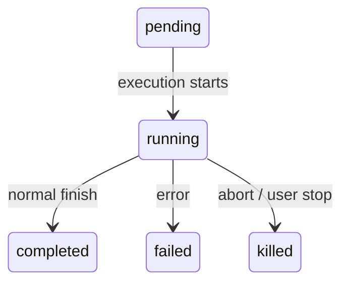
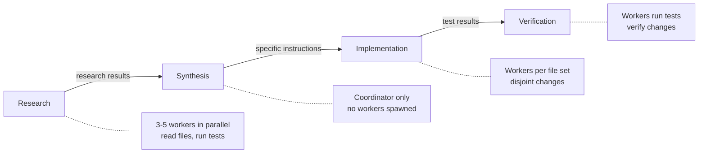
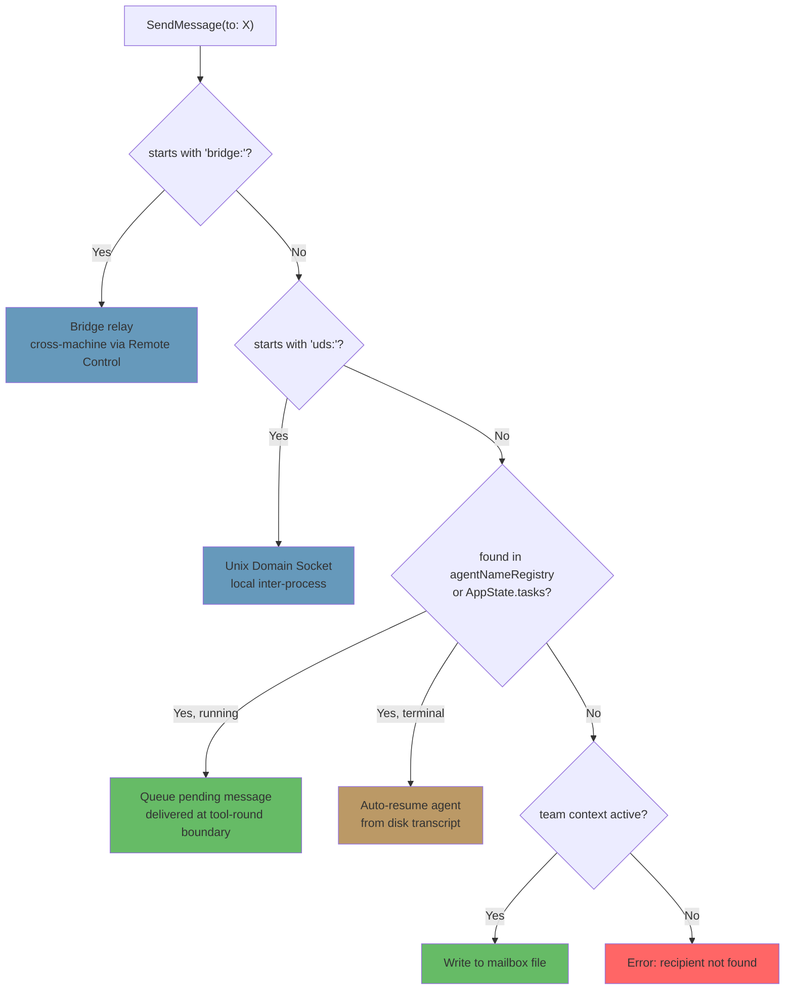

# Chapter 10: Tasks, Coordination, and Swarms

# 第 10 章：任务、协调与蜂群

## The Limits of a Single Thread

## 单线程的极限

Chapter 8 showed how to create a sub-agent -- the fifteen-step lifecycle that builds an isolated execution context from an agent definition. Chapter 9 showed how to make parallel spawns economical through prompt cache exploitation. But creating agents and managing agents are different problems. This chapter addresses the second.

第 8 章展示了如何创建一个子 agent——那套从 agent 定义出发、构建出隔离执行上下文的十五步生命周期。第 9 章展示了如何通过利用 prompt cache 让并行派生变得经济。但创建 agent 与管理 agent 是两个不同的问题。本章处理的是第二个。

A single agent loop -- one model, one conversation, one tool at a time -- can accomplish a remarkable amount of work. It can read files, edit code, run tests, search the web, and reason about complex problems. But it hits a ceiling.

单个 agent 循环——一个模型、一段对话、一次一个工具——能够完成数量惊人的工作。它可以读取文件、编辑代码、运行测试、搜索网络，并对复杂问题进行推理。但它会撞上一个天花板。

The ceiling is not intelligence. It is parallelism and scope. A developer working on a large refactoring needs to update 40 files, run tests after each batch, and verify nothing broke. A codebase migration touches frontend, backend, and database layers simultaneously. A thorough code review reads dozens of files while running the test suite in the background. These are not harder problems -- they are wider ones. They require the ability to do multiple things at once, to delegate work to specialists, and to coordinate the results.

这个天花板不是智能，而是并行度和范围。一个进行大型重构的开发者需要更新 40 个文件，每批改动后运行测试，并验证没有破坏任何东西。一次代码库迁移会同时触及前端、后端和数据库层。一次彻底的代码评审会在后台运行测试套件的同时读取数十个文件。这些并不是更难的问题——它们是更宽的问题。它们要求同时做多件事、把工作委派给专家、并协调各方结果的能力。

Claude Code's answer to this problem is not one mechanism but a layered stack of orchestration patterns, each suited to a different shape of work. Background tasks for fire-and-forget commands. Coordinator mode for manager-worker hierarchies. Swarm teams for peer-to-peer collaboration. And a unified communication protocol that ties them all together.

Claude Code 对这个问题的回答不是单一机制，而是一套分层的编排模式栈，每一层都适配一种不同形态的工作。后台任务用于即发即忘的命令。协调器模式（coordinator mode）用于管理者-工作者的层级结构。蜂群团队（swarm teams）用于点对点协作。还有一套统一的通信协议把它们全部串联起来。

The orchestration layer spans approximately 40 files across `tools/AgentTool/`, `tasks/`, `coordinator/`, `tools/SendMessageTool/`, and `utils/swarm/`. Despite this breadth, the design is anchored by a single state machine that all patterns share. Understanding that state machine -- the `Task` abstraction in `Task.ts` -- is the prerequisite for understanding everything else.

编排层横跨大约 40 个文件，分布在 `tools/AgentTool/`、`tasks/`、`coordinator/`、`tools/SendMessageTool/` 和 `utils/swarm/` 中。尽管覆盖面如此之广，整个设计却由所有模式共享的单一状态机来锚定。理解这个状态机——即 `Task.ts` 中的 `Task` 抽象——是理解其余一切的前提。

This chapter traces the full stack, from the foundational task state machine up through the most sophisticated multi-agent topologies.

本章将贯穿整个栈，从底层的任务状态机一直追溯到最复杂的多 agent 拓扑结构。

---

## The Task State Machine

## 任务状态机

Every background operation in Claude Code -- a shell command, a sub-agent, a remote session, a workflow script -- is tracked as a *task*. The task abstraction lives in `Task.ts` and provides the unified state model that the rest of the orchestration layer builds on.

Claude Code 中的每一个后台操作——一条 shell 命令、一个子 agent、一个远程会话、一个工作流脚本——都被作为一个*任务（task）*来追踪。任务抽象位于 `Task.ts` 中，提供了编排层其余部分赖以构建的统一状态模型。

### Seven Types

### 七种类型

The system defines seven task types, each representing a different execution model:

系统定义了七种任务类型，每一种代表一种不同的执行模型：

The seven task types are: `local_bash` (background shell commands), `local_agent` (background sub-agents), `remote_agent` (remote sessions), `in_process_teammate` (swarm teammates), `local_workflow` (workflow script executions), `monitor_mcp` (MCP server monitors), and `dream` (speculative background thinking).

这七种任务类型分别是：`local_bash`（后台 shell 命令）、`local_agent`（后台子 agent）、`remote_agent`（远程会话）、`in_process_teammate`（蜂群队友）、`local_workflow`（工作流脚本执行）、`monitor_mcp`（MCP 服务器监控）和 `dream`（推测式后台思考）。

`local_bash` and `local_agent` are the workhorses -- background shell commands and background sub-agents, respectively. `in_process_teammate` is the swarm primitive. `remote_agent` bridges to remote Claude Code Runtime environments. `local_workflow` runs multi-step scripts. `monitor_mcp` watches MCP server health. `dream` is the most unusual -- a background task that lets the agent think speculatively while waiting for user input.

`local_bash` 和 `local_agent` 是主力——分别对应后台 shell 命令和后台子 agent。`in_process_teammate` 是蜂群的基本单元。`remote_agent` 桥接到远程的 Claude Code Runtime 环境。`local_workflow` 运行多步骤脚本。`monitor_mcp` 监视 MCP 服务器的健康状况。`dream` 最为特别——它是一个后台任务，让 agent 在等待用户输入时进行推测式思考。

Each type gets a single-character ID prefix for instant visual identification:

每种类型都拥有一个单字符的 ID 前缀，便于瞬间通过视觉识别：

| Type | Prefix | Example ID |
|------|--------|------------|
| `local_bash` | `b` | `b4k2m8x1` |
| `local_agent` | `a` | `a7j3n9p2` |
| `remote_agent` | `r` | `r1h5q6w4` |
| `in_process_teammate` | `t` | `t3f8s2v5` |
| `local_workflow` | `w` | `w6c9d4y7` |
| `monitor_mcp` | `m` | `m2g7k1z8` |
| `dream` | `d` | `d5b4n3r6` |

| 类型 | 前缀 | 示例 ID |
|------|--------|------------|
| `local_bash` | `b` | `b4k2m8x1` |
| `local_agent` | `a` | `a7j3n9p2` |
| `remote_agent` | `r` | `r1h5q6w4` |
| `in_process_teammate` | `t` | `t3f8s2v5` |
| `local_workflow` | `w` | `w6c9d4y7` |
| `monitor_mcp` | `m` | `m2g7k1z8` |
| `dream` | `d` | `d5b4n3r6` |

Task IDs use a single-character prefix (a for agents, b for bash, t for teammates, etc.) followed by 8 random alphanumeric characters drawn from a case-insensitive-safe alphabet (digits plus lowercase letters). This yields approximately 2.8 trillion combinations -- enough to resist brute-force symlink attacks against the task output files on disk.

任务 ID 使用一个单字符前缀（a 表示 agent，b 表示 bash，t 表示队友，等等），后跟 8 个随机字母数字字符，这些字符取自一个对大小写不敏感安全的字母表（数字加小写字母）。这产生大约 2.8 万亿种组合——足以抵御针对磁盘上任务输出文件的暴力 symlink 攻击。

When you see `a7j3n9p2` in a log line, you know immediately it is a background agent. When you see `b4k2m8x1`, a shell command. The prefix is a micro-optimization for human readers, but in a system that can have dozens of concurrent tasks, it matters.

当你在日志行里看到 `a7j3n9p2` 时，你立刻就知道它是一个后台 agent。看到 `b4k2m8x1`，就是一条 shell 命令。这个前缀是面向人类读者的微优化，但在一个可能有数十个并发任务的系统里，它确实有意义。

### Five Statuses

### 五种状态

The lifecycle is a simple directed graph with no cycles:

生命周期是一个无环的简单有向图：



`pending` is the brief state between registration and first execution. `running` means the task is actively doing work. The three terminal states are `completed` (success), `failed` (error), and `killed` (explicitly stopped by the user, the coordinator, or an abort signal). A helper function guards against interacting with dead tasks:

`pending` 是注册与首次执行之间的短暂状态。`running` 表示任务正在主动工作。三种终态分别是 `completed`（成功）、`failed`（出错）和 `killed`（被用户、协调器或中止信号显式停止）。一个辅助函数用来防止与已死任务交互：

```typescript
export function isTerminalTaskStatus(status: TaskStatus): boolean {
  return status === 'completed' || status === 'failed' || status === 'killed'
}
```

This function appears everywhere -- in message injection guards, eviction logic, orphan cleanup, and the SendMessage routing that decides whether to queue a message or resume a dead agent.

这个函数无处不在——出现在消息注入的守卫、驱逐逻辑、孤儿清理，以及决定是把消息排队还是恢复一个已死 agent 的 SendMessage 路由中。

### The Base State

### 基础状态

Every task state extends `TaskStateBase`, which carries the fields that all seven types share:

每个任务状态都继承自 `TaskStateBase`，它承载着所有七种类型共享的字段：

```typescript
export type TaskStateBase = {
  id: string              // Prefixed random ID
  type: TaskType          // Discriminator
  status: TaskStatus      // Current lifecycle position
  description: string     // Human-readable summary
  toolUseId?: string      // The tool_use block that spawned this task
  startTime: number       // Creation timestamp
  endTime?: number        // Terminal-state timestamp
  totalPausedMs?: number  // Accumulated pause time
  outputFile: string      // Disk path for streaming output
  outputOffset: number    // Read cursor for incremental output
  notified: boolean       // Whether completion was reported to parent
}
```

Two fields deserve attention. `outputFile` is the bridge between async execution and the parent's conversation -- every task writes its output to a file on disk, and the parent can read it incrementally via `outputOffset`. `notified` prevents duplicate completion messages; once the parent has been told a task finished, the flag flips to `true` and the notification is never sent again. Without this guard, a task that completes between two consecutive polls of the notification queue would generate duplicate notifications, confusing the model into thinking two tasks finished when only one did.

有两个字段值得关注。`outputFile` 是异步执行与父级对话之间的桥梁——每个任务都把它的输出写入磁盘上的一个文件，父级可以通过 `outputOffset` 增量地读取它。`notified` 用于防止重复的完成消息；一旦父级被告知某个任务已结束，该标志就翻转为 `true`，通知便不会再次发送。如果没有这个守卫，一个在通知队列两次连续轮询之间完成的任务就会产生重复通知，从而误导模型以为有两个任务完成了，而实际上只完成了一个。

### The Agent Task State

### Agent 任务状态

`LocalAgentTaskState` is the most complex variant, carrying everything needed to manage a background sub-agent's full lifecycle:

`LocalAgentTaskState` 是最复杂的变体，承载着管理一个后台子 agent 完整生命周期所需的一切：

```typescript
export type LocalAgentTaskState = TaskStateBase & {
  type: 'local_agent'
  agentId: string
  prompt: string
  selectedAgent?: AgentDefinition
  agentType: string
  model?: string
  abortController?: AbortController
  pendingMessages: string[]       // Queued via SendMessage
  isBackgrounded: boolean         // Was this originally a foreground agent?
  retain: boolean                 // UI is holding this task
  diskLoaded: boolean             // Sidechain transcript loaded
  evictAfter?: number             // GC deadline
  progress?: AgentProgress
  lastReportedToolCount: number
  lastReportedTokenCount: number
  // ... additional lifecycle fields
}
```

Three fields reveal important design decisions. `pendingMessages` is the inbox -- when `SendMessage` targets a running agent, the message is queued here rather than injected immediately. Messages are drained at tool-round boundaries, which preserves the agent's turn structure. `isBackgrounded` distinguishes agents that were born async from those that started as foreground sync agents and were later backgrounded by the user pressing a key. `evictAfter` is a garbage collection mechanism: non-retained completed tasks get a grace period before their state is purged from memory.

有三个字段揭示了重要的设计决策。`pendingMessages` 是收件箱——当 `SendMessage` 指向一个正在运行的 agent 时，消息会被排队到这里，而不是立即注入。消息在工具回合（tool-round）的边界处被排空，这保留了 agent 的回合结构。`isBackgrounded` 用来区分那些一出生就是异步的 agent，与那些起初是前台同步 agent、后来因用户按下某个键而被转入后台的 agent。`evictAfter` 是一种垃圾回收机制：未被保留（retain）的已完成任务会获得一段宽限期，之后其状态才会从内存中清除。

All task states are stored in `AppState.tasks` as a `Record<string, TaskState>`, keyed by the prefixed ID. This is a flat map, not a tree -- the system does not model parent-child relationships in the state store. The parent-child relationship is implicit in the conversation flow: the parent holds the `toolUseId` that spawned the child.

所有任务状态都以 `Record<string, TaskState>` 的形式存储在 `AppState.tasks` 中，以带前缀的 ID 作为键。这是一个扁平映射，而不是树——系统并不在状态存储中建模父子关系。父子关系隐含在对话流之中：父级持有派生出子级的那个 `toolUseId`。

### The Task Registry

### 任务注册表

Each task type is backed by a `Task` object with a minimal interface:

每种任务类型背后都有一个 `Task` 对象，它带有一个极简的接口：

```typescript
export type Task = {
  name: string
  type: TaskType
  kill(taskId: string, setAppState: SetAppState): Promise<void>
}
```

The registry collects all task implementations:

注册表收集了所有任务实现：

```typescript
export function getAllTasks(): Task[] {
  return [
    LocalShellTask,
    LocalAgentTask,
    RemoteAgentTask,
    DreamTask,
    ...(LocalWorkflowTask ? [LocalWorkflowTask] : []),
    ...(MonitorMcpTask ? [MonitorMcpTask] : []),
  ]
}
```

Notice the conditional inclusion -- `LocalWorkflowTask` and `MonitorMcpTask` are feature-gated and may not exist at runtime. The `Task` interface is deliberately minimal. Earlier iterations included `spawn()` and `render()` methods, but these were removed when it became clear that spawning and rendering were never called polymorphically. Each task type has its own spawn logic, its own state management, and its own rendering. The only operation that genuinely needs to dispatch by type is `kill()`, and so that is all the interface requires.

注意这里的条件式包含——`LocalWorkflowTask` 和 `MonitorMcpTask` 受功能开关（feature gate）控制，可能在运行时并不存在。`Task` 接口是有意做成极简的。早期的迭代版本曾包含 `spawn()` 和 `render()` 方法，但当大家明确意识到派生和渲染从来不会以多态方式被调用之后，这两个方法就被移除了。每种任务类型都有自己的派生逻辑、自己的状态管理和自己的渲染。唯一真正需要按类型分派的操作是 `kill()`，因此接口也就只要求这一个方法。

This is an example of interface evolution through subtraction. The initial design imagined that all task types would share a common lifecycle interface. In practice, the types diverged enough that the shared interface became a fiction -- `spawn()` for a shell command and `spawn()` for an in-process teammate have almost nothing in common. Rather than maintain a leaky abstraction, the team removed everything except the one method that actually benefits from polymorphism.

这是通过做减法来演进接口的一个范例。最初的设计设想所有任务类型会共享一个公共的生命周期接口。但实践中，这些类型分化得足够厉害，以至于共享接口变成了一种虚构——shell 命令的 `spawn()` 与进程内队友的 `spawn()` 几乎毫无共同之处。与其维护一个有漏洞的抽象，团队选择移除一切，只保留那个真正能从多态中获益的方法。

---

## Communication Patterns

## 通信模式

A task that runs in the background is only useful if the parent can observe its progress and receive its results. Claude Code supports three communication channels, each optimized for a different access pattern.

一个在后台运行的任务，只有当父级能够观察其进度并接收其结果时才有用。Claude Code 支持三种通信通道，每一种都针对一种不同的访问模式做了优化。

### Foreground: The Generator Chain

### 前台：生成器链

When an agent runs synchronously, the parent iterates its `runAgent()` async generator directly, yielding each message back up the call stack. The interesting mechanism here is the background escape hatch -- the sync loop races between "next message from agent" and "background signal":

当一个 agent 同步运行时，父级直接迭代它的 `runAgent()` async 生成器，把每条消息沿调用栈向上 yield。这里有趣的机制是后台逃生舱口——同步循环在「来自 agent 的下一条消息」与「后台信号」之间进行竞速：

```typescript
const agentIterator = runAgent({ ...params })[Symbol.asyncIterator]()

while (true) {
  const nextMessagePromise = agentIterator.next()
  const raceResult = backgroundPromise
    ? await Promise.race([nextMessagePromise.then(...), backgroundPromise])
    : { type: 'message', result: await nextMessagePromise }

  if (raceResult.type === 'background') {
    // User triggered backgrounding -- transition to async
    await agentIterator.return(undefined)
    void runAgent({ ...params, isAsync: true })
    return { data: { status: 'async_launched' } }
  }

  agentMessages.push(message)
}
```

If the user decides mid-execution that a sync agent should become a background task, the foreground iterator is cleanly returned (triggering its `finally` block for resource cleanup), and the agent is re-spawned as an async task with the same ID. The transition is seamless -- no work is lost, and the agent continues from where it left off with an async abort controller that is unlinked from the parent's ESC key.

如果用户在执行过程中决定让一个同步 agent 转为后台任务，前台迭代器会被干净地 return 掉（触发它的 `finally` 块以进行资源清理），随后 agent 会以相同的 ID 作为异步任务被重新派生。这个转换是无缝的——没有任何工作丢失，agent 会从它离开的地方继续，并使用一个与父级 ESC 键解绑的异步中止控制器。

This is a genuinely difficult state transition to get right. The foreground agent shares the parent's abort controller (ESC kills both). The background agent needs its own controller (ESC should not kill it). The agent's messages need to transfer from the foreground generator stream to the background notification system. The task state needs to flip `isBackgrounded` so the UI knows to show it in the background panel. And all of this must happen atomically -- no messages lost in the transition, no zombie iterators left running. The `Promise.race` between the next message and the background signal is the mechanism that makes this possible.

要把这个状态转换做对，确实相当困难。前台 agent 与父级共享中止控制器（ESC 会杀掉两者）。后台 agent 需要自己的控制器（ESC 不应杀掉它）。agent 的消息需要从前台生成器流转移到后台通知系统。任务状态需要翻转 `isBackgrounded`，这样 UI 才知道把它显示在后台面板里。而所有这一切都必须原子地发生——转换过程中没有消息丢失，没有僵尸迭代器残留运行。在「下一条消息」与「后台信号」之间的 `Promise.race` 正是让这一切成为可能的机制。

### Background: Three Channels

### 后台：三种通道

Background agents communicate through disk, notifications, and queued messages.

后台 agent 通过磁盘、通知和排队消息进行通信。

**Disk output files.** Every task writes to an `outputFile` path -- a symlink to the agent's transcript in JSONL format. The parent (or any observer) can read this file incrementally using `outputOffset`, which tracks how far into the file has been consumed. The `TaskOutputTool` exposes this to the model:

**磁盘输出文件。** 每个任务都写入一个 `outputFile` 路径——这是一个指向 agent 转录文本（JSONL 格式）的 symlink。父级（或任何观察者）可以使用 `outputOffset` 增量地读取该文件，`outputOffset` 追踪了文件已被消费到何处。`TaskOutputTool` 将这一能力暴露给模型：

```typescript
inputSchema = z.strictObject({
  task_id: z.string(),
  block: z.boolean().default(true),
  timeout: z.number().default(30000),
})
```

When `block: true`, the tool polls until the task reaches a terminal state or the timeout expires. This is the primary mechanism for a coordinator that spawns a worker and waits for its result.

当 `block: true` 时，该工具会持续轮询，直到任务到达终态或超时到期。这是一个协调器在派生 worker 并等待其结果时所使用的主要机制。

**Task notifications.** When a background agent completes, the system generates an XML notification and enqueues it for delivery into the parent's conversation:

**任务通知。** 当一个后台 agent 完成时，系统会生成一条 XML 通知，并将其排队以投递到父级的对话中：

```xml
<task-notification>
  <task-id>a7j3n9p2</task-id>
  <tool-use-id>toolu_abc123</tool-use-id>
  <output-file>/path/to/output</output-file>
  <status>completed</status>
  <summary>Agent "Investigate auth bug" completed</summary>
  <result>Found null pointer in src/auth/validate.ts:42...</result>
  <usage>
    <total_tokens>15000</total_tokens>
    <tool_uses>8</tool_uses>
    <duration_ms>12000</duration_ms>
  </usage>
</task-notification>
```

The notification is injected as a user-role message in the parent's conversation, which means the model sees it in its normal message flow. It does not need a special tool to check for completions -- they arrive as context. The `notified` flag on the task state prevents duplicate delivery.

这条通知会作为一条 user 角色的消息注入到父级的对话中，这意味着模型会在其正常的消息流中看到它。模型不需要一个专门的工具去检查是否有任务完成——这些完成事件会作为上下文自行到达。任务状态上的 `notified` 标志可防止重复投递。

**Command queue.** The `pendingMessages` array on `LocalAgentTaskState` is the third channel. When `SendMessage` targets a running agent, the message is queued:

**命令队列。** `LocalAgentTaskState` 上的 `pendingMessages` 数组是第三种通道。当 `SendMessage` 指向一个正在运行的 agent 时，消息会被排队：

```typescript
if (isLocalAgentTask(task) && task.status === 'running') {
  queuePendingMessage(agentId, input.message, setAppState)
  return { data: { success: true, message: 'Message queued...' } }
}
```

These messages are drained at tool-round boundaries by `drainPendingMessages()` and injected as user messages into the agent's conversation. This is a crucial design choice -- messages arrive between tool rounds, not mid-execution. The agent finishes its current thought, then receives the new information. No race conditions, no corrupted state.

这些消息由 `drainPendingMessages()` 在工具回合的边界处排空，并作为 user 消息注入到 agent 的对话中。这是一个关键的设计抉择——消息在工具回合之间到达，而不是在执行中途。agent 先完成它当前的思路，然后才接收新信息。没有竞态条件，没有损坏的状态。

### Progress Tracking

### 进度追踪

The `ProgressTracker` provides real-time visibility into agent activity:

`ProgressTracker` 提供对 agent 活动的实时可见性：

```typescript
export type ProgressTracker = {
  toolUseCount: number
  latestInputTokens: number        // Cumulative (latest value, not sum)
  cumulativeOutputTokens: number   // Summed across turns
  recentActivities: ToolActivity[] // Last 5 tool uses
}
```

The distinction between input and output token tracking is deliberate and reflects a subtlety of the API's billing model. Input tokens are cumulative per API call because the full conversation is re-sent each time -- the 15th turn includes all 14 previous turns, so the input token count reported by the API already reflects the total. Keeping the latest value is the correct aggregation. Output tokens are per-turn -- the model generates new tokens each time -- so summing is the correct aggregation. Getting this wrong would either dramatically overcount (summing cumulative input tokens) or dramatically undercount (keeping only the latest output tokens).

对 input 和 output token 进行区别追踪是有意为之，它反映了 API 计费模型的一个微妙之处。Input token 在每次 API 调用中是累积的，因为每次都会重新发送完整对话——第 15 个回合包含了前面全部 14 个回合，因此 API 报告的 input token 计数已经反映了总量。保留最新值才是正确的聚合方式。Output token 则是按回合计的——模型每次都生成新的 token——所以求和才是正确的聚合方式。弄错这一点要么会严重高估（对累积的 input token 求和），要么会严重低估（只保留最新的 output token）。

The `recentActivities` array (capped at 5 entries) provides a human-readable stream of what the agent is doing: "Read src/auth/validate.ts", "Bash: npm test", "Edit src/auth/validate.ts". This appears in the VS Code subagent panel and the terminal's background task indicator, giving users visibility into agent work without requiring them to read full transcripts.

`recentActivities` 数组（上限 5 条）提供了一个人类可读的流，展示 agent 正在做什么："Read src/auth/validate.ts"、"Bash: npm test"、"Edit src/auth/validate.ts"。它出现在 VS Code 的 subagent 面板和终端的后台任务指示器中，让用户无需阅读完整转录文本就能了解 agent 的工作。

For background agents, progress is written to `AppState` via `updateAsyncAgentProgress()` and emitted as SDK events via `emitTaskProgress()`. The VS Code subagent panel consumes these events to render live progress bars, tool counts, and activity streams. The progress tracking is not just cosmetic -- it is the primary feedback mechanism that tells users whether a background agent is making progress or stuck in a loop.

对于后台 agent，进度会通过 `updateAsyncAgentProgress()` 写入 `AppState`，并通过 `emitTaskProgress()` 作为 SDK 事件发出。VS Code 的 subagent 面板消费这些事件，以渲染实时的进度条、工具计数和活动流。进度追踪不仅仅是装饰——它是首要的反馈机制，告诉用户一个后台 agent 是在取得进展，还是卡在了某个循环里。

---

## Coordinator Mode

## 协调器模式

Coordinator mode transforms Claude Code from a single agent with background helpers into a true manager-worker architecture. It is the most opinionated orchestration pattern in the system, and its design reveals deep thinking about how LLMs should and should not delegate work.

协调器模式把 Claude Code 从「一个带有后台助手的单 agent」转变为一种真正的管理者-工作者架构。它是系统中最具主见的编排模式，其设计揭示了关于 LLM 应该如何、以及不应该如何委派工作的深入思考。

### The Problem Coordinator Mode Solves

### 协调器模式所解决的问题

The standard agent loop has a single conversation and a single context window. When it spawns a background agent, the background agent runs independently and reports results via task notifications. This works well for simple delegation -- "run the tests while I keep editing" -- but breaks down for complex multi-step workflows.

标准的 agent 循环只有一段对话和一个上下文窗口。当它派生一个后台 agent 时，该后台 agent 独立运行，并通过任务通知报告结果。这对简单的委派效果很好——「我继续编辑的时候你去跑测试」——但在复杂的多步骤工作流面前就行不通了。

Consider a codebase migration. The agent needs to: (1) understand the current patterns across 200 files, (2) design the migration strategy, (3) apply changes to each file, and (4) verify nothing broke. Steps 1 and 3 benefit from parallelism. Step 2 requires synthesizing the results of step 1. Step 4 depends on step 3. A single agent doing this sequentially would spend most of its token budget re-reading files. Multiple background agents doing this without coordination would produce inconsistent changes.

考虑一次代码库迁移。agent 需要：(1) 理解横跨 200 个文件的当前模式，(2) 设计迁移策略，(3) 对每个文件应用改动，(4) 验证没有破坏任何东西。步骤 1 和 3 能从并行中获益。步骤 2 需要综合步骤 1 的结果。步骤 4 依赖于步骤 3。一个单 agent 顺序地做这件事，会把它大部分的 token 预算花在反复重读文件上。而多个后台 agent 在没有协调的情况下做这件事，则会产生不一致的改动。

Coordinator mode solves this by splitting the "thinking" agent from the "doing" agents. The coordinator handles steps 1 and 2 (dispatching research workers, then synthesizing). Workers handle steps 3 and 4 (applying changes, running tests). The coordinator sees the full picture; workers see their specific task.

协调器模式通过把「思考」的 agent 与「执行」的 agent 拆开来解决这个问题。协调器负责步骤 1 和 2（派发研究型 worker，然后进行综合）。worker 负责步骤 3 和 4（应用改动、运行测试）。协调器看到的是全局图景；worker 看到的是各自的具体任务。

### Activation

### 激活

A single environment variable flips the switch:

一个环境变量就能拨动这个开关：

```typescript
export function isCoordinatorMode(): boolean {
  if (feature('COORDINATOR_MODE')) {
    return isEnvTruthy(process.env.CLAUDE_CODE_COORDINATOR_MODE)
  }
  return false
}
```

On session resume, `matchSessionMode()` checks whether the resumed session's stored mode matches the current environment. If they diverge, the environment variable is flipped to match. This prevents the confusing scenario where a coordinator session resumes as a regular agent (losing awareness of its workers) or a regular session resumes as a coordinator (losing access to its tools). The session's mode is the source of truth; the environment variable is the runtime signal.

在会话恢复时，`matchSessionMode()` 会检查被恢复会话所存储的模式是否与当前环境匹配。如果两者不一致，环境变量会被翻转以保持一致。这避免了一种令人困惑的情形：协调器会话恢复成了普通 agent（失去了对其 worker 的感知），或者普通会话恢复成了协调器（失去了对其工具的访问）。会话的模式才是事实的来源；环境变量只是运行时信号。

### Tool Restrictions

### 工具限制

The coordinator's power comes not from having more tools, but from having fewer. In coordinator mode, the coordinator agent gets exactly three tools:

协调器的力量并非来自拥有更多工具，而是来自拥有更少工具。在协调器模式下，协调器 agent 恰好获得三个工具：

- **Agent** -- spawn workers
- **SendMessage** -- communicate with existing workers
- **TaskStop** -- terminate running workers

- **Agent** —— 派生 worker
- **SendMessage** —— 与已有的 worker 通信
- **TaskStop** —— 终止正在运行的 worker

That is it. No file reading. No code editing. No shell commands. The coordinator cannot directly touch the codebase. This restriction is not a limitation -- it is the core design principle. The coordinator's job is to think, plan, decompose, and synthesize. Workers do the work.

就这些。没有文件读取。没有代码编辑。没有 shell 命令。协调器不能直接触碰代码库。这一限制不是约束——它是核心设计原则。协调器的工作是思考、规划、拆解和综合。worker 才负责干活。

Workers, conversely, get the full tool set minus internal coordination tools:

而 worker 则相反，它们获得完整的工具集，减去内部协调工具：

```typescript
const INTERNAL_WORKER_TOOLS = new Set([
  TEAM_CREATE_TOOL_NAME,
  TEAM_DELETE_TOOL_NAME,
  SEND_MESSAGE_TOOL_NAME,
  SYNTHETIC_OUTPUT_TOOL_NAME,
])
```

Workers cannot spawn their own sub-teams or send messages to peers. They report results through the normal task completion mechanism, and the coordinator synthesizes across them.

worker 不能派生自己的子团队，也不能向同伴发送消息。它们通过正常的任务完成机制报告结果，再由协调器在各 worker 之间进行综合。

### The 370-Line System Prompt

### 那段 370 行的系统提示

The coordinator system prompt is, line for line, the most instructive document in the codebase about how to use LLMs for orchestration. It runs approximately 370 lines and encodes hard-won lessons about delegation patterns. The key teachings:

协调器的系统提示，逐行来看，是整个代码库中关于「如何使用 LLM 进行编排」最具教学价值的文档。它大约有 370 行，编码了关于委派模式的来之不易的经验。其关键教诲如下：

**"Never delegate understanding."** This is the central thesis. The coordinator must synthesize research findings into specific prompts with file paths, line numbers, and exact changes. The prompt explicitly calls out anti-patterns like "based on your findings, fix the bug" -- a prompt that delegates *comprehension* to the worker, forcing it to re-derive context the coordinator already has. The correct pattern is: "In `src/auth/validate.ts` at line 42, the `userId` parameter can be null when called from the OAuth flow. Add a null check that returns a 401 response."

**「永远不要委派理解。」** 这是核心论点。协调器必须把研究发现综合成带有文件路径、行号和确切改动的具体提示。该系统提示明确点名了诸如「根据你的发现，修复这个 bug」之类的反模式——这种提示把*理解*委派给了 worker，迫使它去重新推导协调器早已掌握的上下文。正确的模式是：「在 `src/auth/validate.ts` 的第 42 行，从 OAuth 流程调用时 `userId` 参数可能为 null。添加一个返回 401 响应的 null 检查。」

**"Parallelism is your superpower."** The prompt establishes a clear concurrency model. Read-only tasks run freely in parallel -- research, exploration, file reading. Write-heavy tasks serialize per file set. The coordinator is expected to reason about which tasks can overlap and which must sequence. A good coordinator spawns five research workers simultaneously, waits for all of them, synthesizes, then spawns three implementation workers that touch disjoint file sets. A bad coordinator spawns one worker, waits, spawns the next, waits again -- serializing work that could have been parallel.

**「并行是你的超能力。」** 该提示确立了一个清晰的并发模型。只读任务可以自由地并行运行——研究、探索、文件读取。写密集型任务则按文件集串行化。协调器被期望去推理哪些任务可以重叠、哪些必须排序。一个好的协调器会同时派生五个研究型 worker，等待它们全部完成，进行综合，然后派生三个触及互不相交文件集的实现型 worker。一个糟糕的协调器则会派生一个 worker、等待、派生下一个、再等待——把本可以并行的工作串行化了。

**Task workflow phases.** The prompt defines four phases:

**任务工作流阶段。** 该提示定义了四个阶段：



1. **Research** -- workers explore the codebase in parallel, reading files, running tests, gathering information
2. **Synthesis** -- the coordinator (not a worker) reads all research results and builds a unified understanding
3. **Implementation** -- workers receive precise instructions derived from the synthesis
4. **Verification** -- workers run tests and verify the changes

1. **研究（Research）** —— worker 并行探索代码库，读取文件、运行测试、收集信息
2. **综合（Synthesis）** —— 由协调器（而非 worker）读取所有研究结果并构建出一个统一的理解
3. **实现（Implementation）** —— worker 接收从综合中推导出的精确指令
4. **验证（Verification）** —— worker 运行测试并验证改动

The coordinator should not skip phases. The most common failure mode is jumping from research directly to implementation without synthesis. When this happens, the coordinator delegates understanding to the implementation workers -- each one must re-derive context from scratch, leading to inconsistent changes and wasted tokens.

协调器不应跳过阶段。最常见的失败模式是从研究直接跳到实现，跳过了综合。当这种情况发生时，协调器就把理解委派给了实现型 worker——每个 worker 都必须从零开始重新推导上下文，导致改动不一致、token 被浪费。

**The continue-vs-spawn decision.** When a worker finishes and the coordinator has follow-up work, should it send a message to the existing worker (via SendMessage) or spawn a fresh one (via Agent)? The decision is a function of context overlap:

**「继续 vs 新派生」的抉择。** 当一个 worker 完成、而协调器还有后续工作时，它应该向现有 worker 发送消息（通过 SendMessage），还是派生一个全新的 worker（通过 Agent）？这个决策是上下文重叠程度的函数：

- **High overlap, same files**: Continue. The worker already has the file contents in its context, understands the patterns, and can build on its previous work. Spawning fresh would force re-reading the same files and re-deriving the same understanding.
- **Low overlap, different domain**: Spawn fresh. A worker that just investigated the authentication system carries 20,000 tokens of auth-specific context that is dead weight for a CSS refactoring task. Starting clean is cheaper.
- **High overlap but the worker failed**: Spawn fresh with explicit guidance about what went wrong. Continuing a failed worker often means fighting against confused context. A fresh start with "the previous attempt failed because X, avoid Y" is more reliable.
- **Follow-up requires the worker's output**: Continue, with the output included in the SendMessage. The worker does not need to re-derive its own results.

- **高度重叠、同一批文件**：继续。该 worker 的上下文里已经有这些文件的内容，理解了其中的模式，并能在它先前的工作上继续构建。重新派生会迫使其重读同样的文件、重新推导同样的理解。
- **低度重叠、不同领域**：新派生。一个刚刚调查过认证系统的 worker 携带着 20,000 token 的认证相关上下文，而这些对于一个 CSS 重构任务来说是死重量。从干净状态开始更便宜。
- **高度重叠但该 worker 失败了**：新派生，并附上关于哪里出了问题的明确指引。继续一个失败的 worker 往往意味着要与混乱的上下文搏斗。带着「上一次尝试因为 X 而失败，避免 Y」从头开始更可靠。
- **后续工作需要该 worker 的输出**：继续，并把其输出包含在 SendMessage 中。这样 worker 就不必重新推导它自己的结果。

**Worker prompt writing and anti-patterns.** The prompt teaches the coordinator how to write effective worker prompts and explicitly flags bad patterns:

**worker 提示的撰写与反模式。** 该系统提示教导协调器如何撰写有效的 worker 提示，并明确标记出糟糕的模式：

Anti-pattern: *"Based on your research findings, implement the fix."* This delegates comprehension. The worker was not the one who did the research -- the coordinator read the research results.

反模式：*「根据你的研究发现，实现这个修复。」* 这是在委派理解。做研究的并不是这个 worker——读取研究结果的是协调器。

Anti-pattern: *"Fix the bug in the auth module."* No file paths, no line numbers, no description of the bug. The worker must search the entire codebase from scratch.

反模式：*「修复 auth 模块里的 bug。」* 没有文件路径，没有行号，没有对 bug 的描述。worker 只能从零开始搜索整个代码库。

Anti-pattern: *"Make the same change to all the other files."* Which files? What change? The coordinator knows; it should enumerate them.

反模式：*「对所有其他文件做同样的改动。」* 哪些文件？什么改动？协调器是知道的；它应该把它们逐一列举出来。

Good pattern: *"In `src/auth/validate.ts` at line 42, the `userId` parameter can be null when called from `src/oauth/callback.ts:89`. Add a null check: if `userId` is null, return `{ error: 'unauthorized', status: 401 }`. Then update the test in `src/auth/__tests__/validate.test.ts` to cover the null case."*

好的模式：*「在 `src/auth/validate.ts` 的第 42 行，从 `src/oauth/callback.ts:89` 调用时 `userId` 参数可能为 null。添加一个 null 检查：如果 `userId` 为 null，返回 `{ error: 'unauthorized', status: 401 }`。然后更新 `src/auth/__tests__/validate.test.ts` 中的测试，以覆盖 null 这一情形。」*

The cost of writing a specific prompt is borne once, by the coordinator. The benefit -- a worker that executes correctly on the first try -- is enormous. Vague prompts create a false economy: the coordinator saves 30 seconds of prompt writing and the worker wastes 5 minutes of exploration.

撰写具体提示的成本由协调器承担一次。而收益——一个第一次尝试就正确执行的 worker——则是巨大的。含糊的提示制造的是一种虚假的经济：协调器省下了 30 秒的提示撰写时间，worker 却浪费了 5 分钟的探索时间。

### Worker Context

### Worker 上下文

The coordinator injects information about available tools into its own context, so the model knows what workers can do:

协调器会把关于可用工具的信息注入到它自己的上下文中，这样模型就知道 worker 能做什么：

```typescript
export function getCoordinatorUserContext(mcpClients, scratchpadDir?) {
  return {
    workerToolsContext: `Workers spawned via Agent have access to: ${workerTools}`
      + (mcpClients.length > 0
        ? `\nWorkers also have MCP tools from: ${serverNames}` : '')
      + (scratchpadDir ? `\nScratchpad: ${scratchpadDir}` : '')
  }
}
```

The scratchpad directory (gated by the `tengu_scratch` feature flag) is a shared filesystem location where workers can read and write without permission prompts. It enables durable cross-worker knowledge sharing -- one worker's research notes become another worker's input, mediated through the filesystem rather than through the coordinator's token window.

scratchpad 目录（由 `tengu_scratch` 功能开关控制）是一个共享的文件系统位置，worker 可以在那里读写而无需权限提示。它使得跨 worker 的持久化知识共享成为可能——一个 worker 的研究笔记成为另一个 worker 的输入，这一过程是通过文件系统而非协调器的 token 窗口来中介的。

This is significant because it solves a fundamental limitation of the coordinator pattern. Without a scratchpad, all information flows through the coordinator: Worker A produces findings, the coordinator reads them via TaskOutput, synthesizes them into Worker B's prompt. The coordinator's context window becomes the bottleneck -- it must hold all intermediate results long enough to synthesize them. With a scratchpad, Worker A writes findings to `/tmp/scratchpad/auth-analysis.md`, and the coordinator tells Worker B: "Read the auth analysis at `/tmp/scratchpad/auth-analysis.md` and apply the pattern to the OAuth module." The coordinator moves information by reference, not by value.

这一点意义重大，因为它解决了协调器模式的一个根本性限制。没有 scratchpad 时，所有信息都流经协调器：Worker A 产出发现，协调器通过 TaskOutput 读取它们，再把它们综合进 Worker B 的提示。协调器的上下文窗口成了瓶颈——它必须把所有中间结果保留足够长的时间以便综合它们。有了 scratchpad，Worker A 把发现写入 `/tmp/scratchpad/auth-analysis.md`，协调器便告诉 Worker B：「读取 `/tmp/scratchpad/auth-analysis.md` 处的 auth 分析，并把该模式应用到 OAuth 模块。」协调器以引用而非值的方式来搬运信息。

### Mutual Exclusion with Fork

### 与 Fork 的互斥

Coordinator mode and fork-based subagents are mutually exclusive:

协调器模式与基于 fork 的 subagent 是互斥的：

```typescript
export function isForkSubagentEnabled(): boolean {
  if (feature('FORK_SUBAGENT')) {
    if (isCoordinatorMode()) return false
    // ...
  }
}
```

The conflict is fundamental. Fork agents inherit the parent's entire conversation context -- they are cheap clones that share prompt cache. Coordinator workers are independent agents with fresh context and specific instructions. These are opposing philosophies of delegation, and the system enforces the choice at the feature flag level.

这种冲突是根本性的。Fork agent 继承父级的整个对话上下文——它们是共享 prompt cache 的廉价克隆。而协调器的 worker 是拥有全新上下文和具体指令的独立 agent。这是两种对立的委派哲学，系统在功能开关这一层级强制做出选择。

---

## The Swarm System

## 集群系统

Coordinator mode is hierarchical: one manager, many workers, top-down control. The swarm system is the peer-to-peer alternative -- multiple Claude Code instances working as a team, with a leader coordinating multiple teammates through message passing.

协调者模式是分层式的：一个管理者、多个工作者、自上而下的控制。集群系统则是对等（peer-to-peer）的替代方案——多个 Claude Code 实例作为一个团队协同工作，由一位领导者通过消息传递来协调多名队友。

### Team Context

### 团队上下文

Teams are identified by a `teamName` and tracked in `AppState.teamContext`:

团队由 `teamName` 标识，并在 `AppState.teamContext` 中追踪：

```typescript
teamContext?: {
  teamName: string
  teammates: {
    [id: string]: { name: string; color?: string; ... }
  }
}
```

Each teammate gets a name (for addressing) and a color (for visual distinction in the UI). The team file is persisted on disk so that team membership survives process restarts.

每名队友都会获得一个名称（用于寻址）和一种颜色（用于在 UI 中进行视觉区分）。团队文件会持久化到磁盘上，因此团队成员关系能够在进程重启后依然存续。

### Agent Name Registry

### 代理名称注册表

Background agents can be given names at spawn time, which makes them addressable by human-readable identifiers instead of random task IDs:

后台代理可以在生成（spawn）时被赋予名称，使其可以通过人类可读的标识符来寻址，而不是用随机的任务 ID：

```typescript
if (name) {
  rootSetAppState(prev => {
    const next = new Map(prev.agentNameRegistry)
    next.set(name, asAgentId(asyncAgentId))
    return { ...prev, agentNameRegistry: next }
  })
}
```

The `agentNameRegistry` is a `Map<string, AgentId>`. When `SendMessage` resolves a `to` field, the registry is checked first:

`agentNameRegistry` 是一个 `Map<string, AgentId>`。当 `SendMessage` 解析 `to` 字段时，会首先查询该注册表：

```typescript
const registered = appState.agentNameRegistry.get(input.to)
const agentId = registered ?? toAgentId(input.to)
```

This means you can send a message to `"researcher"` instead of `a7j3n9p2`. The indirection is simple but it enables the coordinator to think in terms of roles rather than IDs -- a significant improvement for the model's ability to reason about multi-agent workflows.

这意味着你可以向 `"researcher"` 而不是 `a7j3n9p2` 发送消息。这层间接寻址很简单，但它让协调者能够以角色而非 ID 的方式来思考——这对模型推理多代理工作流的能力是一项重大改进。

### In-Process Teammates

### 进程内队友

In-process teammates run in the same Node.js process as the leader, isolated via `AsyncLocalStorage`. Their state extends the base with team-specific fields:

进程内队友与领导者运行在同一个 Node.js 进程中，通过 `AsyncLocalStorage` 进行隔离。它们的状态在基础状态之上扩展了团队专属的字段：

```typescript
export type InProcessTeammateTaskState = TaskStateBase & {
  type: 'in_process_teammate'
  identity: TeammateIdentity
  prompt: string
  messages?: Message[]                  // Capped at 50
  pendingUserMessages: string[]
  isIdle: boolean
  shutdownRequested: boolean
  awaitingPlanApproval: boolean
  permissionMode: PermissionMode
  onIdleCallbacks?: Array<() => void>
  currentWorkAbortController?: AbortController
}
```

The `messages` cap at 50 entries deserves explanation. During development, analysis revealed that each in-process agent accumulates approximately 20MB of RSS at 500+ turns. Whale sessions -- power users running extended workflows -- were observed launching 292 agents in 2 minutes, driving RSS to 36.8GB. The 50-message cap for the UI representation is a memory safety valve. The agent's actual conversation continues with full history; only the UI-facing snapshot is truncated.

`messages` 限制在 50 条值得解释一下。在开发过程中，分析发现每个进程内代理在超过 500 轮时会累积约 20MB 的 RSS。"鲸鱼会话"（whale sessions）——运行长时间工作流的重度用户——曾被观察到在 2 分钟内启动 292 个代理，将 RSS 推高至 36.8GB。面向 UI 表示的 50 条消息上限就是一个内存安全阀。代理实际的对话仍以完整历史继续；只有面向 UI 的快照被截断。

The `isIdle` flag enables a work-stealing pattern. An idle teammate is not consuming tokens or API calls -- it is simply waiting for the next message. The `onIdleCallbacks` array lets the system hook into the transition from active to idle, enabling orchestration patterns like "wait for all teammates to finish, then proceed."

`isIdle` 标志支持一种工作窃取（work-stealing）模式。处于空闲状态的队友既不消耗 token，也不发起 API 调用——它只是在等待下一条消息。`onIdleCallbacks` 数组让系统能够挂钩到从活跃到空闲的状态转换上，从而实现诸如"等待所有队友完成后再继续"这样的编排模式。

The `currentWorkAbortController` is distinct from the teammate's main abort controller. Aborting the current work controller cancels the teammate's ongoing turn but does not kill the teammate. This enables a "redirect" pattern: the leader sends a higher-priority message, the teammate's current work is aborted, and the teammate picks up the new message. The main abort controller, when aborted, kills the teammate entirely. Two levels of interruption for two levels of intent.

`currentWorkAbortController` 不同于队友的主中止控制器（main abort controller）。中止当前工作控制器会取消队友正在进行的回合，但不会终止该队友。这实现了一种"重定向"模式：领导者发送一条更高优先级的消息，队友当前的工作被中止，然后队友接手新消息。而主中止控制器一旦被中止，则会完全终止该队友。两种层级的中断，对应两种层级的意图。

The `shutdownRequested` flag implements cooperative termination. When the leader sends a shutdown request, this flag is set. The teammate can check it at natural stopping points and wind down gracefully -- finishing its current file write, committing its changes, or sending a final status update. This is gentler than a hard kill, which might leave files in an inconsistent state.

`shutdownRequested` 标志实现了协作式终止。当领导者发送关闭请求时，该标志被置位。队友可以在自然的停止点检查它，并优雅地收尾——完成当前的文件写入、提交其更改，或发送一条最终状态更新。这比硬性终止（hard kill）更温和，后者可能会让文件处于不一致的状态。

### The Mailbox

### 邮箱

Teammates communicate via a file-based mailbox system. When `SendMessage` targets a teammate, the message is written to the recipient's mailbox file on disk:

队友之间通过基于文件的邮箱系统进行通信。当 `SendMessage` 以某个队友为目标时，消息会被写入接收者在磁盘上的邮箱文件：

```typescript
await writeToMailbox(recipientName, {
  from: senderName,
  text: content,
  summary,
  timestamp: new Date().toISOString(),
  color: senderColor,
}, teamName)
```

Messages can be plain text, structured protocol messages (shutdown requests, plan approvals), or broadcasts (`to: "*"` sends to all team members excluding the sender). A poller hook processes incoming messages and routes them into the teammate's conversation.

消息可以是纯文本、结构化协议消息（关闭请求、计划批准），或广播（`to: "*"` 会发送给除发送者之外的所有团队成员）。一个轮询器（poller）hook 负责处理传入的消息，并将其路由进队友的对话中。

The file-based approach is deliberately simple. There is no message broker, no event bus, no shared memory channel. Files are durable (surviving process crashes), inspectable (you can `cat` a mailbox), and cheap (no infrastructure dependencies). For a system where message volumes are measured in tens per session, not thousands per second, this is the right trade-off. A Redis-backed message queue would add operational complexity, a dependency, and failure modes -- all for a throughput requirement that a filesystem call handles trivially.

基于文件的方案是刻意设计得简单的。这里没有消息代理（message broker），没有事件总线（event bus），也没有共享内存通道。文件是持久的（能在进程崩溃后存续）、可检视的（你可以 `cat` 一个邮箱），而且廉价（没有基础设施依赖）。对于一个消息量以每会话数十条而非每秒数千条来衡量的系统而言，这是正确的权衡。一个由 Redis 支撑的消息队列会引入运维复杂度、一项依赖以及各种故障模式——而所有这些只是为了应对一个文件系统调用就能轻松满足的吞吐量需求。

The broadcast mechanism deserves a note. When a message is sent to `"*"`, the sender iterates all team members from the team file, skips itself (case-insensitive comparison), and writes to each member's mailbox individually:

广播机制值得一提。当一条消息被发送到 `"*"` 时，发送者会遍历团队文件中的所有团队成员，跳过自身（不区分大小写的比较），然后分别写入每个成员的邮箱：

```typescript
for (const member of teamFile.members) {
  if (member.name.toLowerCase() === senderName.toLowerCase()) continue
  recipients.push(member.name)
}
for (const recipientName of recipients) {
  await writeToMailbox(recipientName, { from: senderName, text: content, ... }, teamName)
}
```

There is no fan-out optimization -- each recipient gets a separate file write. Again, at the scale of agent teams (typically 3-8 members), this is perfectly adequate. If a team had 100 members, this would need rethinking. But the 50-message memory cap that prevents 36GB RSS scenarios also implicitly caps the effective team size.

这里没有扇出（fan-out）优化——每个接收者都对应一次独立的文件写入。同样地，在代理团队的规模（通常为 3 到 8 名成员）下，这完全足够。如果一个团队有 100 名成员，这就需要重新考量了。但是，那个用于防止 36GB RSS 场景的 50 条消息内存上限，也隐式地限制了有效的团队规模。

### Permission Forwarding

### 权限转发

Swarm workers operate with restricted permissions but can escalate to the leader when they need approval for sensitive operations:

集群工作者以受限权限运行，但在需要为敏感操作获得批准时，可以向领导者上报升级：

```typescript
const request = createPermissionRequest({
  toolName, toolUseId, input, description, permissionSuggestions
})
registerPermissionCallback({ requestId, toolUseId, onAllow, onReject })
void sendPermissionRequestViaMailbox(request)
```

The flow is: worker hits a tool that requires permission, the bash classifier attempts auto-approval, and if that fails, the request is forwarded to the leader via the mailbox system. The leader sees the request in their UI and can approve or reject. The callback fires and the worker proceeds. This lets workers operate autonomously for safe operations while maintaining human oversight for dangerous ones.

其流程是：工作者遇到一个需要权限的工具，bash 分类器（bash classifier）尝试自动批准，如果失败，则该请求会通过邮箱系统转发给领导者。领导者在其 UI 中看到该请求，可以批准或拒绝。回调随之触发，工作者继续执行。这让工作者能够自主执行安全操作，同时对危险操作保持人工监督。

---

## Inter-Agent Communication: SendMessage

## 代理间通信：SendMessage

`SendMessageTool` is the universal communication primitive. It handles four distinct routing modes through a single tool interface, selected by the shape of the `to` field.

`SendMessageTool` 是通用的通信原语。它通过单一的工具接口处理四种不同的路由模式，具体由 `to` 字段的形态来选择。

### Input Schema

### 输入 Schema

```typescript
inputSchema = z.object({
  to: z.string(),
  // "teammate-name", "*", "uds:<socket>", "bridge:<session-id>"
  summary: z.string().optional(),
  message: z.union([
    z.string(),
    z.discriminatedUnion('type', [
      z.object({ type: z.literal('shutdown_request'), reason: z.string().optional() }),
      z.object({ type: z.literal('shutdown_response'), request_id, approve, reason }),
      z.object({ type: z.literal('plan_approval_response'), request_id, approve, feedback }),
    ]),
  ]),
})
```

The `message` field is a union of plain text and structured protocol messages. This means SendMessage serves double duty -- it is both the informal chat channel ("here are my findings") and the formal protocol layer ("I approve your plan" / "please shut down").

`message` 字段是纯文本与结构化协议消息的联合类型（union）。这意味着 SendMessage 身兼二职——它既是非正式的聊天通道（"这是我的发现"），也是正式的协议层（"我批准你的计划" / "请关闭"）。

### Routing Dispatch

### 路由分派

The `call()` method follows a priority-ordered dispatch chain:

`call()` 方法遵循一条按优先级排序的分派链：



**1. Bridge messages** (`bridge:<session-id>`). Cross-machine communication via Anthropic's Remote Control servers. This is the widest reach -- two Claude Code instances on different machines, potentially different continents, communicating through a relay. The system requires explicit user consent before sending bridge messages -- a safety check that prevents one agent from unilaterally establishing communication with a remote instance. Without this gate, a compromised or confused agent could exfiltrate information to a remote session. The consent check uses `postInterClaudeMessage()`, which handles serialization and transport over the Remote Control relay.

**1. 桥接消息（Bridge messages）**（`bridge:<session-id>`）。通过 Anthropic 的 Remote Control 服务器进行跨机器通信。这是覆盖范围最广的方式——分处不同机器、甚至可能位于不同大陆的两个 Claude Code 实例，通过一个中继（relay）进行通信。系统在发送桥接消息前要求明确的用户同意——这是一道安全检查，防止某个代理单方面与远程实例建立通信。如果没有这道闸门，一个被攻陷或陷入混乱的代理可能会向远程会话外泄信息。该同意检查使用 `postInterClaudeMessage()`，它负责处理在 Remote Control 中继上的序列化与传输。

**2. UDS messages** (`uds:<socket-path>`). Local inter-process communication via Unix Domain Sockets. This is for Claude Code instances running on the same machine but in different processes -- for example, a VS Code extension hosting one instance and a terminal hosting another. UDS communication is fast (no network round-trip), secure (filesystem permissions control access), and reliable (the kernel handles delivery). The `sendToUdsSocket()` function serializes the message and writes it to the socket path specified in the `to` field. Peers discover each other via a `ListPeers` tool that scans for active UDS endpoints.

**2. UDS 消息**（`uds:<socket-path>`）。通过 Unix Domain Socket 进行本地进程间通信。这适用于运行在同一台机器但不同进程中的 Claude Code 实例——例如，一个 VS Code 扩展承载一个实例，而一个终端承载另一个实例。UDS 通信快速（无网络往返）、安全（由文件系统权限控制访问），且可靠（由内核负责投递）。`sendToUdsSocket()` 函数将消息序列化，并将其写入 `to` 字段中指定的套接字路径。对等方之间通过一个扫描活跃 UDS 端点的 `ListPeers` 工具来相互发现。

**3. In-process subagent routing** (plain name or agent ID). This is the most common path. The routing logic:

**3. 进程内子代理路由**（纯名称或代理 ID）。这是最常见的路径。其路由逻辑为：

- Look up `input.to` in the `agentNameRegistry`
- 在 `agentNameRegistry` 中查找 `input.to`
- If found and running: `queuePendingMessage()` -- the message waits for the next tool-round boundary
- 如果找到且正在运行：调用 `queuePendingMessage()`——消息会等待下一个工具轮次边界（tool-round boundary）
- If found but in a terminal state: `resumeAgentBackground()` -- the agent is transparently restarted
- 如果找到但处于终止状态：调用 `resumeAgentBackground()`——代理被透明地重启
- If not in `AppState`: attempt to resume from the disk transcript
- 如果不在 `AppState` 中：尝试从磁盘上的转录记录（transcript）恢复

**4. Team mailbox** (fallback when team context is active). Named recipients get messages written to their mailbox files. The `"*"` wildcard triggers a broadcast to all team members.

**4. 团队邮箱**（当团队上下文激活时的兜底方案）。具名接收者会收到写入其邮箱文件的消息。`"*"` 通配符会触发向所有团队成员的广播。

### Structured Protocols

### 结构化协议

Beyond plain text, SendMessage carries two formal protocols.

除了纯文本之外，SendMessage 还承载着两种正式协议。

**The shutdown protocol.** The leader sends `{ type: 'shutdown_request', reason: '...' }` to a teammate. The teammate responds with `{ type: 'shutdown_response', request_id, approve: true/false, reason }`. If approved, in-process teammates abort their controller; tmux-based teammates receive a `gracefulShutdown()` call. The protocol is cooperative -- a teammate can reject a shutdown request if it is in the middle of critical work, and the leader must handle that case.

**关闭协议。** 领导者向某个队友发送 `{ type: 'shutdown_request', reason: '...' }`。队友以 `{ type: 'shutdown_response', request_id, approve: true/false, reason }` 作出响应。如果获得批准，进程内队友会中止其控制器；基于 tmux 的队友则会收到一次 `gracefulShutdown()` 调用。该协议是协作式的——如果队友正处于关键工作中途，它可以拒绝关闭请求，而领导者必须处理这种情况。

**The plan approval protocol.** Teammates operating in plan mode must get approval before executing. They submit a plan, and the leader responds with `{ type: 'plan_approval_response', request_id, approve, feedback }`. Only the team lead can issue approvals. This creates a review gate -- the leader can examine a worker's intended approach before any files are touched, catching misunderstandings early.

**计划批准协议。** 以计划模式（plan mode）运行的队友必须在执行前获得批准。它们提交一份计划，领导者以 `{ type: 'plan_approval_response', request_id, approve, feedback }` 作出响应。只有团队领导才能发出批准。这构成了一道审查闸门——领导者可以在任何文件被改动之前检视工作者的预期方案，从而尽早发现误解。

### The Auto-Resume Pattern

### 自动恢复模式

The most elegant feature of the routing system is transparent agent resumption. When `SendMessage` targets a completed or killed agent, instead of returning an error, it resurrects the agent:

路由系统最优雅的特性是透明的代理恢复。当 `SendMessage` 以一个已完成或已被终止的代理为目标时，它不会返回错误，而是将该代理"复活"：

```typescript
if (task.status !== 'running') {
  const result = await resumeAgentBackground({
    agentId,
    prompt: input.message,
    toolUseContext: context,
    canUseTool,
  })
  return {
    data: {
      success: true,
      message: `Agent "${input.to}" was stopped; resumed with your message`
    }
  }
}
```

The `resumeAgentBackground()` function reconstructs the agent from its disk transcript:

`resumeAgentBackground()` 函数从代理的磁盘转录记录中重建该代理：

1. Reads the sidechain JSONL transcript
1. 读取旁链（sidechain）JSONL 转录记录
2. Reconstructs the message history, filtering orphaned thinking blocks and unresolved tool uses
2. 重建消息历史，过滤掉孤立的思考块（thinking blocks）和未解决的工具调用
3. Rebuilds the content replacement state for prompt cache stability
3. 重建内容替换状态，以保证 prompt 缓存的稳定性
4. Resolves the original agent definition from stored metadata
4. 从存储的元数据中解析出原始的代理定义
5. Re-registers as a background task with a fresh abort controller
5. 以一个全新的中止控制器重新注册为后台任务
6. Calls `runAgent()` with the restored history plus the new message as prompt
6. 以恢复的历史记录加上作为 prompt 的新消息来调用 `runAgent()`

From the coordinator's perspective, sending a message to a dead agent and sending a message to a live agent are the same operation. The routing layer handles the complexity. This means coordinators do not need to track which agents are alive -- they simply send messages and the system figures it out.

从协调者的视角来看，向一个已死亡的代理发送消息和向一个存活的代理发送消息是同一个操作。路由层处理了其中的复杂性。这意味着协调者不需要追踪哪些代理还存活着——它们只管发送消息，由系统去搞清楚其余的事。

The implications are significant. Without auto-resume, the coordinator would need to maintain a mental model of agent liveness: "Is `researcher` still running? Let me check. It completed. I need to spawn a new agent. But wait, should I use the same name? Will it have the same context?" With auto-resume, all of that collapses to: "Send `researcher` a message." If it is alive, the message is queued. If it is dead, it is resurrected with its full history. The coordinator's prompt complexity drops dramatically.

其影响是深远的。如果没有自动恢复，协调者就需要维护一套关于代理存活状态的心智模型："`researcher` 还在运行吗？让我查一下。它已经完成了。我需要生成一个新代理。但等等，我应该用相同的名称吗？它会有相同的上下文吗？"有了自动恢复，所有这些都坍缩成一句话："给 `researcher` 发条消息。"如果它还活着，消息会被排队。如果它已经死亡，它会带着完整的历史被复活。协调者的 prompt 复杂度大幅下降。

There is a cost, of course. Resuming from a disk transcript means re-reading potentially thousands of messages, reconstructing internal state, and making a new API call with a full context window. For a long-lived agent, this can be expensive in both latency and tokens. But the alternative -- requiring the coordinator to manually manage agent lifecycles -- is worse. The coordinator is an LLM. It is good at reasoning about problems and writing instructions. It is bad at bookkeeping. Auto-resume plays to the LLM's strengths by eliminating a category of bookkeeping entirely.

当然，这是有代价的。从磁盘转录记录恢复意味着要重新读取可能多达数千条消息、重建内部状态，并以一个完整的上下文窗口发起一次新的 API 调用。对于一个长生命周期的代理而言，这在延迟和 token 两方面都可能代价高昂。但替代方案——要求协调者手动管理代理生命周期——更糟糕。协调者是一个 LLM。它擅长推理问题、编写指令，却不擅长记账式的簿记工作。自动恢复通过彻底消除一整类簿记工作，发挥了 LLM 的长处。

---

## TaskStop: The Kill Switch

## TaskStop：终止开关

`TaskStopTool` is the complement to Agent and SendMessage -- it terminates running tasks:

`TaskStopTool` 是 Agent 和 SendMessage 的补充——它负责终止正在运行的任务：

```typescript
inputSchema = z.strictObject({
  task_id: z.string().optional(),
  shell_id: z.string().optional(),  // Deprecated backward compat
})
```

The implementation delegates to `stopTask()`, which dispatches based on task type:

其实现委托给 `stopTask()`，后者根据任务类型进行分派：

1. Look up the task in `AppState.tasks`
1. 在 `AppState.tasks` 中查找该任务
2. Call `getTaskByType(task.type).kill(taskId, setAppState)`
2. 调用 `getTaskByType(task.type).kill(taskId, setAppState)`
3. For agents: abort the controller, set status to `'killed'`, start the eviction timer
3. 对于代理：中止其控制器，将状态设为 `'killed'`，并启动驱逐（eviction）计时器
4. For shells: kill the process group
4. 对于 shell：终止其进程组（process group）

The tool has a legacy alias `"KillShell"` -- a reminder that the task system evolved from simpler origins where the only background operation was a shell command.

该工具有一个遗留别名 `"KillShell"`——这提醒我们，任务系统是从更简单的起点演化而来的，那时唯一的后台操作就是一条 shell 命令。

The kill mechanism varies by task type, but the pattern is consistent. For agents, killing means aborting the abort controller (which causes the `query()` loop to exit at the next yield point), setting the status to `'killed'`, and starting an eviction timer so the task state is cleaned up after a grace period. For shells, killing means sending a signal to the process group -- `SIGTERM` first, then `SIGKILL` if the process does not exit within a timeout. For in-process teammates, killing also triggers a shutdown notification to the team so other members know the teammate is gone.

终止机制因任务类型而异，但其模式是一致的。对于代理，终止意味着中止中止控制器（这会导致 `query()` 循环在下一个让出点退出），将状态设为 `'killed'`，并启动一个驱逐计时器，以便在宽限期后清理任务状态。对于 shell，终止意味着向进程组发送信号——先发 `SIGTERM`，如果进程在超时内未退出，再发 `SIGKILL`。对于进程内队友，终止还会触发一条发给团队的关闭通知，让其他成员知道该队友已经离开。

The eviction timer is worth noting. When an agent is killed, its state is not immediately purged. It lingers in `AppState.tasks` for a grace period (controlled by `evictAfter`) so that the UI can show the killed status, any final output can be read, and auto-resume via SendMessage remains possible. After the grace period, the state is garbage collected. This is the same pattern used for completed tasks -- the system distinguishes between "finished" (result available) and "forgotten" (state purged).

驱逐计时器值得关注。当一个代理被终止时，它的状态并不会被立即清除。它会在 `AppState.tasks` 中保留一个宽限期（由 `evictAfter` 控制），以便 UI 可以显示已终止状态、任何最终输出都能被读取，并且通过 SendMessage 进行自动恢复仍然可行。宽限期过后，该状态会被垃圾回收。这与用于已完成任务的模式相同——系统区分"已完成"（结果可用）和"已遗忘"（状态被清除）这两种状态。

---

## Choosing Between Patterns

## 在各种模式间作出选择

(A note on naming: the codebase also contains `TaskCreate`/`TaskGet`/`TaskList`/`TaskUpdate` tools that manage a structured todo list -- a completely separate system from the background task state machine described here. `TaskStop` operates on `AppState.tasks`; `TaskUpdate` operates on a project tracking data store. The naming overlap is historical and a recurring source of model confusion.)

（关于命名的一点说明：代码库中还包含 `TaskCreate`/`TaskGet`/`TaskList`/`TaskUpdate` 这几个工具，它们管理着一个结构化的待办清单——这是一个与此处所述的后台任务状态机完全独立的系统。`TaskStop` 作用于 `AppState.tasks`；而 `TaskUpdate` 作用于一个项目追踪数据存储。这种命名上的重叠是历史遗留问题，也是模型反复混淆的来源。）

With three orchestration patterns available -- background delegation, coordinator mode, and swarm teams -- the natural question is when to use each.

在三种可用的编排模式——后台委派、协调者模式和集群团队——之下，一个自然的问题是：何时该用哪一种。

**Simple delegation** (Agent tool with `run_in_background: true`) is appropriate when the parent has one or two independent tasks to offload. Run the tests in the background while continuing to edit. Search the codebase while waiting for a build. The parent stays in control, checks results when ready, and never needs a complex communication protocol. The overhead is minimal -- one task state entry, one disk output file, one notification on completion.

**简单委派**（使用带 `run_in_background: true` 的 Agent 工具）适用于父代理有一两个独立任务需要卸载的场景。在后台运行测试，同时继续编辑。在等待构建时搜索代码库。父代理始终掌握控制权，准备好时再查看结果，且永远不需要复杂的通信协议。其开销极小——一条任务状态条目、一个磁盘输出文件、一条完成时的通知。

**Coordinator mode** is appropriate when the problem decomposes into a research phase, a synthesis phase, and an implementation phase -- and when the coordinator needs to reason across the results of multiple workers before directing the next step. The coordinator cannot touch files, which forces clean separation of concerns: thinking happens in one context, doing happens in another. The 370-line system prompt is not ceremony -- it encodes patterns that prevent the most common failure mode of LLM delegation, which is delegating comprehension instead of delegating action.

**协调者模式**适用于问题可以分解为研究阶段、综合阶段和实现阶段的场景——以及协调者需要在指导下一步之前，跨多个工作者的结果进行推理的场景。协调者无法触碰文件，这强制实现了清晰的关注点分离：思考发生在一个上下文中，执行发生在另一个上下文中。那份 370 行的系统提示词并非繁文缛节——它编码了一系列模式，用以防范 LLM 委派最常见的失败模式，即委派出去的是"理解"而非"行动"。

**Swarm teams** are appropriate for long-running collaborative sessions where agents need peer-to-peer communication, where the work is ongoing rather than batch-oriented, and where agents may need to idle and resume based on incoming messages. The mailbox system supports asynchronous patterns that coordinator mode (which is synchronous spawn-wait-synthesize) does not. Plan approval gates add a review layer. Permission forwarding maintains security without requiring every agent to have full privileges.

**集群团队**适用于长时间运行的协作会话，其中代理之间需要对等通信，工作是持续进行而非面向批处理的，并且代理可能需要根据传入的消息来空闲与恢复。邮箱系统支持协调者模式（一种同步的"生成-等待-综合"流程）所不具备的异步模式。计划批准闸门增加了一个审查层。权限转发在不要求每个代理都拥有完整权限的前提下维持了安全性。

A practical decision table:

一张实用的决策表：

| Scenario | Pattern | Why |
|----------|---------|-----|
| Run tests while editing | Simple delegation | One background task, no coordination needed |
| Search codebase for all usages | Simple delegation | Fire-and-forget, read output when done |
| Refactor 40 files across 3 modules | Coordinator | Research phase finds patterns, synthesis plans changes, workers execute in parallel per module |
| Multi-day feature development with review gates | Swarm | Long-lived agents, plan approval protocol, peer communication |
| Fix a bug with known location | Neither -- single agent | Orchestration overhead exceeds the benefit for focused, sequential work |
| Migrate database schema + update API + update frontend | Coordinator | Three independent workstreams after a shared research/planning phase |
| Pair programming with user oversight | Swarm with plan mode | Worker proposes, leader approves, worker executes |

| 场景 | 模式 | 原因 |
|----------|---------|-----|
| 边编辑边运行测试 | 简单委派 | 单个后台任务，无需协调 |
| 在代码库中搜索所有用法 | 简单委派 | 发后即忘（fire-and-forget），完成后读取输出 |
| 跨 3 个模块重构 40 个文件 | 协调者 | 研究阶段发现模式，综合阶段规划变更，工作者按模块并行执行 |
| 带审查闸门的多日特性开发 | 集群 | 长生命周期代理、计划批准协议、对等通信 |
| 修复一个已知位置的 bug | 两者皆不用——单个代理 | 对于聚焦的、顺序性的工作，编排开销超过其收益 |
| 迁移数据库 schema + 更新 API + 更新前端 | 协调者 | 在共享的研究/规划阶段之后，三条独立的工作流 |
| 在用户监督下的结对编程 | 带计划模式的集群 | 工作者提议，领导者批准，工作者执行 |

The patterns are not mutually exclusive in principle, but they are in practice. Coordinator mode disables fork subagents. Swarm teams have their own communication protocol that does not mix with coordinator task notifications. The choice is made at session startup via environment variables and feature flags, and it shapes the entire interaction model.

这些模式在原理上并不互斥，但在实践中却是互斥的。协调者模式会禁用 fork 子代理。集群团队有自己的通信协议，不与协调者的任务通知混用。这一选择是在会话启动时通过环境变量和特性开关（feature flags）作出的，并且它塑造了整个交互模型。

One final observation: the simplest pattern is almost always the right starting point. Most tasks do not need coordinator mode or swarm teams. A single agent with occasional background delegation handles the vast majority of development work. The sophisticated patterns exist for the 5% of cases where the problem is genuinely wide, genuinely parallel, or genuinely long-running. Reaching for coordinator mode on a single-file bug fix is like deploying Kubernetes for a static website -- technically possible, architecturally inappropriate.

最后一点观察：最简单的模式几乎总是正确的起点。大多数任务并不需要协调者模式或集群团队。一个偶尔进行后台委派的单一代理就能处理绝大部分开发工作。那些复杂精妙的模式之所以存在，是为了应对那 5% 的情形——即问题确实广泛、确实可并行，或确实需要长时间运行。在一个单文件 bug 修复上动用协调者模式，就像为一个静态网站部署 Kubernetes 一样——技术上可行，但在架构上并不恰当。

---

## The Cost of Orchestration

## 编排的代价

Before examining what the orchestration layer reveals philosophically, it is worth acknowledging what it costs practically.

在审视编排层在哲学层面揭示了什么之前，值得先承认它在实践层面的代价。

Every background agent is a separate API conversation. It has its own context window, its own token budget, and its own prompt cache slot. A coordinator that spawns 5 research workers is making 6 concurrent API calls, each with its own system prompt, tool definitions, and CLAUDE.md injection. The token overhead is not trivial -- the system prompt alone can be thousands of tokens, and each worker re-reads files that other workers may have already read.

每个后台代理都是一段独立的 API 对话。它有自己的上下文窗口、自己的 token 预算，以及自己的 prompt 缓存槽位。一个生成 5 个研究工作者的协调者会发起 6 个并发的 API 调用，每个都带有自己的系统提示词、工具定义和 CLAUDE.md 注入。这种 token 开销并非微不足道——单是系统提示词就可能多达数千个 token，而且每个工作者都会重新读取那些其他工作者可能已经读过的文件。

The communication channels add latency. Disk output files require filesystem I/O. Task notifications are delivered at tool-round boundaries, not instantly. The command queue introduces a full round-trip delay -- the coordinator sends a message, the message waits for the worker to finish its current tool use, the worker processes the message, and the result is written to disk for the coordinator to read.

通信通道会增加延迟。磁盘输出文件需要文件系统 I/O。任务通知在工具轮次边界处投递，而非即时投递。命令队列引入了一次完整的往返延迟——协调者发送一条消息，消息等待工作者完成其当前的工具调用，工作者处理该消息，然后结果被写入磁盘供协调者读取。

The state management adds complexity. Seven task types, five statuses, and dozens of fields per task state. The eviction logic, the garbage collection timers, the memory caps -- all of this exists because unbounded state growth caused real production incidents (36.8GB RSS).

状态管理会增加复杂度。七种任务类型、五种状态，每个任务状态有数十个字段。驱逐逻辑、垃圾回收计时器、内存上限——所有这一切之所以存在，是因为无界限的状态增长曾引发真实的生产事故（36.8GB RSS）。

None of this means orchestration is wrong. It means orchestration is a tool with a cost, and the cost should be weighed against the benefit. Running 5 parallel workers to search a codebase is worthwhile when the search would take 5 sequential minutes. Running a coordinator to fix a typo in one file is pure overhead.

这一切都不意味着编排是错误的。它意味着编排是一件带有代价的工具，而这份代价应当与其收益相权衡。当一次搜索串行执行需要 5 分钟时，运行 5 个并行工作者去搜索代码库是值得的。而运行一个协调者去修复某个文件中的一个拼写错误，则纯粹是开销。

---

## What the Orchestration Layer Reveals

## 编排层揭示了什么

The most interesting aspect of this system is not any individual mechanism -- task states, mailboxes, and notification XML are all straightforward engineering. What is interesting is the *design philosophy* that emerges from how they fit together.

这个系统最有趣的方面并不是任何单个机制——任务状态、邮箱和通知 XML 都只是直截了当的工程实现。真正有趣的是从它们彼此契合的方式中浮现出来的*设计哲学*。

The coordinator prompt's "never delegate understanding" is not just good advice for LLM orchestration. It is a statement about the fundamental limitation of context-window-based reasoning. A worker with a fresh context window cannot understand what the coordinator understood after reading 50 files and synthesizing three research reports. The only way to bridge that gap is for the coordinator to distill its understanding into a specific, actionable prompt. Vague delegation is not just inefficient -- it is information-theoretically lossy.

协调者提示词中"永不委派理解"这一原则，不仅仅是针对 LLM 编排的一条好建议。它揭示了基于上下文窗口的推理的根本局限。一个拥有全新上下文窗口的工作者，无法理解协调者在读完 50 个文件并综合了三份研究报告后所理解到的东西。弥合这一鸿沟的唯一办法，是让协调者把它的理解提炼成一个具体的、可执行的提示词。含糊的委派不仅是低效的——从信息论的角度看，它是有损的（lossy）。

The auto-resume pattern in SendMessage reveals a preference for *apparent simplicity over actual simplicity*. The implementation is complex -- reading disk transcripts, reconstructing content replacement state, re-resolving agent definitions. But the interface is trivial: send a message, and it works regardless of whether the recipient is alive or dead. The complexity is absorbed by the infrastructure so that the model (and the user) can reason in simpler terms.

SendMessage 中的自动恢复模式揭示了一种偏好：*表面的简单优先于实际的简单*。其实现是复杂的——读取磁盘转录记录、重建内容替换状态、重新解析代理定义。但其接口却极其简单：发送一条消息，无论接收者是死是活，它都能奏效。复杂性被基础设施所吸收，从而让模型（以及用户）能够以更简单的方式来推理。

And the 50-message memory cap on in-process teammates is a reminder that orchestration systems operate under real physical constraints. 292 agents in 2 minutes reaching 36.8GB of RSS is not a theoretical concern -- it happened in production. The abstractions are elegant, but they run on hardware with finite memory, and the system must degrade gracefully when users push it to extremes.

而进程内队友身上那个 50 条消息的内存上限提醒我们：编排系统是在真实的物理约束下运转的。2 分钟内 292 个代理、达到 36.8GB 的 RSS，这并非一个理论上的担忧——它在生产环境中真实发生过。这些抽象是优雅的，但它们运行在内存有限的硬件之上，而当用户把系统推向极端时，系统必须优雅地降级。

There is also a lesson in the layered architecture itself. The task state machine is agnostic -- it does not know about coordinators or swarms. The communication channels are agnostic -- SendMessage does not know whether it is being called by a coordinator, a swarm leader, or a standalone agent. The coordinator prompt is layered on top, adding methodology without changing the underlying machinery. Each layer can be understood independently, tested independently, and evolved independently. When the team added the swarm system, they did not need to modify the task state machine. When they added the coordinator prompt, they did not need to modify SendMessage.

分层架构本身也蕴含着一个教训。任务状态机是无关性（agnostic）的——它并不知道协调者或集群的存在。通信通道是无关性的——SendMessage 并不知道它是被一个协调者、一个集群领导者，还是一个独立代理所调用。协调者提示词被叠加在最上层，在不改变底层机制的前提下增添了方法论。每一层都可以被独立理解、独立测试、独立演进。当团队添加集群系统时，他们无需修改任务状态机。当他们添加协调者提示词时，他们无需修改 SendMessage。

This is the hallmark of well-factored orchestration: the primitives are general, and the patterns are composed from them. A coordinator is just an agent with restricted tools and a detailed system prompt. A swarm leader is just an agent with a team context and mailbox access. A background worker is just an agent with an independent abort controller and a disk output file. The seven task types, five statuses, and four routing modes combine to produce orchestration patterns that are greater than the sum of their parts.

这正是良好分解的编排所具备的标志：原语是通用的，而模式则由这些原语组合而成。一个协调者无非是一个带有受限工具和详尽系统提示词的代理。一个集群领导者无非是一个带有团队上下文和邮箱访问权的代理。一个后台工作者无非是一个带有独立中止控制器和磁盘输出文件的代理。七种任务类型、五种状态和四种路由模式相互组合，产生出大于其各部分之和的编排模式。

The orchestration layer is where Claude Code stops being a single-threaded tool executor and becomes something closer to a development team. The task state machine provides the bookkeeping. The communication channels provide the information flow. The coordinator prompt provides the methodology. And the swarm system provides the peer-to-peer topology for problems that do not fit a strict hierarchy. Together, they make it possible for a language model to do what no single model invocation can: work on wide problems, in parallel, with coordination.

编排层正是 Claude Code 从一个单线程的工具执行器，转变为某种更接近于一支开发团队的存在之处。任务状态机提供簿记记录。通信通道提供信息流。协调者提示词提供方法论。而集群系统则为那些不适合严格分层结构的问题提供了对等拓扑。它们共同使得一个语言模型能够做到任何单次模型调用都无法做到的事：以协调的方式，并行地处理广泛的问题。

The next chapter examines the permission system -- the safety layer that determines which of these agents can do what, and how dangerous operations are escalated from workers to humans. Orchestration without permission controls would be a force multiplier for mistakes. The permission system ensures that more agents means more capability, not more risk.

下一章将考察权限系统——这一安全层决定了这些代理中哪一个能做什么，以及危险操作如何从工作者升级上报给人类。没有权限控制的编排，将会是错误的放大器。权限系统确保了更多的代理意味着更强的能力，而非更高的风险。
