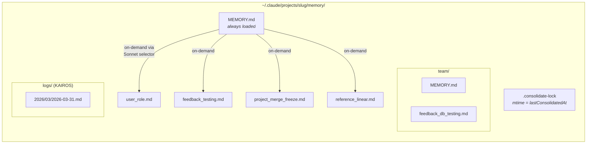
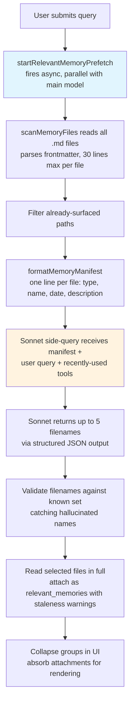
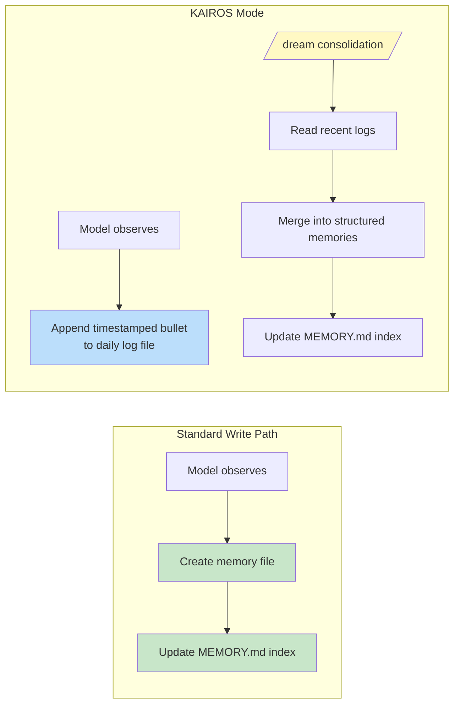

# Chapter 11: Memory -- Learning Across Conversations

> 第 11 章：记忆 —— 跨对话的学习

## The Stateless Problem

> 无状态问题

Every chapter so far has described machinery that exists within a single session. The agent loop runs, tools execute, sub-agents coordinate, and when the process exits, all of it vanishes. The next conversation starts with the same system prompt, the same tool definitions, the same model -- and zero knowledge of what happened before.

> 到目前为止，每一章描述的都是存在于单个会话内部的机制。agent 循环运行，工具执行，子 agent 相互协调，而当进程退出时，这一切都烟消云散。下一次对话从相同的系统提示词、相同的工具定义、相同的模型开始 —— 却对此前发生的一切毫无所知。

This is the fundamental limitation of a stateless architecture. A developer corrects the model's testing approach on Monday, and on Tuesday the model makes the same mistake. A user explains their role, their project's constraints, their preferences for code style, and every new session requires them to explain it again. The model is not forgetful -- it never knew. Each conversation is an independent universe.

> 这是无状态架构的根本局限。开发者周一纠正了模型的测试方法，到了周二模型又犯下同样的错误。用户解释了自己的角色、项目的约束、对代码风格的偏好，而每一次新会话都要求他们重新解释一遍。模型并非健忘 —— 它从来就不知道。每一次对话都是一个独立的宇宙。

The problem is not theoretical. It manifests in concrete ways that erode trust. A user says "remember, we use real database instances in tests, not mocks" -- and next week the model generates mocked tests. A user explains they are a senior engineer who does not need beginner explanations -- and the next session opens with a tutorial-level walkthrough. Without memory, every session starts at zero. The agent is perpetually a new hire on their first day.

> 这个问题并非纸上谈兵。它以具体的方式侵蚀着信任。用户说"记住，我们在测试中使用真实的数据库实例，而不是 mock" —— 而下一周模型又生成了用 mock 的测试。用户解释自己是不需要入门级讲解的资深工程师 —— 而下一次会话却以教程级别的逐步说明开场。没有记忆，每一次会话都从零开始。这个 agent 永远是入职第一天的新人。

The standard solution in the industry is Retrieval-Augmented Generation (RAG): embed documents into vectors, store them in a vector database, and retrieve relevant chunks at query time. This works well for knowledge bases -- documentation, FAQs, reference material. But it is architecturally mismatched for what an agent actually needs to remember across sessions. An agent's memory is not a knowledge base. It is a collection of observations: who the user is, what they have corrected, what the project's current constraints are, where to find things. These observations are small, change frequently, and must be human-editable. A vector database solves the wrong problem.

> 业界的标准解决方案是检索增强生成（RAG）：将文档嵌入为向量，存入向量数据库，在查询时检索相关片段。这对知识库 —— 文档、FAQ、参考资料 —— 效果很好。但对于 agent 真正需要跨会话记住的内容，它在架构上是错配的。agent 的记忆不是知识库。它是一组观察：用户是谁、他们纠正过什么、项目当前的约束是什么、到哪里去找东西。这些观察体量小、变化频繁，并且必须可由人编辑。向量数据库解决的是错误的问题。

Claude Code's memory system is a different bet entirely: files on disk, Markdown format, LLM-powered recall, no infrastructure. The bet is that simplicity in storage, combined with intelligence in retrieval, produces a better system than sophistication in both.

> Claude Code 的记忆系统押的完全是另一种注：磁盘上的文件、Markdown 格式、由 LLM 驱动的召回、零基础设施。这一注押的是：存储上的简单，结合检索上的智能，能产生比两者都复杂更好的系统。

The design philosophy has consequences that shape the entire system:

> 这一设计哲学带来的后果塑造了整个系统：

- **Human-readable.** A user who wants to see what Claude Code remembers can open `~/.claude/projects/<slug>/memory/MEMORY.md` in any text editor. No special tools, no decryption, no export command.

> - **人可读。** 想看看 Claude Code 记住了什么的用户，可以用任意文本编辑器打开 `~/.claude/projects/<slug>/memory/MEMORY.md`。无需特殊工具、无需解密、无需导出命令。

- **Human-editable.** A stale memory can be corrected with vim. A wrong memory can be deleted with `rm`. The user has full agency over the agent's knowledge.

> - **人可编辑。** 过时的记忆可以用 vim 修正。错误的记忆可以用 `rm` 删除。用户对 agent 的知识拥有完全的掌控权。

- **Version-controllable.** Team memories can be committed to git. Memory changes diff cleanly because they are Markdown.

> - **可版本控制。** 团队记忆可以提交到 git。记忆的变更能干净地做 diff，因为它们是 Markdown。

- **Zero infrastructure.** The memory system works offline, works without a server, works on any OS that has a filesystem. There is no migration path because there is no schema.

> - **零基础设施。** 记忆系统离线可用、无需服务器、在任何拥有文件系统的操作系统上都能工作。没有迁移路径，因为没有 schema。

- **Debuggable.** When memory behaves unexpectedly, the diagnosis path is `ls` and `cat`, not query logs and database inspection.

> - **可调试。** 当记忆表现异常时，诊断路径是 `ls` 和 `cat`，而不是查询日志和数据库检查。

The model both reads and writes memories using `FileWriteTool` and `FileEditTool` -- the same tools it uses to edit source code (introduced in Chapter 6). No special memory API exists. The system prompt teaches the model a two-step write protocol (create file, update index), and the model executes it with its existing capabilities under new instructions. This is tool reuse as architectural principle -- the memory system is not a subsystem bolted onto the agent, it is an emergent behavior of the agent using its existing capabilities.

> 模型读写记忆都使用 `FileWriteTool` 和 `FileEditTool` —— 与它编辑源代码所用的工具相同（在第 6 章介绍过）。不存在专门的记忆 API。系统提示词教给模型一套两步式的写入协议（创建文件、更新索引），模型则在新指令下用它已有的能力来执行。这是将工具复用作为架构原则 —— 记忆系统不是螺接在 agent 上的子系统，而是 agent 使用其既有能力时涌现出的行为。

There is a deeper reason the file-based choice works here. Memory, for an AI agent, is fundamentally different from memory in a traditional application. A traditional application's database holds authoritative state -- the source of truth for the system's data. An agent's memory holds *observations* -- things that were true at a point in time and may or may not still be true. Files communicate this epistemological status naturally. They have modification times that reveal when the observation was recorded. They can be read, edited, and deleted by humans who know the observation is wrong. A database suggests permanence and authority; a Markdown file suggests a note that someone wrote down and might need to update. The storage medium communicates the nature of the data -- these are working notes, not gospel.

> 基于文件的选择之所以在这里行得通，还有一个更深层的原因。对于 AI agent 而言，记忆与传统应用中的记忆有着本质区别。传统应用的数据库持有权威状态 —— 系统数据的真相之源。而 agent 的记忆持有的是*观察* —— 那些在某个时间点为真、如今未必仍然为真的东西。文件天然地传达了这种认识论上的状态。它们有修改时间，能揭示观察是何时被记录的。它们可以被那些知道观察有误的人读取、编辑和删除。数据库暗示着永久性与权威性；而一个 Markdown 文件暗示的是某人随手写下、可能需要更新的一则笔记。存储介质本身传达了数据的性质 —— 这些是工作笔记，而非金科玉律。

### Per-Project Scoping

> 按项目划分作用域

Memory is scoped to the git repository root, not the working directory. If a user opens a terminal in `src/components/` and another in `tests/`, both sessions share the same memory directory. The resolution logic finds the canonical git root first, falling back to the project root:

> 记忆的作用域是 git 仓库根目录，而非工作目录。如果用户在 `src/components/` 打开一个终端、在 `tests/` 打开另一个，两个会话共享同一个记忆目录。解析逻辑先查找规范的 git 根，再回退到项目根：

The base path resolution finds the canonical git root first, falling back to the project root. This ensures all git worktrees of the same repository share a single memory directory.

> 基础路径解析先查找规范的 git 根，再回退到项目根。这确保了同一仓库的所有 git worktree 共享单一的记忆目录。

The `findCanonicalGitRoot` call ensures that all git worktrees of the same repository share a single memory directory. The git root is sanitized (slashes become dashes, via `sanitizePath()`) to produce a flat directory name:

> `findCanonicalGitRoot` 调用确保了同一仓库的所有 git worktree 共享单一的记忆目录。git 根会被净化处理（斜杠通过 `sanitizePath()` 变为短横线），生成一个扁平的目录名：

```
~/.claude/projects/-Users-alex-code-myapp/memory/
```

A fully populated memory directory reveals the system's structure:

> 一个填充完整的记忆目录揭示了系统的结构：



The naming convention is semantic: `<type>_<topic>.md`. The type prefix is not enforced by code but is part of the prompt's instructions, making it easy to visually scan the directory and understand the memory landscape.

> 命名约定是语义化的：`<type>_<topic>.md`。类型前缀并非由代码强制，而是提示词指令的一部分，从而便于肉眼扫描目录、理解记忆的整体格局。

---

## The Four-Type Taxonomy

> 四种类型的分类法

Not everything is worth remembering. The memory system constrains all memories to exactly four types:

> 并非所有东西都值得记住。记忆系统将所有记忆约束为恰好四种类型：

The four types are: **user**, **feedback**, **project**, and **reference**.

> 这四种类型是：**user**、**feedback**、**project** 和 **reference**。

The taxonomy is designed around a single criterion: **is this knowledge derivable from the current project state?** Code patterns, architecture, file structure, git history -- all of these can be re-derived by reading the codebase. They are excluded. The four types capture what cannot be re-derived.

> 这套分类法是围绕单一标准设计的：**这个知识能否从当前的项目状态推导出来？** 代码模式、架构、文件结构、git 历史 —— 所有这些都能通过阅读代码库重新推导出来。它们被排除在外。这四种类型捕捉的是无法重新推导的东西。

**User memories** record information about the person: their role, goals, responsibilities, expertise level. A senior Go engineer who is new to React gets different explanations than a first-time programmer.

> **User 记忆**记录关于这个人的信息：他们的角色、目标、职责、专业水平。一位初次接触 React 的资深 Go 工程师，得到的解释与一位初学编程者不同。

**Feedback memories** capture guidance about how to approach work -- both corrections and confirmations. The system explicitly instructs the model to record both: "if you only save corrections, you will drift away from approaches the user has already validated." Each feedback memory has a specific structure: the rule itself, then a `**Why:**` line with the reason (often a past incident), then a `**How to apply:**` line with the trigger conditions.

> **Feedback 记忆**捕捉关于如何开展工作的指导 —— 既包括纠正，也包括确认。系统明确指示模型两者都要记录："如果你只保存纠正，你就会偏离用户已经认可的做法。"每条 feedback 记忆都有特定的结构：规则本身，然后是一行 `**Why:**` 说明原因（通常是一桩过往事件），再然后是一行 `**How to apply:**` 给出触发条件。

**Project memories** record ongoing work context -- who is doing what, why, by when. The prompt emphasizes converting relative dates to absolute: "Thursday" becomes "2026-03-05" so the memory remains interpretable weeks later.

> **Project 记忆**记录正在进行的工作上下文 —— 谁在做什么、为什么、截止到何时。提示词强调要把相对日期转换为绝对日期："周四"变成"2026-03-05"，这样这条记忆在数周之后仍然可以被解读。

**Reference memories** are bookmarks -- pointers to where information lives in external systems. A Linear project URL, a Grafana dashboard, a Slack channel. These tell the model where to look, not what to find.

> **Reference 记忆**是书签 —— 指向信息在外部系统中所在位置的指针。一个 Linear 项目 URL、一个 Grafana 仪表盘、一个 Slack 频道。它们告诉模型去哪里看，而不是要找到什么。

### The Taxonomy as Filter

> 作为过滤器的分类法

The four types are not just categories -- they are a filter. By defining exactly what counts as a memory, the system implicitly defines what does not. Without the taxonomy, an eager model would save everything: code patterns, architecture diagrams, error messages. All derivable from the codebase. Saving it creates a parallel, potentially stale copy of information that is better sourced from its origin.

> 这四种类型不只是分类 —— 它们是一个过滤器。通过精确定义什么算作记忆，系统隐式地定义了什么不算。没有这套分类法，一个急切的模型会把什么都保存下来：代码模式、架构图、错误信息。这些全都能从代码库推导出来。保存它们等于为本该从源头获取的信息制造了一份并行的、可能已经过时的副本。

The taxonomy also prevents a subtler failure: memory as crutch. If the model saves architectural decisions as memories, it stops reading the codebase to understand architecture. By excluding derivable information, the system forces the model to stay grounded in the current state of the code.

> 这套分类法还防止了一种更微妙的失败：把记忆当拐杖。如果模型把架构决策保存为记忆，它就不再去阅读代码库以理解架构了。通过排除可推导的信息，系统迫使模型始终立足于代码的当前状态。

The exclusion list is explicit: code patterns, git history, debugging solutions, anything in CLAUDE.md, ephemeral task details. These exclusions apply even when the user explicitly asks to save. If a user says "remember this PR list," the model is instructed to push back -- "what was *surprising* or *non-obvious* about it?" That surprising part is worth keeping. The raw list is not. This instruction was validated through evals, going from 0/2 to 3/3 when the exclusion-override instruction was added.

> 排除清单是明确的：代码模式、git 历史、调试方案、CLAUDE.md 中的任何内容、短暂的任务细节。即便用户明确要求保存，这些排除规则依然生效。如果用户说"记住这份 PR 列表"，模型被指示要反推一句 —— "关于它有什么*出人意料*或*不显而易见*的地方？"那个出人意料的部分才值得保留。原始列表则不然。这条指令经过 eval 验证：当加入这条"排除可被覆盖"的指令后，得分从 0/2 提升到 3/3。

### Frontmatter as Contract

> 作为契约的 Frontmatter

Every memory file uses YAML frontmatter with three required fields:

> 每个记忆文件都使用带三个必填字段的 YAML frontmatter：

```markdown
---
name: {{memory name}}
description: {{one-line description -- used to decide relevance}}
type: {{user, feedback, project, reference}}
---
```

The `description` is the most load-bearing field. It is what the relevance selector (a Sonnet side-query, discussed below) uses to decide whether to surface this memory. A vague description like "testing stuff" will either match too broadly or fail to match at all. A specific description like "Integration tests must hit real DB, not mocks -- burned by mock divergence Q4" matches exactly the conversations where it matters. The description is the memory's search index -- consumed not by a search engine but by a language model that can understand nuance, context, and intent.

> `description` 是最承重的字段。它是相关性选择器（一个 Sonnet 旁路查询，下文讨论）用来决定是否要浮现这条记忆的依据。像"测试相关"这样含糊的描述，要么匹配得太宽泛，要么根本匹配不上。而像"集成测试必须打真实数据库，不用 mock —— 第四季度曾因 mock 偏离而踩坑"这样具体的描述，则能精确匹配到它真正重要的那些对话。description 是记忆的搜索索引 —— 但消费它的不是搜索引擎，而是一个能理解细微差别、上下文与意图的语言模型。

The frontmatter is also the only part of the file that the scanning system reads during recall. `scanMemoryFiles()` reads each file only to its first 30 lines to extract the header. The body is private until the file is explicitly selected and loaded.

> frontmatter 也是召回期间扫描系统唯一会读取的文件部分。`scanMemoryFiles()` 读取每个文件时只读到前 30 行以提取头部。在文件被明确选中并加载之前，正文都是私有的。

---

## The Write Path

> 写入路径

Writing a memory is a two-step process executed with standard file tools.

> 写入一条记忆是一个用标准文件工具执行的两步过程。

**Step 1: Write the memory file.** The model creates a `.md` file in the memory directory with YAML frontmatter:

> **第一步：写入记忆文件。** 模型在记忆目录中创建一个带 YAML frontmatter 的 `.md` 文件：

```markdown
---
name: Testing Policy
description: Integration tests must hit real DB, not mocks
type: feedback
---

Don't mock the database in integration tests.

**Why:** We got burned last quarter when mocked tests passed but production
queries hit edge cases the mocks didn't cover.

**How to apply:** Any test file under `__tests__/` that touches database
operations should use the real PGlite instance from test-utils.
```

**Step 2: Update the index.** The model adds a one-line pointer to `MEMORY.md`:

> **第二步：更新索引。** 模型向 `MEMORY.md` 添加一行指针：

```markdown
- [Testing Policy](feedback_testing.md) -- integration tests must hit real DB
```

Each entry must stay under approximately 150 characters. The index is a table of contents, not a knowledge base.

> 每个条目都必须保持在约 150 个字符以内。这个索引是一份目录，而不是一座知识库。

When the model learns new information that modifies an existing memory, it uses `FileEditTool` to update the existing file rather than creating a duplicate. The system does not version memories internally -- the file is on the local filesystem, and the user has `git` if they want versioning. Before the prompt is built, `ensureMemoryDirExists()` creates the memory directory, and the prompt tells the model the directory already exists, avoiding wasted turns on `ls` and `mkdir -p`.

> 当模型学到了会修改某条既有记忆的新信息时，它会用 `FileEditTool` 更新已有文件，而不是创建一份副本。系统不在内部为记忆做版本管理 —— 文件在本地文件系统上，用户如果想要版本控制，有 `git` 可用。在构建提示词之前，`ensureMemoryDirExists()` 会创建记忆目录，而提示词会告知模型该目录已经存在，从而避免在 `ls` 和 `mkdir -p` 上浪费回合。

---

## The Recall Path

> 召回路径

Writing memories is necessary but not sufficient. The harder problem is retrieval: given a user's query, which of the potentially hundreds of memory files should be loaded into the model's context? Loading all of them would exhaust the token budget. Loading none would defeat the purpose. Loading the wrong ones would waste tokens on irrelevant information while missing the knowledge that would have changed the model's behavior.

> 写入记忆是必要的，但还不够。更难的问题是检索：给定用户的一个查询，在可能多达数百个的记忆文件中，应该把哪些加载进模型的上下文？全部加载会耗尽 token 预算。一个都不加载则违背了初衷。加载错误的那些则会把 token 浪费在无关信息上，同时错过本可改变模型行为的知识。

The recall system operates in two tiers. The `MEMORY.md` index is always loaded into context at session start, providing orientation. Individual memory files are surfaced on-demand through an LLM-powered relevance query that selects up to five memories per turn.

> 召回系统分两层运作。`MEMORY.md` 索引在会话开始时总是被加载进上下文，提供导览。单个记忆文件则通过一个由 LLM 驱动的相关性查询按需浮现，该查询每个回合最多选取五条记忆。

### The Full Recall Pipeline

> 完整的召回流水线



The async prefetch in step 2 is the key performance decision. By the time the main model reaches a point where recalled context would be useful, the side-query has usually already completed. The user experiences no additional latency.

> 第 2 步中的异步预取是关键的性能决策。等到主模型到达召回上下文会派上用场的那个节点时，旁路查询通常已经完成了。用户感受不到任何额外的延迟。

### The Sonnet Side-Query

> Sonnet 旁路查询

The manifest is sent to a Sonnet model as a side-query. The system prompt for this selector is precise:

> 清单会作为旁路查询发送给一个 Sonnet 模型。这个选择器的系统提示词十分精确：

The system prompt for the selector instructs it to be conservative: include only memories that will be useful for the current query, skip memories if uncertain, and avoid selecting API/usage documentation for tools already in active use (since the model already has those tools loaded) -- but still surface warnings, gotchas, or known issues about those tools.

> 这个选择器的系统提示词指示它要保守：只纳入对当前查询有用的记忆，不确定时就跳过记忆，并避免选取那些已在活跃使用的工具的 API／用法文档（因为模型已经加载了那些工具）—— 但仍然要浮现关于这些工具的警告、陷阱或已知问题。

The response uses structured output -- `{ selected_memories: string[] }` -- and filenames are validated against the known set.

> 响应使用结构化输出 —— `{ selected_memories: string[] }` —— 而文件名会针对已知集合进行校验。

This approach trades latency for precision, and the tradeoff analysis is instructive. **Keyword matching** would be fast but has no understanding of context -- it cannot express "do not select memories for tools already in active use." **Embedding similarity** handles semantic matching but introduces infrastructure (embedding model, vector store, update pipeline) and struggles with negation -- the embedding of "do NOT use database mocks" is very close to "use database mocks." **The Sonnet side-query** understands semantic relevance, reasons about context, handles negation, and requires zero infrastructure. The latency cost is bounded (hundreds of milliseconds) and hidden behind the main model's initial processing.

> 这种方法以延迟换精度，而这笔取舍的分析很有启发性。**关键词匹配**会很快，但对上下文毫无理解 —— 它无法表达"不要为已在活跃使用的工具选取记忆"。**嵌入相似度**能处理语义匹配，但引入了基础设施（嵌入模型、向量存储、更新流水线），并且在处理否定时举步维艰 —— "不要使用数据库 mock"的嵌入与"使用数据库 mock"非常接近。**Sonnet 旁路查询**则理解语义相关性、对上下文进行推理、处理否定，并且需要零基础设施。延迟代价是有界的（数百毫秒），并隐藏在主模型的初始处理之后。

The telemetry system tracks selection rates even when no memories are selected. A selection rate of 0/150 means something different from 0/3 -- the first indicates a precision problem, the second a coverage problem.

> 即便没有选中任何记忆，遥测系统也会追踪选取率。0/150 的选取率与 0/3 含义不同 —— 前者表明的是精度问题，后者表明的是覆盖率问题。

---

## Staleness

> 陈旧度

The staleness system addresses a failure mode that emerged from real usage. Users reported that old memories -- containing file:line citations to code that had since changed -- were being asserted as fact by the model. The citation made the stale claim sound *more* authoritative, not less.

> 陈旧度系统解决的是一个在真实使用中浮现出来的失败模式。用户反映，老旧的记忆 —— 其中包含指向此后已经变化的代码的 file:line 引用 —— 正被模型当作事实来断言。那条引用让陈旧的论断听起来*更*权威，而非更不权威。

The solution is not expiration. Old memories are not deleted -- they may contain institutional knowledge valid for years. Instead, the system attaches age warnings:

> 解决方案不是过期机制。老旧的记忆不会被删除 —— 它们可能包含数年有效的组织知识。相反，系统会附加年龄警告：

The staleness function computes the memory's age in days. Memories from today or yesterday get no warning (the function returns an empty string). Everything older gets a caveat injected alongside the memory content: a message stating the age in days and warning that code behavior claims or file:line citations may be outdated, advising verification against current code.

> 陈旧度函数以天为单位计算记忆的年龄。来自今天或昨天的记忆不会得到警告（函数返回空字符串）。更老的一切都会在记忆内容旁注入一条提醒：一条声明年龄天数的信息，警告关于代码行为的论断或 file:line 引用可能已过时，并建议对照当前代码加以核实。

Memories from today or yesterday get no warning. Everything older gets a staleness caveat injected alongside the memory content. The human-readable format -- "today," "yesterday," "47 days ago" -- exists because models are poor at date arithmetic. A raw ISO timestamp does not trigger staleness reasoning the way "47 days ago" does. This is an empirical observation about model behavior, validated through evals: the action-cue framing "Before recommending from memory" scored 3/3 versus 0/3 for the more abstract "Trusting what you recall," with identical body text.

> 来自今天或昨天的记忆不会得到警告。更老的一切都会在记忆内容旁注入一条陈旧度提醒。这种人可读的格式 —— "今天"、"昨天"、"47 天前" —— 之所以存在，是因为模型不擅长日期算术。一个原始的 ISO 时间戳不会像"47 天前"那样触发陈旧度推理。这是关于模型行为的一个经验性观察，并经过 eval 验证：在正文文本完全相同的情况下，带行动线索框架的"在依据记忆给出建议之前"得分为 3/3，而较为抽象的"信任你所回忆的内容"为 0/3。

There is a philosophical tension worth naming. The staleness system treats memories as hypotheses, not facts. But the model's natural tendency is to present information confidently. The staleness warning is fighting the model's own voice -- using its instruction-following capability to override its confidence-generation tendency.

> 这里有一处值得点明的哲学张力。陈旧度系统把记忆当作假设，而非事实。但模型的天然倾向是自信地呈现信息。陈旧度警告是在对抗模型自身的声音 —— 用它遵循指令的能力来压制它生成自信的倾向。

---

## MEMORY.md as the Always-Loaded Index

> 作为常驻加载索引的 MEMORY.md

Every conversation begins with `MEMORY.md` in context. It is not a memory -- it is an index, a table of contents for the actual memory files.

> 每一次对话开始时，`MEMORY.md` 都在上下文中。它不是一条记忆 —— 它是一个索引，是真正的记忆文件的目录。

The index has two hard caps:

> 这个索引有两道硬上限：

The index has two hard caps: 200 lines and 25,000 bytes.

> 这个索引有两道硬上限：200 行和 25,000 字节。

The 200-line cap catches normal growth. The 25KB byte cap catches an observed failure mode: users packing long lines that stay under 200 lines but consume enormous token budgets. At the 97th percentile, a MEMORY.md with only 197 lines weighed 197KB. When either cap fires, actionable guidance tells the user what to fix: "Keep index entries to one line under ~200 chars; move detail into topic files."

> 200 行的上限拦截的是正常增长。25KB 的字节上限拦截的是一种观察到的失败模式：用户塞入很长的行，行数保持在 200 行以下，却消耗了巨量的 token 预算。在第 97 百分位，一个仅有 197 行的 MEMORY.md 重达 197KB。当任一上限触发时，可操作的指引会告诉用户该修什么："让索引条目保持为约 200 字符以内的一行；把细节移到主题文件中去。"

This two-tier architecture -- lightweight always-on index plus heavy on-demand content -- is the design that allows memory to scale. A project with 150 memories has a 150-line index consuming perhaps 3,000 tokens, not 150 full files consuming 100,000.

> 这种两层架构 —— 轻量的常驻索引加上重量级的按需内容 —— 正是让记忆得以扩展的设计。一个拥有 150 条记忆的项目，其 150 行的索引大约消耗 3,000 个 token，而不是 150 个完整文件消耗 100,000 个。

---

The transition from individual memory to shared knowledge is natural. A testing policy, a deployment convention, a known gotcha in the build system -- these need to be shared across a team.

> 从个人记忆到共享知识的过渡是自然而然的。一项测试策略、一条部署约定、构建系统中一个已知的陷阱 —— 这些都需要在团队内部共享。

## Team Memory

> 团队记忆

Team memory is a subdirectory of the auto-memory directory at `<autoMemPath>/team/`, gated behind a feature flag and requiring auto-memory to be enabled. The architectural nesting is deliberate: disabling auto-memory transitively disables team memory.

> 团队记忆是自动记忆目录下位于 `<autoMemPath>/team/` 的一个子目录，受一个特性开关把守，并要求自动记忆已启用。这种架构上的嵌套是刻意为之的：禁用自动记忆会传递性地禁用团队记忆。

### Defense in Depth

> 纵深防御

Team memory introduces an attack surface that individual memory does not have. Team-synced files come from other users, and a malicious teammate could attempt path traversal. The security model uses three layers of defense.

> 团队记忆引入了个人记忆所没有的攻击面。团队同步的文件来自其他用户，一个心怀恶意的队友可能尝试路径遍历。这套安全模型使用三层防御。

**Layer 1: Input sanitization.** The `sanitizePathKey()` function validates against null bytes, URL-encoded traversals (`%2e%2e%2f`), Unicode normalization attacks (fullwidth characters that normalize to `../`), backslashes, and absolute paths.

> **第一层：输入净化。** `sanitizePathKey()` 函数会针对空字节、URL 编码的遍历（`%2e%2e%2f`）、Unicode 规范化攻击（会规范化为 `../` 的全角字符）、反斜杠以及绝对路径进行校验。

**Layer 2: String-level path validation.** After sanitization, `path.resolve()` normalizes remaining `..` segments, and the resolved path is checked against the team directory prefix (including a trailing separator to prevent `team-evil/` from matching `team/`).

> **第二层：字符串级别的路径校验。** 净化之后，`path.resolve()` 会规范化剩余的 `..` 段，而解析后的路径会针对团队目录前缀进行检查（包括一个末尾分隔符，以防止 `team-evil/` 匹配上 `team/`）。

**Layer 3: Symlink resolution.** `realpathDeepestExisting()` resolves symlinks on the deepest existing ancestor, catching attacks that string-level validation cannot detect. If `team/evil` is a symlink pointing to `/etc/`, string validation sees a valid prefix, but `realpath` reveals the true target.

> **第三层：符号链接解析。** `realpathDeepestExisting()` 会在最深的已存在祖先目录上解析符号链接，从而捕捉字符串级别校验无法察觉的攻击。如果 `team/evil` 是一个指向 `/etc/` 的符号链接，字符串校验看到的是一个有效的前缀，但 `realpath` 会揭示出真正的目标。

All validation failures produce a `PathTraversalError`. No partial successes, no fallbacks. Fail closed.

> 所有校验失败都会产生一个 `PathTraversalError`。没有部分成功，没有回退。失败即关闭（fail closed）。

### Scope Guidance

> 作用域指引

The prompt teaches the model about private vs. shared memory. User memories are always private. Reference memories are usually team. Feedback memories default to private unless they represent project-wide conventions. The cross-checking instruction -- "Before saving a private feedback memory, check that it does not contradict a team feedback memory" -- prevents conflicting guidance from surfacing unpredictably depending on which memory is recalled first.

> 提示词教给模型私有记忆与共享记忆的区别。User 记忆始终是私有的。Reference 记忆通常属于团队。Feedback 记忆默认私有，除非它们代表的是项目范围的约定。那条交叉核查指令 —— "在保存一条私有的 feedback 记忆之前，检查它是否与某条团队 feedback 记忆相矛盾" —— 防止了相互冲突的指导根据哪条记忆先被召回而以不可预测的方式浮现。

---

## KAIROS Mode: Append-Only Daily Logs

> KAIROS 模式：仅追加的每日日志

Standard memory assumes discrete sessions. KAIROS mode (Claude Code's assistant mode) breaks this assumption -- sessions are long-lived, potentially running for days. The two-step write pattern does not scale to continuous operation.

> 标准记忆假定会话是离散的。KAIROS 模式（Claude Code 的助手模式）打破了这一假定 —— 会话是长生命周期的，可能运行数天。两步式写入模式无法扩展到持续运行的场景。

The solution is architectural separation between capture and consolidation:

> 解决方案是在捕获与整合之间做架构上的分离：



In KAIROS mode, the model appends to date-named log files (`<autoMemPath>/logs/YYYY/MM/YYYY-MM-DD.md`). Each entry is a short timestamped bullet. The model is instructed: "Do not rewrite or reorganize the log" -- restructuring during capture loses the chronological signal that consolidation needs.

> 在 KAIROS 模式下，模型向以日期命名的日志文件（`<autoMemPath>/logs/YYYY/MM/YYYY-MM-DD.md`）追加内容。每个条目是一条带时间戳的简短要点。模型被指示："不要重写或重新组织这份日志" —— 在捕获期间重构会丢失整合所需的时间顺序信号。

The path in the prompt is described as a *pattern* rather than today's literal date. This is a caching optimization: the memory prompt is cached and not invalidated when the date changes at midnight. The model derives the current date from a separate `date_change` attachment.

> 提示词中的路径被描述为一个*模式*，而不是今天的字面日期。这是一项缓存优化：记忆提示词被缓存，不会在午夜日期变更时失效。模型从一个单独的 `date_change` 附件中推导出当前日期。

### The /dream Consolidation

> /dream 整合

Consolidation runs in four phases: **Orient** (list directory, read index, skim existing files), **Gather** (search logs, check for drifted memories), **Consolidate** (write or update files, merge rather than duplicate), **Prune** (update index under 200 lines, remove stale pointers). The emphasis on merging into existing files rather than creating new ones is important -- without it, the memory directory would grow linearly with usage.

> 整合分四个阶段运行：**Orient**（列出目录、读取索引、略读现有文件）、**Gather**（搜索日志、检查偏离的记忆）、**Consolidate**（写入或更新文件，合并而非复制）、**Prune**（把索引更新到 200 行以内、移除陈旧的指针）。强调合并到现有文件而非创建新文件很重要 —— 没有这一点，记忆目录会随使用量线性增长。

### The Consolidation Lock

> 整合锁

The lock file `.consolidate-lock` serves dual purpose: its content is the holder's PID (mutual exclusion), its mtime *is* `lastConsolidatedAt` (scheduling state). The auto-dream fires when three gates pass, evaluated cheapest-first: hours since last consolidation exceeds 24, sessions modified since then exceeds 5, and no other process holds the lock. Crash recovery detects dead PIDs via `process.kill(pid, 0)`, with a one-hour staleness timeout as defense against PID reuse.

> 锁文件 `.consolidate-lock` 身兼双职：它的内容是持有者的 PID（互斥），它的 mtime *就是* `lastConsolidatedAt`（调度状态）。自动 dream 在三道关卡通过时触发，按从最便宜到最贵的顺序求值：距上次整合的小时数超过 24、自那以来被修改的会话数超过 5、且没有其他进程持有该锁。崩溃恢复通过 `process.kill(pid, 0)` 检测已死的 PID，并以一小时的陈旧超时作为对 PID 复用的防御。

---

## Background Extraction

> 后台提取

The main agent has full instructions for writing memories proactively. But agents are imperfect -- and the imperfection is predictable. When a user says "remember to always use integration tests" and then immediately asks "now fix the login bug," the model's attention shifts entirely to the bug. The memory-saving instruction was processed but may not execute.

> 主 agent 拥有主动写入记忆的完整指令。但 agent 并不完美 —— 而这种不完美是可预测的。当用户说"记住，要始终使用集成测试"，紧接着又要求"现在去修登录的 bug"时，模型的注意力会完全转向那个 bug。保存记忆的指令被处理了，但可能没有被执行。

At the end of each complete query loop, a forked agent -- sharing the parent's prompt cache -- analyzes recent messages and writes any memories the main agent missed. When the main agent has already written memories in the current turn range, the extraction agent skips that range. The extraction agent has a constrained tool budget: read-only tools plus write access only to memory directory paths. Its prompt instructs a two-turn strategy: turn 1 reads in parallel, turn 2 writes in parallel.

> 在每个完整查询循环的末尾，一个 fork 出来的 agent —— 共享父级的提示词缓存 —— 会分析最近的消息，并写下主 agent 漏掉的任何记忆。当主 agent 已经在当前回合区间内写过记忆时，提取 agent 会跳过那个区间。提取 agent 拥有受约束的工具预算：只读工具，外加仅对记忆目录路径的写入权限。它的提示词指示了一种两回合策略：第 1 回合并行读取，第 2 回合并行写入。

The interaction is cooperative, not competitive. The main agent's prompt always contains the full save instructions. When the main agent saves, the background agent defers. When it does not, the background agent catches the gap. This pattern -- a primary path with a background safety net -- makes memory capture more reliable without burdening the primary interaction. Neither alone would be sufficient.

> 这种互动是协作式的，而非竞争式的。主 agent 的提示词始终包含完整的保存指令。当主 agent 保存了，后台 agent 就退让。当它没有保存时，后台 agent 就补上这道缺口。这种模式 —— 一条主路径加一张后台安全网 —— 让记忆捕获更可靠，又不给主交互增加负担。两者单独任何一个都不够。

---

## Path Resolution and Security

> 路径解析与安全

The auto-memory path is resolved through a priority chain:

> 自动记忆路径通过一条优先级链来解析：

1. **`CLAUDE_COWORK_MEMORY_PATH_OVERRIDE`** -- Full-path override for Cowork.

> 1. **`CLAUDE_COWORK_MEMORY_PATH_OVERRIDE`** —— 供 Cowork 使用的全路径覆盖。

2. **`autoMemoryDirectory` in settings.json** -- Only trusted settings sources. Project settings are intentionally excluded.

> 2. **settings.json 中的 `autoMemoryDirectory`** —— 仅限受信任的设置来源。项目设置被刻意排除在外。

3. **Default computed path** -- `~/.claude/projects/<sanitized-git-root>/memory/`.

> 3. **默认计算出的路径** —— `~/.claude/projects/<sanitized-git-root>/memory/`。

The exclusion of project settings is a security decision. A malicious repository could commit `.claude/settings.json` with `autoMemoryDirectory: "~/.ssh"`, and the permission carve-out for memory files would grant the model automatic write access to SSH keys. By limiting the override to policy, flag, local, and user settings -- none committable to a repository -- this attack vector is closed.

> 排除项目设置是一个安全决策。一个恶意仓库可以提交一份带 `autoMemoryDirectory: "~/.ssh"` 的 `.claude/settings.json`，而为记忆文件开的权限例外会授予模型对 SSH 密钥的自动写入权限。通过把覆盖来源限制在 policy、flag、local 和 user 设置 —— 这些都无法提交进仓库 —— 这条攻击路径就被封死了。

The `isAutoMemPath()` function normalizes paths before prefix-checking to prevent traversal, and the trailing separator convention ensures prefix matching requires a directory boundary.

> `isAutoMemPath()` 函数在做前缀检查之前会先规范化路径以防止遍历，而末尾分隔符的约定确保了前缀匹配必须落在一个目录边界上。

### The Enable/Disable Chain

> 启用／禁用链

Whether auto-memory is active is determined by `isAutoMemoryEnabled()`, implementing its own priority chain: environment variable, bare mode, CCR without persistent storage, settings, default enabled. When disabled, both the prompt section is dropped (so the model receives no memory instructions) and the background processes stop (extract-memories, auto-dream, team sync). Both gates must align -- removing the prompt alone would not stop the extraction agent, which has its own prompt.

> 自动记忆是否处于活动状态由 `isAutoMemoryEnabled()` 决定，它实现了自己的优先级链：环境变量、bare 模式、无持久化存储的 CCR、设置、默认启用。当被禁用时，既会丢弃提示词中的记忆部分（这样模型就收不到任何记忆指令），后台进程也会停止（extract-memories、auto-dream、团队同步）。两道关卡必须对齐 —— 仅仅移除提示词并不能阻止提取 agent，因为它有自己的提示词。

---

## Apply This: Designing Agent Memory

> 应用：设计 agent 记忆

The memory system's complexity is in the behavioral layer -- prompt instructions, LLM-powered recall, staleness management, background extraction -- not in storage infrastructure. This distribution of complexity is itself a design principle.

> 记忆系统的复杂度在于行为层 —— 提示词指令、由 LLM 驱动的召回、陈旧度管理、后台提取 —— 而不在于存储基础设施。这种复杂度的分布本身就是一条设计原则。

**Files beat databases for agent memory.** Files are inspectable, editable, and version-controllable. Transparency builds trust. When the alternative is a database users cannot easily read, files win on trust alone.

> **对于 agent 记忆，文件胜过数据库。** 文件可检视、可编辑、可版本控制。透明建立信任。当备选方案是一个用户难以轻易读取的数据库时，仅凭信任这一点，文件就胜出了。

**Constrain what gets saved, not just how.** The derivability test -- can this knowledge be re-derived from the current project state? -- eliminates the majority of potential memories while preserving the ones that actually matter.

> **约束保存什么，而不只是怎么保存。** 可推导性测试 —— 这个知识能否从当前项目状态重新推导出来？ —— 淘汰了大多数潜在记忆，同时保留了那些真正重要的。

**Use an LLM for recall, not keywords or embeddings.** An LLM side-query understands context, reasons about what is already available in conversation, handles negation, and requires no index maintenance. The latency cost is real but bounded and hidden behind the main model's processing.

> **用 LLM 来做召回，而不是关键词或嵌入。** 一次 LLM 旁路查询能理解上下文、对对话中已有的内容进行推理、处理否定，并且无需维护索引。延迟代价是真实的，但有界，且隐藏在主模型的处理之后。

**Warn about staleness, do not expire.** Institutional knowledge may remain valid for years. Attaching age warnings lets the model treat old memories as hypotheses rather than facts. The human-readable age format triggers the right reasoning in a way that raw timestamps do not.

> **对陈旧度发出警告，而不是让其过期。** 组织知识可能数年仍然有效。附加年龄警告让模型把老旧记忆当作假设而非事实来对待。人可读的年龄格式能触发恰当的推理，而原始时间戳做不到这一点。

**Build a safety net for capture.** The main agent will miss memories. A background extraction agent that reviews recent conversation makes the system more reliable without burdening the primary interaction. When the main agent saves, the background agent defers.

> **为捕获搭建一张安全网。** 主 agent 会漏掉记忆。一个回顾近期对话的后台提取 agent，让系统更可靠，又不给主交互增加负担。当主 agent 保存了，后台 agent 就退让。

---

The agent can now learn across sessions -- accumulating knowledge about its user, their preferences, their project's state, and the corrections they have made. The memory system makes a philosophical commitment: that an agent's relationship with its user should deepen over time, not reset on every interaction. The file-based implementation makes that commitment tangible -- visible on disk, editable by humans, version-controlled alongside code. The agent's memory is not a black box. It is a collection of notes in a folder, written in a language that both the model and the human can read.

> 现在 agent 能够跨会话学习了 —— 积累关于其用户、用户偏好、项目状态以及用户做过的纠正的知识。记忆系统做出了一个哲学上的承诺：agent 与其用户的关系应当随时间加深，而不是在每次交互时重置。基于文件的实现让这一承诺变得可触可感 —— 在磁盘上可见、可由人编辑、与代码一道做版本控制。agent 的记忆不是一个黑箱。它是一个文件夹里的一组笔记，用模型和人都能读懂的语言写就。

The next chapter examines how Claude Code extends its capabilities beyond the core: the skills system that teaches the model new behaviors, and the hooks system that lets external code constrain and modify those behaviors at over two dozen lifecycle points.

> 下一章将考察 Claude Code 如何把自身的能力扩展到核心之外：教给模型新行为的 skills 系统，以及让外部代码在二十多个生命周期节点上约束和修改这些行为的 hooks 系统。
