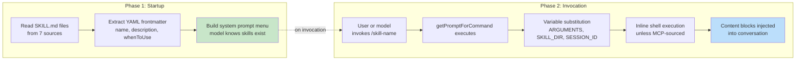
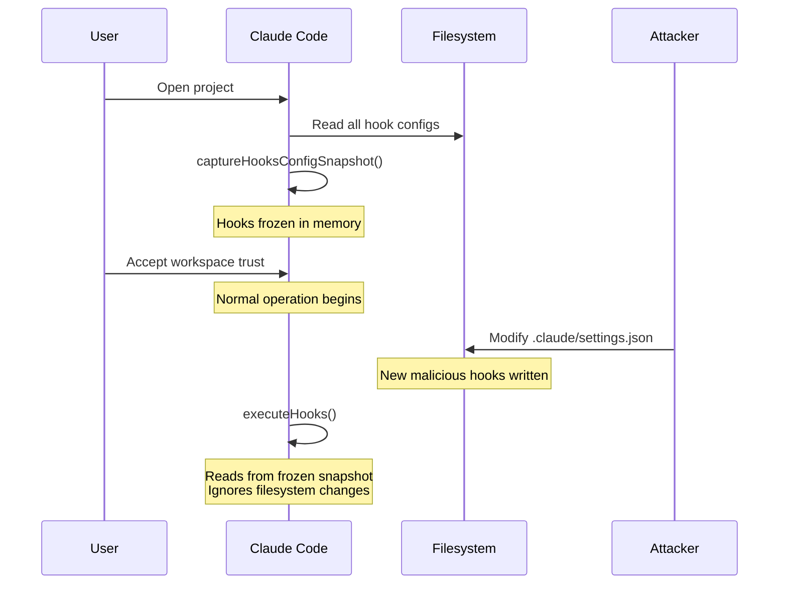
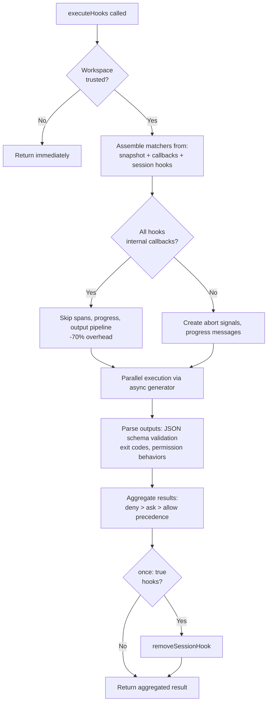

# Chapter 12: Extensibility -- Skills and Hooks

> 第 12 章：可扩展性 —— Skills 与 Hooks

## Two Dimensions of Extension

> 扩展的两个维度

Every extensibility system answers two questions: what can the system do, and when does it do it. Most frameworks conflate the two -- a plugin registers both capabilities and lifecycle callbacks in the same object, and the boundary between "adding a feature" and "intercepting a feature" blurs into a single registration API.

> 每一套可扩展性系统都要回答两个问题：系统能做什么，以及它在什么时候做。大多数框架把这两者混为一谈——一个插件在同一个对象里同时注册能力和生命周期回调，于是"添加一个功能"与"拦截一个功能"之间的界限被模糊进了同一个注册 API 里。

Claude Code separates them cleanly. Skills extend what the model can do. They are markdown files that become slash commands, injecting new instructions into the conversation when invoked. Hooks extend when and how things happen. They are lifecycle interceptors that fire at over two dozen distinct points during a session, running arbitrary code that can block actions, modify inputs, force continuation, or silently observe.

> Claude Code 把它们干净地区分开来。Skills 扩展模型能做什么。它们是 markdown 文件，会变成斜杠命令，在被调用时向对话中注入新的指令。Hooks 扩展事情何时以及如何发生。它们是生命周期拦截器，在一次会话中会在两打以上不同的节点触发，运行任意代码，可以阻止动作、修改输入、强制继续，或者静默观察。

The separation is not accidental. Skills are content -- they expand the model's knowledge and capabilities by adding prompt text. Hooks are control flow -- they modify the execution path without changing what the model knows. A skill might teach the model how to run your team's deployment process. A hook might ensure no deployment command executes without a passing test suite. The skill adds capability; the hook adds constraint.

> 这种区分并非偶然。Skills 是内容——它们通过添加 prompt 文本来扩展模型的知识与能力。Hooks 是控制流——它们在不改变模型所知内容的前提下修改执行路径。一个 skill 可能教会模型如何运行你团队的部署流程；一个 hook 则可能确保没有通过测试套件就不允许执行任何部署命令。skill 增加能力，hook 增加约束。

This chapter covers both systems in depth, then examines where they intersect: skill-declared hooks that register as session-scoped lifecycle interceptors when the skill is invoked.

> 本章将深入剖析这两套系统，然后考察它们的交汇处：由 skill 声明的 hook，在该 skill 被调用时注册为会话级（session-scoped）的生命周期拦截器。

---

## Skills: Teaching the Model New Tricks

> Skills：教会模型新本领

### Two-Phase Loading

> 两阶段加载

The core optimization of the skills system is that frontmatter loads at startup, but full content loads only on invocation.

> skills 系统的核心优化在于：frontmatter 在启动时加载，而完整内容只在被调用时才加载。



**Phase 1** reads each `SKILL.md` file, splits YAML frontmatter from the markdown body, and extracts metadata. The frontmatter fields become part of the system prompt so the model knows the skill exists. The markdown body is captured in a closure but not processed. A project with 50 skills pays the token cost of 50 short descriptions, not 50 full documents.

> **阶段 1** 读取每一个 `SKILL.md` 文件，将 YAML frontmatter 从 markdown 正文中拆分出来，并提取元数据。frontmatter 字段成为 system prompt 的一部分，使模型知道该 skill 的存在。markdown 正文被捕获在一个闭包中，但并不被处理。一个拥有 50 个 skill 的项目只需为 50 段简短描述支付 token 成本，而不是 50 份完整文档。

**Phase 2** fires when the model or user invokes a skill. `getPromptForCommand` prepends the base directory, substitutes variables (`$ARGUMENTS`, `${CLAUDE_SKILL_DIR}`, `${CLAUDE_SESSION_ID}`), and executes inline shell commands (backtick-prefixed with `!`). The result is returned as content blocks injected into the conversation.

> **阶段 2** 在模型或用户调用某个 skill 时触发。`getPromptForCommand` 会在前面拼接基础目录、替换变量（`$ARGUMENTS`、`${CLAUDE_SKILL_DIR}`、`${CLAUDE_SESSION_ID}`），并执行内联 shell 命令（以 `!` 加反引号为前缀）。结果以内容块（content blocks）的形式注入到对话中返回。

### Seven Sources with Priority

> 带优先级的七个来源

Skills arrive from seven distinct sources, loaded in parallel and merged by precedence:

> Skills 来自七个不同的来源，它们并行加载，并按优先级合并：

| Priority | Source | Location | Notes |
|----------|--------|----------|-------|
| 1 | Managed (Policy) | `<MANAGED_PATH>/.claude/skills/` | Enterprise-controlled |
| 2 | User | `~/.claude/skills/` | Personal, available everywhere |
| 3 | Project | `.claude/skills/` (walked up to home) | Checked into version control |
| 4 | Additional Dirs | `<add-dir>/.claude/skills/` | Via `--add-dir` flag |
| 5 | Legacy Commands | `.claude/commands/` | Backwards-compatible |
| 6 | Bundled | Compiled into the binary | Feature-gated |
| 7 | MCP | MCP server prompts | Remote, untrusted |

> | 优先级 | 来源 | 位置 | 说明 |
> |----------|--------|----------|-------|
> | 1 | Managed（策略） | `<MANAGED_PATH>/.claude/skills/` | 由企业管控 |
> | 2 | User（用户） | `~/.claude/skills/` | 个人级，随处可用 |
> | 3 | Project（项目） | `.claude/skills/`（向上遍历至 home） | 纳入版本控制 |
> | 4 | Additional Dirs（附加目录） | `<add-dir>/.claude/skills/` | 通过 `--add-dir` 标志指定 |
> | 5 | Legacy Commands（遗留命令） | `.claude/commands/` | 向后兼容 |
> | 6 | Bundled（内置） | 编译进二进制文件中 | 受特性开关（feature-gate）控制 |
> | 7 | MCP | MCP 服务器 prompt | 远程、不受信任 |

Deduplication uses `realpath` to resolve symlinks and overlapping parent directories. The first-seen source wins. The `getFileIdentity` function resolves to canonical paths via `realpath` rather than relying on inode values, which are unreliable on container/NFS mounts and ExFAT.

> 去重使用 `realpath` 来解析符号链接和重叠的父目录。最先出现的来源胜出。`getFileIdentity` 函数通过 `realpath` 解析到规范路径（canonical path），而不是依赖 inode 值——后者在容器/NFS 挂载以及 ExFAT 上并不可靠。

### The Frontmatter Contract

> Frontmatter 约定

Key frontmatter fields that control skill behavior:

> 控制 skill 行为的关键 frontmatter 字段：

| YAML Field | Purpose |
|-----------|---------|
| `name` | User-facing display name |
| `description` | Shown in autocomplete and system prompt |
| `when_to_use` | Detailed usage scenarios for model discovery |
| `allowed-tools` | Which tools the skill can use |
| `disable-model-invocation` | Block autonomous model use |
| `context` | `'fork'` to run as sub-agent |
| `hooks` | Lifecycle hooks registered on invocation |
| `paths` | Glob patterns for conditional activation |

> | YAML 字段 | 用途 |
> |-----------|---------|
> | `name` | 面向用户的显示名称 |
> | `description` | 在自动补全和 system prompt 中展示 |
> | `when_to_use` | 供模型发现的详细使用场景 |
> | `allowed-tools` | 该 skill 可使用哪些工具 |
> | `disable-model-invocation` | 阻止模型自主调用 |
> | `context` | 设为 `'fork'` 即以 sub-agent 形式运行 |
> | `hooks` | 在调用时注册的生命周期 hook |
> | `paths` | 用于条件激活的 glob 模式 |

The `context: 'fork'` option runs the skill as a sub-agent with its own context window, essential for skills that need significant work without polluting the main conversation's token budget. The `disable-model-invocation` and `user-invocable` fields control two distinct access paths -- setting both to true makes the skill invisible, useful for hooks-only skills.

> `context: 'fork'` 选项让 skill 以拥有自己上下文窗口的 sub-agent 形式运行，这对于那些需要大量工作、又不想污染主对话 token 预算的 skill 至关重要。`disable-model-invocation` 和 `user-invocable` 字段控制两条不同的访问路径——把两者都设为 true 会让该 skill 不可见，这对仅含 hook 的 skill 很有用。

### The MCP Security Boundary

> MCP 安全边界

After variable substitution, inline shell commands execute. The security boundary is absolute: **MCP skills never execute inline shell commands.** MCP servers are external systems. An MCP prompt containing `` !`rm -rf /` `` would execute with the user's full permissions if allowed. The system treats MCP skills as content-only. This trust boundary connects to the broader MCP security model discussed in Chapter 15.

> 变量替换之后，内联 shell 命令才会执行。这条安全边界是绝对的：**MCP skill 永远不会执行内联 shell 命令。** MCP 服务器是外部系统。一个包含 `` !`rm -rf /` `` 的 MCP prompt 如果被允许，就会以用户的完整权限执行。系统把 MCP skill 视为纯内容（content-only）。这条信任边界与第 15 章讨论的更广泛的 MCP 安全模型相连。

### Dynamic Discovery

> 动态发现

Skills are not only loaded at startup. When the model touches files, `discoverSkillDirsForPaths` walks up from each path looking for `.claude/skills/` directories. Skills with `paths` frontmatter are stored in a `conditionalSkills` map and activate only when touched paths match their patterns. A skill declaring `paths: "packages/database/**"` remains invisible until the model reads or edits a database file -- context-sensitive capability expansion.

> Skills 并不只在启动时加载。当模型触及文件时，`discoverSkillDirsForPaths` 会从每个路径向上遍历，寻找 `.claude/skills/` 目录。带有 `paths` frontmatter 的 skill 被存储在一个 `conditionalSkills` 映射中，仅当被触及的路径匹配其模式时才激活。一个声明了 `paths: "packages/database/**"` 的 skill 会保持不可见，直到模型读取或编辑某个数据库文件——这是一种上下文敏感的能力扩展。

---

## Hooks: Controlling When Things Happen

> Hooks：控制事情何时发生

Hooks are Claude Code's mechanism for intercepting and modifying behavior at lifecycle points. The main execution engine exceeds 4,900 lines. The system serves three audiences: individual developers (custom linting, validation), teams (shared quality gates checked into the project), and enterprises (policy-managed compliance rules).

> Hooks 是 Claude Code 在生命周期节点上拦截并修改行为的机制。其主执行引擎超过 4,900 行。该系统服务于三类受众：个人开发者（自定义 linting、校验）、团队（纳入项目的共享质量门禁），以及企业（由策略管控的合规规则）。

### A Real-World Hook: Preventing Commits to Main

> 一个真实世界的 Hook：阻止向 main 提交

Before diving into the machinery, here is what a hook looks like in practice. Suppose your team wants to prevent the model from committing directly to the `main` branch.

> 在深入其内部机制之前，先看看 hook 在实践中是什么样子。假设你的团队想要阻止模型直接向 `main` 分支提交。

**Step 1: The settings.json configuration:**

> **第 1 步：settings.json 配置：**

```json
{
  "hooks": {
    "PreToolUse": [
      {
        "matcher": "Bash",
        "hooks": [
          {
            "type": "command",
            "command": "/path/to/check-not-main.sh",
            "if": "Bash(git commit*)"
          }
        ]
      }
    ]
  }
}
```

**Step 2: The shell script:**

> **第 2 步：shell 脚本：**

```bash
#!/bin/bash
BRANCH=$(git rev-parse --abbrev-ref HEAD 2>/dev/null)
if [ "$BRANCH" = "main" ]; then
  echo "Cannot commit directly to main. Create a feature branch first." >&2
  exit 2  # Exit 2 = blocking error
fi
exit 0
```

**Step 3: What the model experiences.** When the model tries `git commit` on the `main` branch, the hook fires before the command executes. The script checks the branch, writes to stderr, and exits with code 2. The model sees a system message: "Cannot commit directly to main. Create a feature branch first." The commit never runs. The model creates a branch and commits there instead.

> **第 3 步：模型所经历的过程。** 当模型在 `main` 分支上尝试 `git commit` 时，hook 会在命令执行之前触发。脚本检查分支，向 stderr 写入信息，并以退出码 2 退出。模型看到一条系统消息："Cannot commit directly to main. Create a feature branch first."（无法直接向 main 提交，请先创建一个特性分支。）该提交永远不会执行。于是模型转而创建一个分支并在那里提交。

The `if: "Bash(git commit*)"` condition means the script only runs for git commit commands -- not for every Bash invocation. Exit code 2 blocks; exit code 0 passes; any other exit code produces a non-blocking warning. This is the complete protocol.

> `if: "Bash(git commit*)"` 条件意味着脚本只在 git commit 命令时运行——而不是每次 Bash 调用都运行。退出码 2 阻止；退出码 0 放行；任何其他退出码都产生一条非阻塞警告。这就是完整的协议。

### Four User-Configurable Types

> 四种用户可配置的类型

Claude Code defines six hook types -- four user-configurable, two internal.

> Claude Code 定义了六种 hook 类型——四种用户可配置，两种内部使用。

**Command hooks** spawn a shell process. Hook input JSON is piped to stdin; the hook communicates back via exit code and stdout/stderr. This is the workhorse type.

> **Command hook（命令型）** 会派生一个 shell 进程。hook 的输入 JSON 通过管道送入 stdin；hook 则通过退出码以及 stdout/stderr 回传信息。这是最常用的主力类型。

**Prompt hooks** make a single LLM call, returning `{"ok": true}` or `{"ok": false, "reason": "..."}`. Lightweight AI-powered validation without a full agent loop.

> **Prompt hook（提示型）** 进行单次 LLM 调用，返回 `{"ok": true}` 或 `{"ok": false, "reason": "..."}`。这是不需要完整 agent 循环的轻量级 AI 校验。

**Agent hooks** run a multi-turn agentic loop (max 50 turns, `dontAsk` permissions, thinking disabled). Each gets its own session scope. This is the heavy machinery for "verify that the test suite passes and covers the new feature."

> **Agent hook（智能体型）** 运行一个多轮的 agentic 循环（最多 50 轮，`dontAsk` 权限，禁用 thinking）。每个都有自己的 session 作用域。这是用于"验证测试套件通过并覆盖了新功能"这类任务的重型机械。

**HTTP hooks** POST the hook input to a URL. Enables remote policy servers and audit logging without local process spawning.

> **HTTP hook** 将 hook 的输入 POST 到一个 URL。它无需在本地派生进程即可实现远程策略服务器和审计日志。

The two internal types are **callback hooks** (registered programmatically, -70% overhead on the hot path via a fast path that skips span tracking) and **function hooks** (session-scoped TypeScript callbacks for structured output enforcement in agent hooks).

> 两种内部类型分别是 **callback hook（回调型）**（以编程方式注册，通过一条跳过 span 追踪的快速路径，将热路径上的开销降低 70%）以及 **function hook（函数型）**（会话级的 TypeScript 回调，用于在 agent hook 中强制结构化输出）。

### The Five Most Important Lifecycle Events

> 五个最重要的生命周期事件

The hook system fires at over two dozen lifecycle points. Five dominate real-world usage:

> hook 系统会在两打以上的生命周期节点上触发。在实际使用中占主导地位的有五个：

**PreToolUse** -- fires before every tool execution. Can block, modify input, auto-approve, or inject context. Permission behavior follows strict precedence: deny > ask > allow. The most common hook point for quality gates.

> **PreToolUse** —— 在每次工具执行之前触发。可以阻止、修改输入、自动批准或注入上下文。权限行为遵循严格的优先级：deny > ask > allow。这是质量门禁最常用的 hook 节点。

**PostToolUse** -- fires after successful execution. Can inject context or replace MCP tool output entirely. Useful for automated feedback on tool results.

> **PostToolUse** —— 在成功执行之后触发。可以注入上下文，或完全替换 MCP 工具的输出。适用于对工具结果给出自动化反馈。

**Stop** -- fires before Claude concludes its response. A blocking hook forces continuation. This is the mechanism for automated verification loops: "are you really done?"

> **Stop** —— 在 Claude 结束其响应之前触发。一个阻塞型 hook 会强制其继续。这是实现自动化验证循环的机制："你真的做完了吗？"

**SessionStart** -- fires at session beginning. Can set environment variables, override the first user message, or register file watch paths. Cannot block (a hook cannot prevent a session from starting).

> **SessionStart** —— 在会话开始时触发。可以设置环境变量、覆盖首条用户消息，或注册文件监视路径。无法阻塞（hook 无法阻止一个会话启动）。

**UserPromptSubmit** -- fires when the user submits a prompt. Can block processing, enabling input validation or content filtering before the model sees it.

> **UserPromptSubmit** —— 在用户提交 prompt 时触发。可以阻止处理，从而在模型看到输入之前实现输入校验或内容过滤。

**Reference table -- remaining events:**

> **参考表 —— 其余事件：**

| Category | Events |
|----------|--------|
| Tool lifecycle | PostToolUseFailure, PermissionDenied, PermissionRequest |
| Session | SessionEnd (1.5s timeout), Setup |
| Subagent | SubagentStart, SubagentStop |
| Compaction | PreCompact, PostCompact |
| Notification | Notification, Elicitation, ElicitationResult |
| Configuration | ConfigChange, InstructionsLoaded, CwdChanged, FileChanged, TaskCreated, TaskCompleted, TeammateIdle |

> | 类别 | 事件 |
> |----------|--------|
> | 工具生命周期 | PostToolUseFailure, PermissionDenied, PermissionRequest |
> | 会话 | SessionEnd（1.5 秒超时）, Setup |
> | 子智能体 | SubagentStart, SubagentStop |
> | 压缩 | PreCompact, PostCompact |
> | 通知 | Notification, Elicitation, ElicitationResult |
> | 配置 | ConfigChange, InstructionsLoaded, CwdChanged, FileChanged, TaskCreated, TaskCompleted, TeammateIdle |

The blocking asymmetry is intentional. Events representing recoverable decisions (tool calls, stop conditions) support blocking. Events representing irrevocable facts (session started, API failed) do not.

> 这种阻塞能力上的不对称是有意为之的。代表可恢复决策的事件（工具调用、停止条件）支持阻塞；代表不可撤销事实的事件（会话已启动、API 已失败）则不支持。

### Exit Code Semantics

> 退出码语义

For command hooks, exit codes carry specific meaning:

> 对于 command hook，退出码承载着特定含义：

| Exit Code | Meaning | Blocks |
|-----------|---------|--------|
| 0 | Success, stdout parsed if JSON | No |
| 2 | Blocking error, stderr shown as system message | Yes |
| Other | Non-blocking warning, shown to user only | No |

> | 退出码 | 含义 | 是否阻塞 |
> |-----------|---------|--------|
> | 0 | 成功，若 stdout 为 JSON 则被解析 | 否 |
> | 2 | 阻塞型错误，stderr 作为系统消息显示 | 是 |
> | 其他 | 非阻塞型警告，仅向用户显示 | 否 |

Exit code 2 was chosen deliberately. Exit code 1 is too common -- any unhandled exception, assertion failure, or syntax error produces exit 1. Using exit 2 prevents accidental enforcement.

> 选择退出码 2 是经过深思熟虑的。退出码 1 太常见了——任何未处理的异常、断言失败或语法错误都会产生退出码 1。使用退出码 2 可以避免意外触发强制行为。

### Six Hook Sources

> 六个 Hook 来源

| Source | Trust Level | Notes |
|--------|-------------|-------|
| `userSettings` | User | `~/.claude/settings.json`, highest priority |
| `projectSettings` | Project | `.claude/settings.json`, version-controlled |
| `localSettings` | Local | `.claude/settings.local.json`, gitignored |
| `policySettings` | Enterprise | Cannot be overridden |
| `pluginHook` | Plugin | Priority 999 (lowest) |
| `sessionHook` | Session | In-memory only, registered by skills |

> | 来源 | 信任级别 | 说明 |
> |--------|-------------|-------|
> | `userSettings` | User | `~/.claude/settings.json`，最高优先级 |
> | `projectSettings` | Project | `.claude/settings.json`，纳入版本控制 |
> | `localSettings` | Local | `.claude/settings.local.json`，被 gitignore |
> | `policySettings` | Enterprise | 无法被覆盖 |
> | `pluginHook` | Plugin | 优先级 999（最低） |
> | `sessionHook` | Session | 仅存于内存，由 skill 注册 |

---

## The Snapshot Security Model

> 快照安全模型

Hooks execute arbitrary code. A project's `.claude/settings.json` can define hooks that fire before every tool call. What happens if a malicious repository modifies its hooks after the user accepts the workspace trust dialog?

> Hooks 会执行任意代码。一个项目的 `.claude/settings.json` 可以定义在每次工具调用之前触发的 hook。如果一个恶意仓库在用户接受了工作区信任对话框之后修改了它的 hook，会发生什么？

Nothing. The hooks configuration is frozen at startup.

> 什么也不会发生。hook 配置在启动时就已被冻结。



`captureHooksConfigSnapshot()` is called once during startup. From that point, `executeHooks()` reads from the snapshot, never re-reading settings files implicitly. The snapshot is only updated through explicit channels: the `/hooks` command or a file watcher detection, both of which rebuild through `updateHooksConfigSnapshot()`.

> `captureHooksConfigSnapshot()` 在启动期间被调用一次。从那一刻起，`executeHooks()` 便从该快照中读取，绝不会隐式地重新读取设置文件。快照只通过显式渠道更新：`/hooks` 命令或文件监视器的检测，两者都通过 `updateHooksConfigSnapshot()` 进行重建。

The policy enforcement cascade: `disableAllHooks` in policy settings clears everything. `allowManagedHooksOnly` excludes user and project hooks. A user can disable their own hooks by setting `disableAllHooks`, but they cannot disable enterprise-managed hooks. The policy layer always wins.

> 策略强制的级联关系：策略设置中的 `disableAllHooks` 会清除一切。`allowManagedHooksOnly` 会排除用户和项目级的 hook。用户可以通过设置 `disableAllHooks` 来禁用自己的 hook，但无法禁用由企业管控的 hook。策略层永远胜出。

The trust check itself (`shouldSkipHookDueToTrust()`) was introduced after two vulnerabilities: SessionEnd hooks executing when a user *declined* the trust dialog, and SubagentStop hooks firing before trust was presented. Both shared the same root cause -- hooks firing in lifecycle states where the user had not consented to workspace code execution. The fix is a centralized gate at the top of `executeHooks()`.

> 信任检查本身（`shouldSkipHookDueToTrust()`）是在两个漏洞之后引入的：当用户*拒绝*信任对话框时 SessionEnd hook 仍会执行，以及在信任尚未呈现之前 SubagentStop hook 就触发。两者有着相同的根本原因——hook 在用户尚未同意执行工作区代码的生命周期状态下触发。修复方案是在 `executeHooks()` 顶部设置一道集中式的门禁。

---

## Execution Flow

> 执行流程



The fast path for internal callbacks is a significant optimization. When all matched hooks are internal (file access analytics, commit attribution), the system skips span tracking, abort signal creation, progress messages, and the full output processing pipeline. Most PostToolUse invocations hit only internal callbacks.

> 针对内部回调的快速路径是一项重要的优化。当所有匹配到的 hook 都是内部的（文件访问分析、commit 归属）时，系统会跳过 span 追踪、abort 信号创建、进度消息以及完整的输出处理流水线。大多数 PostToolUse 调用都只命中内部回调。

Hook input JSON is serialized once via a lazy `getJsonInput()` closure and reused across all parallel hooks. Environment injection sets `CLAUDE_PROJECT_DIR`, `CLAUDE_PLUGIN_ROOT`, and for certain events, `CLAUDE_ENV_FILE` where hooks can write environment exports.

> hook 的输入 JSON 通过一个惰性的 `getJsonInput()` 闭包只序列化一次，并在所有并行 hook 之间复用。环境注入会设置 `CLAUDE_PROJECT_DIR`、`CLAUDE_PLUGIN_ROOT`，并在某些事件下设置 `CLAUDE_ENV_FILE`——hook 可以在其中写入环境变量导出。

---

## Integration: Where Skills Meet Hooks

> 集成：Skills 与 Hooks 的交汇

When a skill is invoked, its frontmatter-declared hooks register as session-scoped hooks. The `skillRoot` becomes `CLAUDE_PLUGIN_ROOT` for the hook's shell commands:

> 当一个 skill 被调用时，其 frontmatter 中声明的 hook 会注册为会话级 hook。对于该 hook 的 shell 命令而言，`skillRoot` 会成为 `CLAUDE_PLUGIN_ROOT`：

```
my-skill/
  SKILL.md          # The skill content
  validate.sh       # Called by a PreToolUse hook declared in frontmatter
```

The skill's frontmatter declares:

> 该 skill 的 frontmatter 声明如下：

```yaml
hooks:
  PreToolUse:
    - matcher: "Bash"
      hooks:
        - type: command
          command: "${CLAUDE_PLUGIN_ROOT}/validate.sh"
          once: true
```

When the user invokes `/my-skill`, the skill content loads into the conversation AND the PreToolUse hook registers. The next Bash tool call triggers `validate.sh`. Because `once: true` is set, the hook removes itself after the first successful execution.

> 当用户调用 `/my-skill` 时，skill 内容会加载进对话，*同时* PreToolUse hook 也会注册。下一次 Bash 工具调用会触发 `validate.sh`。由于设置了 `once: true`，该 hook 会在首次成功执行后将自己移除。

For agents, `Stop` hooks declared in frontmatter are automatically converted to `SubagentStop` hooks, because subagents trigger `SubagentStop`, not `Stop`. Without the conversion, an agent's stop-verification hook would never fire.

> 对于 agent，frontmatter 中声明的 `Stop` hook 会自动转换为 `SubagentStop` hook，因为子智能体触发的是 `SubagentStop` 而非 `Stop`。如果没有这次转换，agent 的停止验证 hook 将永远不会触发。

### Permission Behavior Precedence

> 权限行为优先级

`executePreToolHooks()` can block (via `blockingError`), auto-approve (via `permissionBehavior: 'allow'`), force ask (via `'ask'`), deny (via `'deny'`), modify input (via `updatedInput`), or add context (via `additionalContext`). When multiple hooks return different behaviors, deny always wins. This is the correct default for security-relevant decisions.

> `executePreToolHooks()` 可以阻止（通过 `blockingError`）、自动批准（通过 `permissionBehavior: 'allow'`）、强制询问（通过 `'ask'`）、拒绝（通过 `'deny'`）、修改输入（通过 `updatedInput`）或添加上下文（通过 `additionalContext`）。当多个 hook 返回不同的行为时，deny 永远胜出。对于安全相关的决策，这是正确的默认行为。

### Stop Hooks: Forcing Continuation

> Stop Hook：强制继续

When a Stop hook returns exit code 2, the stderr is shown to the model as feedback and the conversation continues. This turns a single-shot prompt-response into a goal-directed loop. The Stop hook is arguably the most powerful integration point in the entire system.

> 当 Stop hook 返回退出码 2 时，stderr 会作为反馈展示给模型，对话随即继续。这把一次性的 prompt-响应变成了一个目标导向的循环。Stop hook 可以说是整个系统中最强大的集成点。

---

## Apply This: Designing an Extensibility System

> 实践应用：设计一套可扩展性系统

**Separate content from control flow.** Skills add capabilities; hooks constrain behavior. Conflating the two makes it impossible to reason about what a plugin does versus what it prevents.

> **将内容与控制流分离。** Skills 增加能力；hooks 约束行为。把两者混为一谈会让人无法理清一个插件做了什么、又阻止了什么。

**Freeze configuration at trust boundaries.** The snapshot mechanism captures hooks at the moment of consent and never re-reads implicitly. If your system executes user-provided code, this eliminates TOCTOU attacks.

> **在信任边界处冻结配置。** 快照机制在用户同意的那一刻捕获 hook，并且绝不隐式地重新读取。如果你的系统会执行用户提供的代码，这能消除 TOCTOU（检查时机与使用时机之间的竞态）攻击。

**Use uncommon exit codes for semantic signals.** Exit code 1 is noise -- every unhandled error produces it. Exit code 2 as the blocking signal prevents accidental enforcement. Choose signals that require deliberate intent.

> **用不常见的退出码来表达语义信号。** 退出码 1 是噪声——每一个未处理的错误都会产生它。以退出码 2 作为阻塞信号可以避免意外触发强制行为。选择那些需要刻意而为的信号。

**Validate at the socket level, not the application level.** The SSRF guard runs at DNS lookup time, not as a pre-flight check. This eliminates the DNS rebinding window. When validating network destinations, the check must be atomic with the connection.

> **在 socket 层校验，而非应用层。** SSRF 防护在 DNS 查找时运行，而不是作为预检（pre-flight）检查。这消除了 DNS 重绑定（rebinding）的时间窗口。在校验网络目的地时，该检查必须与连接动作保持原子性。

**Optimize for the common case.** The internal callback fast path (-70% overhead) recognizes that most hook invocations hit only internal callbacks. The two-phase skill loading recognizes that most skills are never invoked in a given session. Each optimization targets the actual distribution of usage.

> **为常见情况做优化。** 内部回调的快速路径（开销降低 70%）认识到大多数 hook 调用只命中内部回调。两阶段的 skill 加载认识到在某次给定的会话中大多数 skill 从未被调用。每一项优化都针对实际的使用分布。

The extensibility system reflects a mature understanding of the tension between power and safety. Skills give the model new capabilities bounded by the MCP security line (Chapter 15). Hooks give external code influence over the model's actions bounded by the snapshot mechanism, exit code semantics, and policy cascade. Neither system trusts the other -- and that mutual distrust is what makes the combination safe to deploy at scale.

> 这套可扩展性系统体现了对"能力与安全之间的张力"的成熟理解。Skills 赋予模型新能力，其边界是 MCP 安全线（第 15 章）。Hooks 赋予外部代码影响模型动作的能力，其边界则是快照机制、退出码语义和策略级联。两套系统都不信任对方——而正是这种相互不信任，让二者的组合可以在大规模场景下安全部署。

The next chapter turns to the visual layer: how Claude Code renders a reactive terminal UI at 60fps and processes input across five terminal protocols.

> 下一章将转向可视层：Claude Code 如何以 60fps 渲染一个响应式（reactive）的终端 UI，以及如何跨五种终端协议处理输入。
