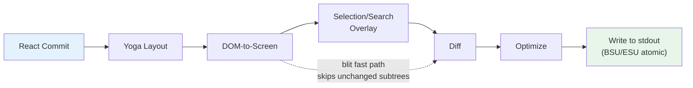
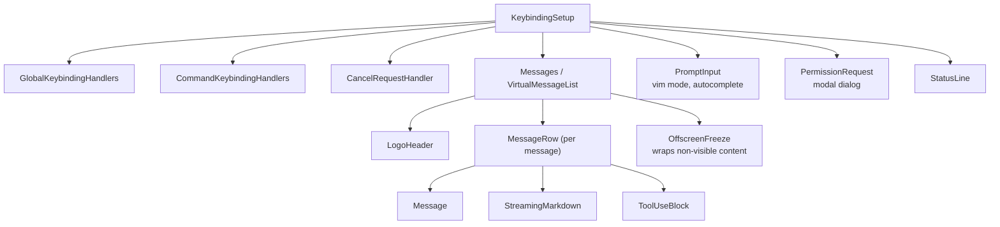

# Chapter 13: The Terminal UI

# 第 13 章：终端 UI

## Why Build a Custom Renderer?

## 为什么要构建自定义渲染器？

The terminal is not a browser. There is no DOM, no CSS engine, no compositor, no retained-mode graphics pipeline. There is a stream of bytes going to stdout and a stream of bytes coming from stdin. Everything between those two streams -- layout, styling, diffing, hit-testing, scrolling, selection -- has to be invented from scratch.

终端不是浏览器。这里没有 DOM、没有 CSS 引擎、没有合成器，也没有保留模式（retained-mode）的图形管线。有的只是一股流向 stdout 的字节流，和一股来自 stdin 的字节流。这两股字节流之间的一切——布局、样式、diff、命中测试、滚动、选择——都必须从零发明出来。

Claude Code needs a reactive UI. It has a prompt input, streaming markdown output, permission dialogs, progress spinners, scrollable message lists, search highlighting, and a vim-mode editor. React is the obvious choice for declaring this kind of component tree. But React needs a host environment to render into, and terminals do not provide one.

Claude Code 需要一个响应式 UI。它包含提示输入框、流式 markdown 输出、权限对话框、进度旋转指示器、可滚动的消息列表、搜索高亮，以及一个 vim 模式编辑器。要声明式地描述这样一棵组件树，React 是显而易见的选择。但 React 需要一个宿主环境来进行渲染，而终端并不提供这样的环境。

Ink is the standard answer: a React renderer for terminals, built on Yoga for flexbox layout. Claude Code started with Ink, then forked it beyond recognition. The stock version allocates one JavaScript object per cell per frame -- on a 200x120 terminal, that is 24,000 objects created and garbage-collected every 16ms. It diffs at the string level, comparing entire rows of ANSI-encoded text. It has no concept of blit optimization, no double buffering, no cell-level dirty tracking. For a simple CLI dashboard refreshing once per second, this is fine. For an LLM agent streaming tokens at 60fps while the user scrolls through a conversation with hundreds of messages, it is a non-starter.

Ink 是标准答案：一个面向终端的 React 渲染器，基于 Yoga 实现 flexbox 布局。Claude Code 最初使用 Ink，随后将其改造到面目全非的程度。原版 Ink 每帧为每个单元格分配一个 JavaScript 对象——在一个 200x120 的终端上，这意味着每 16ms 就要创建并垃圾回收 24,000 个对象。它在字符串级别做 diff，比较整行 ANSI 编码的文本。它没有 blit 优化的概念，没有双缓冲，也没有单元格级别的脏标记追踪。对于一个每秒刷新一次的简单 CLI 仪表盘，这没问题。但对于一个以 60fps 流式输出 token、同时用户还在数百条消息的对话中滚动的 LLM agent 而言，这根本行不通。

What remains in Claude Code is a custom rendering engine that shares Ink's conceptual DNA -- React reconciler, Yoga layout, ANSI output -- but reimplements the critical path: packed typed arrays instead of object-per-cell, pool-based string interning instead of string-per-frame, double-buffered rendering with cell-level diffing, and an optimizer that merges adjacent terminal writes into minimal escape sequences.

Claude Code 中最终保留下来的，是一个自定义渲染引擎：它沿袭了 Ink 的概念 DNA——React reconciler、Yoga 布局、ANSI 输出——但对关键路径进行了重新实现：用打包的类型化数组（typed array）取代每单元格一个对象，用基于池（pool）的字符串驻留（interning）取代每帧分配字符串，采用带单元格级 diff 的双缓冲渲染，以及一个把相邻终端写操作合并为最小转义序列的优化器。

The result runs at 60fps on a 200-column terminal while streaming tokens from Claude. To understand how, we need to examine four layers: the custom DOM that React reconciles against, the rendering pipeline that converts that DOM into terminal output, the pool-based memory management that keeps the system alive for hours-long sessions without drowning in garbage collection, and the component architecture that ties it all together.

最终成果是：在一个 200 列的终端上以 60fps 运行，同时还在流式输出来自 Claude 的 token。要理解它是如何做到的，我们需要考察四个层次：React 用来进行协调（reconcile）的自定义 DOM、把该 DOM 转换为终端输出的渲染管线、让系统在长达数小时的会话中保持运行而不至于被垃圾回收淹没的基于池的内存管理，以及把这一切串联起来的组件架构。

---

## The Custom DOM

## 自定义 DOM

React's reconciler needs something to reconcile against. In the browser, that's the DOM. In Claude Code's terminal, it is a custom in-memory tree with seven element types and one text node type.

React 的 reconciler 需要一个协调的对象。在浏览器中，这个对象是 DOM。在 Claude Code 的终端中，它是一棵自定义的内存树，包含七种元素类型和一种文本节点类型。

The element types map directly to terminal rendering concepts:

这些元素类型直接对应到终端渲染概念：

- **`ink-root`** -- the document root, one per Ink instance
- **`ink-root`** —— 文档根节点，每个 Ink 实例一个
- **`ink-box`** -- a flexbox container, the terminal equivalent of a `<div>`
- **`ink-box`** —— 一个 flexbox 容器，相当于终端中的 `<div>`
- **`ink-text`** -- a text node with a Yoga measure function for word wrapping
- **`ink-text`** —— 一个带 Yoga measure 函数、用于自动换行的文本节点
- **`ink-virtual-text`** -- nested styled text inside another text node (automatically promoted from `ink-text` when inside a text context)
- **`ink-virtual-text`** —— 嵌套在另一个文本节点内部的带样式文本（当处于文本上下文中时，会自动从 `ink-text` 提升而来）
- **`ink-link`** -- a hyperlink, rendered via OSC 8 escape sequences
- **`ink-link`** —— 一个超链接，通过 OSC 8 转义序列渲染
- **`ink-progress`** -- a progress indicator
- **`ink-progress`** —— 一个进度指示器
- **`ink-raw-ansi`** -- pre-rendered ANSI content with known dimensions, used for syntax-highlighted code blocks
- **`ink-raw-ansi`** —— 已知尺寸的预渲染 ANSI 内容，用于语法高亮的代码块

Each `DOMElement` carries the state that the rendering pipeline needs:

每个 `DOMElement` 都携带渲染管线所需的状态：

```typescript
// Illustrative — actual interface extends this significantly
interface DOMElement {
  yogaNode: YogaNode;           // Flexbox layout node
  style: Styles;                // CSS-like properties mapped to Yoga
  attributes: Map<string, DOMNodeAttribute>;
  childNodes: (DOMElement | TextNode)[];
  dirty: boolean;               // Needs re-rendering
  _eventHandlers: EventHandlerMap; // Separated from attributes
  scrollTop: number;            // Imperative scroll state
  pendingScrollDelta: number;
  stickyScroll: boolean;
  debugOwnerChain?: string;     // React component stack for debug
}
```

The separation of `_eventHandlers` from `attributes` is deliberate. In React, handler identity changes on every render (unless manually memoized). If handlers were stored as attributes, every render would mark the node dirty and trigger a full repaint. By storing them separately, the reconciler's `commitUpdate` can update handlers without dirtying the node.

把 `_eventHandlers` 从 `attributes` 中分离出来是有意为之的。在 React 中，handler 的标识（identity）在每次渲染时都会变化（除非手动 memo 化）。如果把 handler 当作 attribute 来存储，那么每次渲染都会把节点标记为脏并触发一次完整重绘。通过将其单独存储，reconciler 的 `commitUpdate` 就能在不弄脏节点的前提下更新 handler。

The `markDirty()` function is the bridge between DOM mutations and the rendering pipeline. When any node's content changes, `markDirty()` walks up through every ancestor, setting `dirty = true` on each element and calling `yogaNode.markDirty()` on leaf text nodes. This is how a single character change in a deeply nested text node schedules a re-render of the entire path to the root -- but only that path. Sibling subtrees remain clean and can be blitted from the previous frame.

`markDirty()` 函数是 DOM 变更与渲染管线之间的桥梁。当任何节点的内容发生变化时，`markDirty()` 会向上遍历每一个祖先节点，在每个元素上设置 `dirty = true`，并在叶子文本节点上调用 `yogaNode.markDirty()`。这正是为什么一个深度嵌套文本节点中的单个字符变化，会调度从该节点到根节点整条路径的重新渲染——但仅限于这条路径。兄弟子树保持干净，可以直接从上一帧 blit（位块传输）过来。

The `ink-raw-ansi` element type deserves special mention. When a code block has already been syntax-highlighted (producing ANSI escape sequences), re-parsing those sequences to extract characters and styles would be wasteful. Instead, the pre-highlighted content is wrapped in an `ink-raw-ansi` node with `rawWidth` and `rawHeight` attributes that tell Yoga the exact dimensions. The rendering pipeline writes the raw ANSI content directly to the output buffer without decomposing it into individual styled characters. This makes syntax-highlighted code blocks essentially zero-cost after the initial highlighting pass -- the most expensive visual element in the UI is also the cheapest to render.

`ink-raw-ansi` 元素类型值得特别一提。当一个代码块已经完成语法高亮（生成了 ANSI 转义序列）时，再去重新解析这些序列以提取字符和样式将是一种浪费。取而代之，预高亮的内容被包裹在一个 `ink-raw-ansi` 节点中，并带有 `rawWidth` 和 `rawHeight` 属性，告诉 Yoga 它的确切尺寸。渲染管线会把原始 ANSI 内容直接写入输出缓冲区，而不将其分解为一个个带样式的字符。这使得语法高亮的代码块在初次高亮处理之后基本上是零成本的——UI 中视觉上最昂贵的元素，恰恰也是渲染起来最廉价的。

The `ink-text` node's measure function is worth understanding because it runs inside Yoga's layout pass, which is synchronous and blocking. The function receives the available width and must return the text's dimensions. It performs word wrapping (respecting the `wrap` style prop: `wrap`, `truncate`, `truncate-start`, `truncate-middle`), accounts for grapheme cluster boundaries (so it does not split a multi-codepoint emoji across lines), measures CJK double-width characters correctly (each counts as 2 columns), and strips ANSI escape codes from the width calculation (escape sequences have zero visual width). All of this must complete in microseconds per node, because a conversation with 50 visible text nodes means 50 measure function calls per layout pass.

`ink-text` 节点的 measure 函数值得理解，因为它运行在 Yoga 的布局阶段（layout pass）之内，而这个阶段是同步且阻塞的。该函数接收可用宽度，并必须返回文本的尺寸。它会执行自动换行（遵循 `wrap` 样式属性：`wrap`、`truncate`、`truncate-start`、`truncate-middle`），考虑字形簇（grapheme cluster）的边界（这样它就不会把一个多码点的 emoji 拆到两行），正确测量 CJK 全角字符的宽度（每个算作 2 列），并在宽度计算中剥离 ANSI 转义码（转义序列的视觉宽度为零）。所有这些都必须在每个节点上以微秒级完成，因为一段有 50 个可见文本节点的对话，意味着每个布局阶段要进行 50 次 measure 函数调用。

---

## The React Fiber Container

## React Fiber 容器

The reconciler bridge uses `react-reconciler` to create a custom host config. This is the same API that React DOM and React Native use. The key difference: Claude Code runs in `ConcurrentRoot` mode.

reconciler 桥接层使用 `react-reconciler` 来创建一个自定义的 host config。这与 React DOM 和 React Native 所使用的是同一套 API。关键区别在于：Claude Code 运行在 `ConcurrentRoot` 模式下。

```typescript
createContainer(rootNode, ConcurrentRoot, ...)
```

ConcurrentRoot enables React's concurrent features -- Suspense for lazy-loaded syntax highlighting, transitions for non-blocking state updates during streaming. The alternative, `LegacyRoot`, would force synchronous rendering and block the event loop during heavy markdown re-parses.

ConcurrentRoot 启用了 React 的并发特性——用 Suspense 实现按需加载的语法高亮，用 transition 实现流式输出期间非阻塞的状态更新。另一个选项 `LegacyRoot` 则会强制同步渲染，并在繁重的 markdown 重新解析期间阻塞事件循环。

The host config methods map React operations to the custom DOM:

host config 中的方法把 React 操作映射到自定义 DOM 上：

- **`createInstance(type, props)`** creates a `DOMElement` via `createNode()`, applies initial styles and attributes, attaches event handlers, and captures the React component owner chain for debug attribution. The owner chain is stored as `debugOwnerChain` and used by the `CLAUDE_CODE_DEBUG_REPAINTS` mode to attribute full-screen resets to specific components
- **`createInstance(type, props)`** 通过 `createNode()` 创建一个 `DOMElement`，应用初始样式和属性，挂接事件 handler，并捕获 React 组件的 owner chain 以便调试归因。owner chain 以 `debugOwnerChain` 的形式存储，供 `CLAUDE_CODE_DEBUG_REPAINTS` 模式用来把全屏重置归因到具体的组件
- **`createTextInstance(text)`** creates a `TextNode` -- but only if we are inside a text context. The reconciler enforces that raw strings must be wrapped in `<Text>`. Attempting to create a text node outside a text context throws, catching a class of bugs at reconciliation time rather than at render time
- **`createTextInstance(text)`** 创建一个 `TextNode`——但仅当我们处于文本上下文中时才会创建。reconciler 强制要求原始字符串必须包裹在 `<Text>` 中。在文本上下文之外尝试创建文本节点会抛出异常，从而在协调（reconciliation）阶段而非渲染阶段捕获一类 bug
- **`commitUpdate(node, type, oldProps, newProps)`** diffs old and new props via a shallow comparison, then applies only what changed. Styles, attributes, and event handlers each have their own update path. The diff function returns `undefined` if nothing changed, avoiding unnecessary DOM mutations entirely
- **`commitUpdate(node, type, oldProps, newProps)`** 通过浅比较对新旧 props 做 diff，然后只应用发生变化的部分。样式、属性和事件 handler 各有自己的更新路径。如果没有任何变化，diff 函数返回 `undefined`，从而彻底避免不必要的 DOM 变更
- **`removeChild(parent, child)`** removes the node from the tree, recursively frees Yoga nodes (calling `unsetMeasureFunc()` before `free()` to avoid accessing freed WASM memory), and notifies the focus manager
- **`removeChild(parent, child)`** 把节点从树中移除，递归释放 Yoga 节点（在 `free()` 之前调用 `unsetMeasureFunc()`，以避免访问已释放的 WASM 内存），并通知 focus manager
- **`hideInstance(node)` / `unhideInstance(node)`** toggles `isHidden` and switches the Yoga node between `Display.None` and `Display.Flex`. This is React's mechanism for Suspense fallback transitions
- **`hideInstance(node)` / `unhideInstance(node)`** 切换 `isHidden`，并在 `Display.None` 与 `Display.Flex` 之间切换 Yoga 节点。这是 React 用于 Suspense fallback 过渡的机制
- **`resetAfterCommit(container)`** is the critical hook: it calls `rootNode.onComputeLayout()` to run Yoga, then `rootNode.onRender()` to schedule the terminal paint
- **`resetAfterCommit(container)`** 是关键钩子：它调用 `rootNode.onComputeLayout()` 来运行 Yoga，然后调用 `rootNode.onRender()` 来调度终端绘制

The reconciler tracks two performance counters per commit cycle: Yoga layout time (`lastYogaMs`) and total commit time (`lastCommitMs`). These flow into the `FrameEvent` that the Ink class reports, enabling performance monitoring in production.

reconciler 在每个 commit 周期中追踪两个性能计数器：Yoga 布局时间（`lastYogaMs`）和总 commit 时间（`lastCommitMs`）。这些数据汇入 Ink 类上报的 `FrameEvent`，从而在生产环境中实现性能监控。

The event system mirrors the browser's capture/bubble model. A `Dispatcher` class implements full event propagation with three phases: capture (root to target), at-target, and bubble (target to root). Event types map to React scheduling priorities -- discrete for keyboard and click (highest priority, processed immediately), continuous for scroll and resize (can be deferred). The dispatcher wraps all event processing in `reconciler.discreteUpdates()` for proper React batching.

事件系统镜像了浏览器的捕获/冒泡模型。一个 `Dispatcher` 类实现了完整的三阶段事件传播：捕获（capture，从根到目标）、目标阶段（at-target）和冒泡（bubble，从目标到根）。事件类型映射到 React 的调度优先级——键盘和点击为 discrete（最高优先级，立即处理），滚动和 resize 为 continuous（可被延后）。dispatcher 把所有事件处理都包裹在 `reconciler.discreteUpdates()` 中，以实现正确的 React 批处理。

When you press a key in the terminal, the resulting `KeyboardEvent` is dispatched through the custom DOM tree, bubbling from the focused element up to the root exactly as a keyboard event would bubble through browser DOM elements. Any handler along the path can call `stopPropagation()` or `preventDefault()`, and the semantics are identical to the browser specification.

当你在终端中按下一个键时，产生的 `KeyboardEvent` 会通过自定义 DOM 树进行派发，从聚焦元素一路冒泡到根节点，方式与键盘事件在浏览器 DOM 元素中冒泡完全一致。路径上的任意 handler 都可以调用 `stopPropagation()` 或 `preventDefault()`，其语义与浏览器规范完全相同。

---

## The Rendering Pipeline

## 渲染管线

Every frame traverses seven stages, each timed individually:

每一帧都会经历七个阶段，每个阶段都被单独计时：



Each stage is timed individually and reported in `FrameEvent.phases`. This per-stage instrumentation is essential for diagnosing performance issues: when a frame takes 30ms, you need to know whether the bottleneck is Yoga re-measuring text (stage 2), the renderer walking a large dirty subtree (stage 3), or stdout backpressure from a slow terminal (stage 7). The answer determines the fix.

每个阶段都被单独计时，并上报到 `FrameEvent.phases` 中。这种逐阶段的埋点对于诊断性能问题至关重要：当一帧耗时 30ms 时，你需要知道瓶颈究竟是 Yoga 在重新测量文本（阶段 2）、渲染器在遍历一棵庞大的脏子树（阶段 3），还是来自慢速终端的 stdout 背压（阶段 7）。答案决定了修复方案。

**Stage 1: React commit and Yoga layout.** The reconciler processes state updates and calls `resetAfterCommit`. This sets the root node's width to `terminalColumns` and runs `yogaNode.calculateLayout()`. Yoga computes the entire flexbox tree in one pass, following the CSS flexbox specification: it resolves flex-grow, flex-shrink, padding, margin, gap, alignment, and wrapping across all nodes. The results -- `getComputedWidth()`, `getComputedHeight()`, `getComputedLeft()`, `getComputedTop()` -- are cached per node. For `ink-text` nodes, Yoga calls the custom measure function (`measureTextNode`) during layout, which computes text dimensions via word wrapping and grapheme measurement. This is the most expensive per-node operation: it must handle Unicode grapheme clusters, CJK double-width characters, emoji sequences, and ANSI escape codes embedded in text content.

**阶段 1：React commit 与 Yoga 布局。** reconciler 处理状态更新并调用 `resetAfterCommit`。这一步把根节点的宽度设置为 `terminalColumns`，并运行 `yogaNode.calculateLayout()`。Yoga 在一次遍历中计算整棵 flexbox 树，遵循 CSS flexbox 规范：它在所有节点上解析 flex-grow、flex-shrink、padding、margin、gap、对齐和换行。计算结果——`getComputedWidth()`、`getComputedHeight()`、`getComputedLeft()`、`getComputedTop()`——会按节点缓存。对于 `ink-text` 节点，Yoga 在布局期间调用自定义的 measure 函数（`measureTextNode`），后者通过自动换行和字形测量来计算文本尺寸。这是每个节点上最昂贵的操作：它必须处理 Unicode 字形簇、CJK 全角字符、emoji 序列，以及嵌入在文本内容中的 ANSI 转义码。

**Stage 2: DOM-to-screen.** The renderer walks the DOM tree depth-first, writing characters and styles into a `Screen` buffer. Each character becomes a packed cell. The output is a complete frame: every cell on the terminal has a defined character, style, and width.

**阶段 2：DOM 到屏幕（DOM-to-screen）。** 渲染器以深度优先的方式遍历 DOM 树，把字符和样式写入一个 `Screen` 缓冲区。每个字符成为一个打包的单元格。输出是一帧完整画面：终端上的每个单元格都有确定的字符、样式和宽度。

**Stage 3: Overlay.** Text selection and search highlighting modify the screen buffer in-place, flipping style IDs on matching cells. Selection applies inverse video to create the familiar "highlighted text" appearance. Search highlighting applies a more aggressive visual treatment: inverse + yellow foreground + bold + underline for the current match, inverse only for other matches. This contaminates the buffer -- tracked by a `prevFrameContaminated` flag so the next frame knows to skip the blit fast-path. The contamination is a deliberate tradeoff: modifying the buffer in-place avoids allocating a separate overlay buffer (saving 48KB on a 200x120 terminal), at the cost of one full-damage frame after the overlay is cleared.

**阶段 3：叠加层（Overlay）。** 文本选择和搜索高亮会就地（in-place）修改屏幕缓冲区，翻转匹配单元格上的样式 ID。选择会应用反显（inverse video）以呈现我们熟悉的“高亮文本”外观。搜索高亮则采用更激进的视觉处理：当前匹配项为反显 + 黄色前景 + 加粗 + 下划线，其他匹配项仅做反显。这会“污染”缓冲区——通过一个 `prevFrameContaminated` 标志来追踪，以便下一帧知道要跳过 blit 快速路径。这种污染是一种刻意的权衡：就地修改缓冲区避免了为叠加层另行分配一个缓冲区（在 200x120 的终端上节省 48KB），代价是在叠加层被清除之后会产生一帧完整损坏（full-damage）的画面。

**Stage 4: Diff.** The new screen is compared cell-by-cell against the front frame's screen. Only changed cells produce output. The comparison is two integer comparisons per cell (the two packed `Int32` words), and the diff walks the damage rectangle rather than the full screen. On a steady-state frame (only a spinner ticking), this might produce patches for 3 cells out of 24,000. Each patch is a `{ type: 'stdout', content: string }` object containing the cursor-move sequence and the ANSI-encoded cell content.

**阶段 4：Diff。** 新屏幕逐单元格地与前置帧（front frame）的屏幕进行比较。只有发生变化的单元格才会产生输出。比较过程是每个单元格两次整数比较（两个打包的 `Int32` 字），并且 diff 只遍历损坏矩形（damage rectangle）而非整个屏幕。在一个稳态帧（只有一个旋转指示器在跳动）上，这可能只为 24,000 个单元格中的 3 个生成 patch。每个 patch 都是一个 `{ type: 'stdout', content: string }` 对象，包含光标移动序列和 ANSI 编码的单元格内容。

**Stage 5: Optimize.** Adjacent patches on the same row are merged into a single write. Redundant cursor moves are eliminated -- if patch N ends at column 10 and patch N+1 starts at column 11, the cursor is already in the right position and no move sequence is needed. Style transitions are pre-serialized via the `StylePool.transition()` cache, so changing from "bold red" to "dim green" is a single cached string lookup rather than a diff-and-serialize operation. The optimizer typically reduces the byte count by 30-50% compared to naive per-cell output.

**阶段 5：优化（Optimize）。** 同一行上相邻的 patch 会被合并为一次写操作。冗余的光标移动会被消除——如果 patch N 在第 10 列结束，而 patch N+1 在第 11 列开始，那么光标已经处在正确位置，无需任何移动序列。样式过渡通过 `StylePool.transition()` 缓存被预先序列化，因此从“加粗红色”切换到“暗淡绿色”只是一次缓存的字符串查找，而非一次“diff 加序列化”的操作。与朴素的逐单元格输出相比，该优化器通常能把字节数减少 30-50%。

**Stage 6: Write.** The optimized patches are serialized to ANSI escape sequences and written to stdout in a single `write()` call, wrapped in synchronous update markers (BSU/ESU) on terminals that support them. BSU (Begin Synchronized Update, `ESC [ ? 2026 h`) tells the terminal to buffer all following output, and ESU (`ESC [ ? 2026 l`) tells it to flush. This eliminates visible tearing on terminals that support the protocol -- the entire frame appears atomically.

**阶段 6：写入（Write）。** 优化后的 patch 被序列化为 ANSI 转义序列，并在一次 `write()` 调用中写入 stdout；在支持的终端上，这些内容会被包裹在同步更新标记（BSU/ESU）之间。BSU（Begin Synchronized Update，`ESC [ ? 2026 h`）告诉终端缓冲后续所有输出，而 ESU（`ESC [ ? 2026 l`）则告诉它进行刷新。在支持该协议的终端上，这消除了可见的画面撕裂——整帧画面以原子方式一次性出现。

Every frame reports its timing breakdown via a `FrameEvent` object:

每一帧都通过一个 `FrameEvent` 对象上报其计时分解：

```typescript
interface FrameEvent {
  durationMs: number;
  phases: {
    renderer: number;    // DOM-to-screen
    diff: number;        // Screen comparison
    optimize: number;    // Patch merging
    write: number;       // stdout write
    yoga: number;        // Layout computation
  };
  yogaVisited: number;   // Nodes traversed
  yogaMeasured: number;  // Nodes that ran measure()
  yogaCacheHits: number; // Nodes with cached layout
  flickers: FlickerEvent[];  // Full-reset attributions
}
```

When `CLAUDE_CODE_DEBUG_REPAINTS` is enabled, full-screen resets are attributed to their source React component via `findOwnerChainAtRow()`. This is the terminal equivalent of React DevTools' "Highlight Updates" -- it shows you which component caused the entire screen to repaint, which is the most expensive thing that can happen in the rendering pipeline.

当 `CLAUDE_CODE_DEBUG_REPAINTS` 被启用时，全屏重置会通过 `findOwnerChainAtRow()` 被归因到其来源的 React 组件。这相当于终端版的 React DevTools “Highlight Updates”——它向你展示是哪个组件导致了整个屏幕重绘，而整屏重绘是渲染管线中可能发生的最昂贵的事情。

The blit optimization deserves special attention. When a node is not dirty and its position has not changed since the previous frame (checked via a node cache), the renderer copies cells directly from `prevScreen` to the current screen instead of re-rendering the subtree. This makes steady-state frames extremely cheap -- on a typical frame where only a spinner is ticking, the blit covers 99% of the screen and only the spinner's 3-4 cells are re-rendered from scratch.

blit 优化值得特别关注。当一个节点不是脏的、且自上一帧以来位置没有变化时（通过节点缓存来检查），渲染器会直接把单元格从 `prevScreen` 复制到当前屏幕，而不是重新渲染该子树。这使得稳态帧极其廉价——在一个只有旋转指示器在跳动的典型帧上，blit 覆盖了屏幕的 99%，只有旋转指示器那 3-4 个单元格是从头重新渲染的。

The blit is disabled under three conditions:

blit 在以下三种情况下会被禁用：

1. **`prevFrameContaminated` is true** -- the selection overlay or a search highlight modified the front frame's screen buffer in-place, so those cells cannot be trusted as the "correct" previous state
1. **`prevFrameContaminated` 为 true** —— 选择叠加层或搜索高亮就地修改了前置帧的屏幕缓冲区，因此这些单元格不能被当作“正确”的上一帧状态来信任
2. **An absolute-positioned node was removed** -- absolute positioning means the node could have painted over non-sibling cells, and those cells need to be re-rendered from the elements that actually own them
2. **某个绝对定位的节点被移除** —— 绝对定位意味着该节点可能已经覆盖绘制了非兄弟单元格，而这些单元格需要由真正拥有它们的元素重新渲染
3. **Layout shifted** -- any node's cached position differs from its current computed position, meaning the blit would copy cells to the wrong coordinates
3. **布局发生了位移** —— 任何节点的缓存位置与其当前计算出的位置不一致，意味着 blit 会把单元格复制到错误的坐标上

The damage rectangle (`screen.damage`) tracks the bounding box of all written cells during rendering. The diff only examines rows within this rectangle, skipping entirely unchanged regions. On a 120-row terminal where a streaming message occupies rows 80-100, the diff checks 20 rows instead of 120 -- a 6x reduction in comparison work.

损坏矩形（`screen.damage`）追踪渲染期间所有被写入单元格的包围盒（bounding box）。diff 只检查该矩形内的行，完全跳过未变化的区域。在一个 120 行的终端上，若一条流式消息占据第 80-100 行，diff 只检查 20 行而非 120 行——比较工作量减少了 6 倍。

---

## Double-Buffer Rendering and Frame Scheduling

## 双缓冲渲染与帧调度

The Ink class maintains two frame buffers:

Ink 类维护着两个帧缓冲区：

```typescript
private frontFrame: Frame;  // Currently displayed on terminal
private backFrame: Frame;   // Being rendered into
```

Each `Frame` contains:

每个 `Frame` 包含：

- `screen: Screen` -- the cell buffer (packed `Int32Array`)
- `screen: Screen` —— 单元格缓冲区（打包的 `Int32Array`）
- `viewport: Size` -- terminal dimensions at render time
- `viewport: Size` —— 渲染时刻的终端尺寸
- `cursor: { x, y, visible }` -- where to park the terminal cursor
- `cursor: { x, y, visible }` —— 终端光标停泊的位置
- `scrollHint` -- DECSTBM (scroll region) optimization hint for alt-screen mode
- `scrollHint` —— 用于备用屏幕（alt-screen）模式的 DECSTBM（滚动区域）优化提示
- `scrollDrainPending` -- whether a ScrollBox has remaining scroll delta to process
- `scrollDrainPending` —— 是否还有某个 ScrollBox 残留的滚动增量（scroll delta）需要处理

After each render, the frames swap: `backFrame = frontFrame; frontFrame = newFrame`. The old front frame becomes the next back frame, providing the `prevScreen` for blit optimization and the baseline for cell-level diffing.

每次渲染之后，两个帧会交换：`backFrame = frontFrame; frontFrame = newFrame`。旧的前置帧成为下一个后置帧，为 blit 优化提供 `prevScreen`，也为单元格级 diff 提供基准。

This double-buffer design eliminates allocation. Instead of creating a new `Screen` every frame, the renderer reuses the back frame's buffer. The swap is a pointer assignment. The pattern is borrowed from graphics programming, where double buffering prevents tearing by ensuring the display reads from a complete frame while the renderer writes to the other. In the terminal context, tearing is not the concern (the BSU/ESU protocol handles that); the concern is GC pressure from allocating and discarding `Screen` objects containing 48KB+ of typed arrays every 16ms.

这种双缓冲设计消除了内存分配。渲染器不会每帧创建一个新的 `Screen`，而是复用后置帧的缓冲区。交换只是一次指针赋值。这一模式借鉴自图形编程，在那里双缓冲通过确保显示器从一帧完整画面读取、同时渲染器向另一帧写入，来防止画面撕裂。在终端这个语境下，撕裂并不是关注点（BSU/ESU 协议已经处理了它）；关注点在于每 16ms 分配并丢弃一个包含 48KB 以上类型化数组的 `Screen` 对象所带来的 GC 压力。

Render scheduling uses lodash `throttle` at 16ms (approximately 60fps), with leading and trailing edges enabled:

渲染调度使用 lodash 的 `throttle`，间隔为 16ms（约 60fps），并同时启用前沿（leading）和后沿（trailing）触发：

```typescript
const deferredRender = () => queueMicrotask(this.onRender);
this.scheduleRender = throttle(deferredRender, FRAME_INTERVAL_MS, {
  leading: true,
  trailing: true,
});
```

The microtask deferral is not accidental. `resetAfterCommit` runs before React's layout effects phase. If the renderer ran synchronously here, it would miss cursor declarations set in `useLayoutEffect`. The microtask runs after layout effects but within the same event-loop tick -- the terminal sees a single, consistent frame.

这种微任务（microtask）延迟并非偶然。`resetAfterCommit` 在 React 的 layout effects 阶段之前运行。如果渲染器在此处同步运行，它就会错过在 `useLayoutEffect` 中设置的光标声明。微任务在 layout effects 之后、但仍在同一个事件循环 tick 之内运行——终端看到的是单一且一致的一帧。

For scroll operations, a separate `setTimeout` at 4ms (FRAME_INTERVAL_MS >> 2) provides faster scroll frames without interfering with the throttle. Scroll mutations bypass React entirely: `ScrollBox.scrollBy()` mutates DOM node properties directly, calls `markDirty()`, and schedules a render via microtask. No React state update, no reconciliation overhead, no re-rendering of the entire message list for a single wheel event.

对于滚动操作，一个单独的、间隔为 4ms（FRAME_INTERVAL_MS >> 2）的 `setTimeout` 提供了更快的滚动帧，且不会干扰 throttle。滚动变更完全绕过 React：`ScrollBox.scrollBy()` 直接修改 DOM 节点属性，调用 `markDirty()`，并通过微任务调度一次渲染。没有 React 状态更新，没有协调开销，也不会为单个滚轮事件重新渲染整个消息列表。

**Resize handling** is synchronous, not debounced. When the terminal resizes, `handleResize` updates dimensions immediately to keep layout consistent. For alt-screen mode, it resets frame buffers and defers `ERASE_SCREEN` into the next atomic BSU/ESU paint block rather than writing it immediately. Writing the erase synchronously would leave the screen blank for the ~80ms the render takes; deferring it into the atomic block means old content stays visible until the new frame is fully ready.

**Resize 处理** 是同步的，而非防抖（debounce）的。当终端尺寸变化时，`handleResize` 会立即更新尺寸以保持布局一致。对于 alt-screen 模式，它会重置帧缓冲区，并把 `ERASE_SCREEN` 延后到下一个原子的 BSU/ESU 绘制块中，而不是立即写入。同步地写入擦除指令会让屏幕在渲染所需的约 80ms 内保持空白；把它延后到原子块中，则意味着旧内容会一直可见，直到新帧完全准备就绪。

**Alt-screen management** adds another layer. The `AlternateScreen` component enters DEC 1049 alternate screen buffer on mount, constraining height to terminal rows. It uses `useInsertionEffect` -- not `useLayoutEffect` -- to ensure the `ENTER_ALT_SCREEN` escape sequence reaches the terminal before the first render frame. Using `useLayoutEffect` would be too late: the first frame would render to the main screen buffer, producing a visible flash before the switch. `useInsertionEffect` runs before layout effects and before the browser (or terminal) would paint, making the transition seamless.

**Alt-screen 管理** 又增加了一层。`AlternateScreen` 组件在挂载时进入 DEC 1049 备用屏幕缓冲区，并把高度约束为终端行数。它使用 `useInsertionEffect`——而非 `useLayoutEffect`——以确保 `ENTER_ALT_SCREEN` 转义序列在第一帧渲染之前抵达终端。使用 `useLayoutEffect` 会太迟：第一帧会被渲染到主屏幕缓冲区上，从而在切换之前产生一次可见的闪烁。`useInsertionEffect` 在 layout effects 之前、也在浏览器（或终端）进行绘制之前运行，使过渡无缝衔接。

---

## Pool-Based Memory: Why Interning Matters

## 基于内存池的内存管理：为何驻留（Interning）至关重要

A 200-column by 120-row terminal has 24,000 cells. If each cell were a JavaScript object with a `char` string, a `style` string, and a `hyperlink` string, that is 72,000 string allocations per frame -- plus 24,000 object allocations for the cells themselves. At 60fps, that is 5.76 million allocations per second. V8's garbage collector can handle this, but not without pauses that show up as dropped frames. The GC pauses are typically 1-5ms, but they are unpredictable: they might hit during a streaming token update, causing a visible stutter exactly when the user is watching the output.

一个 200 列 120 行的终端有 24,000 个单元格（cell）。如果每个单元格都是一个带有 `char` 字符串、`style` 字符串和 `hyperlink` 字符串的 JavaScript 对象，那么每一帧就有 72,000 次字符串分配——再加上单元格本身的 24,000 次对象分配。在 60fps 下，这意味着每秒 576 万次分配。V8 的垃圾回收器能够应付这个量级，但代价是会出现表现为掉帧的停顿。GC 停顿通常为 1-5ms，但它们不可预测：它们可能恰好在一次流式 token 更新期间触发，导致用户正盯着输出时出现可见的卡顿。

Claude Code eliminates this entirely with packed typed arrays and three interning pools. The result: zero per-frame object allocations for the cell buffer. The only allocations are in the pools themselves (amortized, since most characters and styles are interned on the first frame and reused thereafter) and in the patch strings produced by the diff (unavoidable, since stdout.write requires string or Buffer arguments).

Claude Code 通过打包的类型化数组（typed arrays）和三个驻留池（interning pools）彻底消除了这一问题。结果是：单元格缓冲区每帧的对象分配为零。唯一的分配发生在池本身之中（这部分会被摊销，因为大多数字符和样式在第一帧就被驻留，此后被重复使用），以及 diff 产生的补丁字符串中（这无可避免，因为 stdout.write 需要 string 或 Buffer 参数）。

**The cell layout** uses two `Int32` words per cell, stored in a contiguous `Int32Array`:

**单元格布局** 每个单元格使用两个 `Int32` 字（word），存储在一个连续的 `Int32Array` 中：

```
word0: charId        (32 bits, index into CharPool)
word1: styleId[31:17] | hyperlinkId[16:2] | width[1:0]
```

A parallel `BigInt64Array` view over the same buffer enables bulk operations -- clearing a row is a single `fill()` call on 64-bit words instead of zeroing individual fields.

在同一缓冲区上建立的一个并行 `BigInt64Array` 视图使批量操作成为可能——清空一行只需对 64 位字执行一次 `fill()` 调用，而不必逐个字段置零。

**CharPool** interns character strings to integer IDs. It has a fast path for ASCII: a 128-entry `Int32Array` maps character codes directly to pool indices, avoiding the `Map` lookup entirely. Multi-byte characters (emoji, CJK ideographs) fall through to a `Map<string, number>`. Index 0 is always space, index 1 is always empty string.

**CharPool** 将字符串驻留为整数 ID。它为 ASCII 提供了一条快速路径：一个 128 项的 `Int32Array` 直接将字符码映射到池索引，从而完全避开 `Map` 查找。多字节字符（emoji、CJK 表意文字）则落入一个 `Map<string, number>`。索引 0 始终是空格，索引 1 始终是空字符串。

```typescript
export class CharPool {
  private strings: string[] = [' ', '']
  private ascii: Int32Array = initCharAscii()

  intern(char: string): number {
    if (char.length === 1) {
      const code = char.charCodeAt(0)
      if (code < 128) {
        const cached = this.ascii[code]!
        if (cached !== -1) return cached
        const index = this.strings.length
        this.strings.push(char)
        this.ascii[code] = index
        return index
      }
    }
    // Map fallback for multi-byte characters
    ...
  }
}
```

**StylePool** interns arrays of ANSI style codes to integer IDs. The clever part: bit 0 of each ID encodes whether the style has a visible effect on space characters (background color, inverse, underline). Foreground-only styles get even IDs; styles visible on spaces get odd IDs. This lets the renderer skip invisible spaces with a single bitmask check -- `if (!(styleId & 1) && charId === 0) continue` -- without looking up the style definition. The pool also caches pre-serialized ANSI transition strings between any two style IDs, so transitioning from "bold red" to "dim green" is a cached string concatenation, not a diff-and-serialize operation.

**StylePool** 将 ANSI 样式码数组驻留为整数 ID。其精巧之处在于：每个 ID 的第 0 位编码了该样式对空格字符是否有可见效果（背景色、反显、下划线）。仅前景色的样式得到偶数 ID；对空格可见的样式得到奇数 ID。这使得渲染器只需一次位掩码检查即可跳过不可见的空格——`if (!(styleId & 1) && charId === 0) continue`——而无需查找样式定义。该池还缓存了任意两个样式 ID 之间预先序列化好的 ANSI 转换字符串，因此从"粗体红色"切换到"暗淡绿色"是一次缓存的字符串拼接，而非一次 diff 并序列化的操作。

**HyperlinkPool** interns OSC 8 hyperlink URIs. Index 0 means no hyperlink.

**HyperlinkPool** 驻留 OSC 8 超链接 URI。索引 0 表示没有超链接。

All three pools are shared across the front and back frames. This is a critical design decision. Because the pools are shared, interned IDs are valid across frames: the blit optimization can copy packed cell words directly from `prevScreen` to the current screen without re-interning. The diff can compare IDs as integers without string lookups. If each frame had its own pools, the blit would need to re-intern every copied cell (looking up the string by old ID, then interning it in the new pool), which would negate most of the blit's performance benefit.

这三个池在前帧和后帧之间共享。这是一个关键的设计决策。由于池是共享的，驻留得到的 ID 在帧之间都是有效的：blit 优化可以直接将打包的单元格字从 `prevScreen` 复制到当前屏幕，而无需重新驻留。diff 可以将 ID 作为整数进行比较，无需查找字符串。如果每一帧都有自己的池，blit 就需要对每个被复制的单元格重新驻留（先用旧 ID 查出字符串，再在新池中驻留它），这将抵消 blit 带来的大部分性能收益。

Pools are periodically reset (every 5 minutes) to prevent unbounded growth during long sessions. A migration pass re-interns the front frame's live cells into the fresh pools.

为防止在长会话中无限增长，池会被周期性重置（每 5 分钟一次）。一次迁移遍历会将前帧的活跃单元格重新驻留到新的池中。

**CellWidth** handles double-wide characters with a 2-bit classification:

**CellWidth** 用一个 2 位的分类来处理双宽字符：

| Value | Meaning |
|-------|---------|
| 0 (Narrow) | Standard single-column character |
| 1 (Wide) | CJK/emoji head cell, occupies two columns |
| 2 (SpacerTail) | Second column of a wide character |
| 3 (SpacerHead) | Soft-wrap continuation marker |

| 值 | 含义 |
|-------|---------|
| 0 (Narrow) | 标准的单列字符 |
| 1 (Wide) | CJK/emoji 头单元格，占据两列 |
| 2 (SpacerTail) | 宽字符的第二列 |
| 3 (SpacerHead) | 软换行延续标记 |

This is stored in the low 2 bits of `word1`, making width checks on packed cells free -- no field extraction needed for the common case.

它存储在 `word1` 的低 2 位中，使得对打包单元格的宽度检查近乎零开销——常见情况下无需提取字段。

Additional per-cell metadata lives in parallel arrays rather than the packed cells:

额外的单元格级元数据存放在并行数组中，而非打包的单元格里：

- **`noSelect: Uint8Array`** -- per-cell flag excluding content from text selection. Used for UI chrome (borders, indicators) that should not appear in copied text
- **`noSelect: Uint8Array`** —— 单元格级标志，用于将内容排除在文本选择之外。用于那些不应出现在复制文本中的 UI 装饰元素（边框、指示符）
- **`softWrap: Int32Array`** -- per-row marker indicating word-wrap continuation. When the user selects text across a soft-wrapped line, the selection logic knows not to insert a newline at the wrap point
- **`softWrap: Int32Array`** —— 行级标记，表示自动换行的延续。当用户跨越一个软换行的行选择文本时，选择逻辑知道不要在换行点插入换行符
- **`damage: Rectangle`** -- bounding box of all written cells in the current frame. The diff only examines rows within this rectangle, skipping entirely unchanged regions
- **`damage: Rectangle`** —— 当前帧中所有被写入单元格的包围盒。diff 只检查该矩形内的行，完全跳过未变化的区域

These parallel arrays avoid widening the packed cell format (which would increase cache pressure in the diff inner loop) while providing the metadata that selection, copy, and optimization need.

这些并行数组避免了拓宽打包单元格格式（那将增加 diff 内层循环的缓存压力），同时又提供了选择、复制和优化所需的元数据。

The `Screen` also exposes a `createScreen()` factory that takes dimensions and pool references. Creating a screen zeroes the `Int32Array` via `fill(0n)` on the `BigInt64Array` view -- a single native call that clears the entire buffer in microseconds. This is used during resize (when new frame buffers are needed) and during pool migration (when the old screen's cells are re-interned into fresh pools).

`Screen` 还暴露了一个 `createScreen()` 工厂方法，它接受尺寸和池引用作为参数。创建一个 screen 时会通过在 `BigInt64Array` 视图上调用 `fill(0n)` 来将 `Int32Array` 置零——这是一次本地调用，可在微秒级清空整个缓冲区。它被用于尺寸调整时（需要新的帧缓冲区）以及池迁移时（旧 screen 的单元格被重新驻留到新池中）。

---

## The REPL Component

## REPL 组件

The REPL (`REPL.tsx`) is approximately 5,000 lines. It is the largest single component in the codebase, and for good reason: it is the orchestrator of the entire interactive experience. Everything flows through it.

REPL（`REPL.tsx`）大约有 5,000 行。它是整个代码库中最大的单个组件，这并非没有道理：它是整个交互式体验的编排者。一切都流经它。

The component is organized into roughly nine sections:

该组件大致组织为九个部分：

1. **Imports** (~100 lines) -- pulls in bootstrap state, commands, history, hooks, components, keybindings, cost tracking, notifications, swarm/team support, voice integration
1. **Imports**（约 100 行）—— 引入引导状态、命令、历史记录、hook、组件、按键绑定、成本跟踪、通知、swarm/team 支持、语音集成
2. **Feature-flagged imports** -- conditional loading of voice integration, proactive mode, brief tool, and coordinator agent via `feature()` guards with `require()`
2. **Feature-flagged imports**（特性开关式导入）—— 通过带 `require()` 的 `feature()` 守卫，按条件加载语音集成、主动模式、brief 工具和协调器 agent
3. **State management** -- extensive `useState` calls covering messages, input mode, pending permissions, dialogs, cost thresholds, session state, tool state, and agent state
3. **State management**（状态管理）—— 大量的 `useState` 调用，涵盖消息、输入模式、待处理权限、对话框、成本阈值、会话状态、工具状态和 agent 状态
4. **QueryGuard** -- manages active API call lifecycle, preventing concurrent requests from stepping on each other
4. **QueryGuard** —— 管理活跃 API 调用的生命周期，防止并发请求相互干扰
5. **Message handling** -- processes incoming messages from the query loop, normalizes ordering, manages streaming state
5. **Message handling**（消息处理）—— 处理来自查询循环的传入消息，规范化顺序，管理流式状态
6. **Tool permission flow** -- coordinates permission requests between tool use blocks and the PermissionRequest dialog
6. **Tool permission flow**（工具权限流程）—— 在工具使用块与 PermissionRequest 对话框之间协调权限请求
7. **Session management** -- resume, switch, export conversations
7. **Session management**（会话管理）—— 恢复、切换、导出对话
8. **Keybinding setup** -- wires the keybinding providers: `KeybindingSetup`, `GlobalKeybindingHandlers`, `CommandKeybindingHandlers`
8. **Keybinding setup**（按键绑定设置）—— 接入各个按键绑定提供者：`KeybindingSetup`、`GlobalKeybindingHandlers`、`CommandKeybindingHandlers`
9. **Render tree** -- composes the final UI from all the above
9. **Render tree**（渲染树）—— 由上述全部内容组合出最终的 UI

Its render tree composes the full interface in fullscreen mode:

它的渲染树在全屏模式下组合出完整的界面：



`OffscreenFreeze` is a performance optimization specific to terminal rendering. When a message scrolls above the viewport, its React element is cached and its subtree is frozen. This prevents timer-based updates (spinners, elapsed time counters) in off-screen messages from triggering terminal resets. Without this, a spinning indicator in message 3 would cause a full repaint even though the user is looking at message 47.

`OffscreenFreeze` 是一项专门针对终端渲染的性能优化。当一条消息滚动到视口上方时，它的 React 元素会被缓存，其子树会被冻结。这可以防止屏幕外消息中基于定时器的更新（spinner、已用时间计数器）触发终端重置。没有它，第 3 条消息中的旋转指示符会导致整屏重绘，即便用户正在看的是第 47 条消息。

The component is compiled by the React Compiler throughout. Instead of manual `useMemo` and `useCallback`, the compiler inserts per-expression memoization using slot arrays:

该组件全程由 React Compiler 编译。编译器不依赖手写的 `useMemo` 和 `useCallback`，而是使用槽位数组（slot arrays）插入逐表达式的记忆化：

```typescript
const $ = _c(14);  // 14 memoization slots
let t0;
if ($[0] !== dep1 || $[1] !== dep2) {
  t0 = expensiveComputation(dep1, dep2);
  $[0] = dep1; $[1] = dep2; $[2] = t0;
} else {
  t0 = $[2];
}
```

This pattern appears in every component in the codebase. It provides finer granularity than `useMemo` (which memoizes at the hook level) -- individual expressions within a render function get their own dependency tracking and caching. For a 5,000-line component like the REPL, this eliminates hundreds of potential unnecessary recomputations per render.

这种模式出现在代码库中的每一个组件里。它提供了比 `useMemo`（在 hook 层级进行记忆化）更细的粒度——渲染函数内的单个表达式获得各自的依赖跟踪和缓存。对于像 REPL 这样 5,000 行的组件，这每次渲染消除了数百次潜在的不必要重算。

---

## Selection and Search Highlighting

## 选择与搜索高亮

Text selection and search highlighting operate as screen-buffer overlays, applied after the main render but before the diff.

文本选择和搜索高亮作为屏幕缓冲区的叠加层（overlay）运作，在主渲染之后、diff 之前应用。

**Text selection** is alt-screen only. The Ink instance holds a `SelectionState` tracking anchor and focus points, drag mode (character/word/line), and captured rows that have scrolled off-screen. When the user clicks and drags, the selection handler updates these coordinates. During `onRender`, `applySelectionOverlay` walks the affected rows and modifies cell style IDs in-place using `StylePool.withSelectionBg()`, which returns a new style ID with inverse video added. This direct mutation of the screen buffer is why the `prevFrameContaminated` flag exists -- the front frame's buffer has been modified by the overlay, so the next frame cannot trust it for blit optimization and must do a full-damage diff.

**文本选择** 仅在备用屏幕（alt-screen）模式下可用。Ink 实例持有一个 `SelectionState`，跟踪锚点和焦点位置、拖拽模式（字符/单词/行）以及已滚出屏幕的被捕获行。当用户点击并拖动时，选择处理器会更新这些坐标。在 `onRender` 期间，`applySelectionOverlay` 遍历受影响的行，并使用 `StylePool.withSelectionBg()` 就地修改单元格样式 ID，该方法返回一个添加了反显视频的新样式 ID。正是这种对屏幕缓冲区的直接修改，解释了 `prevFrameContaminated` 标志为何存在——前帧的缓冲区已被叠加层修改，因此下一帧不能信任它来做 blit 优化，必须执行一次全损坏（full-damage）diff。

Mouse tracking uses SGR 1003 mode, which reports clicks, drags, and motion with column/row coordinates. The `App` component implements multi-click detection: double-click selects a word, triple-click selects a line. The detection uses a 500ms timeout and 1-cell position tolerance (the mouse can move one cell between clicks without resetting the multi-click counter). Hyperlink clicks are intentionally deferred by this timeout -- double-clicking a link selects the word instead of opening the browser, matching the behavior users expect from text editors.

鼠标跟踪使用 SGR 1003 模式，它以列/行坐标报告点击、拖拽和移动。`App` 组件实现了多次点击检测：双击选择一个单词，三击选择一行。该检测使用 500ms 的超时和 1 个单元格的位置容差（鼠标可以在两次点击之间移动一个单元格而不重置多击计数器）。超链接点击被该超时刻意延后——双击一个链接会选中单词而非打开浏览器，与用户对文本编辑器的预期行为一致。

A lost-release recovery mechanism handles the case where the user starts a drag inside the terminal, moves the mouse outside the window, and releases. The terminal reports the press and the drag, but not the release (which happened outside its window). Without recovery, the selection would be stuck in drag mode permanently. The recovery works by detecting mouse motion events with no buttons pressed -- if we are in a drag state and receive a no-button motion event, we infer that the button was released outside the window and finalize the selection.

一个"丢失释放"恢复机制处理了这样一种情况：用户在终端内部开始拖拽，将鼠标移出窗口，然后释放。终端报告了按下和拖拽，但没有报告释放（释放发生在它的窗口之外）。没有这个恢复机制，选择就会永久卡在拖拽模式中。该恢复机制通过检测没有按键被按下的鼠标移动事件来工作——如果我们处于拖拽状态并收到一个无按键的移动事件，就推断按键已在窗口外释放，并最终确定选择。

**Search highlighting** has two mechanisms running in parallel. The scan-based path (`applySearchHighlight`) walks visible cells looking for the query string and applies SGR inverse styling. The position-based path uses pre-computed `MatchPosition[]` from `scanElementSubtree()`, stored message-relative, and applies them at known offsets with a "current match" yellow highlight using stacked ANSI codes (inverse + yellow foreground + bold + underline). The yellow foreground combined with inverse becomes a yellow background -- the terminal swaps fg/bg when inverse is active. The underline is the fallback visibility marker for themes where the yellow clashes with existing background colors.

**搜索高亮** 有两套并行运作的机制。基于扫描的路径（`applySearchHighlight`）遍历可见单元格寻找查询字符串，并应用 SGR 反显样式。基于位置的路径使用来自 `scanElementSubtree()` 的预计算 `MatchPosition[]`（以消息相对方式存储），在已知偏移处应用它们，并对"当前匹配"使用叠加的 ANSI 码（反显 + 黄色前景 + 粗体 + 下划线）做黄色高亮。黄色前景与反显结合后变成黄色背景——当反显激活时，终端会交换前景/背景。下划线是一个后备的可见性标记，用于那些黄色与已有背景色冲突的主题。

**Cursor declaration** solves a subtle problem. Terminal emulators render IME (Input Method Editor) preedit text at the physical cursor position. CJK users composing characters need the cursor to be at the text input's caret, not at the bottom of the screen where the terminal would naturally park it. The `useDeclaredCursor` hook lets a component declare where the cursor should be after each frame. The Ink class reads the declared node's position from `nodeCache`, translates it to screen coordinates, and emits cursor-move sequences after the diff. Screen readers and magnifiers also track the physical cursor, so this mechanism benefits accessibility as well as CJK input.

**游标声明（Cursor declaration）** 解决了一个微妙的问题。终端模拟器会在物理游标位置渲染 IME（输入法编辑器）的预编辑文本。正在组字的 CJK 用户需要游标位于文本输入框的插入点，而不是终端自然停放它的屏幕底部。`useDeclaredCursor` hook 让组件可以声明每一帧之后游标应当处于的位置。Ink 类从 `nodeCache` 读取被声明节点的位置，将其转换为屏幕坐标，并在 diff 之后发出游标移动序列。屏幕阅读器和放大器也会跟踪物理游标，所以这一机制既有利于 CJK 输入，也有利于无障碍访问。

In main-screen mode, the declared cursor position is tracked separately from `frame.cursor` (which must stay at the content bottom for the log-update's relative-move invariants). In alt-screen mode, the problem is simpler: every frame begins with `CSI H` (cursor home), so the declared cursor is just an absolute position emitted at the end of the frame.

在主屏幕模式下，被声明的游标位置与 `frame.cursor`（为满足 log-update 的相对移动不变式，它必须停在内容底部）分开跟踪。在备用屏幕模式下，问题更简单：每一帧都以 `CSI H`（游标归位）开始，因此被声明的游标只是在帧末尾发出的一个绝对位置。

---

## Streaming Markdown

## 流式 Markdown

Rendering LLM output is the most demanding task the terminal UI faces. Tokens arrive one at a time, 10-50 per second, and each one changes the content of a message that might contain code blocks, lists, bold text, and inline code. The naive approach -- re-parse the entire message on every token -- would be catastrophic at scale.

渲染 LLM 输出是终端 UI 面临的最苛刻的任务。token 一次一个地到达，每秒 10-50 个，而每一个都会改变某条消息的内容，该消息可能包含代码块、列表、粗体文本和行内代码。朴素的做法——每来一个 token 就重新解析整条消息——在大规模下会是灾难性的。

Claude Code uses three optimizations:

Claude Code 使用了三项优化：

**Token caching.** A module-level LRU cache (500 entries) stores `marked.lexer()` results keyed by content hash. The cache survives React unmount/remount cycles during virtual scrolling. When a user scrolls back to a previously visible message, the markdown tokens are served from cache instead of re-parsed.

**Token 缓存。** 一个模块级的 LRU 缓存（500 项）以内容哈希为键存储 `marked.lexer()` 的结果。该缓存能挺过虚拟滚动期间 React 的卸载/重新挂载循环。当用户滚回到之前可见的某条消息时，markdown token 会从缓存中取出，而不是重新解析。

**Fast-path detection.** `hasMarkdownSyntax()` checks the first 500 characters for markdown markers via a single regex. If no syntax is found, it constructs a single-paragraph token directly, bypassing the full GFM parser. This saves approximately 3ms per render on plain-text messages -- which matters when you are rendering 60 frames per second.

**快速路径检测。** `hasMarkdownSyntax()` 通过一个正则表达式检查前 500 个字符中的 markdown 标记。如果未发现任何语法，它会直接构造一个单段落 token，绕过完整的 GFM 解析器。这在纯文本消息上每次渲染约节省 3ms——当你以每秒 60 帧渲染时，这一点很重要。

**Lazy syntax highlighting.** Code block highlighting is loaded via React `Suspense`. The `MarkdownBody` component renders immediately with `highlight={null}` as a fallback, then resolves asynchronously with the cli-highlight instance. The user sees the code immediately (unstyled), then it pops into color a frame or two later.

**惰性语法高亮。** 代码块高亮通过 React `Suspense` 加载。`MarkdownBody` 组件以 `highlight={null}` 作为后备立即渲染，然后异步地用 cli-highlight 实例解析完成。用户会立即看到代码（无样式），随后在一两帧之后它变为彩色。

The streaming case adds a wrinkle. When tokens arrive from the model, the markdown content grows incrementally. Re-parsing the entire content on every token would be O(n^2) over the course of a message. The fast-path detection helps -- most streaming content is plain text paragraphs, which bypass the parser entirely -- but for messages with code blocks and lists, the LRU cache provides the real optimization. The cache key is the content hash, so when 10 tokens arrive and only the last paragraph changes, the cached parse result for the unchanged prefix is reused. The markdown renderer only re-parses the tail that changed.

流式场景增加了一道难题。当 token 从模型到达时，markdown 内容是增量增长的。在一条消息的整个过程中，每来一个 token 就重新解析全部内容将是 O(n^2) 的复杂度。快速路径检测有所帮助——大多数流式内容是纯文本段落，它们完全绕过解析器——但对于含有代码块和列表的消息，LRU 缓存提供了真正的优化。缓存键是内容哈希，因此当 10 个 token 到达而只有最后一段发生变化时，未变化前缀的缓存解析结果会被复用。markdown 渲染器只重新解析发生变化的尾部。

The `StreamingMarkdown` component is distinct from the static `Markdown` component. It handles the case where the content is still being generated: incomplete code fences (a ` ``` ` without a closing fence), partial bold markers, and truncated list items. The streaming variant is more forgiving in its parsing -- it does not error on unclosed syntax because the closing syntax has not arrived yet. When the message finishes streaming, the component transitions to the static `Markdown` renderer, which applies full GFM parsing with strict syntax checking.

`StreamingMarkdown` 组件与静态的 `Markdown` 组件有所不同。它处理内容仍在生成中的情况：不完整的代码围栏（一个没有闭合围栏的 ` ``` `）、未完成的粗体标记和被截断的列表项。流式变体在解析上更为宽容——它不会因未闭合的语法而报错，因为闭合语法尚未到达。当消息流式输出结束时，该组件切换到静态的 `Markdown` 渲染器，后者会进行带严格语法检查的完整 GFM 解析。

Syntax highlighting for code blocks is the most expensive per-element operation in the rendering pipeline. A 100-line code block can take 50-100ms to highlight with cli-highlight. Loading the highlighting library itself takes 200-300ms (it bundles grammar definitions for dozens of languages). Both costs are hidden behind React `Suspense`: the code block renders immediately as plain text, the highlighting library loads asynchronously, and when it resolves, the code block re-renders with colors. The user sees code instantly and colors a moment later -- a much better experience than a 300ms blank frame while the library loads.

代码块的语法高亮是渲染流水线中开销最大的逐元素操作。一个 100 行的代码块用 cli-highlight 高亮可能需要 50-100ms。加载高亮库本身就需要 200-300ms（它打包了数十种语言的语法定义）。这两项开销都被隐藏在 React `Suspense` 之后：代码块立即以纯文本渲染，高亮库异步加载，当它解析完成时，代码块带着颜色重新渲染。用户瞬间看到代码、片刻之后看到颜色——这远胜于在库加载期间出现一个 300ms 的空白帧。

---

## Apply This: Rendering Streaming Output Efficiently

## 应用要点：高效渲染流式输出

The terminal rendering pipeline is a case study in eliminating work. Three principles drive the design:

终端渲染流水线是一个"消除工作量"的范例研究。三条原则驱动着这一设计：

**Intern everything.** If you have a value that appears in thousands of cells -- a style, a character, a URL -- store it once and reference it by integer ID. Integer comparison is one CPU instruction. String comparison is a loop. When your inner loop runs 24,000 times per frame at 60fps, the difference between `===` on integers and `===` on strings is the difference between smooth scrolling and visible lag.

**驻留一切。** 如果你有一个出现在数千个单元格中的值——一个样式、一个字符、一个 URL——就把它存储一次，并通过整数 ID 引用它。整数比较是一条 CPU 指令。字符串比较是一个循环。当你的内层循环在 60fps 下每帧运行 24,000 次时，对整数做 `===` 与对字符串做 `===` 之间的差别，就是流畅滚动与可见卡顿之间的差别。

**Diff at the right level.** Cell-level diffing sounds expensive -- 24,000 comparisons per frame. But it is two integer comparisons per cell (the packed words), and on a steady-state frame, the diff bails out of most rows after checking the first cell. The alternative -- re-rendering the entire screen and writing it to stdout -- would produce 100KB+ of ANSI escape sequences per frame. The diff typically produces under 1KB.

**在恰当的层级上做 diff。** 单元格级的 diff 听起来开销很大——每帧 24,000 次比较。但它对每个单元格只是两次整数比较（打包的字），而在稳态帧上，diff 在检查完第一个单元格后就会从大多数行中提前退出。另一种方案——重新渲染整个屏幕并写入 stdout——每帧会产生 100KB 以上的 ANSI 转义序列。而 diff 通常产生不到 1KB。

**Separate the hot path from React.** Scroll events arrive at mouse-input frequency (potentially hundreds per second). Routing each one through React's reconciler -- state update, reconciliation, commit, layout, render -- adds 5-10ms of latency per event. By mutating DOM nodes directly and scheduling renders via microtask, the scroll path stays under 1ms. React is involved only in the final paint, where it would run anyway.

**将热路径与 React 分离。** 滚动事件以鼠标输入的频率到达（每秒可能数百次）。让每一个都经过 React 的协调器（reconciler）——状态更新、协调、提交、布局、渲染——每个事件会增加 5-10ms 的延迟。通过直接修改 DOM 节点并经由微任务（microtask）调度渲染，滚动路径保持在 1ms 以下。React 只参与最终的绘制，而那一步它本来也会运行。

These principles apply to any streaming output system, not just terminals. If you are building a web application that renders real-time data -- a log viewer, a chat client, a monitoring dashboard -- the same tradeoffs apply. Intern repeated values. Diff against the previous frame. Keep the hot path out of your reactive framework.

这些原则适用于任何流式输出系统，而不仅仅是终端。如果你正在构建一个渲染实时数据的 Web 应用——一个日志查看器、一个聊天客户端、一个监控仪表盘——同样的权衡也适用。驻留重复的值。与上一帧做 diff。把热路径置于你的响应式框架之外。

A fourth principle, specific to long-running sessions: **clean up periodically.** Claude Code's pools grow monotonically as new characters and styles are interned. Over a multi-hour session, the pools could accumulate thousands of entries that are no longer referenced by any live cell. The 5-minute reset cycle bounds this growth: every 5 minutes, fresh pools are created, the front frame's cells are migrated (re-interned into the new pools), and the old pools become garbage. This is a generational collection strategy, applied at the application level because the JavaScript GC has no visibility into the semantic liveness of pool entries.

第四条原则，专门针对长时间运行的会话：**周期性地清理。** 随着新字符和样式被驻留，Claude Code 的池会单调增长。在一个长达数小时的会话中，池可能积累数千个不再被任何活跃单元格引用的条目。5 分钟的重置周期为这种增长设定了界限：每 5 分钟，创建新的池，前帧的单元格被迁移（重新驻留到新池中），旧池则成为垃圾。这是一种分代回收策略，因为 JavaScript GC 无法看到池条目的语义存活性，所以它被应用在应用层。

The decision to use `Int32Array` over plain objects has a subtler benefit beyond GC pressure: memory locality. When the diff compares 24,000 cells, it walks a contiguous typed array. Modern CPUs prefetch sequential memory accesses, so the entire screen comparison runs within the L1/L2 cache. An object-per-cell layout would scatter cells across the heap, turning every comparison into a cache miss. The performance difference is measurable: on a 200x120 screen, the typed-array diff completes in under 0.5ms, while an equivalent object-based diff takes 3-5ms -- enough to blow the 16ms frame budget when combined with the other pipeline stages.

选择用 `Int32Array` 而非普通对象，除了减轻 GC 压力之外，还有一个更微妙的好处：内存局部性。当 diff 比较 24,000 个单元格时，它遍历的是一个连续的类型化数组。现代 CPU 会预取顺序内存访问，因此整个屏幕的比较都在 L1/L2 缓存内运行。而每个单元格一个对象的布局会把单元格散落在堆的各处，使每次比较都变成一次缓存未命中。这一性能差异是可度量的：在一个 200x120 的屏幕上，类型化数组的 diff 在 0.5ms 内完成，而等价的基于对象的 diff 需要 3-5ms——当与其他流水线阶段叠加时，足以击穿 16ms 的帧预算。

A fifth principle applies to any system that renders into a fixed-size grid: **track damage bounds.** The `damage` rectangle on each screen records the bounding box of cells that were written during rendering. The diff consults this rectangle and skips rows outside it entirely. When a streaming message occupies the bottom 20 rows of a 120-row terminal, the diff examines 20 rows, not 120. Combined with the blit optimization (which populates the damage rectangle only for re-rendered regions, not blitted ones), this means the common case -- one message streaming while the rest of the conversation is static -- touches a fraction of the screen buffer.

第五条原则适用于任何渲染到固定大小网格的系统：**跟踪损坏边界（damage bounds）。** 每个屏幕上的 `damage` 矩形记录了渲染期间被写入的单元格的包围盒。diff 查询这个矩形，并完全跳过其外的行。当一条流式消息占据一个 120 行终端底部的 20 行时，diff 检查 20 行而非 120 行。结合 blit 优化（它只为重新渲染的区域填充 damage 矩形，而非 blit 过来的区域），这意味着常见情况——一条消息在流式输出而对话的其余部分保持静态——只触及屏幕缓冲区的一小部分。

The broader lesson: performance in a rendering system is not about making any single operation fast. It is about eliminating operations entirely. The blit eliminates re-rendering. The damage rectangle eliminates diffing. The pool sharing eliminates re-interning. The packed cells eliminate allocation. Each optimization removes an entire category of work, and they stack multiplicatively.

更宏观的教训是：渲染系统中的性能并不在于把任何单个操作做快，而在于彻底消除操作。blit 消除了重新渲染。damage 矩形消除了 diff。池共享消除了重新驻留。打包单元格消除了分配。每项优化都移除了一整类工作，而它们以乘法方式叠加。

To put numbers on it: a worst-case frame (everything dirty, no blit, full-screen damage) on a 200x120 terminal takes approximately 12ms. A best-case frame (one dirty node, blit everything else, 3-row damage rectangle) takes under 1ms. The system spends most of its time in the best case. The streaming token arrival triggers one dirty text node, which dirties its ancestors up to the message container, which is typically 10-30 rows of the screen. The blit handles the other 90-110 rows. The damage rectangle constrains the diff to the dirty region. The pool lookups are integer operations. The steady-state cost of streaming one token is dominated by Yoga layout (which re-measures the dirty text node and its ancestors) and the markdown re-parse -- not by the rendering pipeline itself.

用数字说话：在一个 200x120 的终端上，最坏情况的一帧（一切皆脏、无 blit、全屏损坏）约需 12ms。最好情况的一帧（一个脏节点、其余全部 blit、3 行的 damage 矩形）耗时不到 1ms。系统的大部分时间都处于最好情况。流式 token 的到达触发一个脏文本节点，它向上把祖先节点直到消息容器都标记为脏，这通常是屏幕的 10-30 行。blit 处理另外的 90-110 行。damage 矩形把 diff 约束在脏区域内。池查找是整数操作。流式输出一个 token 的稳态开销主要由 Yoga 布局（它重新测量脏文本节点及其祖先）和 markdown 的重新解析所主导——而非渲染流水线本身。


---

