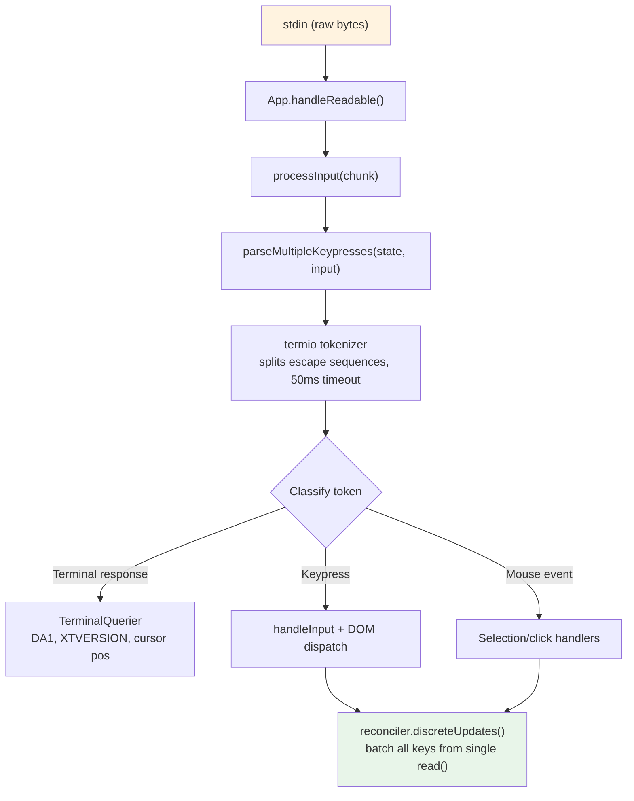
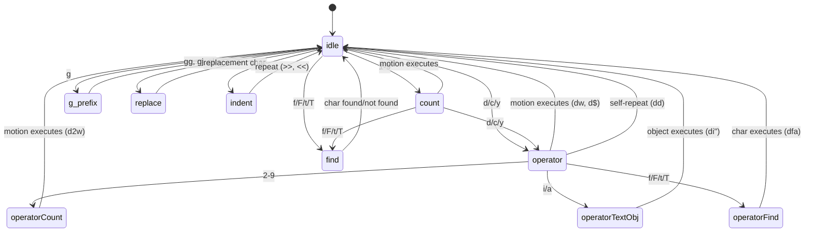

# Chapter 14: Input and Interaction

> 第 14 章：输入与交互

## Raw Bytes, Meaningful Actions

> 原始字节，有意义的动作

When you press Ctrl+X followed by Ctrl+K in Claude Code, the terminal sends two byte sequences separated by perhaps 200 milliseconds. The first is `0x18` (ASCII CAN). The second is `0x0B` (ASCII VT). Neither of these bytes carries any inherent meaning beyond "control character." The input system must recognize that these two bytes, arriving in sequence within a timeout window, constitute the chord `ctrl+x ctrl+k`, which maps to the action `chat:killAgents`, which terminates all running sub-agents.

> 当你在 Claude Code 中先按 Ctrl+X 再按 Ctrl+K 时，终端会发送两段字节序列，二者之间或许相隔 200 毫秒。第一段是 `0x18`（ASCII CAN）。第二段是 `0x0B`（ASCII VT）。除了"控制字符"之外，这两个字节本身并不携带任何固有含义。输入系统必须识别出：这两个字节在一个超时窗口内按序到达，构成了和弦 `ctrl+x ctrl+k`，它映射到动作 `chat:killAgents`，进而终止所有正在运行的 sub-agent。

Between the raw bytes and the killed agents, six systems activate: a tokenizer splits escape sequences, a parser classifies them across five terminal protocols, a keybinding resolver matches the sequence against context-specific bindings, a chord state machine manages the multi-key sequence, a handler executes the action, and React batches the resulting state updates into a single render.

> 从原始字节到被终止的 agent 之间，有六个系统被激活：一个 tokenizer 切分转义序列，一个解析器在五种终端协议之间对其分类，一个键位解析器将该序列与上下文相关的绑定进行匹配，一个和弦状态机管理这个多键序列，一个 handler 执行该动作，而 React 则将由此产生的状态更新批处理为一次渲染。

The difficulty is not in any one of these systems. It is in the combinatorial explosion of terminal diversity. iTerm2 sends Kitty keyboard protocol sequences. macOS Terminal sends legacy VT220 sequences. Ghostty over SSH sends xterm modifyOtherKeys. tmux may eat, transform, or passthrough any of these depending on its configuration. Windows Terminal has its own quirks with VT mode. The input system must produce correct `ParsedKey` objects from all of them, because a user should not have to know which keyboard protocol their terminal uses.

> 困难并不在于其中任何单独一个系统，而在于终端多样性带来的组合爆炸。iTerm2 发送 Kitty 键盘协议序列。macOS Terminal 发送传统的 VT220 序列。通过 SSH 连接的 Ghostty 发送 xterm modifyOtherKeys。根据其配置，tmux 可能吞掉、转换或透传上述任意一种。Windows Terminal 在 VT 模式上有自己的怪癖。输入系统必须从所有这些来源中产生正确的 `ParsedKey` 对象，因为用户不应该需要知道自己的终端使用的是哪种键盘协议。

This chapter traces the path from raw bytes to meaningful actions across that landscape.

> 本章将沿着这一全景，追踪从原始字节到有意义动作的路径。

The design philosophy is progressive enhancement with graceful degradation. On a modern terminal with Kitty keyboard protocol support, Claude Code gets full modifier detection (Ctrl+Shift+A is distinct from Ctrl+A), super key reporting (Cmd shortcuts), and unambiguous key identification. On a legacy terminal over SSH, it falls back to the best available protocol, losing some modifier distinctions but keeping core functionality intact. The user never sees an error message about their terminal being unsupported. They might not be able to use `ctrl+shift+f` for global search, but `ctrl+r` for history search works everywhere.

> 其设计哲学是渐进增强加优雅降级。在支持 Kitty 键盘协议的现代终端上，Claude Code 能获得完整的修饰键检测（Ctrl+Shift+A 与 Ctrl+A 是不同的）、super 键上报（Cmd 快捷键）以及无歧义的按键识别。在通过 SSH 连接的传统终端上，它会回退到可用的最佳协议，丢失一部分修饰键区分能力，但核心功能保持完好。用户永远不会看到一条关于其终端不受支持的错误消息。他们或许无法使用 `ctrl+shift+f` 进行全局搜索，但用于历史搜索的 `ctrl+r` 在任何地方都能正常工作。

---

## The Key Parsing Pipeline

> 按键解析流水线

Input arrives as chunks of bytes on stdin. The pipeline processes them in stages:

> 输入以字节块的形式到达 stdin。流水线分阶段对其进行处理：



The tokenizer is the foundation. Terminal input is a stream of bytes that mixes printable characters, control codes, and multi-byte escape sequences with no explicit framing. A single `read()` from stdin might return `\x1b[1;5A` (Ctrl+Up arrow), or it might return `\x1b` in one read and `[1;5A` in the next, depending on how fast bytes arrive from the PTY. The tokenizer maintains a state machine that buffers partial escape sequences and emits complete tokens.

> tokenizer 是整个流水线的基础。终端输入是一段字节流，混合了可打印字符、控制码以及多字节转义序列，且没有显式的分帧。一次从 stdin 进行的 `read()` 可能返回 `\x1b[1;5A`（Ctrl+上方向键），也可能在一次读取中返回 `\x1b`、在下一次读取中返回 `[1;5A`，这取决于字节从 PTY 到达的速度。tokenizer 维护一个状态机，缓冲不完整的转义序列，并在序列完整时发出 token。

The incomplete-sequence problem is fundamental. When the tokenizer sees a lone `\x1b`, it cannot know whether this is the Escape key or the start of a CSI sequence. It buffers the byte and starts a 50ms timer. If no continuation arrives, the buffer is flushed and the `\x1b` becomes an Escape keypress. But before flushing, the tokenizer checks `stdin.readableLength` -- if bytes are waiting in the kernel buffer, the timer re-arms rather than flushing. This handles the case where the event loop was blocked past 50ms and the continuation bytes are already buffered but not yet read.

> 不完整序列问题是根本性的。当 tokenizer 看到一个孤立的 `\x1b` 时，它无法知道这是 Escape 键，还是一段 CSI 序列的开头。它会缓冲该字节并启动一个 50ms 的计时器。如果没有后续字节到达，缓冲区被刷新，`\x1b` 就成为一次 Escape 按键。但在刷新之前，tokenizer 会检查 `stdin.readableLength`——如果内核缓冲区中还有字节在等待，计时器会重新计时而不是刷新。这处理了这样一种情况：事件循环被阻塞超过了 50ms，后续字节已经被缓冲但尚未被读取。

For paste operations, the timeout extends to 500ms. Pasted text can be large and arrive in multiple chunks.

> 对于粘贴操作，超时被延长到 500ms。被粘贴的文本可能很大，并分多个块到达。

All parsed keys from a single `read()` are processed in one `reconciler.discreteUpdates()` call. This batches React state updates so that pasting 100 characters produces one re-render, not 100. The batching is essential: without it, each character in a paste would trigger a full reconciliation cycle -- state update, reconciliation, commit, Yoga layout, render, diff, write. At 5ms per cycle, a 100-character paste would take 500ms to process. With batching, the same paste takes one 5ms cycle.

> 来自单次 `read()` 的所有已解析按键都在一次 `reconciler.discreteUpdates()` 调用中处理。这会批处理 React 状态更新，使得粘贴 100 个字符只产生一次重新渲染，而不是 100 次。批处理至关重要：没有它，粘贴中的每个字符都会触发一次完整的协调周期——状态更新、协调、提交、Yoga 布局、渲染、diff、写出。按每个周期 5ms 计算，一次 100 字符的粘贴需要 500ms 才能处理完。有了批处理，同样的粘贴只需一个 5ms 的周期。

### stdin Management

> stdin 管理

The `App` component manages raw mode via reference counting. When any component needs raw input (the prompt, a dialog, vim mode), it calls `setRawMode(true)`, incrementing a counter. When it no longer needs raw input, it calls `setRawMode(false)`, decrementing. Raw mode is only disabled when the counter reaches zero. This prevents a common bug in terminal applications: component A enables raw mode, component B enables raw mode, component A disables raw mode, and suddenly component B's input breaks because raw mode was globally disabled.

> `App` 组件通过引用计数来管理 raw 模式。当任何组件需要 raw 输入时（提示符、对话框、vim 模式），它会调用 `setRawMode(true)`，使计数器加一。当它不再需要 raw 输入时，它会调用 `setRawMode(false)`，使计数器减一。只有当计数器归零时，raw 模式才会被禁用。这避免了终端应用中一个常见的 bug：组件 A 启用 raw 模式，组件 B 启用 raw 模式，组件 A 禁用 raw 模式，然后组件 B 的输入突然就失灵了，因为 raw 模式被全局禁用了。

When raw mode is first enabled, the App:

> 当 raw 模式首次被启用时，App 会：

1. Stops early input capture (the bootstrap-phase mechanism that collects keystrokes before React mounts)
2. Puts stdin into raw mode (no line buffering, no echo, no signal processing)
3. Attaches a `readable` listener for async input processing
4. Enables bracketed paste (so pasted text is identifiable)
5. Enables focus reporting (so the app knows when the terminal window gains/loses focus)
6. Enables extended key reporting (Kitty keyboard protocol + xterm modifyOtherKeys)

> 1. 停止早期输入捕获（这是在 React 挂载之前收集按键的引导阶段机制）
> 2. 将 stdin 置于 raw 模式（无行缓冲、无回显、无信号处理）
> 3. 挂上一个 `readable` 监听器以进行异步输入处理
> 4. 启用 bracketed paste（这样被粘贴的文本是可识别的）
> 5. 启用焦点上报（这样应用知道终端窗口何时获得/失去焦点）
> 6. 启用扩展按键上报（Kitty 键盘协议 + xterm modifyOtherKeys）

On disable, all of these are reversed in the opposite order. The careful sequencing prevents escape sequence leaks -- disabling extended key reporting before disabling raw mode ensures that the terminal does not continue sending Kitty-encoded sequences after the app has stopped parsing them.

> 禁用时，所有这些都以相反的顺序被逆转。这种谨慎的排序可以防止转义序列泄漏——在禁用 raw 模式之前先禁用扩展按键上报，可以确保终端不会在应用已经停止解析之后还继续发送 Kitty 编码的序列。

The `onExit` signal handler (via the `signal-exit` package) ensures cleanup happens even on unexpected termination. If the process receives SIGTERM or SIGINT, the handler disables raw mode, restores the terminal state, exits alternate screen if active, and re-shows the cursor before the process exits. Without this cleanup, a crashed Claude Code session would leave the terminal in raw mode with no cursor and no echo -- the user would need to blindly type `reset` to recover their terminal.

> `onExit` 信号处理器（通过 `signal-exit` 包）确保即使在意外终止时也会进行清理。如果进程收到 SIGTERM 或 SIGINT，该处理器会在进程退出前禁用 raw 模式、恢复终端状态、若处于备用屏幕则退出、并重新显示光标。没有这套清理，一个崩溃的 Claude Code 会话会让终端停留在 raw 模式下，没有光标也没有回显——用户需要盲打 `reset` 才能恢复其终端。

---

## Multi-Protocol Support

> 多协议支持

Terminals do not agree on how to encode keyboard input. A modern terminal emulator like Kitty sends structured sequences with full modifier information. A legacy terminal over SSH sends ambiguous byte sequences that require context to interpret. Claude Code's parser handles five distinct protocols simultaneously, because the user's terminal might be any of them.

> 终端在如何编码键盘输入这件事上并不一致。像 Kitty 这样的现代终端模拟器会发送带有完整修饰键信息的结构化序列。通过 SSH 连接的传统终端则发送需要依靠上下文才能解读的有歧义的字节序列。Claude Code 的解析器同时处理五种不同的协议，因为用户的终端可能是其中任意一种。

**CSI u (Kitty keyboard protocol)** is the modern standard. Format: `ESC [ codepoint [; modifier] u`. Example: `ESC[13;2u` is Shift+Enter, `ESC[27u` is Escape with no modifiers. The codepoint identifies the key unambiguously -- there is no ambiguity between Escape-the-key and Escape-as-sequence-prefix. The modifier word encodes shift, alt, ctrl, and super (Cmd) as individual bits. Claude Code enables this protocol on terminals that support it via the `ENABLE_KITTY_KEYBOARD` escape sequence at startup, and disables it on exit via `DISABLE_KITTY_KEYBOARD`. The protocol is detected through a query/response handshake: the application sends `CSI ? u` and the terminal responds with `CSI ? flags u`, where `flags` indicates the supported protocol level.

> **CSI u（Kitty 键盘协议）** 是现代标准。格式为 `ESC [ codepoint [; modifier] u`。例如：`ESC[13;2u` 是 Shift+Enter，`ESC[27u` 是不带修饰键的 Escape。codepoint 无歧义地标识按键——在"作为按键的 Escape"和"作为序列前缀的 Escape"之间不存在歧义。modifier 字将 shift、alt、ctrl 和 super（Cmd）编码为各自独立的位。Claude Code 在启动时通过 `ENABLE_KITTY_KEYBOARD` 转义序列在支持该协议的终端上启用它，并在退出时通过 `DISABLE_KITTY_KEYBOARD` 禁用它。该协议通过一次查询/响应握手来检测：应用发送 `CSI ? u`，终端以 `CSI ? flags u` 响应，其中 `flags` 指示所支持的协议级别。

**xterm modifyOtherKeys** is the fallback for terminals like Ghostty over SSH, where the Kitty protocol is not negotiated. Format: `ESC [ 27 ; modifier ; keycode ~`. Note that the parameter order is reversed from CSI u -- modifier comes before keycode, then keycode. This is a common source of parser bugs. The protocol is enabled via `CSI > 4 ; 2 m` and emitted by Ghostty, tmux, and xterm when the terminal's TERM identification is not detected (common over SSH where `TERM_PROGRAM` is not forwarded).

> **xterm modifyOtherKeys** 是面向像通过 SSH 连接的 Ghostty 这类终端的回退方案，在这些场景下 Kitty 协议没有被协商出来。格式为 `ESC [ 27 ; modifier ; keycode ~`。注意其参数顺序与 CSI u 相反——modifier 在 keycode 之前，然后才是 keycode。这是解析器 bug 的一个常见来源。该协议通过 `CSI > 4 ; 2 m` 启用，并在终端的 TERM 标识未被检测到时由 Ghostty、tmux 和 xterm 发出（这在 SSH 场景下很常见，因为 `TERM_PROGRAM` 不会被转发过去）。

**Legacy terminal sequences** cover everything else: function keys via `ESC O` and `ESC [` sequences, arrow keys, numpad, Home/End/Insert/Delete, and the full zoo of VT100/VT220/xterm variations accumulated over 40 years of terminal evolution. The parser uses two regular expressions to match these: `FN_KEY_RE` for the `ESC O/N/[/[[` prefix pattern (matching function keys, arrow keys, and their modified variants), and `META_KEY_CODE_RE` for meta-key codes (`ESC` followed by a single alphanumeric, the traditional Alt+key encoding).

> **传统终端序列** 涵盖其余一切：通过 `ESC O` 和 `ESC [` 序列表示的功能键、方向键、小键盘、Home/End/Insert/Delete，以及在 40 年终端演进中累积下来的 VT100/VT220/xterm 各种变体的全部"动物园"。解析器使用两个正则表达式来匹配它们：`FN_KEY_RE` 匹配 `ESC O/N/[/[[` 前缀模式（匹配功能键、方向键及其带修饰键的变体），`META_KEY_CODE_RE` 匹配 meta 键编码（`ESC` 后跟单个字母数字字符，即传统的 Alt+键编码）。

The challenge with legacy sequences is ambiguity. `ESC [ 1 ; 2 R` could be Shift+F3 or a cursor position report, depending on context. The parser resolves this with a private-marker check: cursor position reports use `CSI ? row ; col R` (with the `?` private marker), while modified function keys use `CSI params R` (without it). This disambiguation is why Claude Code requests DECXCPR (extended cursor position reports) rather than standard CPR -- the extended form is unambiguous.

> 传统序列的挑战在于歧义。`ESC [ 1 ; 2 R` 可能是 Shift+F3，也可能是一次光标位置上报，取决于上下文。解析器通过一次私有标记检查来解决这个问题：光标位置上报使用 `CSI ? row ; col R`（带有 `?` 私有标记），而带修饰键的功能键使用 `CSI params R`（不带该标记）。正是这种消歧的需要，使得 Claude Code 请求 DECXCPR（扩展光标位置上报）而不是标准的 CPR——扩展形式是无歧义的。

Terminal identification adds another layer of complexity. On startup, Claude Code sends an `XTVERSION` query (`CSI > 0 q`) to discover the terminal's name and version. The response (`DCS > | name ST`) survives SSH connections -- unlike `TERM_PROGRAM`, which is an environment variable that does not propagate through SSH. Knowing the terminal identity allows the parser to handle terminal-specific quirks. For example, xterm.js (used by VS Code's integrated terminal) has different escape sequence behavior from native xterm, and the identification string (`xterm.js(X.Y.Z)`) allows the parser to account for these differences.

> 终端识别又增加了一层复杂性。启动时，Claude Code 发送一个 `XTVERSION` 查询（`CSI > 0 q`）来探明终端的名称和版本。其响应（`DCS > | name ST`）能在 SSH 连接中存活下来——不像 `TERM_PROGRAM`，那是一个不会通过 SSH 传播的环境变量。知道终端身份让解析器能够处理终端特有的怪癖。例如，xterm.js（被 VS Code 的集成终端使用）的转义序列行为与原生 xterm 不同，而识别字符串（`xterm.js(X.Y.Z)`）让解析器得以考虑这些差异。

**SGR mouse events** use the format `ESC [ < button ; col ; row M/m`, where `M` is press and `m` is release. Button codes encode the action: 0/1/2 for left/middle/right click, 64/65 for wheel up/down (0x40 OR'd with a wheel bit), 32+ for drag (0x20 OR'd with a motion bit). Wheel events are converted to `ParsedKey` objects so they flow through the keybinding system; click and drag events become `ParsedMouse` objects routed to the selection handler.

> **SGR 鼠标事件** 使用 `ESC [ < button ; col ; row M/m` 格式，其中 `M` 表示按下，`m` 表示释放。按钮码对动作进行编码：0/1/2 表示左/中/右键点击，64/65 表示滚轮上/下（0x40 与一个滚轮位做 OR），32+ 表示拖拽（0x20 与一个移动位做 OR）。滚轮事件被转换为 `ParsedKey` 对象，从而流经键位绑定系统；点击和拖拽事件则成为 `ParsedMouse` 对象，路由到选择处理器。

**Bracketed paste** wraps pasted content between `ESC [200~` and `ESC [201~` markers. Everything between the markers becomes a single `ParsedKey` with `isPasted: true`, regardless of what escape sequences the pasted text might contain. This prevents pasted code from being interpreted as commands -- a critical safety feature when a user pastes a code snippet containing `\x03` (which is Ctrl+C as a raw byte).

> **Bracketed paste（括号粘贴）** 将被粘贴的内容包裹在 `ESC [200~` 和 `ESC [201~` 标记之间。无论被粘贴的文本中可能包含什么转义序列，两个标记之间的所有内容都会成为一个 `isPasted: true` 的单个 `ParsedKey`。这可以防止被粘贴的代码被解释为命令——当用户粘贴一段包含 `\x03`（其作为原始字节即 Ctrl+C）的代码片段时，这是一项至关重要的安全特性。

The output types from the parser form a clean discriminated union:

> 解析器的输出类型构成一个干净的可辨识联合（discriminated union）：

```typescript
type ParsedKey = {
  kind: 'key';
  name: string;        // 'return', 'escape', 'a', 'f1', etc.
  ctrl: boolean; meta: boolean; shift: boolean;
  option: boolean; super: boolean;
  sequence: string;    // Raw escape sequence for debugging
  isPasted: boolean;   // Inside bracketed paste
}

type ParsedMouse = {
  kind: 'mouse';
  button: number;      // SGR button code
  action: 'press' | 'release';
  col: number; row: number;  // 1-indexed terminal coordinates
}

type ParsedResponse = {
  kind: 'response';
  response: TerminalResponse;  // Routed to TerminalQuerier
}
```

The `kind` discriminant ensures that downstream code handles each input type explicitly. A key cannot be accidentally processed as a mouse event; a terminal response cannot be accidentally interpreted as a keypress. The `ParsedKey` type also carries the raw `sequence` string for debugging -- when a user reports "pressing Ctrl+Shift+A does nothing," the debug log can show exactly what byte sequence the terminal sent, making it possible to diagnose whether the issue is in the terminal's encoding, the parser's recognition, or the keybinding's configuration.

> `kind` 辨识字段确保下游代码显式地处理每一种输入类型。一个按键不会被意外地当作鼠标事件处理；一个终端响应不会被意外地解读为按键。`ParsedKey` 类型还携带原始的 `sequence` 字符串以供调试——当用户报告"按 Ctrl+Shift+A 没有任何反应"时，调试日志可以精确显示终端发送了什么字节序列，从而能够诊断问题出在终端的编码、解析器的识别，还是键位绑定的配置上。

The `isPasted` flag on `ParsedKey` is critical for security. When bracketed paste is enabled, the terminal wraps pasted content in marker sequences. The parser sets `isPasted: true` on the resulting key event, and the keybinding resolver skips keybinding matching for pasted keys. Without this, pasting text containing `\x03` (Ctrl+C as a raw byte) or escape sequences would trigger application commands. With it, pasted content is treated as literal text input regardless of its byte content.

> `ParsedKey` 上的 `isPasted` 标志对安全性至关重要。当 bracketed paste 被启用时，终端会把被粘贴的内容包裹在标记序列中。解析器在生成的按键事件上设置 `isPasted: true`，键位解析器则对被粘贴的按键跳过键位匹配。没有这个机制，粘贴包含 `\x03`（作为原始字节的 Ctrl+C）或转义序列的文本就会触发应用命令。有了它，被粘贴的内容无论其字节内容如何，都会被当作字面文本输入处理。

The parser also recognizes terminal responses -- sequences sent by the terminal itself in answer to queries. These include device attributes (DA1, DA2), cursor position reports, Kitty keyboard flag responses, XTVERSION (terminal identification), and DECRPM (mode status). These are routed to a `TerminalQuerier` rather than the input handler:

> 解析器还识别终端响应——由终端自身发送以回应查询的序列。这些包括设备属性（DA1、DA2）、光标位置上报、Kitty 键盘标志响应、XTVERSION（终端识别）以及 DECRPM（模式状态）。这些被路由到 `TerminalQuerier` 而不是输入处理器：

```typescript
type TerminalResponse =
  | { type: 'decrpm'; mode: number; status: number }
  | { type: 'da1'; params: number[] }
  | { type: 'da2'; params: number[] }
  | { type: 'kittyKeyboard'; flags: number }
  | { type: 'cursorPosition'; row: number; col: number }
  | { type: 'osc'; code: number; data: string }
  | { type: 'xtversion'; version: string }
```

**Modifier decoding** follows the XTerm convention: the modifier word is `1 + (shift ? 1 : 0) + (alt ? 2 : 0) + (ctrl ? 4 : 0) + (super ? 8 : 0)`. The `meta` field in `ParsedKey` maps to Alt/Option (bit 2). The `super` field is distinct (bit 8, Cmd on macOS). This distinction matters because Cmd shortcuts are reserved by the OS and cannot be captured by terminal applications -- unless the terminal uses the Kitty protocol, which reports super-modified keys that other protocols silently swallow.

> **修饰键解码** 遵循 XTerm 约定：修饰键字为 `1 + (shift ? 1 : 0) + (alt ? 2 : 0) + (ctrl ? 4 : 0) + (super ? 8 : 0)`。`ParsedKey` 中的 `meta` 字段映射到 Alt/Option（第 2 位）。`super` 字段是独立的（第 8 位，macOS 上的 Cmd）。这种区分很重要，因为 Cmd 快捷键被操作系统保留，终端应用无法捕获——除非终端使用 Kitty 协议，它会上报其他协议会默默吞掉的 super 修饰按键。

A stdin-gap detector triggers terminal mode re-assertion when no input arrives for 5 seconds after a gap. This handles tmux reattach and laptop wake scenarios, where the terminal's keyboard mode may have been reset by the multiplexer or the OS. When re-assertion fires, it re-sends `ENABLE_KITTY_KEYBOARD`, `ENABLE_MODIFY_OTHER_KEYS`, bracketed paste, and focus reporting sequences. Without this, detaching from a tmux session and reattaching would silently downgrade the keyboard protocol to legacy mode, breaking modifier detection for the rest of the session.

> 一个 stdin 间隙检测器会在出现间隙后 5 秒内没有任何输入到达时触发终端模式的重新声明。这处理了 tmux 重新附着以及笔记本电脑唤醒的场景，在这些场景下终端的键盘模式可能已被复用器或操作系统重置。当重新声明触发时，它会重新发送 `ENABLE_KITTY_KEYBOARD`、`ENABLE_MODIFY_OTHER_KEYS`、bracketed paste 以及焦点上报序列。没有这个机制，从一个 tmux 会话分离再重新附着就会悄无声息地把键盘协议降级到传统模式，在会话余下的时间里破坏修饰键检测。

### The Terminal I/O Layer

> 终端 I/O 层

Beneath the parser sits a structured terminal I/O subsystem in `ink/termio/`:

> 在解析器之下是一个位于 `ink/termio/` 中的结构化终端 I/O 子系统：

- **csi.ts** -- CSI (Control Sequence Introducer) sequences: cursor movement, erase, scroll regions, bracketed paste enable/disable, focus event enable/disable, Kitty keyboard protocol enable/disable
- **dec.ts** -- DEC private mode sequences: alternate screen buffer (1049), mouse tracking modes (1000/1002/1003), cursor visibility, bracketed paste (2004), focus events (1004)
- **osc.ts** -- Operating System Commands: clipboard access (OSC 52), tab status, iTerm2 progress indicators, tmux/screen multiplexer wrapping (DCS passthrough for sequences that need to traverse a multiplexer boundary)
- **sgr.ts** -- Select Graphic Rendition: the ANSI style code system (colors, bold, italic, underline, inverse)
- **tokenize.ts** -- The stateful tokenizer for escape sequence boundary detection

> - **csi.ts** —— CSI（Control Sequence Introducer，控制序列引导符）序列：光标移动、擦除、滚动区域、bracketed paste 启用/禁用、焦点事件启用/禁用、Kitty 键盘协议启用/禁用
> - **dec.ts** —— DEC 私有模式序列：备用屏幕缓冲区（1049）、鼠标追踪模式（1000/1002/1003）、光标可见性、bracketed paste（2004）、焦点事件（1004）
> - **osc.ts** —— 操作系统命令：剪贴板访问（OSC 52）、标签状态、iTerm2 进度指示器、tmux/screen 复用器包装（针对需要穿越复用器边界的序列的 DCS 透传）
> - **sgr.ts** —— Select Graphic Rendition（图形渲染选择）：ANSI 样式码系统（颜色、加粗、斜体、下划线、反显）
> - **tokenize.ts** —— 用于转义序列边界检测的有状态 tokenizer

The multiplexer wrapping deserves a note. When Claude Code runs inside tmux, certain escape sequences (like Kitty keyboard protocol negotiation) must pass through to the outer terminal. tmux uses DCS passthrough (`ESC P ... ST`) to forward sequences it does not understand. The `wrapForMultiplexer` function in `osc.ts` detects the multiplexer environment and wraps sequences appropriately. Without this, Kitty keyboard mode would silently fail inside tmux, and the user would never know why their Ctrl+Shift bindings stopped working.

> 复用器包装值得一提。当 Claude Code 运行在 tmux 内部时，某些转义序列（如 Kitty 键盘协议协商）必须穿透到外层终端。tmux 使用 DCS 透传（`ESC P ... ST`）来转发它不理解的序列。`osc.ts` 中的 `wrapForMultiplexer` 函数检测复用器环境并对序列进行恰当的包装。没有这个机制，Kitty 键盘模式会在 tmux 内部悄无声息地失败，而用户永远不会明白为什么自己的 Ctrl+Shift 绑定不再起作用。

### The Event System

> 事件系统

The `ink/events/` directory implements a browser-compatible event system with seven event types: `KeyboardEvent`, `ClickEvent`, `FocusEvent`, `InputEvent`, `TerminalFocusEvent`, and base `TerminalEvent`. Each carries `target`, `currentTarget`, `eventPhase`, and supports `stopPropagation()`, `stopImmediatePropagation()`, and `preventDefault()`.

> `ink/events/` 目录实现了一个浏览器兼容的事件系统，包含七种事件类型：`KeyboardEvent`、`ClickEvent`、`FocusEvent`、`InputEvent`、`TerminalFocusEvent` 以及基类 `TerminalEvent`。每个事件都携带 `target`、`currentTarget`、`eventPhase`，并支持 `stopPropagation()`、`stopImmediatePropagation()` 和 `preventDefault()`。

The `InputEvent` wrapping `ParsedKey` exists for backward compatibility with the legacy `EventEmitter` path, which older components may still use. New components use the DOM-style keyboard event dispatch with capture/bubble phases. Both paths fire from the same parsed key, so they are always consistent -- a key that arrives on stdin produces exactly one `ParsedKey`, which spawns both an `InputEvent` (for legacy listeners) and a `KeyboardEvent` (for DOM-style dispatch). This dual-path design allows incremental migration from the EventEmitter pattern to the DOM event pattern without breaking existing components.

> 包装 `ParsedKey` 的 `InputEvent` 之所以存在，是为了向后兼容传统的 `EventEmitter` 路径，较旧的组件可能仍在使用它。新组件使用带捕获/冒泡阶段的 DOM 风格键盘事件派发。两条路径都源自同一个已解析的按键，因此它们始终一致——一个到达 stdin 的按键恰好产生一个 `ParsedKey`，它同时衍生出一个 `InputEvent`（供传统监听器使用）和一个 `KeyboardEvent`（供 DOM 风格派发使用）。这种双路径设计允许从 EventEmitter 模式向 DOM 事件模式增量迁移，而不破坏现有组件。

---

## The Keybinding System

> 键位绑定系统

The keybinding system separates three concerns that are often tangled together: what key triggers what action (bindings), what happens when an action fires (handlers), and which bindings are active right now (contexts).

> 键位绑定系统将三个常常纠缠在一起的关注点分离开来：哪个键触发哪个动作（bindings，绑定）、动作触发时会发生什么（handlers，处理器），以及当前哪些绑定处于激活状态（contexts，上下文）。

### Bindings: Declarative Configuration

> 绑定：声明式配置

Default bindings are defined in `defaultBindings.ts` as an array of `KeybindingBlock` objects, each scoped to a context:

> 默认绑定在 `defaultBindings.ts` 中被定义为一个 `KeybindingBlock` 对象数组，每个对象都限定在某个上下文范围内：

```typescript
export const DEFAULT_BINDINGS: KeybindingBlock[] = [
  {
    context: 'Global',
    bindings: {
      'ctrl+c': 'app:interrupt',
      'ctrl+d': 'app:exit',
      'ctrl+l': 'app:redraw',
      'ctrl+r': 'history:search',
    },
  },
  {
    context: 'Chat',
    bindings: {
      'escape': 'chat:cancel',
      'ctrl+x ctrl+k': 'chat:killAgents',
      'enter': 'chat:submit',
      'up': 'history:previous',
      'ctrl+x ctrl+e': 'chat:externalEditor',
    },
  },
  // ... 14 more contexts
]
```

Platform-specific bindings are handled at definition time. Image paste is `ctrl+v` on macOS/Linux but `alt+v` on Windows (where `ctrl+v` is system paste). Mode cycling is `shift+tab` on terminals with VT mode support but `meta+m` on Windows Terminal without it. Feature-flagged bindings (quick search, voice mode, terminal panel) are conditionally included.

> 平台相关的绑定在定义时就被处理。图片粘贴在 macOS/Linux 上是 `ctrl+v`，但在 Windows 上是 `alt+v`（在 Windows 上 `ctrl+v` 是系统粘贴）。模式切换在支持 VT 模式的终端上是 `shift+tab`，但在不支持的 Windows Terminal 上是 `meta+m`。受特性开关控制的绑定（快速搜索、语音模式、终端面板）则会被有条件地纳入。

Users can override any binding via `~/.claude/keybindings.json`. The parser accepts modifier aliases (`ctrl`/`control`, `alt`/`opt`/`option`, `cmd`/`command`/`super`/`win`), key aliases (`esc` -> `escape`, `return` -> `enter`), chord notation (space-separated steps like `ctrl+k ctrl+s`), and null actions to unbind default keys. A null action is not the same as not defining a binding -- it explicitly blocks the default binding from firing, which is important for users who want to reclaim a key for their terminal's use.

> 用户可以通过 `~/.claude/keybindings.json` 覆盖任何绑定。解析器接受修饰键别名（`ctrl`/`control`、`alt`/`opt`/`option`、`cmd`/`command`/`super`/`win`）、按键别名（`esc` -> `escape`、`return` -> `enter`）、和弦记法（以空格分隔的步骤，如 `ctrl+k ctrl+s`），以及用于解绑默认键的 null 动作。null 动作与"不定义绑定"并不相同——它会显式阻止默认绑定触发，这对那些想把某个键收回供终端自己使用的用户而言非常重要。

### Contexts: 16 Scopes of Activity

> 上下文：16 种活动作用域

Each context represents a mode of interaction where a specific set of bindings applies:

> 每个上下文代表一种交互模式，在该模式下会应用一组特定的绑定：

| Context | When Active |
|---------|------------|
| Global | Always |
| Chat | Prompt input is focused |
| Autocomplete | Completion menu is visible |
| Confirmation | Permission dialog is showing |
| Scroll | Alt-screen with scrollable content |
| Transcript | Read-only transcript viewer |
| HistorySearch | Reverse history search (ctrl+r) |
| Task | A background task is running |
| Help | Help overlay is displayed |
| MessageSelector | Rewind dialog |
| MessageActions | Message cursor navigation |
| DiffDialog | Diff viewer |
| Select | Generic selection list |
| Settings | Config panel |
| Tabs | Tab navigation |
| Footer | Footer indicators |

> | Context | 激活时机 |
> |---------|------------|
> | Global | 始终激活 |
> | Chat | 提示输入框获得焦点时 |
> | Autocomplete | 补全菜单可见时 |
> | Confirmation | 权限对话框正在显示时 |
> | Scroll | 处于具有可滚动内容的备用屏幕（alt-screen）时 |
> | Transcript | 只读的会话记录查看器中 |
> | HistorySearch | 反向历史搜索（ctrl+r）时 |
> | Task | 有后台任务正在运行时 |
> | Help | 帮助浮层正在显示时 |
> | MessageSelector | 回退（rewind）对话框中 |
> | MessageActions | 消息光标导航中 |
> | DiffDialog | Diff 查看器中 |
> | Select | 通用选择列表中 |
> | Settings | 配置面板中 |
> | Tabs | 标签页导航中 |
> | Footer | 页脚指示器中 |

When a key arrives, the resolver builds a context list from the currently active contexts (determined by React component state), deduplicates it preserving priority order, and searches for a matching binding. The last matching binding wins -- this is how user overrides take precedence over defaults. The context list is rebuilt on every keystroke (it is cheap: array concatenation and deduplication of at most 16 strings), so context changes take effect immediately without any subscription or listener mechanism.

> 当一个按键到来时，解析器会根据当前激活的上下文（由 React 组件状态决定）构建一个上下文列表，在保留优先级顺序的前提下对其去重，然后搜索匹配的绑定。最后匹配到的绑定胜出——这正是用户覆盖能够优先于默认值的原理。上下文列表在每次按键时都会重建（这很廉价：至多对 16 个字符串做数组拼接和去重），因此上下文的变化会立即生效，无需任何订阅或监听器机制。

The context design handles a tricky interaction pattern: nested modals. When a permission dialog appears during a running task, both `Confirmation` and `Task` contexts might be active. The `Confirmation` context takes priority (it is registered later in the component tree), so `y` triggers "approve" rather than any task-level binding. When the dialog closes, the `Confirmation` context deactivates and `Task` bindings resume. This stacking behavior emerges naturally from the context list's priority ordering -- no special modal-handling code is needed.

> 这种上下文设计处理了一种棘手的交互模式：嵌套模态框。当一个权限对话框在任务运行期间弹出时，`Confirmation` 和 `Task` 两个上下文可能都处于激活状态。`Confirmation` 上下文优先（它在组件树中注册得更晚），因此 `y` 会触发"批准"而非任何任务级别的绑定。当对话框关闭时，`Confirmation` 上下文停用，`Task` 的绑定随即恢复。这种堆叠行为自然地从上下文列表的优先级排序中浮现出来——无需任何专门的模态框处理代码。

### Reserved Shortcuts

> 保留快捷键

Not everything can be rebound. The system enforces three tiers of reservation:

> 并非所有键都可以重新绑定。系统强制实施三个层级的保留：

**Non-rebindable** (hardcoded behavior): `ctrl+c` (interrupt/exit), `ctrl+d` (exit), `ctrl+m` (identical to Enter in all terminals -- rebinding it would break Enter).

> **不可重新绑定**（硬编码行为）：`ctrl+c`（中断/退出）、`ctrl+d`（退出）、`ctrl+m`（在所有终端中都等同于 Enter——重新绑定它会破坏 Enter）。

**Terminal-reserved** (warnings): `ctrl+z` (SIGTSTP), `ctrl+\` (SIGQUIT). These can technically be bound, but the terminal will intercept them before the application sees them in most configurations.

> **终端保留**（警告）：`ctrl+z`（SIGTSTP）、`ctrl+\`（SIGQUIT）。这些键在技术上可以绑定，但在大多数配置下，终端会在应用看到它们之前就将其拦截。

**macOS-reserved** (errors): `cmd+c`, `cmd+v`, `cmd+x`, `cmd+q`, `cmd+w`, `cmd+tab`, `cmd+space`. The OS intercepts these before they reach the terminal. Binding them would create a shortcut that never fires.

> **macOS 保留**（错误）：`cmd+c`、`cmd+v`、`cmd+x`、`cmd+q`、`cmd+w`、`cmd+tab`、`cmd+space`。操作系统会在这些键到达终端之前就将其拦截。绑定它们只会造就一个永远不会触发的快捷键。

### The Resolution Flow

> 解析流程

When a key arrives, the resolution path is:

> 当一个按键到来时，解析路径如下：

1. Build the context list: the component's registered active contexts plus Global, deduplicated with priority preserved
2. Call `resolveKeyWithChordState(input, key, contexts)` against the merged binding table
3. On `match`: clear any pending chord, call the handler, `stopImmediatePropagation()` on the event
4. On `chord_started`: save the pending keystrokes, stop propagation, start the chord timeout
5. On `chord_cancelled`: clear the pending chord, let the event fall through
6. On `unbound`: clear the chord -- this is an explicit unbinding (user set the action to `null`), so propagation is stopped but no handler runs
7. On `none`: fall through to other handlers

> 1. 构建上下文列表：组件已注册的激活上下文加上 Global，在保留优先级的前提下去重
> 2. 针对合并后的绑定表调用 `resolveKeyWithChordState(input, key, contexts)`
> 3. 当结果为 `match` 时：清除任何待处理的和弦，调用处理器，并对事件执行 `stopImmediatePropagation()`
> 4. 当结果为 `chord_started` 时：保存待处理的按键序列，停止传播，启动和弦超时计时
> 5. 当结果为 `chord_cancelled` 时：清除待处理的和弦，让事件继续向下传递
> 6. 当结果为 `unbound` 时：清除和弦——这是一次显式解绑（用户将动作设为 `null`），因此停止传播，但不运行任何处理器
> 7. 当结果为 `none` 时：向下传递给其他处理器

The "last wins" resolution strategy means that if both the default bindings and user bindings define `ctrl+k` in the `Chat` context, the user's binding takes precedence. This is evaluated at match time by iterating bindings in definition order and keeping the last match, rather than building an override map at load time. The advantage: context-specific overrides compose naturally. A user can override `enter` in `Chat` without affecting `enter` in `Confirmation`.

> 这种"后者胜出"的解析策略意味着，如果默认绑定和用户绑定都在 `Chat` 上下文中定义了 `ctrl+k`，那么用户的绑定优先。这是在匹配时通过按定义顺序遍历绑定并保留最后一次匹配来评估的，而不是在加载时构建一张覆盖映射表。其优势在于：上下文专属的覆盖能够自然地组合。用户可以覆盖 `Chat` 中的 `enter`，而不影响 `Confirmation` 中的 `enter`。

---

## Chord Support

> 组合键支持

The `ctrl+x ctrl+k` binding is a chord: two keystrokes that together form a single action. The resolver manages this with a state machine.

> `ctrl+x ctrl+k` 这个绑定是一个组合键（chord）：两次按键共同构成一个动作。解析器通过一个状态机来管理它。

When a key arrives:

> 当一个按键到达时：

1. The resolver appends it to any pending chord prefix
2. It checks whether any binding's chord starts with this prefix. If so, it returns `chord_started` and saves the pending keystrokes
3. If the full chord matches a binding exactly, it returns `match` and clears the pending state
4. If the chord prefix matches nothing, it returns `chord_cancelled`

> 1. 解析器将其追加到任何待处理的组合键前缀之后
> 2. 它检查是否有任何绑定的组合键以该前缀开头。如果有，则返回 `chord_started` 并保存待处理的按键
> 3. 如果完整的组合键与某个绑定精确匹配，则返回 `match` 并清除待处理状态
> 4. 如果组合键前缀什么都匹配不上，则返回 `chord_cancelled`

A `ChordInterceptor` component intercepts all input during the chord wait state. It has a 1000ms timeout -- if the second keystroke does not arrive within a second, the chord is cancelled and the first keystroke is discarded. The `KeybindingContext` provides a `pendingChordRef` for synchronous access to the pending state, avoiding React state update delays that could cause the second keystroke to be processed before the first one's state update completes.

> 一个 `ChordInterceptor` 组件会在组合键等待状态期间拦截所有输入。它有一个 1000ms 的超时——如果第二次按键没有在一秒内到达，组合键就会被取消，第一次按键也会被丢弃。`KeybindingContext` 提供了一个 `pendingChordRef` 用于同步访问待处理状态，从而避免 React 状态更新延迟所导致的问题——这种延迟可能会让第二次按键在第一次按键的状态更新完成之前就被处理。

The chord design avoids shadowing readline editing keys. Without chords, the keybinding for "kill agents" might be `ctrl+k` -- but that is readline's "kill to end of line," which users expect in a terminal text input. By using `ctrl+x` as a prefix (matching readline's own chord prefix convention), the system gets a namespace of bindings that do not conflict with single-key editing shortcuts.

> 组合键的设计避免了遮蔽 readline 的编辑键。如果不用组合键，“终止 agent”的键位绑定可能会是 `ctrl+k`——但那是 readline 的“删除到行尾”，是用户在终端文本输入中所期望的功能。通过使用 `ctrl+x` 作为前缀（与 readline 自身的组合键前缀约定保持一致），该系统获得了一个不会与单键编辑快捷方式冲突的绑定命名空间。

The implementation handles an edge case that most chord systems miss: what happens when the user presses `ctrl+x` but then types a character that is not part of any chord? Without careful handling, that character would be swallowed -- the chord interceptor consumed the input, the chord was cancelled, and the character is gone. Claude Code's `ChordInterceptor` returns `chord_cancelled` in this case, which causes the pending input to be discarded but allows the non-matching character to fall through to normal input processing. The character is not lost; only the chord prefix is discarded. This matches the behavior users expect from Emacs-style chord prefixes.

> 该实现处理了大多数组合键系统都会忽略的一个边界情形：当用户按下 `ctrl+x`，但随后输入了一个不属于任何组合键的字符时会发生什么？如果不加以谨慎处理，那个字符就会被吞掉——组合键拦截器消费了该输入，组合键被取消，而字符也随之消失。在这种情况下，Claude Code 的 `ChordInterceptor` 会返回 `chord_cancelled`，这会导致待处理的输入被丢弃，但允许那个不匹配的字符向下穿透到正常的输入处理流程中。字符不会丢失，被丢弃的只是组合键前缀。这符合用户对 Emacs 风格组合键前缀的预期行为。

---

## Vim Mode

> Vim 模式

### The State Machine

> 状态机

The vim implementation is a pure state machine with exhaustive type checking. The types are the documentation:

> vim 的实现是一个带有穷尽式类型检查的纯状态机。类型本身就是文档：

```typescript
export type VimState =
  | { mode: 'INSERT'; insertedText: string }
  | { mode: 'NORMAL'; command: CommandState }

export type CommandState =
  | { type: 'idle' }
  | { type: 'count'; digits: string }
  | { type: 'operator'; op: Operator; count: number }
  | { type: 'operatorCount'; op: Operator; count: number; digits: string }
  | { type: 'operatorFind'; op: Operator; count: number; find: FindType }
  | { type: 'operatorTextObj'; op: Operator; count: number; scope: TextObjScope }
  | { type: 'find'; find: FindType; count: number }
  | { type: 'g'; count: number }
  | { type: 'operatorG'; op: Operator; count: number }
  | { type: 'replace'; count: number }
  | { type: 'indent'; dir: '>' | '<'; count: number }
```

This is a discriminated union with 12 variants. TypeScript's exhaustive checking ensures that every `switch` statement on `CommandState.type` handles all 12 cases. Adding a new state to the union causes every incomplete switch to produce a compile error. The state machine cannot have dead states or missing transitions -- the type system forbids it.

> 这是一个有 12 个变体的可辨识联合（discriminated union）。TypeScript 的穷尽式检查确保了每一个针对 `CommandState.type` 的 `switch` 语句都处理了全部 12 种情况。向该联合中添加一个新状态，会使每一个不完整的 switch 都产生编译错误。这个状态机不可能存在死状态或缺失的转换——类型系统禁止它出现。

Notice how each state carries exactly the data needed for the next transition. The `operator` state knows which operator (`op`) and the preceding count. The `operatorCount` state adds the digit accumulator (`digits`). The `operatorTextObj` state adds the scope (`inner` or `around`). No state carries data it does not need. This is not just good taste -- it prevents an entire class of bugs where a handler reads stale data from a previous command. If you are in the `find` state, you have a `FindType` and a `count`. You do not have an operator, because no operator is pending. The type makes the impossible state unrepresentable.

> 请注意每个状态恰好携带了下一次转换所需的数据。`operator` 状态知道是哪个操作符（`op`）以及前面的计数。`operatorCount` 状态增加了数字累加器（`digits`）。`operatorTextObj` 状态增加了作用域（`inner` 或 `around`）。没有任何一个状态携带它不需要的数据。这不仅仅是品味上的考究——它防止了一整类 bug，即处理器从前一条命令中读取到陈旧数据的情况。如果你处于 `find` 状态，你就拥有一个 `FindType` 和一个 `count`。你没有操作符，因为没有任何操作符处于待处理状态。类型让不可能的状态无法被表达。

The state diagram tells the story:

> 状态图道出了全貌：



From `idle`, pressing `d` enters the `operator` state. From `operator`, pressing `w` executes `delete` with the `w` motion. Pressing `d` again (`dd`) triggers a line deletion. Pressing `2` enters `operatorCount`, so `d2w` becomes "delete the next 2 words." Pressing `i` enters `operatorTextObj`, so `di"` becomes "delete inside quotes." Every intermediate state carries exactly the context needed for the next transition -- no more, no less.

> 从 `idle` 出发，按下 `d` 进入 `operator` 状态。从 `operator` 出发，按下 `w` 会以 `w` 移动来执行 `delete`。再次按下 `d`（`dd`）会触发整行删除。按下 `2` 进入 `operatorCount`，于是 `d2w` 就变成了“删除接下来的 2 个单词”。按下 `i` 进入 `operatorTextObj`，于是 `di"` 就变成了“删除引号内的内容”。每一个中间状态恰好携带了下一次转换所需的上下文——不多，也不少。

### Transitions as Pure Functions

> 转换即纯函数

The `transition()` function dispatches on the current state type to one of 10 handler functions. Each returns a `TransitionResult`:

> `transition()` 函数根据当前状态类型分派到 10 个处理函数之一。每个处理函数都返回一个 `TransitionResult`：

```typescript
type TransitionResult = {
  next?: CommandState;    // New state (omitted = stay in current)
  execute?: () => void;   // Side effect (omitted = no action yet)
}
```

Side effects are returned, not executed. The transition function is pure -- given a state and a key, it returns the next state and optionally a closure that performs the action. The caller decides when to run the effect. This makes the state machine trivially testable: feed it states and keys, assert on the returned states, ignore the closures. It also means the transition function has no dependencies on the editor state, the cursor position, or the buffer content. Those details are captured by the closure at creation time, not consumed by the state machine at transition time.

> 副作用是被返回的，而不是被执行的。转换函数是纯函数——给定一个状态和一个按键，它返回下一个状态，以及（可选地）一个执行该动作的闭包。由调用方来决定何时运行这个副作用。这让状态机变得极易测试：给它喂入状态和按键，对返回的状态做断言，忽略那些闭包即可。这也意味着转换函数不依赖于编辑器状态、光标位置或缓冲区内容。那些细节是在闭包创建时被捕获的，而不是在转换时被状态机消费的。

The `fromIdle` handler is the entry point and covers the full vim vocabulary:

> `fromIdle` 处理器是入口点，覆盖了完整的 vim 词汇表：

- **Count prefix**: `1-9` enters the `count` state, accumulating digits. `0` is special -- it is the "start of line" motion, not a count digit, unless digits have already been accumulated
- **Operators**: `d`, `c`, `y` enter the `operator` state, waiting for a motion or text object to define the range
- **Find**: `f`, `F`, `t`, `T` enter the `find` state, waiting for a character to search for
- **G-prefix**: `g` enters the `g` state for composite commands (`gg`, `gj`, `gk`)
- **Replace**: `r` enters the `replace` state, waiting for the replacement character
- **Indent**: `>`, `<` enter the `indent` state (for `>>` and `<<`)
- **Simple motions**: `h/j/k/l/w/b/e/W/B/E/0/^/$` execute immediately, moving the cursor
- **Immediate commands**: `x` (delete char), `~` (toggle case), `J` (join lines), `p/P` (paste), `D/C/Y` (operator shortcuts), `G` (go to end), `.` (dot-repeat), `;/,` (find repeat), `u` (undo), `i/I/a/A/o/O` (enter insert mode)

> - **计数前缀**：`1-9` 进入 `count` 状态，累加数字。`0` 是特殊的——它是“行首”移动，而不是计数数字，除非此前已经累加了数字
> - **操作符**：`d`、`c`、`y` 进入 `operator` 状态，等待一个移动或文本对象来定义范围
> - **查找**：`f`、`F`、`t`、`T` 进入 `find` 状态，等待要搜索的字符
> - **G 前缀**：`g` 进入 `g` 状态以处理复合命令（`gg`、`gj`、`gk`）
> - **替换**：`r` 进入 `replace` 状态，等待替换字符
> - **缩进**：`>`、`<` 进入 `indent` 状态（用于 `>>` 和 `<<`）
> - **简单移动**：`h/j/k/l/w/b/e/W/B/E/0/^/$` 立即执行，移动光标
> - **即时命令**：`x`（删除字符）、`~`（切换大小写）、`J`（合并行）、`p/P`（粘贴）、`D/C/Y`（操作符快捷方式）、`G`（移动到末尾）、`.`（点号重复）、`;/,`（查找重复）、`u`（撤销）、`i/I/a/A/o/O`（进入插入模式）

### Motions, Operators, and Text Objects

> 移动、操作符与文本对象

**Motions** are pure functions mapping a key to a cursor position. `resolveMotion(key, cursor, count)` applies the motion `count` times, short-circuiting if the cursor stops moving (you cannot move left past column 0). This short-circuit is important for `3w` at the end of a line -- it stops at the last word rather than wrapping or erroring.

> **移动（Motions）** 是将按键映射到光标位置的纯函数。`resolveMotion(key, cursor, count)` 将移动应用 `count` 次，并在光标停止移动时短路返回（你无法越过第 0 列向左移动）。这种短路对于行尾的 `3w` 很重要——它会停在最后一个单词处，而不是回绕或报错。

Motions are classified by how they interact with operators:

> 移动按其与操作符交互的方式分类：

- **Exclusive** (default) -- the character at the destination is NOT included in the range. `dw` deletes up to but not including the first character of the next word
- **Inclusive** (`e`, `E`, `$`) -- the character at the destination IS included. `de` deletes through the last character of the current word
- **Linewise** (`j`, `k`, `G`, `gg`, `gj`, `gk`) -- when used with operators, the range extends to cover full lines. `dj` deletes the current line and the one below, not just the characters between the two cursor positions

> - **排他式（Exclusive）**（默认）——目标位置处的字符不被包含在范围内。`dw` 删除到下一个单词的第一个字符之前（不包含该字符）
> - **包含式（Inclusive）**（`e`、`E`、`$`）——目标位置处的字符会被包含。`de` 删除到当前单词的最后一个字符（含）
> - **行式（Linewise）**（`j`、`k`、`G`、`gg`、`gj`、`gk`）——与操作符一起使用时，范围会扩展到覆盖整行。`dj` 删除当前行及其下一行，而不仅仅是两个光标位置之间的字符

**Operators** apply to a range. `delete` removes text and saves it to the register. `change` removes text and enters insert mode. `yank` copies to the register without modification. The `cw`/`cW` special case follows vim convention: change-word goes to the end of the current word, not the start of the next word (unlike `dw`).

> **操作符（Operators）** 作用于一个范围。`delete` 删除文本并将其保存到寄存器。`change` 删除文本并进入插入模式。`yank` 在不做修改的情况下复制到寄存器。`cw`/`cW` 的特殊情形遵循 vim 的约定：change-word 会移动到当前单词的末尾，而不是下一个单词的开头（与 `dw` 不同）。

One interesting edge case: `[Image #N]` chip snapping. When a word motion lands inside an image reference chip (rendered as a single visual unit in the terminal), the range extends to cover the entire chip. This prevents partial deletions of what the user perceives as an atomic element -- you cannot delete half of `[Image #3]` because the motion system treats the entire chip as a single word.

> 一个有趣的边界情形：`[Image #N]` 标签（chip）吸附。当一个单词移动落在某个图片引用标签（在终端中渲染为单个视觉单元）内部时，范围会扩展以覆盖整个标签。这防止了对用户眼中的原子元素进行部分删除——你无法删除 `[Image #3]` 的一半，因为移动系统把整个标签当作一个单词来对待。

Additional commands cover the full expected vim vocabulary: `x` (delete character), `r` (replace character), `~` (toggle case), `J` (join lines), `p`/`P` (paste with linewise/characterwise awareness), `>>` / `<<` (indent/outdent with 2-space stops), `o`/`O` (open line below/above and enter insert mode).

> 更多命令覆盖了人们预期的完整 vim 词汇表：`x`（删除字符）、`r`（替换字符）、`~`（切换大小写）、`J`（合并行）、`p`/`P`（具备行式/字符式感知能力的粘贴）、`>>` / `<<`（以 2 个空格为单位的缩进/反缩进）、`o`/`O`（在下方/上方新建一行并进入插入模式）。

**Text objects** find boundaries around the cursor. They answer the question: "what is the 'thing' the cursor is inside?"

> **文本对象（Text objects）** 在光标周围寻找边界。它们回答的问题是：“光标所处其中的那个‘东西’是什么？”

Word objects (`iw`, `aw`, `iW`, `aW`) segment text into graphemes, classify each as word-character, whitespace, or punctuation, and expand the selection to the word boundary. The `i` (inner) variant selects just the word. The `a` (around) variant includes surrounding whitespace -- trailing whitespace preferred, falling back to leading if at line end. The uppercase variants (`W`, `aW`) treat any non-whitespace sequence as a word, ignoring punctuation boundaries.

> 单词对象（`iw`、`aw`、`iW`、`aW`）将文本切分为字素（grapheme），将每个字素分类为单词字符、空白或标点，并将选区扩展到单词边界。`i`（inner，内部）变体只选择单词本身。`a`（around，周围）变体则包含周边的空白——优先选择尾部空白，若处于行尾则回退到前导空白。大写变体（`W`、`aW`）将任何非空白序列都视为一个单词，忽略标点边界。

Quote objects (`i"`, `a"`, `i'`, `a'`, `` i` ``, `` a` ``) find paired quotes on the current line. Pairs are matched in order (first and second quote form a pair, third and fourth form the next pair, etc.). If the cursor is between the first and second quote, that is the match. The `a` variant includes the quote characters; the `i` variant excludes them.

> 引号对象（`i"`、`a"`、`i'`、`a'`、`` i` ``、`` a` ``）在当前行查找成对的引号。引号按顺序配对（第一个和第二个引号构成一对，第三个和第四个构成下一对，依此类推）。如果光标位于第一个和第二个引号之间，那就是匹配项。`a` 变体包含引号字符；`i` 变体则排除它们。

Bracket objects (`ib`/`i(`, `ab`/`a(`, `i[`/`a[`, `iB`/`i{`/`aB`/`a{`, `i<`/`a<`) do depth-tracking search for matching delimiters. They search outward from the cursor, maintaining a nesting count, until they find the matching pair at depth zero. This correctly handles nested brackets -- `d i (` inside `foo((bar))` deletes `bar`, not `(bar)`.

> 括号对象（`ib`/`i(`、`ab`/`a(`、`i[`/`a[`、`iB`/`i{`/`aB`/`a{`、`i<`/`a<`）通过深度跟踪来搜索匹配的定界符。它们从光标向外搜索，维护一个嵌套计数，直到在深度为零处找到匹配的一对。这能正确处理嵌套括号——在 `foo((bar))` 内部执行 `d i (` 会删除 `bar`，而不是 `(bar)`。

### Persistent State and Dot-Repeat

> 持久化状态与点号重复

The vim mode maintains a `PersistentState` that survives across commands -- the "memory" that makes vim feel like vim:

> vim 模式维护着一个跨命令存续的 `PersistentState`——正是这种“记忆”让 vim 用起来有 vim 的感觉：

```typescript
interface PersistentState {
  lastChange: RecordedChange;   // For dot-repeat
  lastFind: { type: FindType; char: string };  // For ; and ,
  register: string;             // Yank buffer
  registerIsLinewise: boolean;  // Paste behavior flag
}
```

Every mutating command records itself as a `RecordedChange` -- a discriminated union covering insert, operator+motion, operator+textObj, operator+find, replace, delete-char, toggle-case, indent, open-line, and join. The `.` command replays `lastChange` from persistent state, using the recorded count, operator, and motion to reproduce the exact same edit at the current cursor position.

> 每一条会产生修改的命令都将自身记录为一个 `RecordedChange`——这是一个可辨识联合，涵盖了 insert、operator+motion、operator+textObj、operator+find、replace、delete-char、toggle-case、indent、open-line 和 join。`.` 命令会从持久化状态中重放 `lastChange`，使用记录下来的计数、操作符和移动，在当前光标位置上重现出完全相同的编辑。

Find-repeat (`;` and `,`) uses `lastFind`. The `;` command repeats the last find in the same direction. The `,` command flips the direction: `f` becomes `F`, `t` becomes `T`, and vice versa. This means after `fa` (find next 'a'), `;` finds the next 'a' forward and `,` finds the next 'a' backward -- without the user having to remember which direction they were searching.

> 查找重复（`;` 和 `,`）使用 `lastFind`。`;` 命令以相同方向重复上一次查找。`,` 命令翻转方向：`f` 变为 `F`，`t` 变为 `T`，反之亦然。这意味着在执行 `fa`（查找下一个 'a'）之后，`;` 会向前查找下一个 'a'，而 `,` 会向后查找下一个 'a'——而用户无需记住自己当时是朝哪个方向搜索的。

The register tracks yanked and deleted text. When register content ends with `\n`, it is flagged as linewise, which changes paste behavior: `p` inserts below the current line (not after the cursor), and `P` inserts above. This distinction is invisible to the user but critical for the "delete a line, paste it somewhere else" workflow that vim users rely on constantly.

> 寄存器跟踪被复制（yank）和被删除的文本。当寄存器内容以 `\n` 结尾时，它会被标记为行式（linewise），这会改变粘贴行为：`p` 会插入到当前行的下方（而不是光标之后），`P` 会插入到上方。这一区分对用户来说是不可见的，但对 vim 用户经常依赖的“删除一行、把它粘贴到别处”这一工作流而言至关重要。

---

## Virtual Scrolling

> 虚拟滚动

Long Claude Code sessions produce long conversations. A heavy debugging session might generate 200+ messages, each containing markdown, code blocks, tool use results, and permission records. Without virtualization, React would maintain 200+ component subtrees in memory, each with its own state, effects, and memoization caches. The DOM tree would contain thousands of nodes. Yoga layout would visit all of them on every frame. The terminal would be unusable.

> 漫长的 Claude Code 会话会产生漫长的对话。一次繁重的调试会话可能生成 200 多条消息，每条都包含 markdown、代码块、工具使用结果以及权限记录。如果没有虚拟化，React 就会在内存中维护 200 多个组件子树，每个都带有自己的状态、副作用（effects）和记忆化缓存。DOM 树将包含数千个节点。Yoga 布局会在每一帧都访问它们全部。终端将变得无法使用。

The `VirtualMessageList` component solves this by rendering only the messages visible in the viewport plus a small buffer above and below. In a conversation with hundreds of messages, this is the difference between mounting 500 React subtrees (each with markdown parsing, syntax highlighting, and tool use blocks) and mounting 15.

> `VirtualMessageList` 组件通过只渲染视口中可见的消息，外加上下各一小段缓冲区，来解决这个问题。在一段有数百条消息的对话中，这就是挂载 500 个 React 子树（每个都带有 markdown 解析、语法高亮和工具使用块）与挂载 15 个之间的差别。

The component maintains:

> 该组件维护着：

- **Height cache** per message, invalidated when terminal column count changes
- **Jump handle** for transcript search navigation (jump to index, next/previous match)
- **Search text extraction** with warm-cache support (pre-lowercase all messages when the user enters `/`)
- **Sticky prompt tracking** -- when the user scrolls away from the input, their last prompt text appears at the top as context
- **Message actions navigation** -- cursor-based message selection for the rewind feature

> - **每条消息的高度缓存（Height cache）**，在终端列数发生变化时失效
> - **跳转句柄（Jump handle）**，用于对话记录的搜索导航（跳转到索引、下一个/上一个匹配项）
> - **搜索文本提取（Search text extraction）**，带有预热缓存支持（当用户输入 `/` 时，预先将所有消息转为小写）
> - **粘附提示词跟踪（Sticky prompt tracking）**——当用户从输入框滚动离开时，他们最后输入的提示词文本会作为上下文出现在顶部
> - **消息操作导航（Message actions navigation）**——用于回溯（rewind）功能的、基于光标的消息选择

The `useVirtualScroll` hook computes which messages to mount based on `scrollTop`, `viewportHeight`, and cumulative message heights. It maintains scroll clamp bounds on the `ScrollBox` to prevent blank screens when burst `scrollTo` calls race past React's async re-render -- a classic problem with virtualized lists where the scroll position can outrun the DOM update.

> `useVirtualScroll` hook 基于 `scrollTop`、`viewportHeight` 和消息的累积高度来计算应当挂载哪些消息。它在 `ScrollBox` 上维护滚动夹紧边界（clamp bounds），以防止当突发的 `scrollTo` 调用抢先于 React 的异步重渲染时出现空白屏幕——这是虚拟化列表的一个经典问题，即滚动位置可能跑到 DOM 更新前面去。

The interaction between virtual scrolling and the markdown token cache is worth noting. When a message scrolls out of the viewport, its React subtree unmounts. When the user scrolls back, the subtree remounts. Without caching, this would mean re-parsing the markdown for every message the user scrolls past. The module-level LRU cache (500 entries, keyed by content hash) ensures that the expensive `marked.lexer()` call happens at most once per unique message content, regardless of how many times the component mounts and unmounts.

> 虚拟滚动与 markdown token 缓存之间的相互作用值得一提。当一条消息滚出视口时，它的 React 子树会卸载。当用户滚动回来时，该子树会重新挂载。如果没有缓存，这就意味着要为用户滚过的每条消息重新解析 markdown。模块级的 LRU 缓存（500 个条目，以内容哈希为键）确保了昂贵的 `marked.lexer()` 调用对于每段唯一的消息内容至多只发生一次，无论该组件挂载与卸载了多少次。

The `ScrollBox` component itself provides an imperative API via `useImperativeHandle`:

> `ScrollBox` 组件本身通过 `useImperativeHandle` 提供了一套命令式 API：

- `scrollTo(y)` -- absolute scroll, breaks sticky-scroll mode
- `scrollBy(dy)` -- accumulates into `pendingScrollDelta`, drained by the renderer at a capped rate
- `scrollToElement(el, offset)` -- defers position read to render time via `scrollAnchor`
- `scrollToBottom()` -- re-enables sticky-scroll mode
- `setClampBounds(min, max)` -- constrains the virtual scroll window

> - `scrollTo(y)`——绝对滚动，会打破粘附滚动（sticky-scroll）模式
> - `scrollBy(dy)`——累加到 `pendingScrollDelta`，由渲染器以受限速率消耗
> - `scrollToElement(el, offset)`——通过 `scrollAnchor` 将位置读取推迟到渲染时
> - `scrollToBottom()`——重新启用粘附滚动模式
> - `setClampBounds(min, max)`——约束虚拟滚动窗口

All scroll mutations go directly to DOM node properties and schedule renders via microtask, bypassing React's reconciler. The `markScrollActivity()` call signals background intervals (spinners, timers) to skip their next tick, reducing event-loop contention during active scrolling. This is a cooperative scheduling pattern: the scroll path tells background work "I am in a latency-sensitive operation, please yield." Background intervals check this flag before scheduling their next tick and delay by one frame if scrolling is active. The result is consistently smooth scrolling even when multiple spinners and timers are running in the background.

> 所有滚动变更都直接写入 DOM 节点属性，并通过微任务（microtask）来调度渲染，从而绕过 React 的协调器（reconciler）。`markScrollActivity()` 调用会向后台定时器（spinner、timer）发出信号，让它们跳过下一次 tick，以减少在主动滚动期间的事件循环争用。这是一种协作式调度模式：滚动路径告诉后台工作“我正处于一个对延迟敏感的操作中，请让步”。后台定时器在调度下一次 tick 之前会检查这个标志，如果正在滚动，就延迟一帧。其结果是，即便后台正运行着多个 spinner 和 timer，滚动也始终保持平滑。

---

## Apply This: Building a Context-Aware Keybinding System

> 实践应用：构建一个上下文感知的键位绑定系统

Claude Code's keybinding architecture offers a template for any application with modal input -- editors, IDEs, drawing tools, terminal multiplexers. The key insights:

> Claude Code 的键位绑定架构为任何具有模式化输入（modal input）的应用——编辑器、IDE、绘图工具、终端复用器——提供了一个模板。其中的关键洞见：

**Separate bindings from handlers.** Bindings are data (which key maps to which action name). Handlers are code (what happens when the action fires). Keeping them separate means bindings can be serialized to JSON for user customization, while handlers remain in the components that own the relevant state. A user can rebind `ctrl+k` to `chat:submit` without touching any component code.

> **将绑定与处理器分离。** 绑定是数据（哪个键映射到哪个动作名）。处理器是代码（动作触发时会发生什么）。将二者分离意味着绑定可以序列化为 JSON 供用户自定义，而处理器则保留在拥有相关状态的组件中。用户可以在不触碰任何组件代码的情况下，把 `ctrl+k` 重新绑定到 `chat:submit`。

**Context as a first-class concept.** Instead of one flat keymap, define contexts that activate and deactivate based on application state. When a dialog opens, the `Confirmation` context activates and its bindings take precedence over `Chat` bindings. When the dialog closes, `Chat` bindings resume. This eliminates the conditional soup of `if (dialogOpen && key === 'y')` scattered through event handlers.

> **将上下文作为一等概念。** 不要使用单一扁平的键位映射，而应定义那些根据应用状态激活和失活的上下文。当一个对话框打开时，`Confirmation` 上下文被激活，它的绑定优先于 `Chat` 绑定。当对话框关闭时，`Chat` 绑定恢复生效。这消除了散落在各个事件处理器中、像 `if (dialogOpen && key === 'y')` 这样的条件判断大杂烩。

**Chord state as an explicit machine.** Multi-key sequences (chords) are not a special case of single-key bindings -- they are a different kind of binding that requires a state machine with timeout and cancellation semantics. Making this explicit (with a dedicated `ChordInterceptor` component and a `pendingChordRef`) prevents subtle bugs where the second keystroke of a chord is consumed by a different handler because React's state update had not yet propagated.

> **将组合键状态作为一个显式的状态机。** 多键序列（组合键）并不是单键绑定的一种特例——它们是一种不同类型的绑定，需要一个具备超时和取消语义的状态机。将这一点显式化（借助一个专门的 `ChordInterceptor` 组件和一个 `pendingChordRef`）可以防止那种微妙的 bug：由于 React 的状态更新尚未传播，组合键的第二次按键被另一个处理器消费掉了。

**Reserve early, warn clearly.** Identify keys that cannot be rebound (system shortcuts, terminal control characters) at definition time, not at resolution time. When a user tries to bind `ctrl+c`, show an error during configuration loading rather than silently accepting a binding that will never fire. This is the difference between a keybinding system that works and one that produces mysterious bug reports.

> **尽早保留，清晰告警。** 在定义时而非解析时识别出那些不能被重新绑定的键（系统快捷方式、终端控制字符）。当用户试图绑定 `ctrl+c` 时，应在配置加载期间报错，而不是默默接受一个永远不会触发的绑定。这就是一个能正常工作的键位绑定系统与一个会产出莫名其妙的 bug 报告的系统之间的区别。

**Design for terminal diversity.** Claude Code's keybinding system defines platform-specific alternatives at the binding level, not the handler level. Image paste is `ctrl+v` or `alt+v` depending on the OS. Mode cycling is `shift+tab` or `meta+m` depending on VT mode support. The handler for each action is the same regardless of which key triggers it. This means testing covers one code path per action, not one per platform-key combination. And when a new terminal quirk surfaces (Windows Terminal lacking VT mode before Node 24.2.0, for example), the fix is a single conditional in the binding definition, not a scattered set of `if (platform === 'windows')` checks in handler code.

> **为终端的多样性而设计。** Claude Code 的键位绑定系统在绑定层面而非处理器层面定义特定平台的备选方案。图片粘贴根据操作系统不同是 `ctrl+v` 或 `alt+v`。模式循环根据 VT 模式支持情况不同是 `shift+tab` 或 `meta+m`。无论是哪个键触发，每个动作的处理器都是同一个。这意味着测试针对每个动作覆盖一条代码路径，而不是每个“平台-键”组合各一条。而当一个新的终端怪癖浮现时（例如，在 Node 24.2.0 之前 Windows Terminal 缺少 VT 模式），修复方法是在绑定定义中加一个条件判断，而不是在处理器代码里散布一堆 `if (platform === 'windows')` 检查。

**Provide escape hatches.** The null-action unbinding mechanism is small but important. A user who runs Claude Code inside a terminal multiplexer might find that `ctrl+t` (toggle todos) conflicts with their multiplexer's tab-switching shortcut. By adding `{ "ctrl+t": null }` to their keybindings.json, they disable the binding entirely. The key press passes through to the multiplexer. Without null unbinding, the user's only option would be to rebind `ctrl+t` to some other action they do not want, or to reconfigure their multiplexer -- neither of which is a good experience.

> **提供脱离机制（escape hatches）。** 这种用 null 动作来解除绑定的机制虽小，却很重要。一个在终端复用器中运行 Claude Code 的用户可能会发现 `ctrl+t`（切换待办事项）与其复用器的标签切换快捷方式冲突。通过在他们的 keybindings.json 中加入 `{ "ctrl+t": null }`，他们就能完全禁用该绑定。这次按键会被透传给复用器。如果没有 null 解绑机制，用户唯一的选择就只能是把 `ctrl+t` 重新绑定到某个他们并不想要的其他动作上，或者去重新配置他们的复用器——两者都不是好的体验。

The vim mode implementation adds one more lesson: **make the type system enforce your state machine**. The 12-variant `CommandState` union makes it impossible to forget a state in a switch statement. The `TransitionResult` type separates state changes from side effects, making the machine testable as a pure function. If your application has modal input, express the modes as a discriminated union and let the compiler verify exhaustiveness. The time spent defining the types pays for itself in eliminated runtime bugs.

> vim 模式的实现又补充了一条经验：**让类型系统来强制约束你的状态机**。这个有 12 个变体的 `CommandState` 联合使得你不可能在 switch 语句中遗漏某个状态。`TransitionResult` 类型将状态变更与副作用分离开来，使该状态机可以作为纯函数进行测试。如果你的应用具有模式化输入，就把这些模式表达为可辨识联合，让编译器去验证穷尽性。花在定义类型上的时间，会通过消除运行时 bug 而得到回报。

Consider the alternative: a vim implementation using mutable state and imperative conditionals. The `fromOperator` handler would be a nest of `if (mode === 'operator' && pendingCount !== null && isDigit(key))` checks, with each branch mutating shared variables. Adding a new state (say, a macro-recording mode) would require auditing every branch to ensure the new state is handled. With a discriminated union, the compiler does the audit -- the PR that adds the new variant will not build until every switch statement handles it.

> 设想另一种做法：一个使用可变状态和命令式条件判断的 vim 实现。`fromOperator` 处理器会是一堆嵌套的 `if (mode === 'operator' && pendingCount !== null && isDigit(key))` 检查，每个分支都在修改共享变量。添加一个新状态（比如一个宏录制模式）就需要审查每一个分支，以确保新状态被处理到。而有了可辨识联合，编译器会替你做这次审查——添加新变体的那个 PR，在每一个 switch 语句都处理它之前都无法构建通过。

This is the deeper lesson of Claude Code's input system: at every layer -- tokenizer, parser, keybinding resolver, vim state machine -- the architecture converts unstructured input into typed, exhaustively handled structures as early as possible. Raw bytes become `ParsedKey` at the parser boundary. `ParsedKey` becomes an action name at the keybinding boundary. The action name becomes a typed handler at the component boundary. Each conversion narrows the space of possible states, and each narrowing is enforced by TypeScript's type system. By the time a keystroke reaches application logic, the ambiguity is gone. There is no "what if the key is undefined?" There is no "what if the modifier combination is impossible?" The types have already forbidden those states from existing.

> 这正是 Claude Code 输入系统更深层的经验：在每一层——分词器（tokenizer）、解析器（parser）、键位绑定解析器、vim 状态机——架构都尽可能早地将非结构化的输入转换为带类型的、被穷尽式处理的结构。原始字节在解析器边界处变成 `ParsedKey`。`ParsedKey` 在键位绑定边界处变成一个动作名。动作名在组件边界处变成一个带类型的处理器。每一次转换都缩小了可能状态的空间，而每一次缩小都由 TypeScript 的类型系统来强制约束。等到一次按键抵达应用逻辑时，歧义早已消失。不存在“万一这个键是 undefined 怎么办？”，也不存在“万一这个修饰键组合是不可能出现的怎么办？”。类型早已禁止了那些状态的存在。

The two chapters together tell one story. Chapter 13 showed how the rendering system eliminates unnecessary work -- blitting unchanged regions, interning repeated values, diffing at the cell level, tracking damage bounds. Chapter 14 showed how the input system eliminates ambiguity -- parsing five protocols into one type, resolving keys against contextual bindings, expressing modal state as exhaustive unions. The rendering system answers "how do you paint 24,000 cells 60 times per second?" The input system answers "how do you turn a byte stream into meaningful actions across a fragmented ecosystem?" Both answers follow the same principle: push complexity to the boundaries, where it can be handled once and correctly, so that everything downstream operates on clean, typed, well-bounded data. The terminal is chaos. The application is order. The boundary code does the hard work of converting one into the other.

> 这两章合在一起讲述了同一个故事。第 13 章展示了渲染系统如何消除不必要的工作——位块传送（blit）未变化的区域、对重复值进行驻留（intern）、在单元格层面做差分、跟踪损坏边界。第 14 章展示了输入系统如何消除歧义——将五种协议解析为一种类型、针对上下文绑定来解析按键、将模式化状态表达为穷尽式联合。渲染系统回答的是“你要如何每秒 60 次地绘制 24,000 个单元格？”，输入系统回答的是“你要如何在一个支离破碎的生态系统中，把字节流转化为有意义的动作？”。两个答案都遵循同一条原则：把复杂性推向边界，在那里它可以被一次性、正确地处理掉，从而让下游的一切都在干净的、带类型的、边界清晰的数据上运作。终端是混沌。应用是秩序。边界代码做的，正是把前者转化为后者的那项艰苦工作。

---

## Summary: Two Systems, One Design Philosophy

> 小结：两个系统，一种设计哲学

Chapters 13 and 14 covered the two halves of the terminal interface: output and input. Despite their different concerns, both systems follow the same architectural principles.

> 第 13 章和第 14 章覆盖了终端界面的两半：输出与输入。尽管二者关注点不同，但两个系统都遵循相同的架构原则。

**Interning and indirection.** The rendering system interns characters, styles, and hyperlinks into pools, replacing string comparisons with integer comparisons throughout the hot path. The input system interns escape sequences into structured `ParsedKey` objects at the parser boundary, replacing byte-level pattern matching with typed field access throughout the handler path.

> **驻留与间接。** 渲染系统将字符、样式和超链接驻留到对象池中，在整条热路径上用整数比较替代字符串比较。输入系统在解析器边界处将转义序列驻留为结构化的 `ParsedKey` 对象，在整条处理器路径上用带类型的字段访问替代字节级的模式匹配。

**Layered elimination of work.** The rendering system stacks five optimizations (dirty flags, blit, damage rectangles, cell-level diff, patch optimization) that each eliminate a category of unnecessary computation. The input system stacks three (tokenizer, protocol parser, keybinding resolver) that each eliminate a category of ambiguity.

> **分层消除工作量。** 渲染系统叠加了五项优化（脏标记、位块传送、损坏矩形、单元格级差分、补丁优化），每一项都消除了一类不必要的计算。输入系统叠加了三项（分词器、协议解析器、键位绑定解析器），每一项都消除了一类歧义。

**Pure functions and typed state machines.** The vim mode is a pure state machine with typed transitions. The keybinding resolver is a pure function from (key, contexts, chord-state) to resolution-result. The rendering pipeline is a pure function from (DOM tree, previous screen) to (new screen, patches). Side effects happen at the boundaries -- writing to stdout, dispatching to React -- not in the core logic.

> **纯函数与带类型的状态机。** vim 模式是一个带有类型化转换的纯状态机。键位绑定解析器是一个从（key、contexts、chord-state）到 resolution-result 的纯函数。渲染管线是一个从（DOM 树、上一帧屏幕）到（新屏幕、补丁）的纯函数。副作用发生在边界处——写入 stdout、分派给 React——而不发生在核心逻辑中。

**Graceful degradation across environments.** The rendering system adapts to terminal size, alt-screen support, and synchronized-update protocol availability. The input system adapts to Kitty keyboard protocol, xterm modifyOtherKeys, legacy VT sequences, and multiplexer passthrough requirements. Neither system requires a specific terminal to function; both get better on more capable terminals.

> **跨环境的优雅降级。** 渲染系统会适应终端尺寸、备用屏幕（alt-screen）支持情况以及同步更新协议的可用性。输入系统会适应 Kitty 键盘协议、xterm modifyOtherKeys、传统 VT 序列以及复用器透传需求。两个系统都不要求特定的终端才能工作；在能力更强的终端上，两者都会表现得更好。

These principles are not specific to terminal applications. They apply to any system that must process high-frequency input and produce low-latency output across a diverse set of runtime environments. The terminal just happens to be an environment where the constraints are sharp enough that violating these principles produces immediately visible degradation -- a dropped frame, a swallowed keystroke, a flicker. That sharpness makes it an excellent teacher.

> 这些原则并非终端应用所独有。它们适用于任何必须在一组多样化的运行时环境中处理高频输入并产出低延迟输出的系统。终端只是恰好成了这样一个环境：其约束足够尖锐，以至于违反这些原则会立刻产生肉眼可见的退化——一次掉帧、一次被吞掉的按键、一次闪烁。正是这种尖锐，使它成为一位出色的老师。

The next chapter moves from the UI layer to the protocol layer: how Claude Code implements MCP -- the universal tool protocol that lets any external service become a first-class tool. The terminal UI handles the last mile of the user experience -- converting data structures into pixels on a screen and keystrokes into application actions. MCP handles the first mile of extensibility -- discovering, connecting, and executing tools that live outside the agent's own codebase. Between them, the memory system (Chapter 11) and the skills/hooks system (Chapter 12) define the intelligence and control layers. The quality ceiling of the entire system depends on all four: no amount of model intelligence compensates for a laggy UI, and no amount of rendering performance compensates for a model that cannot reach the tools it needs.

> 下一章将从 UI 层转向协议层：Claude Code 如何实现 MCP——那个让任何外部服务都能成为一等工具的通用工具协议。终端 UI 处理的是用户体验的“最后一公里”——把数据结构转换成屏幕上的像素，把按键转换成应用动作。MCP 处理的是可扩展性的“第一公里”——发现、连接并执行那些位于 agent 自身代码库之外的工具。在它们之间，记忆系统（第 11 章）与技能/钩子系统（第 12 章）定义了智能层与控制层。整个系统的质量上限取决于这四者：再多的模型智能也无法弥补一个迟钝的 UI，再强的渲染性能也无法弥补一个够不到所需工具的模型。
