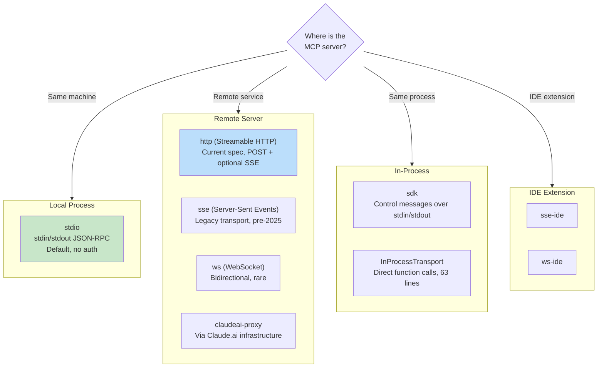
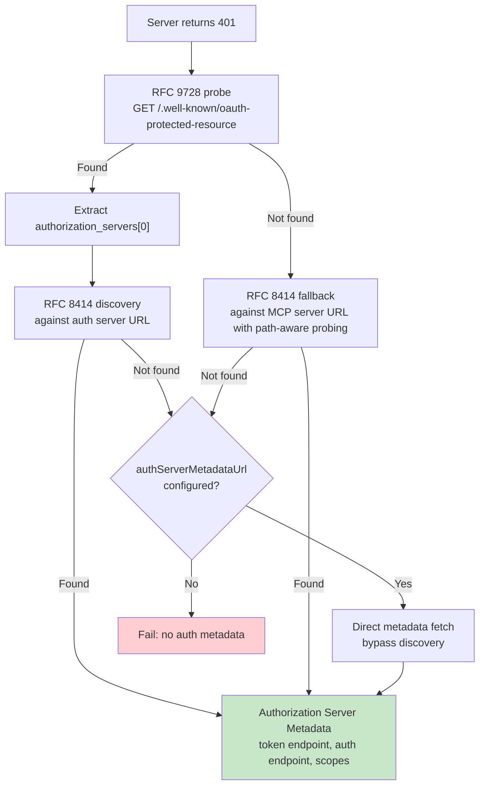

# Chapter 15: MCP -- The Universal Tool Protocol

> 第 15 章：MCP —— 通用工具协议

## Why MCP Matters Beyond Claude Code

> 为什么 MCP 的意义超越了 Claude Code 本身

Every other chapter in this book is about Claude Code's internals. This one is different. The Model Context Protocol is an open specification that any agent can implement, and Claude Code's MCP subsystem is one of the most complete production clients in existence. If you are building an agent that needs to call external tools -- any agent, in any language, on any model -- the patterns in this chapter transfer directly.

> 本书的其他每一章都在讲 Claude Code 的内部实现。这一章不一样。Model Context Protocol（模型上下文协议）是一份任何 agent 都可以实现的开放规范，而 Claude Code 的 MCP 子系统是现存最完整的生产级客户端之一。如果你正在构建一个需要调用外部工具的 agent —— 无论是哪种 agent、用什么语言、跑在什么模型上 —— 本章中的模式都可以直接迁移过去。

The core proposition is straightforward: MCP defines a JSON-RPC 2.0 protocol for tool discovery and invocation between a client (the agent) and a server (the tool provider). The client sends `tools/list` to discover what a server offers, then `tools/call` to execute. The server describes each tool with a name, description, and JSON Schema for its inputs. That is the entire contract. Everything else -- transport selection, authentication, config loading, tool name normalization -- is the implementation work that turns a clean spec into something that survives contact with the real world.

> 其核心主张很直接：MCP 定义了一套基于 JSON-RPC 2.0 的协议，用于在客户端（agent）与服务器（工具提供方）之间进行工具发现和调用。客户端发送 `tools/list` 来发现服务器提供了哪些工具，然后用 `tools/call` 来执行。服务器用名称、描述以及一份描述其输入的 JSON Schema 来刻画每个工具。这就是全部契约。其余的一切 —— 传输方式的选择、认证、配置加载、工具名称归一化 —— 都是把一份干净的规范变成能在真实世界中存活下来的东西所需的实现工作。

Claude Code's MCP implementation spans four core files: `types.ts`, `client.ts`, `auth.ts`, and `InProcessTransport.ts`. Together they support eight transport types, seven configuration scopes, OAuth discovery across two RFCs, and a tool wrapping layer that makes MCP tools indistinguishable from built-in ones -- the same `Tool` interface covered in Chapter 6. This chapter walks through each layer.

> Claude Code 的 MCP 实现横跨四个核心文件：`types.ts`、`client.ts`、`auth.ts` 和 `InProcessTransport.ts`。它们合在一起支持八种传输类型、七个配置作用域、跨两份 RFC 的 OAuth 发现机制，以及一个工具包装层 —— 后者让 MCP 工具与内置工具无从区分，使用的正是第 6 章介绍过的同一个 `Tool` 接口。本章将逐层剖析。

---

## Eight Transport Types

> 八种传输类型

The first design decision in any MCP integration is how the client talks to the server. Claude Code supports eight transport configurations:

> 任何 MCP 集成的第一个设计决策，都是客户端如何与服务器通信。Claude Code 支持八种传输配置：



Three design choices are worth noting. First, `stdio` is the default -- when `type` is omitted, the system assumes a local subprocess. This is backwards-compatible with the earliest MCP configs. Second, the fetch wrappers stack: timeout wrapping outside step-up detection, outside the base fetch. Each wrapper handles one concern. Third, the `ws-ide` branch has a Bun/Node runtime split -- Bun's `WebSocket` accepts proxy and TLS options natively, while Node requires the `ws` package.

> 有三个设计选择值得留意。第一，`stdio` 是默认值 —— 当 `type` 被省略时，系统会假定这是一个本地子进程。这与最早期的 MCP 配置保持了向后兼容。第二，fetch 包装器是层层叠加的：超时包装在 step-up 检测之外，而 step-up 检测又在基础 fetch 之外。每一层包装只处理一件事。第三，`ws-ide` 分支有一个 Bun/Node 运行时分叉 —— Bun 的 `WebSocket` 原生支持代理和 TLS 选项，而 Node 则需要 `ws` 这个包。

**When to use which.** For local tools (filesystem, database, custom scripts), `stdio` -- no network, no auth, just pipes. For remote services, `http` (Streamable HTTP) is the current spec recommendation. `sse` is legacy but widely deployed. The `sdk`, IDE, and `claudeai-proxy` types are internal to their respective ecosystems.

> **该用哪一种。** 对于本地工具（文件系统、数据库、自定义脚本），用 `stdio` —— 不走网络、无需认证，只是管道而已。对于远程服务，`http`（Streamable HTTP）是当前规范推荐的方式。`sse` 虽是遗留方案，但部署仍然广泛。`sdk`、IDE 和 `claudeai-proxy` 这几种类型则各自隶属于其所属生态系统的内部使用。

---

## Configuration Loading and Scoping

> 配置加载与作用域划分

MCP server configs load from seven scopes, merged and deduplicated:

> MCP 服务器配置从七个作用域加载，并经过合并与去重：

| Scope | Source | Trust |
|-------|--------|-------|
| `local` | `.mcp.json` in working directory | Requires user approval |
| `user` | `~/.claude.json` mcpServers field | User-managed |
| `project` | Project-level config | Shared project settings |
| `enterprise` | Managed enterprise config | Pre-approved by org |
| `managed` | Plugin-provided servers | Auto-discovered |
| `claudeai` | Claude.ai web interface | Pre-authorized via web |
| `dynamic` | Runtime injection (SDK) | Programmatically added |

> | 作用域 | 来源 | 信任级别 |
> |-------|--------|-------|
> | `local` | 工作目录中的 `.mcp.json` | 需要用户批准 |
> | `user` | `~/.claude.json` 的 mcpServers 字段 | 用户管理 |
> | `project` | 项目级配置 | 共享的项目设置 |
> | `enterprise` | 受管的企业级配置 | 由组织预先批准 |
> | `managed` | 插件提供的服务器 | 自动发现 |
> | `claudeai` | Claude.ai 网页界面 | 通过网页预先授权 |
> | `dynamic` | 运行时注入（SDK） | 以编程方式添加 |

**Deduplication is content-based, not name-based.** Two servers with different names but the same command or URL are recognized as the same server. The `getMcpServerSignature()` function computes a canonical key: `stdio:["command","arg1"]` for local servers, `url:https://example.com/mcp` for remote ones. Plugin-provided servers whose signature matches a manual config are suppressed.

> **去重是基于内容的，而非基于名称的。** 两个名称不同但命令或 URL 相同的服务器会被识别为同一个服务器。`getMcpServerSignature()` 函数会计算出一个规范化的键：本地服务器是 `stdio:["command","arg1"]`，远程服务器是 `url:https://example.com/mcp`。若插件提供的服务器其签名与某个手动配置相匹配，则该插件服务器会被屏蔽掉。

---

## Tool Wrapping: From MCP to Claude Code

> 工具包装：从 MCP 到 Claude Code

When a connection succeeds, the client calls `tools/list`. Each tool definition is transformed into Claude Code's internal `Tool` interface -- the same interface used by built-in tools. After wrapping, the model cannot distinguish between a built-in tool and an MCP tool.

> 连接成功后，客户端会调用 `tools/list`。每一个工具定义都会被转换成 Claude Code 内部的 `Tool` 接口 —— 也就是内置工具所使用的同一个接口。包装完成后，模型无法区分一个工具究竟是内置工具还是 MCP 工具。

The wrapping process has four stages:

> 包装过程分为四个阶段：

**1. Name normalization.** `normalizeNameForMCP()` replaces invalid characters with underscores. The fully qualified name follows `mcp__{serverName}__{toolName}`.

> **1. 名称归一化。** `normalizeNameForMCP()` 会把非法字符替换为下划线。完全限定名遵循 `mcp__{serverName}__{toolName}` 的格式。

**2. Description truncation.** Capped at 2,048 characters. OpenAPI-generated servers have been observed dumping 15-60KB into `tool.description` -- roughly 15,000 tokens per turn for a single tool.

> **2. 描述截断。** 上限为 2,048 个字符。曾观察到由 OpenAPI 生成的服务器会往 `tool.description` 里塞入 15–60KB 内容 —— 单单一个工具每轮就要消耗大约 15,000 个 token。

**3. Schema passthrough.** The tool's `inputSchema` passes directly to the API. No transformation, no validation at wrapping time. Schema errors surface at call time, not registration time.

> **3. Schema 直通。** 工具的 `inputSchema` 会直接透传给 API。包装时不做任何转换，也不做任何校验。Schema 错误会在调用时浮现，而不是在注册时。

**4. Annotation mapping.** MCP annotations map to behavior flags: `readOnlyHint` marks tools safe for concurrent execution (as discussed in Chapter 7's streaming executor), `destructiveHint` triggers extra permission scrutiny. These annotations come from the MCP server -- a malicious server could mark a destructive tool as read-only. This is an accepted trust boundary, but one worth understanding: the user opted into the server, and a malicious server marking destructive tools as read-only is a real attack vector. The system accepts this tradeoff because the alternative -- ignoring annotations entirely -- would prevent legitimate servers from improving the user experience.

> **4. 注解映射。** MCP 注解会映射为行为标志：`readOnlyHint` 标记工具可以安全地并发执行（正如第 7 章的流式执行器中所讨论的），`destructiveHint` 则会触发额外的权限审查。这些注解来自 MCP 服务器 —— 一个恶意服务器完全可以把一个破坏性工具标记为只读。这是一条被接受的信任边界，但值得理解清楚：是用户主动选择启用了该服务器，而恶意服务器把破坏性工具标记为只读确实是一个真实存在的攻击向量。系统之所以接受这一权衡，是因为另一种做法 —— 完全忽略注解 —— 会让合法的服务器无法借此改善用户体验。

---

## OAuth for MCP Servers

> 面向 MCP 服务器的 OAuth

Remote MCP servers often require authentication. Claude Code implements the full OAuth 2.0 + PKCE flow with RFC-based discovery, Cross-App Access, and error body normalization.

> 远程 MCP 服务器通常需要认证。Claude Code 实现了完整的 OAuth 2.0 + PKCE 流程，包含基于 RFC 的发现机制、Cross-App Access（跨应用访问）以及错误响应体归一化。

### Discovery Chain

> 发现链



The `authServerMetadataUrl` escape hatch exists because some OAuth servers implement neither RFC.

> `authServerMetadataUrl` 这个应急出口之所以存在，是因为有些 OAuth 服务器两份 RFC 都没有实现。

### Cross-App Access (XAA)

> Cross-App Access（跨应用访问，XAA）

When an MCP server config has `oauth.xaa: true`, the system performs federated token exchange through an Identity Provider -- one IdP login unlocks multiple MCP servers.

> 当某个 MCP 服务器配置中设置了 `oauth.xaa: true` 时，系统会通过身份提供方（Identity Provider）执行联合令牌交换 —— 一次 IdP 登录即可解锁多个 MCP 服务器。

### Error Body Normalization

> 错误响应体归一化

The `normalizeOAuthErrorBody()` function handles OAuth servers that violate the spec. Slack returns HTTP 200 for error responses with the error buried in the JSON body. The function peeks at 2xx POST response bodies, and when the body matches `OAuthErrorResponseSchema` but not `OAuthTokensSchema`, rewrites the response to HTTP 400. It also normalizes Slack-specific error codes (`invalid_refresh_token`, `expired_refresh_token`, `token_expired`) to the standard `invalid_grant`.

> `normalizeOAuthErrorBody()` 函数专门应对那些违反规范的 OAuth 服务器。Slack 在返回错误响应时会用 HTTP 200，把错误埋在 JSON 响应体里。该函数会窥探 2xx 的 POST 响应体，当响应体匹配 `OAuthErrorResponseSchema` 但不匹配 `OAuthTokensSchema` 时，就把响应改写为 HTTP 400。它还会把 Slack 特有的错误码（`invalid_refresh_token`、`expired_refresh_token`、`token_expired`）归一化为标准的 `invalid_grant`。

---

## In-Process Transport

> 进程内传输

Not every MCP server needs to be a separate process. The `InProcessTransport` class enables running an MCP server and client in the same process:

> 并非每个 MCP 服务器都需要是一个独立的进程。`InProcessTransport` 类让 MCP 服务器和客户端可以运行在同一个进程内：

```typescript
class InProcessTransport implements Transport {
  async send(message: JSONRPCMessage): Promise<void> {
    if (this.closed) throw new Error('Transport is closed')
    queueMicrotask(() => { this.peer?.onmessage?.(message) })
  }
  async close(): Promise<void> {
    if (this.closed) return
    this.closed = true
    this.onclose?.()
    if (this.peer && !this.peer.closed) {
      this.peer.closed = true
      this.peer.onclose?.()
    }
  }
}
```

The entire file is 63 lines. Two design decisions deserve attention. First, `send()` delivers via `queueMicrotask()` to prevent stack depth issues in synchronous request/response cycles. Second, `close()` cascades to the peer, preventing half-open states. The Chrome MCP server and Computer Use MCP server both use this pattern.

> 整个文件只有 63 行。有两个设计决策值得关注。第一，`send()` 通过 `queueMicrotask()` 来投递消息，以避免在同步的请求/响应循环中出现栈深度问题。第二，`close()` 会级联到对端（peer），从而防止出现半开（half-open）状态。Chrome MCP 服务器和 Computer Use MCP 服务器都采用了这一模式。

---

## Connection Management

> 连接管理

### Connection States

> 连接状态

Each MCP server connection exists in one of five states: `connected`, `failed`, `needs-auth` (with a 15-minute TTL cache to prevent 30 servers from independently discovering the same expired token), `pending`, or `disabled`.

> 每个 MCP 服务器连接都处于五种状态之一：`connected`（已连接）、`failed`（已失败）、`needs-auth`（需要认证，带有 15 分钟的 TTL 缓存，以防止 30 个服务器各自独立地去发现同一个已过期的令牌）、`pending`（等待中）或 `disabled`（已禁用）。

### Session Expiry Detection

> 会话过期检测

MCP's Streamable HTTP transport uses session IDs. When a server restarts, requests return HTTP 404 with JSON-RPC error code -32001. The `isMcpSessionExpiredError()` function checks both signals -- note that it uses string inclusion on the error message to detect the error code, which is pragmatic but fragile:

> MCP 的 Streamable HTTP 传输使用会话 ID。当服务器重启时，请求会返回 HTTP 404，并带有 JSON-RPC 错误码 -32001。`isMcpSessionExpiredError()` 函数会同时检查这两个信号 —— 注意它是通过在错误消息上做字符串包含判断来检测错误码的，这种做法务实但脆弱：

```typescript
export function isMcpSessionExpiredError(error: Error): boolean {
  const httpStatus = 'code' in error ? (error as any).code : undefined
  if (httpStatus !== 404) return false
  return error.message.includes('"code":-32001') ||
    error.message.includes('"code": -32001')
}
```

On detection, the connection cache clears and the call retries once.

> 一旦检测到，连接缓存就会被清空，并对该调用重试一次。

### Batched Connections

> 批量连接

Local servers connect in batches of 3 (spawning processes can exhaust file descriptors), remote servers in batches of 20. The React context provider `MCPConnectionManager.tsx` manages the lifecycle, diffing current connections against new configs.

> 本地服务器以每批 3 个的方式建立连接（生成进程可能会耗尽文件描述符），远程服务器则以每批 20 个的方式连接。React context provider `MCPConnectionManager.tsx` 负责管理整个生命周期，将当前连接与新配置进行差异比对（diffing）。

---

## Claude.ai Proxy Transport

> Claude.ai 代理传输

The `claudeai-proxy` transport illustrates a common agent integration pattern: connecting through an intermediary. Claude.ai subscribers configure MCP "connectors" through the web interface, and the CLI routes through Claude.ai's infrastructure which handles vendor-side OAuth.

> `claudeai-proxy` 传输方式展示了一种常见的 agent 集成模式：通过中介进行连接。Claude.ai 的订阅用户通过网页界面配置 MCP “connector”（连接器），CLI 则经由 Claude.ai 的基础设施进行路由，由后者负责处理供应商侧的 OAuth。

The `createClaudeAiProxyFetch()` function captures the `sentToken` at request time, not re-read after a 401. Under concurrent 401s from multiple connectors, another connector's retry might have already refreshed the token. The function also checks for concurrent refreshes even when the refresh handler returns false -- the "ELOCKED contention" case where another connector won the lockfile race.

> `createClaudeAiProxyFetch()` 函数会在请求发出时捕获 `sentToken`，而不是在收到 401 之后重新读取。当多个连接器并发返回 401 时，另一个连接器的重试可能已经刷新了令牌。即便刷新处理器返回 false，该函数也会检查是否存在并发刷新 —— 也就是 “ELOCKED 争用” 这种情形：另一个连接器赢得了对锁文件（lockfile）的竞争。

---

## Timeout Architecture

> 超时架构

MCP timeouts are layered, each protecting against a different failure mode:

> MCP 的超时是分层的，每一层都针对一种不同的失败模式提供保护：

| Layer | Duration | Protects Against |
|-------|----------|------------------|
| Connection | 30s | Unreachable or slow-starting servers |
| Per-request | 60s (fresh per request) | Stale timeout signal bug |
| Tool call | ~27.8 hours | Legitimately long operations |
| Auth | 30s per OAuth request | Unreachable OAuth servers |

> | 层级 | 时长 | 防范的问题 |
> |-------|----------|------------------|
> | 连接（Connection） | 30 秒 | 不可达或启动缓慢的服务器 |
> | 单次请求（Per-request） | 60 秒（每次请求都重新生成） | 过期超时信号的 bug |
> | 工具调用（Tool call） | 约 27.8 小时 | 合理的长耗时操作 |
> | 认证（Auth） | 每次 OAuth 请求 30 秒 | 不可达的 OAuth 服务器 |

The per-request timeout deserves emphasis. Early implementations created a single `AbortSignal.timeout(60000)` at connection time. After 60 seconds of idle time, the next request would abort immediately -- the signal was already expired. The fix: `wrapFetchWithTimeout()` creates a fresh timeout signal for every request. It also normalizes the `Accept` header as a last-step defense against runtimes and proxies that drop it.

> 单次请求超时这一点值得强调。早期实现在连接时只创建了一个 `AbortSignal.timeout(60000)`。在空闲 60 秒之后，下一个请求会立即中止 —— 因为这个信号早就过期了。修复方法是：`wrapFetchWithTimeout()` 为每一个请求都创建一个全新的超时信号。它还会对 `Accept` 头做归一化处理，作为针对那些会丢弃该头的运行时和代理的最后一道防线。

---

## Apply This: Integrating MCP Into Your Own Agent

> 实践应用：将 MCP 集成到你自己的 Agent 中

**Start with stdio, add complexity later.** `StdioClientTransport` handles everything: spawn, pipe, kill. One line of config, one transport class, and you have MCP tools.

> **从 stdio 开始，复杂度留到以后再加。** `StdioClientTransport` 把一切都处理好了：生成进程、建立管道、杀掉进程。一行配置、一个传输类，你就拥有了 MCP 工具。

**Normalize names and truncate descriptions.** Names must match `^[a-zA-Z0-9_-]{1,64}$`. Prefix with `mcp__{serverName}__` to avoid collisions. Cap descriptions at 2,048 characters -- OpenAPI-generated servers will waste context tokens otherwise.

> **对名称做归一化，对描述做截断。** 名称必须匹配 `^[a-zA-Z0-9_-]{1,64}$`。加上 `mcp__{serverName}__` 前缀以避免冲突。把描述限制在 2,048 个字符以内 —— 否则由 OpenAPI 生成的服务器会白白浪费上下文 token。

**Handle auth lazily.** Do not attempt OAuth until a server returns 401. Most stdio servers need no auth.

> **惰性处理认证。** 在服务器返回 401 之前，不要尝试 OAuth。大多数 stdio 服务器根本不需要认证。

**Use in-process transport for built-in servers.** `createLinkedTransportPair()` eliminates subprocess overhead for servers you control.

> **对内置服务器使用进程内传输。** 对于你自己掌控的服务器，`createLinkedTransportPair()` 可以消除子进程的开销。

**Respect tool annotations and sanitize output.** `readOnlyHint` enables concurrent execution. Sanitize responses against malicious Unicode (bidirectional overrides, zero-width joiners) that could mislead the model.

> **尊重工具注解，并对输出做净化。** `readOnlyHint` 可启用并发执行。对响应进行净化，以防范可能误导模型的恶意 Unicode（双向覆盖字符、零宽连接符等）。

The MCP protocol is deliberately minimal -- two JSON-RPC methods. Everything between those methods and a production deployment is engineering: eight transports, seven config scopes, two OAuth RFCs, and timeout layering. Claude Code's implementation shows what that engineering looks like at scale.

> MCP 协议是刻意做到极简的 —— 只有两个 JSON-RPC 方法。介于这两个方法与生产部署之间的一切，都是工程：八种传输、七个配置作用域、两份 OAuth RFC，以及超时分层。Claude Code 的实现展示了这种工程在规模化之后是什么样子。

The next chapter examines what happens when the agent reaches beyond localhost: the remote execution protocols that let Claude Code run in cloud containers, accept instructions from web browsers, and tunnel API traffic through credential-injecting proxies.

> 下一章将考察当 agent 把触角伸到 localhost 之外时会发生什么：那些让 Claude Code 能够在云端容器中运行、接受来自网页浏览器的指令、并通过注入凭据的代理来隧道转发 API 流量的远程执行协议。
