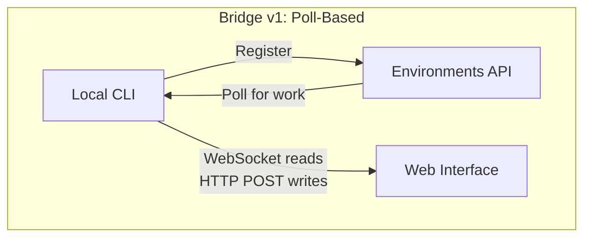
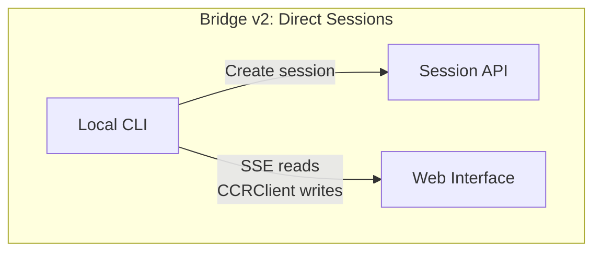
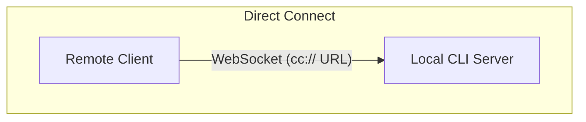
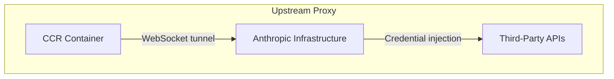

# Chapter 16: Remote Control and Cloud Execution

# 第 16 章：远程控制与云端执行

## The Agent Reaches Beyond Localhost

## 智能体突破 localhost 的边界

Every chapter so far has assumed that Claude Code runs on the same machine where the code lives. The terminal is local. The filesystem is local. The model responses stream back to a process that owns both the keyboard and the working directory.

到目前为止的每一章都假设 Claude Code 运行在代码所在的同一台机器上。终端是本地的，文件系统是本地的，模型的响应流式返回给一个同时拥有键盘和工作目录的进程。

That assumption breaks the moment you want to control Claude Code from a browser, run it inside a cloud container, or expose it as a service on your LAN. The agent needs a way to receive instructions from a web browser, a mobile app, or an automated pipeline -- forward permission prompts to someone who is not sitting at the terminal, and tunnel its API traffic through infrastructure that might inject credentials or terminate TLS on the agent's behalf.

一旦你想从浏览器控制 Claude Code、在云端容器内运行它，或者把它作为 LAN 上的一项服务暴露出来，这个假设就不成立了。智能体需要一种方式来接收来自 Web 浏览器、移动应用或自动化流水线的指令——把权限提示转发给并不坐在终端前的人，并将其 API 流量通过某些基础设施进行隧道传输，而这些基础设施可能会代表智能体注入凭证或终止 TLS。

Claude Code solves this with four systems, each addressing a different topology:

Claude Code 用四套系统来解决这个问题，每套系统针对一种不同的拓扑结构：

<div class="diagram-grid">









</div>

These systems share a common design philosophy: reads and writes are asymmetric, reconnection is automatic, and failures degrade gracefully.

这些系统共享一套共同的设计哲学：读和写是非对称的，重连是自动的，而故障会优雅降级。

---

## Bridge v1: Poll, Dispatch, Spawn

## Bridge v1：轮询、派发、派生

The v1 bridge is the environment-based remote control system. When a developer runs `claude remote-control`, the CLI registers with the Environments API, polls for work, and spawns a child process per session.

v1 桥接是基于环境（environment）的远程控制系统。当开发者运行 `claude remote-control` 时，CLI 会向 Environments API 注册、轮询工作项，并为每个会话派生一个子进程。

Before registration, a gauntlet of pre-flight checks runs: runtime feature gate, OAuth token validation, organization policy check, dead token detection (a cross-process backoff after three consecutive failures with the same expired token), and proactive token refresh that eliminates roughly 9% of registrations that would otherwise fail on the first attempt.

在注册之前，会先跑一连串的预检：运行时功能开关（feature gate）、OAuth token 校验、组织策略检查、失效 token 检测（在同一个过期 token 连续失败三次后进行的跨进程退避），以及主动 token 刷新——后者消除了大约 9% 本来会在首次尝试时失败的注册。

Once registered, the bridge enters a long-poll loop. Work items arrive as sessions (with a `secret` field containing session tokens, API base URL, MCP configs, and environment variables) or healthchecks. The bridge throttles "no work" log messages to every 100 empty polls.

注册完成后，桥接进入一个长轮询（long-poll）循环。工作项以会话（带有一个 `secret` 字段，内含会话 token、API base URL、MCP 配置和环境变量）或健康检查的形式到达。桥接会对“无工作”的日志消息进行节流，每 100 次空轮询才打印一次。

Each session spawns a child Claude Code process communicating via NDJSON on stdin/stdout. Permission requests flow through the bridge transport to the web interface where the user approves or denies. The round-trip must complete within roughly 10-14 seconds.

每个会话派生一个子 Claude Code 进程，通过 stdin/stdout 上的 NDJSON 进行通信。权限请求经由桥接传输流向 Web 界面，用户在那里批准或拒绝。整个往返必须在大约 10-14 秒内完成。

---

## Bridge v2: Direct Sessions and SSE

## Bridge v2：直接会话与 SSE

The v2 bridge eliminates the entire Environments API layer -- no registration, no polling, no acknowledgment, no heartbeat, no deregistration. The motivation: v1 required the server to know the machine's capabilities before dispatching work. V2 collapses the lifecycle to three steps:

v2 桥接彻底去掉了整个 Environments API 层——没有注册，没有轮询，没有确认，没有心跳，也没有注销。动机在于：v1 要求服务器在派发工作之前先了解机器的能力。v2 把生命周期压缩成三步：

1. **Create session**: `POST /v1/code/sessions` with OAuth credentials.

1. **创建会话**：带上 OAuth 凭证 `POST /v1/code/sessions`。

2. **Connect bridge**: `POST /v1/code/sessions/{id}/bridge`. Returns a `worker_jwt`, `api_base_url`, and `worker_epoch`. Each `/bridge` call bumps the epoch -- it IS the registration.

2. **连接桥接**：`POST /v1/code/sessions/{id}/bridge`。返回 `worker_jwt`、`api_base_url` 和 `worker_epoch`。每次 `/bridge` 调用都会递增 epoch——它本身就是注册。

3. **Open transport**: SSE for reads, `CCRClient` for writes.

3. **打开传输通道**：读用 SSE，写用 `CCRClient`。

The transport abstraction (`ReplBridgeTransport`) unifies v1 and v2 behind a common interface, so message handling does not need to know which generation it is talking to.

传输抽象（`ReplBridgeTransport`）把 v1 和 v2 统一在一个共同接口之后，因此消息处理逻辑无需知道自己正在与哪一代桥接对话。

When the SSE connection drops due to a 401, the transport rebuilds with fresh credentials from a new `/bridge` call while preserving the sequence number cursor -- no messages are lost. The write path uses per-instance `getAuthToken` closures instead of process-wide environment variables, preventing JWT leakage across concurrent sessions.

当 SSE 连接因为 401 而断开时，传输层会通过一次新的 `/bridge` 调用拿到新鲜凭证来重建连接，同时保留序列号游标——不会丢失任何消息。写入路径使用每实例（per-instance）的 `getAuthToken` 闭包，而不是进程级的环境变量，从而防止 JWT 在并发会话之间泄露。

### The FlushGate

### FlushGate（刷新闸门）

A subtle ordering problem: the bridge needs to send conversation history while accepting live writes from the web interface. If a live write arrives during the history flush, messages could be delivered out of order. The `FlushGate` queues live writes during the flush POST and drains them in order when it completes.

这里有一个微妙的顺序问题：桥接需要发送对话历史，同时还要接受来自 Web 界面的实时写入。如果在历史刷新过程中有一条实时写入到达，消息就可能乱序投递。`FlushGate` 会在刷新 POST 期间把实时写入排队，并在其完成后按顺序排空（drain）。

### Token Refresh and Epoch Management

### Token 刷新与 Epoch 管理

The v2 bridge proactively refreshes worker JWTs before expiry. A new epoch tells the server this is the same worker with fresh credentials. Epoch mismatches (409 responses) are handled aggressively: both connections close and an exception unwinds the caller, preventing split-brain scenarios.

v2 桥接会在 worker JWT 过期之前主动刷新它们。一个新的 epoch 告诉服务器：这是同一个 worker，只是换了新鲜凭证。epoch 不匹配（409 响应）会被强硬处理：两条连接都关闭，并通过一个异常回溯调用方，从而避免脑裂（split-brain）场景。

---

## Message Routing and Echo Deduplication

## 消息路由与回声去重

Both bridge generations share `handleIngressMessage()` as the central router:

两代桥接都共用 `handleIngressMessage()` 作为中央路由器：

1. Parse JSON, normalize control message keys.

1. 解析 JSON，规范化控制消息的键。

2. Route `control_response` to permission handler, `control_request` to request handler.

2. 将 `control_response` 路由到权限处理器，将 `control_request` 路由到请求处理器。

3. Check UUID against `recentPostedUUIDs` (echo dedup) and `recentInboundUUIDs` (re-delivery dedup).

3. 用 `recentPostedUUIDs`（回声去重）和 `recentInboundUUIDs`（重投递去重）来核对 UUID。

4. Forward validated user messages.

4. 转发已校验的用户消息。

### BoundedUUIDSet: O(1) Lookup, O(capacity) Memory

### BoundedUUIDSet：O(1) 查找，O(capacity) 内存

The bridge has an echo problem -- messages may echo back on the read stream or be delivered twice during transport switches. `BoundedUUIDSet` is a FIFO-bounded set backed by a circular buffer:

桥接存在回声问题——消息可能在读取流上回弹回来，或者在传输切换期间被投递两次。`BoundedUUIDSet` 是一个由环形缓冲区支撑的 FIFO 有界集合：

```typescript
class BoundedUUIDSet {
  private buffer: string[]
  private set: Set<string>
  private head = 0

  add(uuid: string): void {
    if (this.set.size >= this.capacity) {
      this.set.delete(this.buffer[this.head])
    }
    this.buffer[this.head] = uuid
    this.set.add(uuid)
    this.head = (this.head + 1) % this.capacity
  }

  has(uuid: string): boolean { return this.set.has(uuid) }
}
```

Two instances run in parallel, each with capacity 2000. O(1) lookup via the Set, O(capacity) memory via circular buffer eviction, no timers or TTLs. Unknown control request subtypes get an error response, not silence -- preventing the server from waiting for a response that never comes.

两个实例并行运行，各自容量为 2000。通过 Set 实现 O(1) 查找，通过环形缓冲区淘汰实现 O(capacity) 内存，没有定时器也没有 TTL。未知的控制请求子类型会得到一个错误响应，而不是沉默——这避免了服务器一直等待一个永远不会到来的响应。

---

## The Asymmetric Design: Persistent Reads, HTTP POST Writes

## 非对称设计：持久化读取，HTTP POST 写入

The CCR protocol uses asymmetric transport: reads flow through a persistent connection (WebSocket or SSE), writes go through HTTP POST. This reflects a fundamental asymmetry in the communication pattern.

CCR 协议采用非对称传输：读取通过一条持久连接（WebSocket 或 SSE）流动，写入则走 HTTP POST。这反映了通信模式中一种根本性的非对称。

Reads are high-frequency, low-latency, server-initiated -- hundreds of small messages per second during token streaming. A persistent connection is the only sensible choice. Writes are low-frequency, client-initiated, and require acknowledgment -- messages per minute, not per second. HTTP POST provides reliable delivery, idempotency via UUIDs, and natural integration with load balancers.

读取是高频、低延迟、由服务器发起的——在 token 流式传输期间每秒数百条小消息。持久连接是唯一合理的选择。写入则是低频、由客户端发起、且需要确认的——以每分钟而非每秒计的消息量。HTTP POST 提供可靠投递、借助 UUID 的幂等性，以及与负载均衡器的天然整合。

Trying to unify them on a single WebSocket creates coupling: if the WebSocket drops during a write, you need retry logic and must distinguish "not sent" from "sent but acknowledgment lost." Separate channels let each be optimized independently.

试图把两者统一到单条 WebSocket 上会制造耦合：如果 WebSocket 在一次写入过程中断开，你就需要重试逻辑，并且必须区分“未发送”和“已发送但确认丢失”。分开的通道让两者各自独立优化。

---

## Remote Session Management

## 远程会话管理

The `SessionsWebSocket` manages the client side of a CCR WebSocket connection. Its reconnection strategy discriminates between failure types:

`SessionsWebSocket` 管理 CCR WebSocket 连接的客户端一侧。它的重连策略会区分不同的故障类型：

| Failure | Strategy |
|---------|----------|
| 4003 (unauthorized) | Stop immediately, no retries |
| 4001 (session not found) | Max 3 retries, linear backoff (transient during compaction) |
| Other transient | Exponential backoff, max 5 attempts |

| 故障 | 策略 |
|---------|----------|
| 4003（未授权） | 立即停止，不重试 |
| 4001（会话未找到） | 最多 3 次重试，线性退避（在压缩期间为瞬时故障） |
| 其他瞬时故障 | 指数退避，最多 5 次尝试 |

The `isSessionsMessage()` type guard accepts any object with a string `type` field -- deliberately permissive. A hardcoded allowlist would silently drop new message types before the client is updated.

`isSessionsMessage()` 类型守卫接受任何带有字符串 `type` 字段的对象——故意设计得宽松。一个硬编码的允许列表会在客户端更新之前悄无声息地丢弃新的消息类型。

---

## Direct Connect: The Local Server

## Direct Connect：本地服务器

Direct Connect is the simplest topology: Claude Code runs as a server and clients connect via WebSocket. No cloud intermediary, no OAuth tokens.

Direct Connect 是最简单的拓扑：Claude Code 作为服务器运行，客户端通过 WebSocket 连接。没有云端中介，也没有 OAuth token。

Sessions have five states: `starting`, `running`, `detached`, `stopping`, `stopped`. Metadata persists to `~/.claude/server-sessions.json` for resume across server restarts. The `cc://` URL scheme provides clean addressing for local connections.

会话有五种状态：`starting`、`running`、`detached`、`stopping`、`stopped`。元数据持久化到 `~/.claude/server-sessions.json`，以便在服务器重启后恢复。`cc://` URL 方案为本地连接提供了简洁的寻址方式。

---

## Upstream Proxy: Credential Injection in Containers

## 上游代理：容器中的凭证注入

The upstream proxy runs inside CCR containers and solves a specific problem: injecting organization credentials into outbound HTTPS traffic from a container where the agent might execute untrusted commands.

上游代理运行在 CCR 容器内部，解决一个特定问题：在一个智能体可能执行不可信命令的容器中，向出站 HTTPS 流量注入组织凭证。

The setup sequence is carefully ordered:

这套初始化序列经过精心排序：

1. Read the session token from `/run/ccr/session_token`.

1. 从 `/run/ccr/session_token` 读取会话 token。

2. Set `prctl(PR_SET_DUMPABLE, 0)` via Bun FFI -- blocking same-UID ptrace of the process heap. Without this, a prompt-injected `gdb -p $PPID` could scrape the token from memory.

2. 通过 Bun FFI 设置 `prctl(PR_SET_DUMPABLE, 0)`——阻止同 UID 对进程堆的 ptrace。没有这一步，一个被提示注入的 `gdb -p $PPID` 就可能从内存中刮取 token。

3. Download the upstream proxy CA certificate and concatenate with system CA bundle.

3. 下载上游代理 CA 证书，并与系统 CA bundle 拼接。

4. Start a local CONNECT-to-WebSocket relay on an ephemeral port.

4. 在一个临时端口上启动一个本地的 CONNECT-到-WebSocket 中继。

5. Unlink the token file -- the token now exists only on the heap.

5. 删除（unlink）token 文件——此时 token 只存在于堆上。

6. Export environment variables for all subprocesses.

6. 为所有子进程导出环境变量。

Every step fails open: errors disable the proxy rather than killing the session. The correct tradeoff -- a failed proxy means some integrations will not work, but core functionality remains available.

每一步都采用“故障开放”（fail open）：出错时禁用代理，而不是杀掉会话。这是正确的取舍——代理失败意味着某些集成无法工作，但核心功能依然可用。

### Protobuf Hand-Encoding

### 手写 Protobuf 编码

Bytes through the tunnel are wrapped in `UpstreamProxyChunk` protobuf messages. The schema is trivial -- `message UpstreamProxyChunk { bytes data = 1; }` -- and Claude Code encodes it by hand in ten lines rather than pulling in a protobuf runtime:

穿过隧道的字节被包裹在 `UpstreamProxyChunk` protobuf 消息中。这个 schema 非常简单——`message UpstreamProxyChunk { bytes data = 1; }`——Claude Code 用十行代码手工编码它，而不是引入一个 protobuf 运行时：

```typescript
export function encodeChunk(data: Uint8Array): Uint8Array {
  const varint: number[] = []
  let n = data.length
  while (n > 0x7f) { varint.push((n & 0x7f) | 0x80); n >>>= 7 }
  varint.push(n)
  const out = new Uint8Array(1 + varint.length + data.length)
  out[0] = 0x0a  // field 1, wire type 2
  out.set(varint, 1)
  out.set(data, 1 + varint.length)
  return out
}
```

Ten lines replace a full protobuf runtime. A single-field message does not justify a dependency -- the maintenance burden of the bit manipulation is far lower than the supply chain risk.

十行代码取代了一个完整的 protobuf 运行时。一个单字段消息不足以正当化引入一个依赖——这点位运算的维护负担，远低于供应链风险。

---

## Apply This: Designing Remote Agent Execution

## 实践应用：设计远程智能体执行

**Separate read and write channels.** When reads are high-frequency streams and writes are low-frequency RPCs, unifying them creates unnecessary coupling. Let each channel fail and recover independently.

**分离读写通道。** 当读取是高频流而写入是低频 RPC 时，把它们统一会制造不必要的耦合。让每条通道各自独立地失败与恢复。

**Bound your deduplication memory.** The BoundedUUIDSet pattern provides fixed-memory deduplication. Any at-least-once delivery system needs a bounded dedup buffer, not an unbounded Set.

**为去重内存设界。** BoundedUUIDSet 模式提供了固定内存的去重。任何“至少一次”投递的系统都需要一个有界的去重缓冲区，而不是一个无界的 Set。

**Make reconnection strategy proportional to the failure signal.** Permanent failures should not retry. Transient failures should retry with backoff. Ambiguous failures should retry with a low cap.

**让重连策略与故障信号成正比。** 永久性故障不应重试。瞬时故障应带退避重试。模糊的故障应在较低上限内重试。

**Keep secrets heap-only in adversarial environments.** Reading the token from a file, disabling ptrace, and unlinking the file eliminates both filesystem and memory-inspection attack vectors.

**在对抗性环境中让密钥只驻留于堆。** 从文件读取 token、禁用 ptrace、再删除该文件，同时消除了文件系统和内存检视两类攻击面。

**Fail open for auxiliary systems.** The upstream proxy fails open because it provides enhanced functionality (credential injection), not core functionality (model inference).

**对辅助系统采用故障开放。** 上游代理之所以故障开放，是因为它提供的是增强功能（凭证注入），而非核心功能（模型推理）。

The remote execution systems encode a deeper principle: the agent's core loop (Chapter 5) should be agnostic about where instructions come from and where results go. The bridge, Direct Connect, and upstream proxy are transport layers. The message handling, tool execution, and permission flows above them are identical regardless of whether the user is sitting at the terminal or on the other side of a WebSocket.

这些远程执行系统编码了一个更深层的原则：智能体的核心循环（第 5 章）应当对指令从何而来、结果去往何处保持无关性（agnostic）。桥接、Direct Connect 和上游代理都是传输层。无论用户是坐在终端前，还是在 WebSocket 的另一端，它们之上的消息处理、工具执行和权限流程都是完全一致的。

The next chapter examines the other operational concern: performance -- how Claude Code makes every millisecond and token count across startup, rendering, search, and API costs.

下一章将考察另一个运维层面的关注点：性能——Claude Code 如何在启动、渲染、搜索和 API 成本各个环节上，让每一毫秒和每一个 token 都物尽其用。
