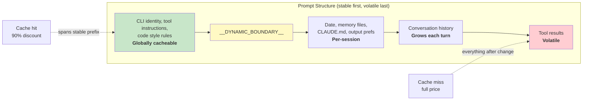

# Chapter 17: Performance -- Every Millisecond and Token Counts

> 第 17 章：性能 —— 每一毫秒、每一个 token 都至关重要

## The Senior Engineer's Playbook

> 资深工程师的实战手册

Performance optimization in an agentic system is not one problem. It is five:

> agentic 系统中的性能优化不是一个问题，而是五个：

1. **Startup latency** -- the time from keystroke to first useful output. Users abandon tools that feel slow to launch.

> 1. **启动延迟** —— 从按下按键到首次产生有用输出的时间。用户会抛弃那些启动起来感觉很慢的工具。

2. **Token efficiency** -- the fraction of the context window consumed by useful content versus overhead. The context window is the most constrained resource.

> 2. **Token 效率** —— 上下文窗口中被有用内容占用的比例，相对于被开销占用的比例。上下文窗口是最受约束的资源。

3. **API cost** -- the dollar amount per turn. Prompt caching can reduce this by 90%, but only if the system preserves cache stability across turns.

> 3. **API 成本** —— 每一轮交互的美元花费。prompt 缓存可以将其降低 90%，但前提是系统能在多轮之间保持缓存稳定。

4. **Rendering throughput** -- the frames per second during streaming output. Chapter 13 covered the rendering architecture; this chapter covers the performance measurements and optimizations that keep it fast.

> 4. **渲染吞吐量** —— 流式输出期间的每秒帧数。第 13 章介绍了渲染架构；本章介绍让它保持高速运行的性能测量和优化手段。

5. **Search speed** -- the time to find a file in a 270,000-path codebase on every keystroke.

> 5. **搜索速度** —— 在每次按键时，于一个包含 270,000 条路径的代码库中找到某个文件所需的时间。

Claude Code attacks all five with techniques ranging from the obvious (memoization) to the subtle (26-bit bitmaps for pre-filtering fuzzy search). A note on methodology: these are not theoretical optimizations. Claude Code ships with 50+ startup profiling checkpoints, sampled at 100% of internal users and 0.5% of external users. Every optimization below was motivated by data from this instrumentation, not by intuition.

> Claude Code 用从显而易见（memoization）到微妙精巧（用于模糊搜索预过滤的 26 位 bitmap）的各种技术来应对这全部五个问题。关于方法论的一点说明：这些都不是理论上的优化。Claude Code 内置了 50 多个启动性能剖析检查点，对内部用户以 100% 采样、对外部用户以 0.5% 采样。下文中的每一项优化都源自这套埋点带来的数据，而非凭直觉拍脑袋。

---

## Saving Milliseconds at Startup

> 在启动阶段省下毫秒

### Module-Level I/O Parallelism

> 模块级 I/O 并行

The entry point `main.tsx` deliberately violates "no side effects at module scope":

> 入口文件 `main.tsx` 刻意违反了"模块作用域内不得有副作用"这条规则：

```typescript
profileCheckpoint('main_tsx_entry');
startMdmRawRead();       // fires plutil/reg-query subprocesses
startKeychainPrefetch();  // fires both macOS keychain reads in parallel
```

Two macOS keychain entries would otherwise cost ~65ms of sequential synchronous spawns. By launching both as fire-and-forget promises at the module level, they execute in parallel with ~135ms of module loading during which the CPU would otherwise be idle.

> 两个 macOS keychain 条目本来需要约 65ms 的串行同步进程创建。通过在模块级把它们作为"发射后不管"（fire-and-forget）的 promise 启动，它们便能与约 135ms 的模块加载过程并行执行——而在这段加载时间里，CPU 本来是空闲的。

### API Preconnection

> API 预连接

`apiPreconnect.ts` fires a `HEAD` request to the Anthropic API during initialization, overlapping the TCP+TLS handshake (100-200ms) with setup work. In interactive mode, the overlap is unbounded -- the connection warms while the user types. The request fires after `applyExtraCACertsFromConfig()` and `configureGlobalAgents()` so the warmed connection uses the correct transport configuration.

> `apiPreconnect.ts` 在初始化期间向 Anthropic API 发出一个 `HEAD` 请求，让 TCP+TLS 握手（100-200ms）与启动初始化工作相互重叠。在交互模式下，这种重叠是没有上界的——连接会在用户打字时持续预热。该请求在 `applyExtraCACertsFromConfig()` 和 `configureGlobalAgents()` 之后才发出，这样预热出的连接就会使用正确的传输配置。

### Fast-Path Dispatch and Deferred Imports

> 快速路径分发与延迟导入

The CLI entry point contains early-return paths for specialized subcommands -- `claude mcp` never loads the React REPL, `claude daemon` never loads the tool system. Heavy modules are loaded via dynamic `import()` only when needed: OpenTelemetry (~400KB + ~700KB gRPC), event logging, error dialogs, upstream proxy. `LazySchema` defers Zod schema construction to first validation, pushing the cost past startup.

> CLI 入口为专用子命令提供了提前返回（early-return）路径——`claude mcp` 永远不会加载 React REPL，`claude daemon` 永远不会加载工具系统。重量级模块只在需要时才通过动态 `import()` 加载：OpenTelemetry（约 400KB + 约 700KB 的 gRPC）、事件日志、错误对话框、上游代理。`LazySchema` 将 Zod schema 的构造推迟到首次校验时，从而把这部分开销挪到了启动之后。

---

## Saving Tokens in the Context Window

> 在上下文窗口中省下 token

### Slot Reservation: 8K Default, 64K Escalation

> 槽位预留：默认 8K，升级至 64K

The most impactful single optimization:

> 影响最大的单项优化：

The default output slot reservation is 8,000 tokens, escalating to 64,000 on truncation. The API reserves `max_output_tokens` of capacity for the model's response. The default SDK value is 32K-64K, but production data shows p99 output length is 4,911 tokens. The default over-reserves by 8-16x, wasting 24,000-59,000 tokens per turn. Claude Code caps at 8K and retries at 64K on the rare truncation (<1% of requests). For a 200K window, this is a 12-28% improvement in usable context -- for free.

> 默认的输出槽位预留是 8,000 个 token，在发生截断时升级到 64,000。API 会为模型的响应预留 `max_output_tokens` 大小的容量。SDK 的默认值是 32K-64K，但生产数据显示输出长度的 p99 仅为 4,911 个 token。默认值过度预留了 8 到 16 倍，每一轮浪费掉 24,000 到 59,000 个 token。Claude Code 将上限设为 8K，仅在罕见的截断情况下（不到 1% 的请求）以 64K 重试。对于一个 200K 的窗口而言，这相当于可用上下文凭空提升了 12% 到 28%。

### Tool Result Budgeting

> 工具结果预算

| Limit | Value | Purpose |
|-------|-------|---------|
| Per-tool characters | 50,000 | Results persisted to disk when exceeded |
| Per-tool tokens | 100,000 | ~400KB text upper bound |
| Per-message aggregate | 200,000 chars | Prevents N parallel tools from blowing the budget in one turn |

> | 限制 | 取值 | 用途 |
> |-------|-------|---------|
> | 单工具字符数 | 50,000 | 超出后结果会持久化到磁盘 |
> | 单工具 token 数 | 100,000 | 约 400KB 文本的上界 |
> | 单条消息总量 | 200,000 字符 | 防止 N 个并行工具在一轮内撑爆预算 |

The per-message aggregate is the key insight. Without it, "read all files in src/" could produce 10 parallel reads each returning 40K characters.

> 单条消息的总量限制才是关键洞见。没有它，"读取 src/ 中的所有文件"可能会产生 10 个并行读取，每个返回 40K 字符。

### Context Window Sizing

> 上下文窗口大小

The default 200K-token window is expandable to 1M via the `[1m]` suffix on model names or experiment treatment. When usage approaches the limit, a 4-layer compaction system progressively summarizes older content. Token counting is anchored on the API's actual `usage` field, not client-side estimation -- accounting for prompt caching credits, thinking tokens, and server-side transformations.

> 默认的 200K token 窗口可以通过在模型名上加 `[1m]` 后缀或通过实验分组扩展到 1M。当用量接近上限时，一套 4 层的压缩（compaction）系统会渐进式地对较早的内容进行摘要。token 计数以 API 实际返回的 `usage` 字段为基准，而非客户端估算——这样才能把 prompt 缓存的抵扣额度、thinking token 以及服务端的各种变换都准确计入。

---

## Saving Money on API Calls

> 在 API 调用上省钱

### The Prompt Cache Architecture

> Prompt 缓存架构



Anthropic's prompt cache operates on exact prefix matching. If a single token changes mid-prefix, everything after is a cache miss. Claude Code structures the entire prompt so stable parts come first and volatile parts come last.

> Anthropic 的 prompt 缓存基于精确的前缀匹配工作。如果前缀中间有任何一个 token 发生变化，其后的所有内容都会缓存未命中。Claude Code 对整个 prompt 进行结构化编排，让稳定的部分排在前面、易变的部分排在后面。

When `shouldUseGlobalCacheScope()` returns true, system prompt entries before the dynamic boundary get `scope: 'global'` -- two users running the same Claude Code version share the prefix cache. Global scope is disabled when MCP tools are present, since MCP schemas are per-user.

> 当 `shouldUseGlobalCacheScope()` 返回 true 时，动态边界之前的 system prompt 条目会被赋予 `scope: 'global'`——两个运行相同 Claude Code 版本的用户便能共享该前缀缓存。当存在 MCP 工具时，global scope 会被禁用，因为 MCP 的 schema 是按用户区分的。

### Sticky Latch Fields

> 黏性锁存字段

Five boolean fields use a "sticky-on" pattern -- once true, they remain true for the session:

> 五个布尔字段采用了"黏性置位"（sticky-on）模式——一旦为 true，它们在整个会话期间都会保持为 true：

| Latch Field | What It Prevents |
|-------------|-----------------|
| `promptCache1hEligible` | Mid-session overage flip changing cache TTL |
| `afkModeHeaderLatched` | Shift+Tab toggles busting cache |
| `fastModeHeaderLatched` | Cooldown enter/exit double-busting cache |
| `cacheEditingHeaderLatched` | Mid-session config toggles busting cache |
| `thinkingClearLatched` | Flipping thinking mode after confirmed cache miss |

> | 锁存字段 | 它所阻止的事情 |
> |-------------|-----------------|
> | `promptCache1hEligible` | 会话中途的超额状态翻转改变缓存 TTL |
> | `afkModeHeaderLatched` | Shift+Tab 切换导致缓存失效 |
> | `fastModeHeaderLatched` | 冷却态的进入/退出导致缓存双重失效 |
> | `cacheEditingHeaderLatched` | 会话中途的配置切换导致缓存失效 |
> | `thinkingClearLatched` | 在确认缓存未命中后翻转 thinking 模式 |

Each corresponds to a header or parameter that, if changed mid-session, would bust ~50,000-70,000 tokens of cached prompt. The latches sacrifice mid-session toggling to preserve the cache.

> 每个字段都对应一个 header 或参数，若在会话中途被改变，就会让约 50,000 到 70,000 个 token 的已缓存 prompt 失效。这些锁存以牺牲会话中途的切换能力为代价，换取缓存的保全。

### Memoized Session Date

> 被 memoize 的会话日期

```typescript
const getSessionStartDate = memoize(getLocalISODate)
```

Without this, the date would change at midnight, busting the entire cached prefix. A stale date is cosmetic; a cache bust reprocesses the entire conversation.

> 没有它的话，日期会在午夜发生变化，从而让整个已缓存的前缀失效。一个过时的日期只是表面上的小问题；而一次缓存失效会重新处理整段对话。

### Section Memoization

> 分段 memoization

System prompt sections use a two-tier cache. Most content uses `systemPromptSection(name, compute)`, cached until `/clear` or `/compact`. The nuclear option `DANGEROUS_uncachedSystemPromptSection(name, compute, reason)` recomputes every turn -- the naming convention forces developers to document WHY cache-breaking is necessary.

> system prompt 的各个分段使用了两级缓存。大多数内容使用 `systemPromptSection(name, compute)`，缓存会一直保留到 `/clear` 或 `/compact`。而核弹级选项 `DANGEROUS_uncachedSystemPromptSection(name, compute, reason)` 会在每一轮都重新计算——这种命名约定强制开发者必须说明清楚为什么必须打破缓存。

---

## Saving CPU in Rendering

> 在渲染中省下 CPU

Chapter 13 covered the rendering architecture in depth -- the packed typed arrays, pool-based interning, double buffering, and cell-level diffing. Here we focus on the performance measurements and adaptive behaviors that keep it fast.

> 第 13 章深入介绍了渲染架构——紧凑排布的 typed array、基于池的驻留（interning）、双缓冲，以及单元格级别的差异比对。这里我们聚焦于让它保持高速运行的性能测量和自适应行为。

The terminal renderer throttles at 60fps via `throttle(deferredRender, FRAME_INTERVAL_MS)`. When the terminal is blurred, the interval doubles to 30fps. Scroll drain frames run at quarter interval for maximum scroll speed. This adaptive throttling ensures rendering never consumes more CPU than necessary.

> 终端渲染器通过 `throttle(deferredRender, FRAME_INTERVAL_MS)` 以 60fps 进行节流。当终端失焦时，间隔加倍，降至 30fps。滚动排空（scroll drain）帧则以四分之一的间隔运行，以获得最大滚动速度。这种自适应节流确保渲染消耗的 CPU 永远不会超过必要的量。

The React Compiler (`react/compiler-runtime`) auto-memoizes component renders throughout the codebase. Manual `useMemo` and `useCallback` are error-prone; the compiler gets it right by construction. Pre-allocated frozen objects (`Object.freeze()`) eliminate allocations for common render-path values -- one allocation saved per frame in alt-screen mode compounds over thousands of frames.

> React Compiler（`react/compiler-runtime`）在整个代码库中对组件渲染进行自动 memoization。手写 `useMemo` 和 `useCallback` 容易出错；而编译器从构造上就保证了正确。预先分配好的冻结对象（`Object.freeze()`）消除了渲染路径上常见值的内存分配——在 alt-screen 模式下，每帧省下的一次分配会在成千上万帧上累积放大。

For the full rendering pipeline details -- the `CharPool`/`StylePool`/`HyperlinkPool` interning system, the blit optimization, the damage rectangle tracking, the OffscreenFreeze component -- see Chapter 13.

> 完整的渲染流水线细节——`CharPool`/`StylePool`/`HyperlinkPool` 驻留系统、blit 优化、脏矩形（damage rectangle）追踪、OffscreenFreeze 组件——请参见第 13 章。

---

## Saving Memory and Time in Search

> 在搜索中省下内存和时间

The fuzzy file search runs on every keystroke, searching 270,000+ paths. Three optimization layers keep it under a few milliseconds.

> 模糊文件搜索在每次按键时都会运行，要在 270,000 多条路径中进行搜索。三层优化让它的耗时保持在几毫秒以内。

### The Bitmap Pre-Filter

> Bitmap 预过滤器

Every indexed path gets a 26-bit bitmap of which lowercase letters it contains:

> 每条被索引的路径都会获得一个 26 位的 bitmap，用来标记它包含哪些小写字母：

```typescript
// Pseudocode — illustrates the 26-bit bitmap concept
function buildCharBitmap(filepath: string): number {
  let mask = 0
  for (const ch of filepath.toLowerCase()) {
    const code = ch.charCodeAt(0)
    if (code >= 97 && code <= 122) mask |= 1 << (code - 97)
  }
  return mask  // Each bit represents presence of a-z
}
```

At search time: `if ((charBits[i] & needleBitmap) !== needleBitmap) continue`. Any path missing a query letter fails instantly -- one integer comparison, no string operations. Rejection rate: ~10% for broad queries like "test," 90%+ for queries with rare letters. Cost: 4 bytes per path, ~1MB for 270,000 paths.

> 搜索时：`if ((charBits[i] & needleBitmap) !== needleBitmap) continue`。任何缺少查询字母的路径都会立刻被淘汰——只需一次整数比较，无需任何字符串操作。淘汰率：对于像"test"这样宽泛的查询约为 10%，对于含有罕见字母的查询则超过 90%。代价：每条路径 4 字节，270,000 条路径约 1MB。

### Score-Bound Rejection and Fused indexOf Scan

> 分数上界淘汰与融合式 indexOf 扫描

Paths surviving the bitmap face a score ceiling check before the expensive boundary/camelCase scoring. If the best-case score cannot beat the current top-K threshold, the path is skipped.

> 通过了 bitmap 这一关的路径，在进入昂贵的边界/camelCase 评分之前，还要面对一次分数上限检查。如果其最佳情况下的得分都无法超过当前 top-K 阈值，该路径就会被跳过。

The actual matching fuses position finding with gap/consecutive bonus computation using `String.indexOf()`, which is SIMD-accelerated in both JSC (Bun) and V8 (Node). The engine's optimized search is significantly faster than manual character loops.

> 实际的匹配过程使用 `String.indexOf()` 将位置查找与间隙/连续匹配奖励的计算融合在一起，而该函数在 JSC（Bun）和 V8（Node）中都有 SIMD 加速。引擎经过优化的搜索远比手写的字符循环快得多。

### Async Indexing with Partial Queryability

> 支持部分可查询的异步索引

For large codebases, `loadFromFileListAsync()` yields to the event loop every ~4ms of work (time-based, not count-based -- adapting to machine speed). It returns two promises: `queryable` (resolves on first chunk, enabling immediate partial results) and `done` (full index complete). The user can start searching within 5-10ms of the file list becoming available.

> 对于大型代码库，`loadFromFileListAsync()` 每做约 4ms 的工作就向事件循环让出一次（按时间计，而非按数量计——以此适应机器速度）。它返回两个 promise：`queryable`（在第一个数据块就绪时 resolve，从而立即支持部分结果）和 `done`（完整索引构建完成）。用户在文件列表可用后的 5-10ms 内就能开始搜索。

The yield check uses `(i & 0xff) === 0xff` -- a branchless modulo-256 to amortize the cost of `performance.now()`.

> 让出的检查使用 `(i & 0xff) === 0xff`——这是一种无分支的对 256 取模运算，用来摊销 `performance.now()` 的调用开销。

---

## The Memory Relevance Side-Query

> 记忆相关性旁路查询

One optimization sits at the intersection of token efficiency and API cost. As described in Chapter 11, the memory system uses a lightweight Sonnet model call -- not the main Opus model -- to select which memory files to include. The cost (256 max output tokens on a fast model) is negligible compared to the tokens saved by not including irrelevant memory files. A single irrelevant 2,000-token memory costs more in wasted context than the side query costs in API calls.

> 有一项优化恰好位于 token 效率与 API 成本的交汇点上。正如第 11 章所述，记忆系统使用一次轻量级的 Sonnet 模型调用——而非主力的 Opus 模型——来挑选要纳入哪些记忆文件。这项调用的成本（在一个快速模型上最多 256 个输出 token）与不纳入无关记忆文件所省下的 token 相比微不足道。单是一个无关的、长达 2,000 个 token 的记忆，在浪费上下文上的代价就已经超过这次旁路查询在 API 调用上的花费。

---

## Speculative Tool Execution

> 推测式工具执行

The `StreamingToolExecutor` begins executing tools as they stream in, before the full response completes. Read-only tools (Glob, Grep, Read) can execute in parallel; write tools require exclusive access. The `partitionToolCalls()` function groups consecutive safe tools into batches: [Read, Read, Grep, Edit, Read, Read] becomes three batches -- [Read, Read, Grep] concurrent, [Edit] serial, [Read, Read] concurrent.

> `StreamingToolExecutor` 会在工具流式传入时就开始执行它们，而不必等待完整响应结束。只读工具（Glob、Grep、Read）可以并行执行；写工具则需要独占访问。`partitionToolCalls()` 函数把连续的安全工具分组成批次：[Read, Read, Grep, Edit, Read, Read] 会变成三个批次——[Read, Read, Grep] 并发执行、[Edit] 串行执行、[Read, Read] 并发执行。

Results are always yielded in the original tool order for deterministic model reasoning. A sibling abort controller kills parallel subprocesses when a Bash tool errors, preventing resource waste.

> 为了保证模型推理的确定性，结果始终按工具的原始顺序产出。一个同级（sibling）的 abort controller 会在某个 Bash 工具出错时终止并行的子进程，从而避免资源浪费。

---

## Streaming and the Raw API

> 流式传输与原始 API

Claude Code uses the raw streaming API instead of the SDK's `BetaMessageStream` helper. The helper calls `partialParse()` on every `input_json_delta` -- O(n^2) in tool input length. Claude Code accumulates raw strings and parses once when the block is complete.

> Claude Code 使用原始的流式 API，而不是 SDK 的 `BetaMessageStream` 辅助封装。这个封装会在每个 `input_json_delta` 上调用 `partialParse()`——其复杂度相对于工具输入长度是 O(n^2)。Claude Code 则累积原始字符串，等到整个数据块完成后只解析一次。

A streaming watchdog (`CLAUDE_STREAM_IDLE_TIMEOUT_MS`, default 90 seconds) aborts and retries if no chunks arrive, with fallback to non-streaming `messages.create()` on proxy failure.

> 一个流式看门狗（`CLAUDE_STREAM_IDLE_TIMEOUT_MS`，默认 90 秒）会在没有数据块到达时中止并重试，并在代理失败时回退到非流式的 `messages.create()`。

---

## Apply This: Performance for Agentic Systems

> 实践应用：agentic 系统的性能之道

**Audit your context window budget.** The gap between your `max_output_tokens` reservation and your actual p99 output length is wasted context. Set a tight default and escalate on truncation.

> **审计你的上下文窗口预算。** 你的 `max_output_tokens` 预留量与实际的 p99 输出长度之间的差距，就是被浪费掉的上下文。设一个紧凑的默认值，并在发生截断时再升级。

**Design for cache stability.** Every field in your prompt is stable or volatile. Put stable first, volatile last. Treat any mid-conversation change to the stable prefix as a bug with a dollar cost.

> **为缓存稳定性而设计。** 你 prompt 中的每个字段要么稳定、要么易变。把稳定的放前面，易变的放后面。把对话中途对稳定前缀的任何改动都当作一个有真金白银代价的 bug 来对待。

**Parallelize startup I/O.** Module loading is CPU-bound. Keychain reads and network handshakes are I/O-bound. Launch I/O before imports.

> **让启动期的 I/O 并行化。** 模块加载是 CPU 密集型的。keychain 读取和网络握手是 I/O 密集型的。在导入之前就先发起 I/O。

**Use bitmap pre-filters for search.** A cheap pre-filter rejecting 10-90% of candidates before expensive scoring is a significant win at 4 bytes per entry.

> **为搜索使用 bitmap 预过滤器。** 一个廉价的预过滤器能在昂贵的评分之前淘汰掉 10% 到 90% 的候选项，仅以每条 4 字节的代价换来一笔可观的收益。

**Measure where it matters.** Claude Code has 50+ startup checkpoints, sampled at 100% internally and 0.5% externally. Performance work without measurement is guesswork.

> **在关键之处进行测量。** Claude Code 拥有 50 多个启动检查点，对内 100% 采样、对外 0.5% 采样。没有测量的性能工作只是瞎猜。

---

A final observation: most of these optimizations are not algorithmically sophisticated. Bitmap pre-filters, circular buffers, memoization, interning -- these are CS fundamentals. The sophistication is in knowing where to apply them. The startup profiler tells you where the milliseconds are. The API usage field tells you where the tokens are. The cache hit rate tells you where the money is. Measurement first, optimization second, always.

> 最后一点观察：这些优化中的大多数在算法层面并不高深。bitmap 预过滤器、环形缓冲区、memoization、驻留（interning）——这些都是计算机科学的基本功。真正高明之处在于知道该把它们用在哪里。启动剖析器告诉你毫秒花在了哪里。API 的 usage 字段告诉你 token 花在了哪里。缓存命中率告诉你钱花在了哪里。永远是测量在先，优化在后。
